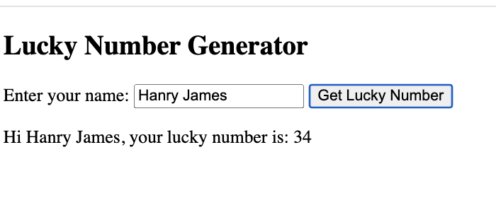
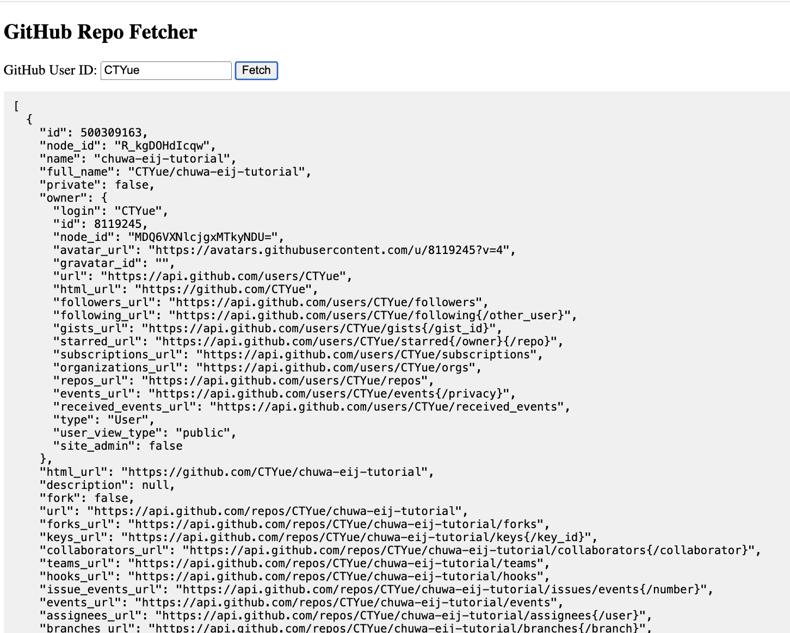

### HW19

---
1. Read and practice all sample codes from PDF `71-Dom-Bom-JavaScript-Typescript-Node.pdf` on your local
browser or an online compiler.

---

2. Resolve 5 leetcode problems using Javascript.

---

1. Two Sum  
```javascript
var twoSum = function(nums, target) {
    const map = new Map();
    for (let i = 0; i < nums.length; i++) {
        const complement = target - nums[i];
        if (map.has(complement)) {
            return [map.get(complement), i];
        }
        map.set(nums[i], i);
    }
};
```

3. Longest Substring Without Repeating Characters
```javascript
var lengthOfLongestSubstring = function(s) {
const seen = new Set();
let left = 0;
let maxLen = 0;

    for (let right = 0; right < s.length; right++) {
        while (seen.has(s[right])) {
            seen.delete(s[left]);
            left++;
        }
        seen.add(s[right]);
        maxLen = Math.max(maxLen, right - left + 1);
    }
    
    return maxLen;
};
```

5. Longest Palindromic Substring
```javascript
var longestPalindrome = function(s) {
    let start = 0;
    let maxLen = 1;
    
    function expandAroundCenter(left, right) {
        while (left >= 0 && right < s.length && s[left] === s[right]) {
            const len = right - left + 1;
            if (len > maxLen) {
                maxLen = len;
                start = left;
            }
            left--;
            right++;
        }
    }
    
    for (let i = 0; i < s.length; i++) {
        expandAroundCenter(i, i);
        expandAroundCenter(i, i + 1);
    }
    
    return s.substring(start, start + maxLen);
};
```

9. Palindrome Number
```javascript
var isPalindrome = function(x) {
if (x < 0) return false;

    let original = x;
    let reversed = 0;
    
    while (x > 0) {
        reversed = reversed * 10 + x % 10;
        x = Math.floor(x / 10);
    }
    
    return original === reversed;
};
```

14. Longest Common Prefix
```javascript
var longestCommonPrefix = function(strs) {
    if (strs.length === 0) return "";
    
    let prefix = strs[0];
    
    for (let i = 1; i < strs.length; i++) {
        while (strs[i].indexOf(prefix) !== 0) {
            prefix = prefix.substring(0, prefix.length - 1);
            if (prefix === "") return "";
        }
    }
    
    return prefix;
};
```


---

3. Compare `let` vs `var` , explain `variable hoisting` with your own code examples.

---

**Hoisting**:   
- Variables declared with `var` are *hoisted* to the top of their scope and initialized as `undefined`.  
- Variables declared with `let` is also hoisted, but accessing it before declaration throws an error.

`var` Example:
```javascript
console.log(a); // undefined (hoisted)
var a = 5;
```

`let` Example:
```javascript
console.log(b); // ReferenceError: Cannot access 'b' before initialization
let b = 10;
```

Summary:
- Use `let` (or `const`) over `var` for predictable, safer scoping.
- Avoid `var` unless maintaining legacy code.
 


---

4. Explain `closure` with code example.

---

**Closure**:   
A function that "remembers" variables from its outer scope even after the outer function has finished executing.

Example:
```javascript
function outer() {
  let count = 0;
  return function inner() {
    count++;
    return count;
  };
}

const counter = outer();

console.log(counter()); // 1
console.log(counter()); // 2
console.log(counter()); // 3
```

How It Works:
- `inner()` is returned by `outer()` and retains access to `count` via closure.
- Even though `outer()` has finished, `count` is preserved in memory.


---

5. Explain `Callback Hell` with code example.

---

**Callback Hell**:   
A situation where multiple nested callbacks make code hard to read and maintain.

Example:
```javascript
getUser(userId, function(user) {
  getOrders(user.id, function(orders) {
    getOrderDetails(orders[0], function(details) {
      sendEmail(details, function(response) {
        console.log('Email sent:', response);
      });
    });
  });
});
```

Solution:  
Use `Promises` or `async/await` for cleaner, more manageable code.


---

6. Explain `Promise`, `Async`, `Await` with code examples.

---


**Promise**:  
An object representing the eventual completion (or failure) of an asynchronous operation.

States of a Promise:
- `pending`: Initial state
- `fulfilled`: Operation completed successfully
- `rejected`: Operation failed

Example:
```javascript
const fetchData = () => {
  return new Promise((resolve, reject) => {
    setTimeout(() => {
      resolve("Data received");
    }, 1000);
  });
};

fetchData()
  .then(response => console.log(response))  // "Data received"
  .catch(error => console.error(error));
```

Use `.then()` for success, `.catch()` for errors.

---

**async / await:**  
- `async`: Declares an asynchronous function that returns a Promise.  
- `await`: Pauses the execution until the Promise resolves.

Example:
```javascript
async function getData() {
  const response = await fetch('https://jsonplaceholder.typicode.com/todos/1');
  const data = await response.json();
  console.log(data);
}

getData();
```


---

7. Write an HTML page that generates a lucky number based on the date, time, and user inputs.   
Users should be able to get their random lucky numbers by clicking a button or using the enter key after typing the input.

---

See file `Q7-lucky-number.html` (in the same folder as this file).




---

8. 
Write an HTML page that returns a user's GitHub repos (https://api.github.com/users/{user_id}/repos) in JSON format.  

The web page should have a text box and a submit button where users can provide the
GitHub user ID.  

The fetch call should be asynchronous.  

If the call to the above API fails for any reason, you should return a customized, user-friendly error message.  

If you know more than one approach to implement the asynchronous call, 
please do it using different approaches.

---


See file `Q8-github-repos.html` (in the same folder as this file).




---

9. Explain how Javascript implement `asynchronous non-blocking` feature.  
Particularly: `Event Loop`, `Macrotask`, and `Microtask` with code samples.

---

- JS runs in a single thread but uses the event loop to handle async tasks.
- Microtasks are always executed before the next Macrotask.


1. Event Loop:
- Continuously checks the **call stack** and **task queues**.
 
2. Microtasks:
- Higher priority.
- Examples: `Promise.then`, `queueMicrotask`, `MutationObserver`.

3. Macrotasks:
- Lower priority.
- Examples: `setTimeout`, `setInterval`, UI events.


Example:
```javascript
console.log('Start');

setTimeout(() => {
  console.log('Macrotask - setTimeout');
}, 0);

Promise.resolve().then(() => {
  console.log('Microtask - Promise.then');
});

console.log('End');
```

Output:
``` 
Start
End
Microtask - Promise.then
Macrotask - setTimeout
```

Why the Output Is in This Order:

1. Synchronous code runs first (`Start`, `End`).  


2. `setTimeout(..., 0)`:
- Registered as a Macrotask.
- Added to the Macrotask queue.

3. `Promise.resolve().then(...)`:
- Registered as a Microtask.
- Added to the Microtask queue.


4. Microtask is executed before any Macrotask.


