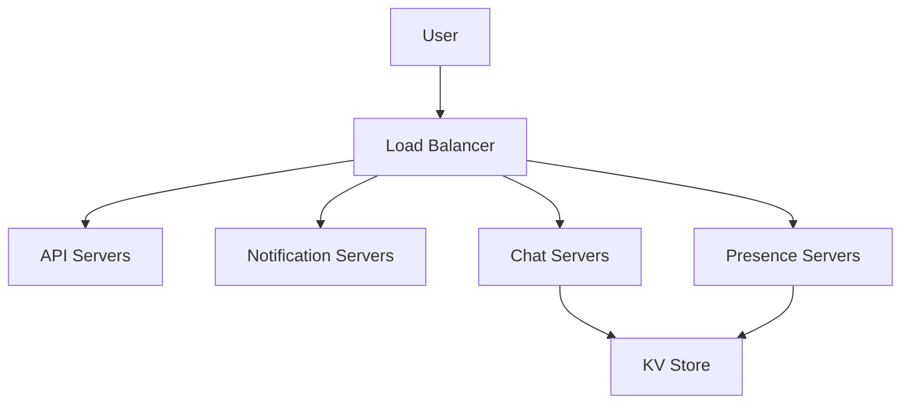

# **Designing a Chat System**

## **Step 1: Understand the Problem and Establish Design Scope**

### **Requirements**
- **Type of chat app**: Supports both 1-on-1 and group chat.
- **Platform**: Mobile and web app.
- **Scale**: 50 million daily active users (DAU).
- **Group member limit**: Maximum of 100 people.
- **Features**:
  - 1-on-1 chat.
  - Group chat.
  - Online presence indicator.
  - Multiple device support.
  - Push notifications.
  - Text messages only (max length: 100,000 characters).
- **Chat history**: Stored forever.
- **End-to-end encryption**: Not required in the initial design.

---

## **Step 2: High-Level Design**

### **Key Components**
- **Stateless Services**:
  - Authentication.
  - Group management.
  - User profile.
  - Service discovery.
- **Stateful Services**:
  - Chat servers (real-time messaging).
  - Presence servers (online/offline status).
- **Third-Party Integration**:
  - Push notification servers.

### **Communication Protocols**
- **WebSocket**: Used for bidirectional real-time communication between clients and chat servers.
- **HTTP**: Used for non-real-time features like login, signup, and user profile management.

### **High-Level Architecture**

- **Load Balancer**: Routes requests to appropriate services.
- **API Servers**: Handle HTTP-based requests (login, signup, etc.).
- **Real-Time Service**:
  - Chat servers: Manage WebSocket connections and message delivery.
  - Presence servers: Track online/offline status.
- **Notification Servers**: Send push notifications for offline users.
- **KV Store**: Store chat history and presence information.

---

## **Step 3: Deep Dive into Design**

### **Service Discovery**
- **Purpose**: Recommend the best chat server for a client based on criteria like geographical location and server capacity.
- **Implementation**: Use Apache Zookeeper for service discovery.
- **Workflow**:
  1. User logs in.
  2. Load balancer forwards login request to API servers.
  3. API servers authenticate the user and query Zookeeper for the best chat server.
  4. User establishes a WebSocket connection with the selected chat server.

### **Messaging Flows**
#### **1-on-1 Chat Flow**
- **Steps**:
  1. Sender sends a message to Chat Server 1.
  2. Chat Server 1 requests a unique message ID from the ID generator.
  3. Message is pushed to the message sync queue.
  4. Stored in KV Store for persistence.
  5. If the recipient is online, the message is forwarded to their chat server.
  6. If the recipient is offline, a push notification is sent.

#### **Message Synchronization Across Devices**
- **Logic**:
  - Each device maintains `cur_max_message_id` to track the latest message ID.
  - Devices fetch new messages from the KV Store based on the recipient ID and `cur_max_message_id`.

#### **Group Chat Flow**
- **Steps**:
  1. Sender sends a message to the chat server.
  2. Message is copied to the inbox (message sync queue) of each group member.
  3. Each recipient fetches messages from their inbox.

### **Online Presence**
- **Heartbeat Mechanism**:
  - Clients send periodic heartbeat events to presence servers.
  - If a heartbeat is not received within a threshold (e.g., 30 seconds), the user is marked offline.
- **Online Status Fanout**:
  - Presence servers use a publish-subscribe model to notify friends about status changes.

---

## **Step 4: Wrap-Up**

### **Storage Design**
- **Key-Value Stores**:
  - Used for chat history and presence information.
  - Allows horizontal scaling and low-latency access.
- **Message Tables**:
  - **1-on-1 Chat**:
    - Columns: `message_id`, `message_from`, `message_to`, `content`, `created_at`.
  - **Group Chat**:
    - Columns: `channel_id`, `message_id`, `user_id`, `content`, `created_at`.

### **Scalability**
- Horizontal scaling for chat servers and presence servers.
- Use message sync queues for efficient delivery.

### **Additional Talking Points**
- Extend to support media files (photos, videos).
- Implement end-to-end encryption.
- Cache messages on the client-side for faster access.
- Improve load time with geographically distributed caching.
- Error handling:
  - Retry mechanisms for message delivery.
  - Reconnect logic for failed WebSocket connections.

---

## **Architectural Diagram**

---

## **Conclusion**
The chat system design supports both 1-on-1 and small group chat with real-time messaging, online presence, and push notifications. It is scalable to handle 50 million DAU and uses WebSocket for efficient communication. The design ensures persistence, synchronization across devices, and effective service discovery.