# 1. Read and practice all sample codes from 71-Dom-Bom-JavaScript-Typescript-Node.md on your local browser or an online compiler.
# 2. Resolve 5 leetcode problems using Javascript.

## 88. Merge Sorted Array
https://leetcode.com/problems/merge-sorted-array/submissions/1868966844/?envType=study-plan-v2&envId=top-interview-150

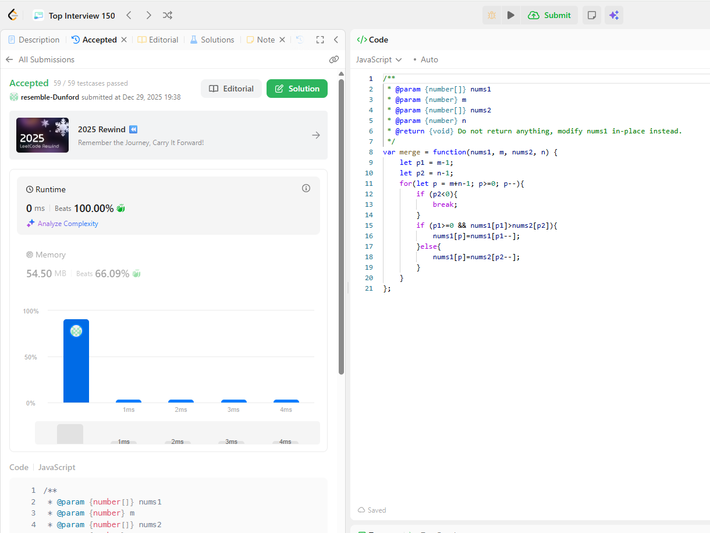

## 27. Remove Element
https://leetcode.com/problems/remove-element/submissions/1868967150/?envType=study-plan-v2&envId=top-interview-150

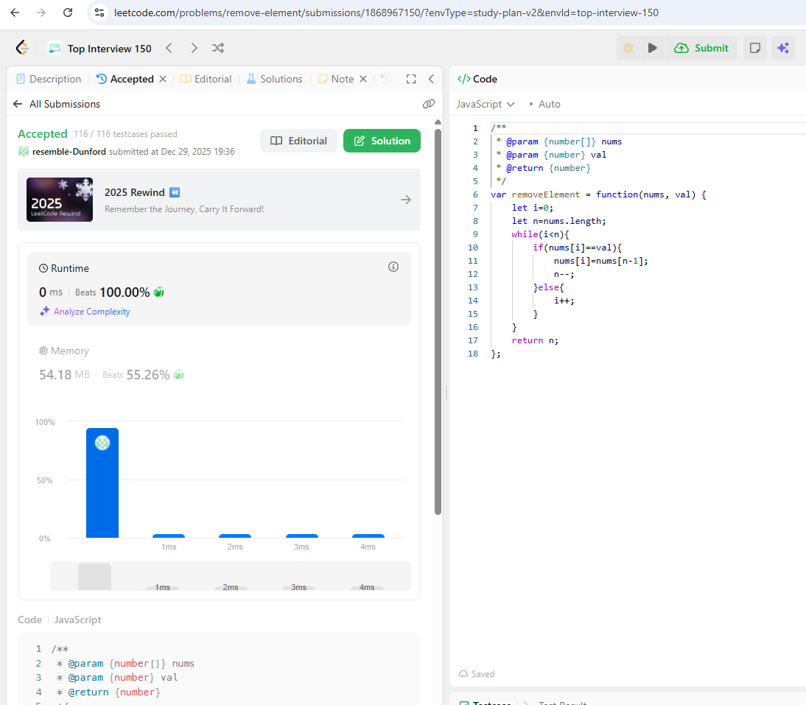

## 26. Remove Duplicates from Sorted Array
https://leetcode.com/problems/remove-duplicates-from-sorted-array/submissions/1868967361/?envType=study-plan-v2&envId=top-interview-150

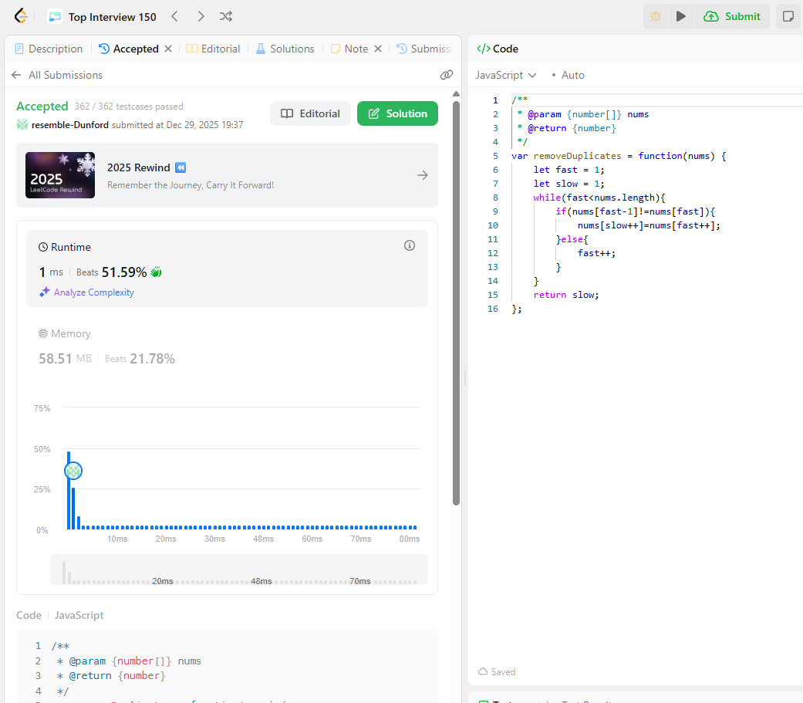

## 80. Remove Duplicates from Sorted Array II
https://leetcode.com/problems/remove-duplicates-from-sorted-array-ii/submissions/1868968032/?envType=study-plan-v2&envId=top-interview-150

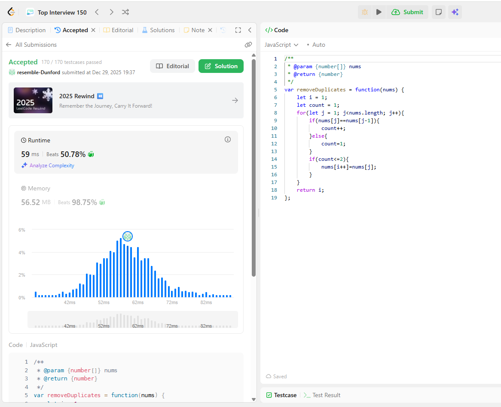

## 169. Majority Element
https://leetcode.com/problems/majority-element/submissions/1868967826/?envType=study-plan-v2&envId=top-interview-150

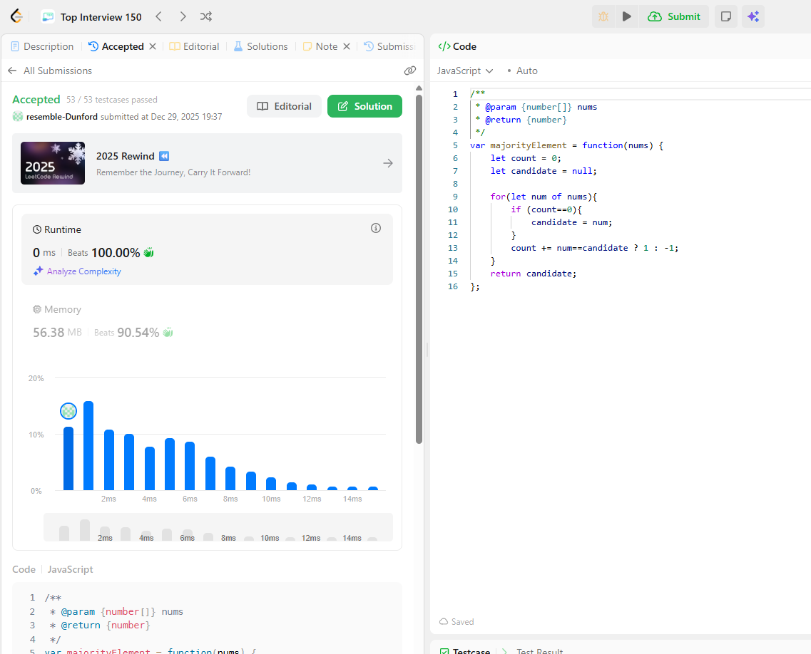

# 3. Compare `let` vs `var` , explain variable hosting with your own code examples.
A:
| Feature | `var` | `let` |
| --- | --- | --- |
| Scope | Function-scoped | Block-scoped |
| Redeclaration | Allowed | ❌ Not allowed |
| Hoisting | Yes (initialized as `undefined`) | Yes (but in **TDZ**) |
| Global object | Attaches to `window` | Does NOT attach |

---

### 🔹 Example: Scope difference

```javascript
if (true) {
  var x = 10;
  let y = 20;
}

console.log(x); // ✅ 10
console.log(y); // ❌ ReferenceError
```

---

### 🔹 Hoisting with `var`

```javascript
console.log(a); // undefined (hoisted)
var a = 5;
console.log(a); // 5
```

Equivalent to:

```javascript
var a;
console.log(a);
a = 5;
```

---

### 🔹 Hoisting with `let` (Temporal Dead Zone)

```javascript
console.log(b); // ❌ ReferenceError
let b = 10;
```

Explanation:

-   `let` **is hoisted**
    
-   But accessing it before declaration enters **Temporal Dead Zone (TDZ)**
    

---

### ✅ Summary

-   `var` is unsafe due to function scope & silent bugs
    
-   `let` is safer and preferred in modern JavaScript
    
-   **Always use `let` or `const` instead of `var`**
    
# 4. Explain `closure` with code example

A:
Understanding JavaScript closures is a pivotal moment in a developer's journey; it is a fundamental concept that underpins much of the language's functionality and many common design patterns. It might seem a bit mysterious at first, but the core idea is elegantly simple and incredibly powerful. The best way to think about it is that every function in JavaScript, by its very nature, is a closure, capable of remembering the environment in which it was initially created.
理解 JavaScript 闭包是开发者旅程中的关键时刻；它是一个基本概念，支撑着该语言的大部分功能和许多常见的设计模式。乍一看可能有点神秘，但其核心思想非常简单且非常强大。最好的思考方式是JavaScript 中的每一个函数，其本质就是一个闭包，能够记住其最初创建时的环境。 
A closure is a function that retains access to its outer scope (its lexical environment) even after the outer function has finished executing.
闭包是一个即使在外部函数执行完毕后仍能保留对其外部作用域（其词法环境）访问权限的函数。 
This means a function "remembers" the variables and arguments that were in scope when it was defined, regardless of where or when it is eventually executed later in the program's lifecycle.
这意味着一个函数会"记住"它在定义时所在作用域中的变量和参数，无论它最终在程序的哪个生命周期阶段被执行。 
## The Mechanism of Closure: How It Works Under the Hood
闭包的机制：它是如何运作的
The magic of closures is tied directly to JavaScript's use of lexical scoping.
闭包的神奇之处直接与 JavaScript 对词法作用域的使用相关。 
- Lexical Scoping: This rule dictates that a function's access to variables is determined by its physical placement within the source code (where it's defined), not where it is called (where it's executed).
词法作用域：这条规则规定，一个函数对变量的访问是由其在源代码中的物理位置（定义的位置）决定的，而不是由其调用位置（执行的位置）决定的。
- The "Backpack" Analogy: When you create a function, the JavaScript engine essentially gives it an invisible "backpack" (an internal [[Environment]] property) that contains references to all the variables in its surrounding scope chain.
"背包"类比：当你创建一个函数时，JavaScript 引擎实际上会为其提供一个看不见的"背包"（一个内部的 [[Environment]] 属性），其中包含对其周围作用域链中所有变量的引用。 

When a function is called and its outer function has finished running and would normally have its local variables destroyed (e.g., in languages like C), the inner function, thanks to its closure "backpack," keeps a reference to those variables alive in memory (specifically, on the heap rather than the stack). The inner function can access and even modify these "closed-over" variables, and those changes persist across subsequent calls to the inner function.
当函数被调用并且其外部函数已经运行完毕且通常情况下其局部变量会被销毁（例如在 C 语言等语言中），由于内部函数的闭包"背包"，它能在内存中保持对这些变量的引用（具体来说，是在堆上而不是栈上）。内部函数可以访问甚至修改这些"被封闭"的变量，并且这些变化会持续存在于对内部函数的后续调用中。 
## Practical Applications and Why They Matter
实际应用及其重要性
Closures aren't just theoretical; they are an essential part of modern JavaScript development, allowing for elegant solutions to common problems.
闭包不仅仅是理论概念；它们是现代 JavaScript 开发的重要组成部分，能够为常见问题提供优雅的解决方案。 
- Data Encapsulation and Private Variables: This is a primary use case. Closures allow you to create private state that cannot be accessed directly from outside the function, much like private members in object-oriented programming. This is achieved by defining variables in an outer function and exposing methods (the inner functions) that interact with those private variables.
数据封装和私有变量：这是主要的应用场景。闭包允许你创建无法从函数外部直接访问的私有状态，类似于面向对象编程中的私有成员。这是通过在外部函数中定义变量，并暴露与之交互的内部函数（方法）来实现的。
    ```javascript
    function createCounter() {
    let count = 0; // This variable is private to the closure

    return {
        increment: function() {
        count++;
        return count;
        },
        decrement: function() {
        count--;
        return count;
        },
        getCount: function() {
        return count;
        }
    };
    }

    const counter1 = createCounter();
    console.log(counter1.increment()); // Output: 1
    console.log(counter1.getCount());  // Output: 1
    console.log(counter1.count);     // Output: undefined (cannot be accessed directly)
    ```
- Notice that each `createCounter` call creates a new, independent instance with its own private `count` variable.
请注意，每次 `createCounter` 调用都会创建一个新的独立实例，并拥有自己的私有 `count` 变量。
- Function Factories: You can use closures to generate new, specialized functions with specific configurations or preset arguments. This is a powerful pattern known as partial application or currying.
函数工厂：你可以使用闭包来生成新的、具有特定配置或预设参数的专用函数。这是一种强大的模式，称为部分应用或柯里化。
    ```javascript
    function createMultiplier(multiplier) {
    return function(number) { // This inner function is the closure
        return number * multiplier; // 'multiplier' is remembered from the outer scope
    };
    }

    const double = createMultiplier(2);
    const triple = createMultiplier(3);

    console.log(double(5)); // Output: 10
    console.log(triple(5)); // Output: 15
    ```
- Asynchronous Programming and Callbacks: Closures are vital in scenarios involving setTimeout, event handlers, or data fetching, where a function needs to access variables long after the surrounding function has completed execution. The callback function retains access to the necessary data from its original scope to execute correctly when it's eventually called.
异步编程和回调：闭包在涉及异步操作、事件处理器或数据获取的场景中至关重要，在这些场景中，一个函数需要在外围函数执行完成后很长时间内访问变量。回调函数保留对其原始作用域中必要数据的访问权限，以便在最终被调用时能够正确执行。
- Module Pattern: Before the widespread adoption of native ES6 modules, the module pattern (often using Immediately Invoked Function Expressions or IIFEs) relied heavily on closures to create private namespaces and expose only a public interface.
模块模式：在原生 ES6 模块得到广泛采用之前，模块模式（通常使用立即调用的函数表达式或 IIFEs）严重依赖闭包来创建私有命名空间，并仅公开公共接口。 

## Summary  总结
In essence, closures provide a powerful way to associate data (state) with a function that operates on that data. This mechanism allows for modular, encapsulated, and stateful code in JavaScript. While they can seem confusing initially, closures are a natural outcome of how JavaScript's scope and garbage collection work, making them one of the most fundamental and continuously used features of the language. Understanding them is key to writing effective and efficient JavaScript applications.
本质上，闭包提供了一种强大的方式，将数据（状态）与操作该数据的函数关联起来。这种机制使得 JavaScript 中的代码可以模块化、封装化且具有状态。虽然它们一开始可能看起来令人困惑，但闭包是 JavaScript 作用域和垃圾回收机制运作的自然结果，使其成为语言中最基础和持续使用的功能之一。理解闭包是编写高效 JavaScript 应用程序的关键。
# 5. Explain `Callback Hell` with code example
A:
### 🔹 Definition

**Callback Hell** happens when multiple nested callbacks make code:

-   Hard to read
    
-   Hard to debug
    
-   Hard to maintain
    

---

### 🔹 Example (Callback Hell)

```javascript
setTimeout(() => {
  console.log("Step 1");

  setTimeout(() => {
    console.log("Step 2");

    setTimeout(() => {
      console.log("Step 3");
    }, 1000);

  }, 1000);

}, 1000);
```

👎 Problems:

-   Deep nesting
    
-   Error handling becomes messy
    
-   Code looks like a “pyramid of doom”
    

---

### 🔹 Real-world Example

```javascript
login(user, () => {
  getProfile(user, () => {
    getOrders(user, () => {
      processPayment();
    });
  });
});
```

---

### ✅ How to avoid Callback Hell

-   Use **Promises**
    
-   Use **async / await**
    
-   Modularize functions

# 6. Explain `Promise` , `Async` , `Await` with code examples.

A:
## 🔹 Promise

### Definition

A **Promise** represents a value that may be:

-   **fulfilled:** Action related to the promise succeeded.
    
-   **rejected:** Action related to the promise failed.
    
-   **pending:** Promise is still pending i.e. not fulfilled or rejected yet.
    

---

### Example

```javascript
const fetchData = new Promise((resolve, reject) => {
  setTimeout(() => {
    resolve("Data received");
  }, 1000);
});

fetchData
  .then(data => console.log(data))
  .catch(err => console.error(err));
```

---

## 🔹 Async / Await

### Definition

`async/await` is **syntactic sugar over Promises**, making async code look synchronous.

---

### Example

```javascript
function fetchData() {
  return new Promise(resolve => {
    setTimeout(() => resolve("Data received"), 1000);
  });
}

async function getData() {
  const result = await fetchData();
  console.log(result);
}

getData();
```

✔ No `.then()` chains  
✔ Cleaner and easier to read

---

### 🔹 Error Handling with `try/catch`

```javascript
async function loadData() {
  try {
    const data = await fetchData();
    console.log(data);
  } catch (err) {
    console.error("Error:", err);
  }
}
```

---

## ✅ Comparison Summary

| Feature | Callback | Promise | Async/Await |
| --- | --- | --- | --- |
| Readability | ❌ Poor | 👍 Better | ✅ Best |
| Error handling | ❌ Messy | `.catch()` | `try/catch` |
| Nesting | ❌ Deep | Flat | Flat |
| Modern JS | ❌ Old | ✅ | ✅ Preferred |

---

### ✅ Final Recommendation

-   ❌ Avoid `var` and callback hell
    
-   ✅ Use `let`, `const`
    
-   ✅ Use closures intentionally
    
-   ✅ Prefer `async/await` for async logic
    
# 7. Write an HTML page that generates a lucky number based on the date, time, and user inputs. Users should be able to get their random lucky numbers by clicking a button or using the enter key after typing the input.

A:
Code is in https://github.com/SiyanWen/lucky-number-generator-hw20 main branch. 
## How it works (quick)

-   It builds a **seed string** from:
    
    -   your inputs (`name`, `favoriteNumber`, `city`)
        
    -   current time down to **milliseconds**
        
-   Hashes that seed into an integer
    
-   Uses a deterministic PRNG to produce a number in **1–100**
    
-   Supports both **button click** and **Enter** key


## How the random number is generated:
1. It takes current timestamp and user input (name, favorite number, city) and hash it to a 32-bit integer
2. Use it as seed for a PRNG function to make a random number of range `[0,1)`
3. Multiply by 100 and take floor and +1 to create a [1,100] lucky number.

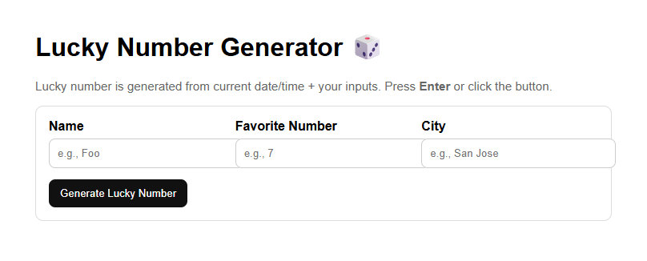

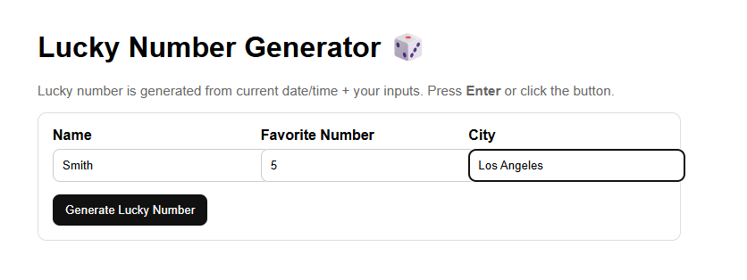

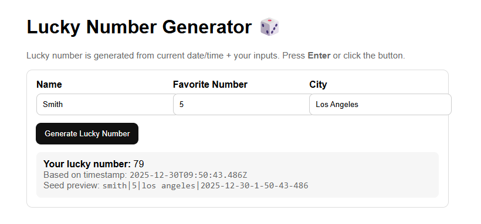

# 8. Write an HTML page that returns a user's GitHub repos (https://api.github.com/users/{user_id}/repos) in JSON format. The web page should have a text box and a submit button where users can provide the GitHub user ID. The fetch call should be asynchronous. If the call to the above API fails for any reason, you should return a customized, user-friendly error message. If you know more than one approach to implement the asynchronous call, please do it using different approaches.
A:
Code is in https://github.com/SiyanWen/git-repo-viewer-hw20 main branch.

Folder srtucture
```pgsql
question8-github-repos/
│── index.html
│── fetch-async.js      (async/await version)
│── fetch-promise.js    (then/catch version)
```


1.  Create an **HTML page**
    
2.  Add:
    
    -   A **text box** for GitHub user ID
        
    -   A **submit button**
        
3.  Call this API **asynchronously**:
    
    ```bash
    https://api.github.com/users/{user_id}/repos
    ```
    
4.  Display the result in **JSON format**
    
5.  Handle errors with a **custom, user-friendly message**
    
6.  Use **more than one async approach** if possible
    
You can switch which function is called by changing:
```javascript
// Use Async/Await Approach (Recommended)
<button onclick="getRepos()">Submit</button>

// Promise (.then / .catch) Approach
<button onclick="getReposPromise()">Submit</button>
```
- The GitHub API is accessed asynchronously using `fetch()`, which returns a Promise.  
- This prevents the browser UI thread from being blocked while waiting for the network response.  
- The `async/await` approach makes asynchronous code easier to read, while the Promise chaining approach demonstrates the underlying mechanism.
- Errors are handled using `try/catch` or `.catch()`.

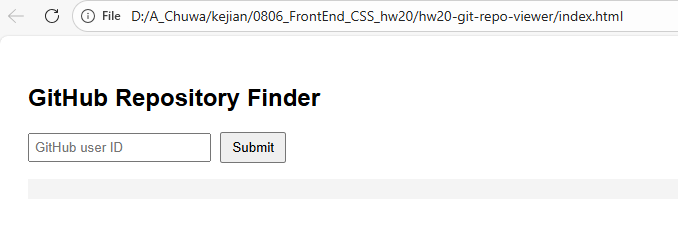

Enter Github id:

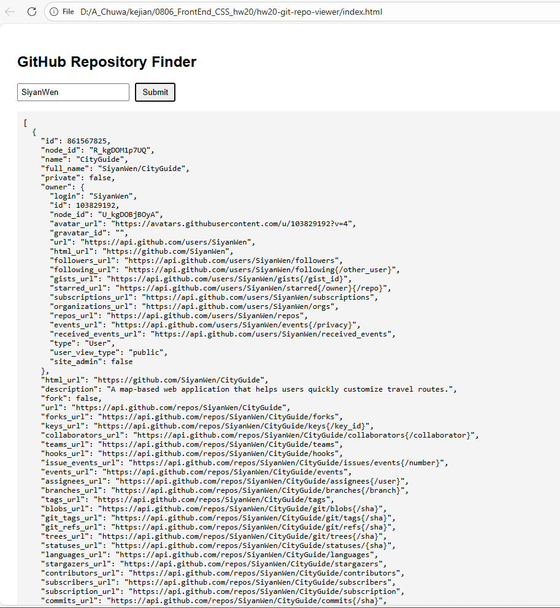

If the given id is not a valid github id:

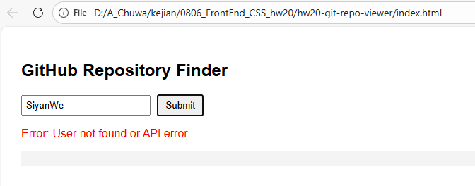


# 9. Explain how Javascript implement asynchronous non-blocking feature
## 1. Particularly: Event Loop, Macrotask, and Microtask with code samples.
Please submit code, answers, and screenshots to your GitHub branch.
A:
JavaScript is **single-threaded** (one call stack), but it can still feel “non-blocking” because it uses an **event loop** + **task queues** to schedule work *after* the current synchronous code finishes.

## How JS achieves asynchronous non-blocking

### 1) Call Stack (synchronous execution)

-   JS runs your code on the **call stack**.
    
-   While a function is on the stack, nothing else JS-side can run.
    

### 2) Web APIs / Host environment (browser or Node)

When you call things like:

-   `setTimeout`, DOM events, `fetch`, timers, IO  
    they are handled by the **host environment** (browser Web APIs / Node runtime), not the JS call stack.
    

So JS can “start” an async operation and **continue running other code**.

### 3) Queues + Event Loop

When async work completes, its callback is placed into a queue:

-   **Macrotask queue** (a.k.a. “task queue”)
    
-   **Microtask queue**
    

The **event loop** repeatedly does:

1.  If call stack is empty:
    
2.  Run **all microtasks** (drain microtask queue)
    
3.  Run **one macrotask**
    
4.  Repeat
    

That ordering is the key to many “why did this log first?” questions.

---

## Macrotask vs Microtask (what goes where)

### Macrotasks (Task queue)

Examples:

-   `setTimeout`, `setInterval`
    
-   DOM events (click, keydown)
    
-   `MessageChannel` / `postMessage`
    
-   (Node) `setImmediate` (Node-specific)
    

### Microtasks (Higher priority: run before next macrotask)

Examples:

-   `Promise.then(...) / catch(...) / finally(...)`
    
-   `queueMicrotask(...)`
    
-   `MutationObserver` (browser)
    

**Rule of thumb:** Promises schedule **microtasks**.

---

## Code Sample 1: Basic ordering

```javascript
console.log("A (sync start)");
setTimeout(() => console.log("D (setTimeout macrotask)"), 0);
Promise.resolve().then(() => console.log("C (promise microtask)"));
console.log("B (sync end)");
```

### Output (typical)

```bash
A (sync start)
B (sync end)
C (promise microtask)
D (setTimeout macrotask)
```

**Why?**

-   `A` and `B` are synchronous → run immediately.
    
-   Promise `.then` goes to **microtask queue** → runs as soon as stack is empty.
    
-   `setTimeout` callback goes to **macrotask queue** → runs after microtasks.
    

---

## Code Sample 2: “Microtasks drain before macrotask”

```javascript
setTimeout(() => console.log("timeout"), 0);

Promise.resolve().then(() => console.log("micro-1"));
Promise.resolve().then(() => console.log("micro-2"));
Promise.resolve().then(() => console.log("micro-3"));
```

### Output

```bash
micro-1
micro-2
micro-3
timeout
```

**Key point:** The event loop **drains all microtasks** before running the next macrotask.

---

## Code Sample 3: Nested scheduling (microtask inside macrotask)

```javascript
setTimeout(() => {
  console.log("timeout start");

  Promise.resolve().then(() => console.log("micro inside timeout"));

  console.log("timeout end");
}, 0);

Promise.resolve().then(() => console.log("top-level micro"));
```

### Output

```bash
top-level micro
timeout start
timeout end
micro inside timeout
```

**Why does “micro inside timeout” run after `timeout end`?**  
Because it’s scheduled as a microtask, but **microtasks only run when the call stack becomes empty** (after the timeout callback finishes).

---

## Code Sample 4: A real “non-blocking” example (fetch)

```javascript
console.log("1) before fetch");

fetch("https://api.github.com/")
  .then(r => r.json())
  .then(data => console.log("3) fetch done (async)"));

console.log("2) after fetch");
```
### Output

```bash
1) before fetch
2) after fetch
3) fetch done (async)
```
### What happens conceptually

-   `fetch(...)` starts a network request in the **browser’s networking layer**.
    
-   JS does **not** wait; it continues to `console.log("2)")`.
    
-   When the response arrives, the `.then(...)` handlers are queued (Promise jobs → **microtasks**, after the Promise is resolved).
    

---

## Why it’s “non-blocking” even though JS is single-threaded

Because time-consuming operations (network, timers, IO) are handled outside the call stack by the host environment. JS only runs:

-   quick synchronous code now
    
-   callbacks later, scheduled via queues
    

The **event loop** ensures the UI doesn’t freeze (unless *your synchronous code* blocks the stack, e.g., a huge loop).

---

## One more important detail: microtasks can starve macrotasks

If you keep adding microtasks endlessly, `setTimeout`/UI events can be delayed:

```js
function foreverMicrotasks() {
  queueMicrotask(() => {
    // keeps adding microtasks forever
    foreverMicrotasks();
  });
}
foreverMicrotasks();
```

This can make the page unresponsive because the event loop keeps draining microtasks and never gets to macrotasks (like rendering / user events).