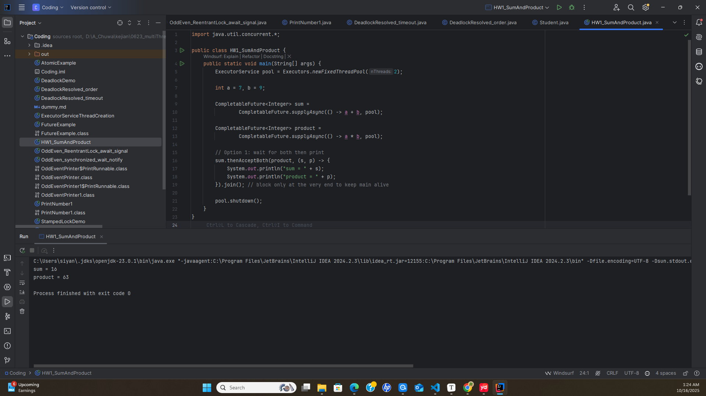
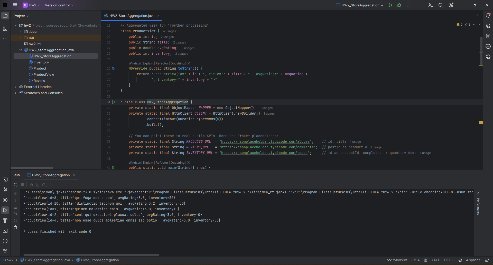
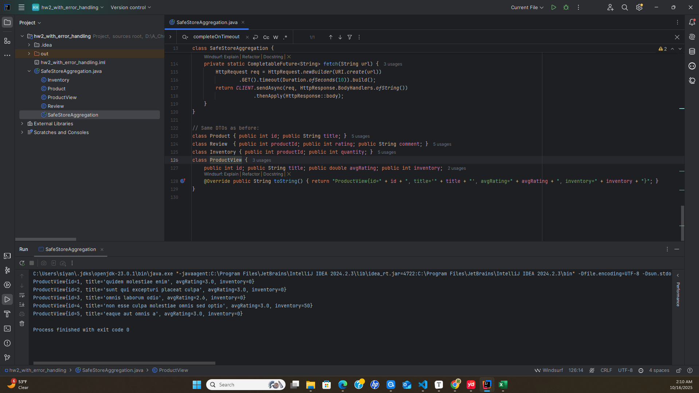

### Short Questions

# 1. Read
Q: Read https://www.interviewbit.com/multithreading-interview-questions/#class-level-lock-vs-object-level-lock
A: Completed.

# 2. Write a thread-safe singleton class 

## 1. Eager Initialization
```java
public class Singleton {
    private static final Singleton instance = new Singleton();

    private Singleton() {
        // private constructor
    }

    public static Singleton getInstance() {
        return instance;
    }
}
```

- Thread-safe by default because the instance is created at class loading time.

- Downside: Instance is created even if it's never used.

## 2. Lazy Initialization with `synchronized` Method
```java
public class Singleton {
    private static Singleton instance;

    private Singleton() {
        // private constructor
    }

    public static synchronized Singleton getInstance() {
        if (instance == null) {
            instance = new Singleton();
        }
        return instance;
    }
}
```
- Thread-safe, but the synchronized keyword makes it slower, especially after the instance is initialized.

## 3. Double-Checked Locking (Efficient and Thread-safe)

```java
public class Singleton {
    private static volatile Singleton instance;
    private Singleton(){

    }
    public static Singleton getInstance(){
        if(instance == null){
            synchronized(Singleton.class){
                if(instance == null){
                    instance=new Singleton();
                }
            }
        }
    }
}
```
- Uses volatile to prevent instruction reordering.

- Best balance of laziness, performance, and thread safety.
### Why is this faster?
**Without Double-Check: Always Synchronized:**
```java
public static synchronized Singleton getInstance() {
    if (instance == null) {
        instance = new Singleton();
    }
    return instance;
}
```
- Every call to getInstance() is synchronized.

- Synchronization is slow compared to a plain method call — it causes a performance hit, especially when many threads are calling it frequently after the singleton is already initialized.

**With Double-Checked Locking:**

- First check (if (instance == null)) happens without any lock.

- This allows fast access to the instance after it's initialized.

- Synchronization (synchronized) only happens once, when the instance is created.

- Second check inside the synchronized block prevents multiple initializations if two threads hit it simultaneously.
### Why volatile is necessary?
Without volatile, a thread might see a partially constructed object due to instruction reordering. volatile prevents this by ensuring:

Writes to instance happen after the constructor finishes.

All threads see the same state of the object.

## 4. Initialization-on-demand Holder Idiom (Best Practice)

```java
public class Singleton {
    private Singleton() {
        // private constructor
    }

    private static class Holder {
        private static final Singleton instance = new Singleton();
    }

    public static Singleton getInstance() {
        return Holder.instance;
    }
}
```
- Uses Java’s **class loading mechanism** to ensure thread safety.

- Lazy-loaded and no synchronization overhead.

|Method|	Thread-Safe|	Lazy|	Performance|	Recommended|
|------|------|------|------|------|
|Eager Initialization|	Yes|	No|	High|	If instance always used|
|Synchronized Method|	Yes|	Yes|	Low|	No
|Double-Checked Locking|	Yes|	Yes|	High|	Yes|
|Holder Class Idiom|	Yes|	Yes|	High|	✅ Best Choice|

# 3. How to create a new thread(Please also consider Thread Pool approach)?
## Create Manually:

###  1. Extend Thread class
```java
class MyThread extends Thread {
    public void run() {
        System.out.println("Thread is running.");
    }
}

public class Main {
    public static void main(String[] args) {
        Thread t = new MyThread();
        t.start();  // Starts a new thread
    }
}
```

### 2. Implement Runnable interface

```java
class MyRunnable implements Runnable {
    public void run() {
        System.out.println("Thread is running.");
    }
}

public class Main {
    public static void main(String[] args) {
        Thread t = new Thread(new MyRunnable());
        t.start();
    }
}
```

### 3. Lambda (since Java 8)
```java
public class Main {
    public static void main(String[] args) {
        Thread t = new Thread(() -> {
            System.out.println("Thread is running.");
        });
        t.start();
    }
}
```
## 2. Using a Thread Pool (ExecutorService)
Thread pools are more efficient for managing many short-lived threads.
```java
import java.util.concurrent.ExecutorService;
import java.util.concurrent.Executors;

public class Main {
    public static void main(String[] args) {
        ExecutorService executor = Executors.newFixedThreadPool(3); // 3 threads

        for (int i = 0; i < 5; i++) {
            int taskId = i;
            executor.submit(() -> {
                System.out.println("Running task " + taskId);
            });
        }

        executor.shutdown(); // Graceful shutdown
    }
}
```
### Common thread pool types:

|Executor Type|	Return Type |Usage|
|------|------|------|
|Executors.newFixedThreadPool(n)| static ExecutorService |	Fixed number of threads|
|Executors.newCachedThreadPool()| static ExecutorService |	Auto-adjusting thread count (flexible)|
|Executors.newSingleThreadExecutor()| static ExecutorService |	One thread (sequential tasks)
|Executors.newScheduledThreadPool(int corePoolSize)| static ScheduledExecutorService |	For scheduled/delayed tasks|

|Method|	When to Use|
|------|-----|
|Thread / Runnable|	Simple, quick one-off tasks|
|ExecutorService|	Production, scalable workloads|

# 4. Difference between Runnable and Callable?

|Runnable Interface|	Callable Interface |
|------|-----|
|It does not return any result and therefore, cannot throw a checked exception. |	It returns a result and therefore, can throw an exception.|
|It cannot be passed to invokeAll* method. |	It can be passed to invokeAll* method.|
|It was introduced in JDK 1.0.	|It was introduced in JDK 5.0, so one cannot use it before Java 5. |
|It simply belongs to Java.lang.|	It simply belongs to java.util.concurrent. |
|It uses the run() method to define a task.|	It uses the call() method to define a task.| 
|To use this interface, one needs to override the run() method. |	To use this interface, one needs to override the call() method.|

```
*
The invokeAll method in Java is a part of the ExecutorService interface within the java.util.concurrent package. It is designed for executing a collection of Callable tasks concurrently and waiting for their completion.

Java 中的 invokeAll 方法是 java.util.concurrent 包中 ExecutorService 接口的一部分。它旨在并发执行一组 Callable 任务并等待它们完成。
```

# 5. What is the difference between t.start() and t.run()?

start(): In simple words, the start() method is used to start or begin the execution of a newly created thread. When the start() method is called, a **new thread** is created and this newly created thread executes the task that is kept in the run() method. One can call the start() method only once.  

run(): In simple words, the run() method is used to start or begin the execution of the same thread. When the run() method is called, **no** new thread is created as in the case of the start() method. This method is executed by the current thread. One can call the run() method multiple times.

# 6. Which way of creating threads is better: Thread class or Runnable interface?

Implementing Runnable is generally preferred over extending Thread for several key reasons:
实现 Runnable 通常比扩展 Thread 更可取，原因如下：

- Flexibility and Multiple Inheritance: Java supports single inheritance, meaning a class can only extend one class. If you extend the Thread class, your class cannot extend any other class, limiting its flexibility. By implementing the Runnable interface, your class can still extend another class if needed, offering more design options.
灵活性和多重继承：Java 支持单继承，这意味着一个类只能扩展一个类。如果扩展 Thread 类，则类无法扩展任何其他类，从而限制其灵活性。通过实现 Runnable 接口，你的类仍然可以在需要时扩展另一个类，从而提供更多的设计选项。

- Separation of Concerns: Implementing Runnable separates the task you want to execute from the thread management itself. The Runnable object defines the "what" (the task), and the Thread object handles the "how" (the execution). This promotes better object-oriented design and makes your code more modular and reusable. You can easily reuse the same Runnable object with different threads.
关注点分离：实现 Runnable 将要执行的任务与线程管理本身分开。Runnable 对象定义 “什么” （任务），而 Thread 对象处理 “如何” （执行）。这促进了更好的面向对象的设计，并使代码更加模块化和可重用。您可以轻松地将同一个 Runnable 对象用于不同的线程。
- Compatibility with Executor Framework: The ExecutorService and Executors framework, the recommended way to manage thread pools in modern Java, primarily works with Runnable or Callable tasks. Using Runnable makes your code compatible with these advanced concurrency tools, leading to more efficient thread management and resource utilization.
与 Executor 框架的兼容性：ExecutorService 和 Executors 框架是在现代 Java 中管理线程池的推荐方法，主要适用于可运行或可调用的任务。使用 Runnable 可以使您的代码与这些高级并发工具兼容，从而提高线程管理和资源利用率。
- Reusability: A single instance of a Runnable implementation can be shared among multiple threads, allowing them to share the same resources and state. This is particularly useful for tasks that involve shared resources and reduces memory consumption.
可重用性：Runnable 实现的单个实例可以在多个线程之间共享，从而允许它们共享相同的资源和状态。这对于涉及共享资源和减少内存消耗的任务特别有用。

Extending Thread can be a suitable choice when:
在以下情况下，扩展 Thread 可能是一个合适的选择：

- You need to quickly create and manage a thread for a simple task.
您需要为简单任务快速创建和管理线程。

- You need to customize the thread's behavior or properties, such as its name or priority.
您需要自定义线程的行为或属性，例如其名称或优先级。
- You want to directly access thread-specific methods like getName() or interrupt().
您希望直接访问特定于线程的方法，如 getName() 或 interrup()。

In summary, while both approaches are valid, implementing Runnable is generally considered the better and more flexible approach for creating threads in Java, especially for complex applications and when working with modern concurrency frameworks. Extending Thread is more appropriate for simple scenarios where the task and thread management are tightly coupled.
总之，虽然这两种方法都有效，但实现 Runnable 通常被认为是在 Java 中创建线程的更好、更灵活的方法，尤其是对于复杂的应用程序和使用现代并发框架时。ExtendingThread更适合任务和线程管理紧密耦合的简单场景。

# 8. Demonstrate deadlock and how to resolve it in Java code.

## 🧩 Example 1 — Deadlock Demonstration

In this example, two threads hold locks on two different objects and try to acquire each other’s lock in reverse order, causing a deadlock.

```java
public class DeadlockDemo {
    private final Object lock1 = new Object();
    private final Object lock2 = new Object();

    public void task1() {
        synchronized (lock1) {
            System.out.println("Task1 locked lock1");
            try {
                Thread.sleep(100);
            } catch (InterruptedException e) {}
            System.out.println("Task1 waiting for lock2...");
            synchronized (lock2) {
                System.out.println("Task1 acquired lock2");
            }
        }
    }

    public void task2() {
        synchronized (lock2) {
            System.out.println("Task2 locked lock2");
            try {
                Thread.sleep(100);
            } catch (InterruptedException e) {}
            System.out.println("Task2 waiting for lock1...");
            synchronized (lock1) {
                System.out.println("Task2 acquired lock1");
            }
        }
    }

    public static void main(String[] args) {
        DeadlockDemo demo = new DeadlockDemo();

        Thread t1 = new Thread(() -> demo.task1());
        Thread t2 = new Thread(() -> demo.task2());

        t1.start();
        t2.start();
    }
}
```

### 🧠 Explanation:

-   **Thread t1** locks `lock1` first, then waits for `lock2`.
    
-   **Thread t2** locks `lock2` first, then waits for `lock1`.
    
-   Both threads are waiting for each other forever ⇒ **Deadlock**.
    

You’ll see output similar to:

```rust
Task1 locked lock1
Task2 locked lock2
Task1 waiting for lock2...
Task2 waiting for lock1...
```

Then the program hangs indefinitely.

---

## ✅ Example 2 — Deadlock Resolution

The fix is to **always acquire locks in a consistent order**.

```java
public class DeadlockResolved {
    private final Object lock1 = new Object();
    private final Object lock2 = new Object();

    public void task1() {
        synchronized (lock1) {
            System.out.println("Task1 locked lock1");
            try {
                Thread.sleep(100);
            } catch (InterruptedException e) {}
            synchronized (lock2) {
                System.out.println("Task1 locked lock2");
            }
        }
    }

    public void task2() {
        // Use same lock order: lock1 → lock2
        synchronized (lock1) {
            System.out.println("Task2 locked lock1");
            try {
                Thread.sleep(100);
            } catch (InterruptedException e) {}
            synchronized (lock2) {
                System.out.println("Task2 locked lock2");
            }
        }
    }

    public static void main(String[] args) {
        DeadlockResolved demo = new DeadlockResolved();

        Thread t1 = new Thread(() -> demo.task1());
        Thread t2 = new Thread(() -> demo.task2());

        t1.start();
        t2.start();
    }
}
```

### 💡 Key Idea:

-   **Both threads acquire locks in the same order (`lock1` → `lock2`)**.
    
-   Prevents circular waiting, eliminating deadlock.
    

---

## 🔧 Other Common Solutions

1.  **Use `tryLock()` with timeout** (from `java.util.concurrent.locks.Lock`):
    
    ```java
    if (lock1.tryLock(1, TimeUnit.SECONDS)) {
        try {
            if (lock2.tryLock(1, TimeUnit.SECONDS)) {
                try {
                    // Do work
                } finally {
                    lock2.unlock();
                }
            }
        } finally {
            lock1.unlock();
        }
    }
    ```
    
    → Avoids indefinite blocking.
    
2.  **Avoid nested locks** — redesign to reduce inter-thread dependencies.
    
3.  **Use higher-level concurrency utilities** like `ExecutorService`, `ConcurrentHashMap`, or `BlockingQueue`.

# 9. How do threads communicate each other?

A: Threads can communicate using three methods i.e., wait(), notify(), and notifyAll().

#  10. What’s the difference between class lock and object lock?

A:

## 1. Object Lock (Instance Lock):

- In java, each and every object has a unique lock usually referred to as an object-level lock.
对象锁：在Java中，每个对象都有一个唯一的锁定，通常称为对象级锁定。
- Lock that is tied to a specific object instance (this).
锁定与特定对象实例（this）绑定的锁。
- Used when synchronizing instance methods or blocks on this.
当同步实例方法或块上时使用。

Used in:
```java
public synchronized void doSomething() {
    // Locks "this" object
}
```
or
```java
public void doSomething() {
    synchronized(this) {
        // Locks this instance
    }
}
```
## 2. Class Lock (Static/Class-Level Lock) 
类锁定 （静态/类级锁定）

- Lock that is tied to the Class object (i.e., MyClass.class).
绑定到 Class 对象的 Lock（即 MyClass.class）。
- In java, each and every class has a unique lock usually referred to as a class level lock. 
在Java中，每个类都有一个唯一的锁，通常称为类级锁。
- Used when synchronizing static methods or blocks on MyClass.class.
在同步静态方法或块 onMyClass.class 时使用。

Used in:
```java
public static synchronized void staticMethod() {
    // Locks the class object
}
```
or
```java
public static void staticMethod() {
    synchronized(MyClass.class) {
        // Locks the class
    }
}
```
### Can a static class has object lock / a non-static class has  class lock?
First: The Lock is on the Object, Not the Code Itself
A synchronized method or block does not itself hold a lock.

Instead, it tells the JVM to acquire a lock on an object before entering that code.

🔒 So What’s Being Locked?
|synchronized type|	What’s locked?|
|------|-----|
|synchronized instance method or synchronized(this)|	The object (this) instance|
|synchronized static method or synchronized(ClassName.class)|	The class object (only one per class)|

- ❓ Is the lock about the method or the class?
No, the lock is about the object (instance or class), not the method or class itself.
Think of it this way: synchronized code just says "acquire this lock before proceeding."
What matters is which object the lock is on.
- ❓ Can a static class have an object lock?
In Java, the term "static class" specifically refers to a static nested class. A top-level class cannot be declared as static.
static nested classes are treated like top-level classes — they do not have an enclosing instance.
So no, a static class cannot have an object lock on this, because this doesn’t exist in that context.
However, it can use class locks (e.g., synchronized(MyStaticClass.class)).
- ❓ Can a non-static class use a class lock?
Yes! Absolutely. A regular (non-static) class can still lock on the class object like this:
```java
synchronized(MyClass.class) {
    // class-level lock
}
```
This is how you enforce that only one thread can enter that code across all instances of the class.

🧠 Summary

|Class Type|	Can use object lock (this)	|Can use class lock (ClassName.class)|
|------|-----|-----|
|Non-static class|	✅ Yes|	✅ Yes|
|Static nested class|	❌ No (this doesn't exist)|	✅ Yes|


# 11. What is join() method?
A: 

join() method is generally used to pause the execution of a current thread unless and until the specified thread on which join is called is dead or completed. To stop a thread from running until another thread gets ended, this method can be used. It joins the start of a thread execution to the end of another thread’s execution. It is considered the final method of a thread class.
join（）方法通常用于暂停当前线程的执行，除非和直到指定的加入的指定线程已死或完成。要阻止线程运行直到另一个线程结束，可以使用此方法。它将线程执行的开始连接到到另一个线程执行的末尾。它被认为是线程类的final方法。

In Java, the join() method is a crucial part of multithreading, allowing for synchronization between threads. It is a method of the Thread class and its primary purpose is to make one thread wait for the completion of another thread.
在 Java 中，join（） 方法是多线程的关键部分，允许线程之间的同步。它是 Thread 类的一个方法，其主要目的是使一个线程等待另一个线程完成。
Here's how it works:
以下是它的工作原理：
### Waiting for Thread Completion: 等待线程完成：
When a thread (let's call it Thread A) calls the join() method on another thread (Thread B), Thread A will pause its execution and wait until Thread B finishes its execution (i.e., until Thread B's run() method completes). Once Thread B terminates, Thread A resumes its execution.
当一个线程（我们称之为线程 A）在另一个线程（线程 B）上调用 join（） 方法时，线程 A 将暂停其执行并等待线程 B 完成其执行（即，直到线程 B 的 run（） 方法完成）。线程 B 终止后，线程 A 将继续执行。
### Synchronization Mechanism: 同步机制：
join() is a synchronization mechanism that ensures a specific order of execution among threads. It is particularly useful when one thread needs the results or completion of another thread before it can proceed.
join（） 是一种同步机制，可确保线程之间的特定执行顺序。当一个线程需要另一个线程的结果或完成才能继续时，它特别有用。
### Overloaded Versions:重载版本：
The join() method comes in three overloaded versions:
join（） 方法有三个重载版本：

- join(): Waits indefinitely for the target thread to complete.
join（）：无限期等待目标线程完成。
- join(long millis): Waits for the specified number of milliseconds for the target thread to complete. If the thread does not terminate within the specified time, the calling thread will resume. 
join（long millis）：等待指定的毫秒数以完成目标线程。如果线程未在指定时间内终止，则调用线程将恢复。
- join(long millis, int nanos): Waits for the specified number of milliseconds and nanoseconds. 
join（long millis， int nanos）：等待指定的毫秒数和纳秒数。

InterruptedException:  InterruptedException 异常：
The join() method can throw an InterruptedException, which needs to be handled (caught or declared to be thrown). This exception occurs if another thread interrupts the waiting thread while it's in the join() state.
join（） 方法可以抛出一个 InterruptedException，它需要被处理（捕获或声明被抛出）。如果另一个线程在 join（） 状态时中断等待线程，则会发生此异常。
```java
class MyRunnable implements Runnable {
    private String name;

    public MyRunnable(String name) {
        this.name = name;
    }

    @Override
    public void run() {
        System.out.println(name + " starting.");
        try {
            Thread.sleep(2000); // Simulate some work
        } catch (InterruptedException e) {
            Thread.currentThread().interrupt();
        }
        System.out.println(name + " finishing.");
    }
}

public class JoinExample {
    public static void main(String[] args) {
        Thread thread1 = new Thread(new MyRunnable("Thread-1"));
        Thread thread2 = new Thread(new MyRunnable("Thread-2"));

        thread1.start();
        thread2.start();

        try {
            thread1.join(); // Main thread waits for thread1 to complete
            System.out.println("Thread-1 has finished.");
            thread2.join(); // Main thread waits for thread2 to complete
            System.out.println("Thread-2 has finished.");
        } catch (InterruptedException e) {
            Thread.currentThread().interrupt();
        }

        System.out.println("Main thread finishing.");
    }
}
```
Output:
```
Thread-2 starting.
Thread-1 starting.
Thread-2 finishing.
Thread-1 finishing.
Thread-1 has finished.
Thread-2 has finished.
Main thread finishing.
```

In this example, the main thread will start thread1 and thread2. Then, it will call thread1.join(), pausing its own execution until thread1 completes. After thread1 finishes, the main thread will then call thread2.join(), waiting for thread2 to complete before finally printing "Main thread finishing." This ensures that "Thread-1 has finished." is printed only after Thread-1 actually finishes, and similarly for Thread-2.

在此示例中，主线程将启动thread1和thread2。然后，它将调用thread1.join（），暂停自己的执行，直到thread1完成。thread1完成后，主线程将调用thread2.join（），等待thread2完成，然后最终打印“Main thread finishing.”。这样可以确保“thread1已经完成”仅在thread1实际完成后才打印，而对于Thread2类似。

# 12. what is yield() method?

A: 

Thread.yield(), is a static method that acts as a hint to the thread scheduler. When a thread calls yield(), it suggests to the scheduler that it is willing to temporarily pause its execution and allow other runnable threads, particularly those of the same or higher priority, to execute. 
Thread.yield（），是一个静态方法，用作线程计划程序的提示。当线程调用yield()时，它会向调度程序建议它愿意暂时暂停其执行并允许其他可运行的线程，特别是那些具有相同或更高优先级的线程。

## Key characteristics and implications in Java synchronization:Java 同步的主要特征和影响：
### Hint to the scheduler:  给调度程序的提示：
yield() is not a guaranteed pause. The thread scheduler is free to ignore the hint and continue executing the current thread if it determines there are no other suitable threads to run or if its scheduling algorithm prioritizes the current thread.
yield（） 不能保证暂停。如果线程调度程序确定没有其他合适的线程可供运行，或者其调度算法优先考虑当前线程，则可以自由地忽略该提示并继续执行当前线程。
### Does not release locks:  不释放锁：
Unlike wait(), yield() does not release any monitors (locks) held by the current thread. If a thread calls yield() while inside a synchronized block, it will still retain the lock, potentially preventing other threads from acquiring it.
与 wait（） 不同，yield（） 不会释放当前线程持有的任何监视器（锁）。如果线程在同步块内调用 yield（），它仍将保留该锁，从而可能阻止其他线程获取它。
### Purpose:  目的：
It is primarily used as a heuristic attempt to improve the fairness of thread execution and prevent one thread from monopolizing the CPU, especially in scenarios with busy-wait loops.
它主要用作一种启发式尝试，以提高线程执行的公平性并防止一个线程垄断 CPU，尤其是在具有忙等待循环的情况下。
### Limited practical use:  有限的实际用途：
Due to its advisory nature and lack of guarantees, yield() is generally not recommended for precise control over thread execution or for managing synchronization. More robust mechanisms like sleep(), join(), wait()/notify(), or concurrency utilities from java.util.concurrent are typically preferred for reliable thread coordination and synchronization.
由于其建议性质和缺乏保证，通常不建议使用 yield（） 来精确控制线程执行或管理同步。对于可靠的线程协调和同步，通常首选更健壮的机制，如 sleep（）、join（）、wait（）/notify（） 或 java.util.concurrent 中的并发实用程序。


# 13. What is ThreadPool? How many types of ThreadPool? What is the TaskQueue in ThreadPool?

A:

A ThreadPool in Java is a pool of worker threads that execute tasks from a queue. It’s part of the java.util.concurrent package and is a key tool for efficient multithreading and resource management.Java 中的线程池是一组工作线程，它们从队列中执行任务。它是 java.util.concurrent 包的一部分，是高效多线程和资源管理的关键工具。


A ThreadPool manages a fixed number of threads.一个线程池管理固定数量的线程。

Instead of creating a new thread for each task (which is expensive), tasks are queued and executed by reusable threads.与其为每个任务创建一个新线程（这很昂贵），任务会被排队并由可重用的线程执行。

Provided by the ExecutorService interface (mainly via Executors factory class).由 ExecutorService 接口提供（主要通过 Executors 工厂类）。


### ✅ Types of Thread Pools (via Executors)✅ 线程池类型（通过 Executors ）
|Method方法|	Description描述|
|------|------|
|Executors.newFixedThreadPool(n)|	A pool with a fixed number of threads一个固定数量的线程池|
|Executors.newCachedThreadPool()|	A flexible pool that creates new threads as needed and reuses idle ones一个灵活的池，按需创建新线程并重用空闲的线程|
|Executors.newSingleThreadExecutor()|	A single worker thread pool (sequential task execution)一个单一的工作线程池（顺序任务执行）|
|Executors.newScheduledThreadPool(n)|	For scheduling tasks with delay or periodic execution用于计划具有延迟或周期性执行的任务|

### 🔍 Custom ThreadPool: ThreadPoolExecutor🔍 自定义线程池: ThreadPoolExecutor
For full control, use ThreadPoolExecutor directly:对于完全控制，直接使用 ThreadPoolExecutor ：

```java
ExecutorService executor = new ThreadPoolExecutor(
    corePoolSize,        // min number of threads
    maximumPoolSize,     // max threads allowed
    keepAliveTime,       // idle time before excess threads are terminated
    TimeUnit.SECONDS,
    new LinkedBlockingQueue<>(), // TaskQueue
    new MyThreadFactory(),       // (optional) custom thread factory
    new ThreadPoolExecutor.AbortPolicy() // (optional) Rejection handler
);
```
## 📦 What is TaskQueue in ThreadPool?📦 线程池中的 TaskQueue 是什么？
➤ TaskQueue is the queue that holds pending tasks waiting to be executed by a thread in the pool.➤ 任务队列是存放待执行任务的队列，等待池中的线程来执行。
It’s a BlockingQueue<Runnable> implementation.这是一个 BlockingQueue<Runnable> 实现。

Threads in the pool pull tasks from the queue when they’re available.池中的线程在任务可用时从队列中拉取任务。

Common types:常见类型：
|Queue Type队列类型|	Description描述|
|------|------|
|LinkedBlockingQueue|	Unbounded, used in FixedThreadPool无界，用于 FixedThreadPool|
|SynchronousQueue|	No queue — task must be handed off directly to a thread (used in CachedThreadPool)无队列 — 任务必须直接交给线程（用于 CachedThreadPool ）|
|ArrayBlockingQueue|	Bounded queue — good for backpressure control有界队列 — 适用于背压控制|
|PriorityBlockingQueue|	Allows tasks with priority (used less often)允许具有优先级的任务（使用频率较低）|

🧠 Summary🧠 摘要
|Concept概念|	Explanation解释|
|------|------|
|ThreadPool线程池|	A manager of a fixed number of reusable threads一个固定数量的可重用线程的管理器|
|Types类型|	Fixed, Cached, Single, Scheduled固定、缓存、单例、计划|
|TaskQueue任务队列|	A queue where tasks wait to be picked up by a thread一个任务等待线程来处理的队列|
|Benefits优点|	Reuse threads, control concurrency, improve performance重用线程，控制并发，提高性能|

# 14. Which Library is used to create ThreadPool? Which Interface provide main functions of thread-pool?

A:

## 1. The `java.util.concurrent` library (Java Concurrency Utilities) is used to create and manage thread pools in Java.

It contains: 
`Executor`
`ExecutorService`
`Executors`
`ThreadPoolExecutor`

## 2. The `ExecutorService` interface provides the **main functions** of a thread pool, including:

- Submitting tasks
- Managing the lifecycle (shutdown, termination checks)
- Handling asynchronous computation results (`Future`)

Functions of Interface ExecutorService:

|Return Type|Method|
|------|------|
|boolean|awaitTermination(long timeout, TimeUnit unit)|
|\<T\> Future\<T\>|submit(Callable<T> task)|
|Future\<?\>|submit(Runnable task)|
|\<T\> Future\<T\>|submit(Runnable task, T result)|
|void|shutdown()|
|List\<Runnable\>|shutdownNow()|
|\<T\> T|invokeAny(Collection<? extends Callable<T>> tasks, long timeout, TimeUnit unit)|
|\<T\> T|invokeAny(Collection<? extends Callable<T>> tasks)|
|\<T\> List\<Future\<T\>\>|invokeAll(Collection<? extends Callable<T>> tasks, long timeout, TimeUnit unit)|
|\<T\> List\<Future\<T\>\>|invokeAll(Collection<? extends Callable<T>> tasks)|

# 15. How to submit a task to ThreadPool?

A:

We can submit tasks using:

✅ Using submit() (returns a Future):

```java
ExecutorService executor = Executors.newFixedThreadPool(3);

Future<?> future = executor.submit(() -> {
    System.out.println("Task is running");
});
```
✅ Using execute() (does not return a result):
```java
executor.execute(() -> {
    System.out.println("Task is running");
});
```

# 16. What is the advantage of ThreadPool?

A:

### 🧵 Why use ThreadPool?🧵 为什么使用线程池？
|特性|单个线程|线程池|
|------|------|------|
|Creation创建|`new Thread(runnable)`| `Executors.newFixedThreadPool(n)` or `new ThreadPoolExecutor(...)`|
|Execution执⾏|thread.start()| `executorService.submit(runnable)` or `execute(runnable)`|
|Resource Consumption资源消耗| New thread created for each task, consuming more resources每个任务创建⼀个新线程，占⽤更多资源| Fixed or configurable number of threads, sharing thread resources固定数量或可配置数量的线程，共享线程资源|
|Performance性能|Potential performance issues due to frequent thread creation and destruction可能因为频繁创建和销毁线程导致性能低下| Thread reuse, reducing overhead of thread creation and destruction, improving performance复⽤线程，减少线程创建和销毁的开销，提⾼性能|
|Thread Lifecycle Management线程⽣命周期管理| Manual thread lifecycle management需要⼿动管理线程的⽣命周期|Automatic thread lifecycle management by thread pool线程池⾃动管理线程的⽣命周期|
| Concurrency Control并发控制| Difficult to control the number of concurrent tasks难以控制并发任务的数量|Control the number of concurrent tasks by configuring the pool size通过配置线程池⼤⼩来控制并发任务的数量|
|Task Queuing & Execution Strategy任务排队与执⾏策略|No task queuing for waiting tasks⽆法排队等待执⾏的任务|Allows queuing of tasks waiting for execution可以对等待执⾏的任务进⾏排队|
|Result Retrieval (optional)结果获取（可选）| No direct result return, manual synchronization required不直接返回结果，需要⼿动同步| submit(runnable) returns a Future object for result retrievalsubmit(runnable) 返回 Future 对象，可⽤于获取结果|
|Error Handling (optional)错误处理（可选）|Error handling within the task需要在任务内部处理错误|Provide a `RejectedExecutionHandler` for handling errors可以提供⼀个 `RejectedExecutionHandler` 来处理错误|
|Thread/Pool Shutdown关闭线程/线程池|No direct way to close thread, interrupt logic implementation required⽆法直接关闭线程，需要实现中断逻辑|Close thread pool using `executorService.shutdown()` or `shutdownNow()`使⽤ `executorService.shutdown()` 或 `shutdownNow()` 关闭线程池|

- Using thread pools generally offers better performance and resource management compared to creating single 
threads directly. Thread pools control the number of concurrent tasks, reduce the overhead of thread creation 
and destruction, and improve performance. Moreover, thread pools allow task queuing for pending execution, 
automatically manage thread lifecycles, and provide more flexible error handling mechanisms. However, in 
some simple scenarios, using a single thread might be more straightforward.
使⽤线程池通常⽐直接创建单个线程具有更好的性能和资源管理。线程池可以控制并发任务的数量，减少线程创建和销
毁的开销，提⾼性能。此外，线程池还可以对等待执⾏的任务进⾏排队，⾃动管理线程的⽣命周期，并提供更灵活的错
误处理机制。然⽽，在某些简单的场景中，使⽤单个线程可能会更简单。

- Reduces the overhead of thread creation.减少线程创建的开销。

- Limits the number of concurrent threads — prevents resource exhaustion.限制并发线程数量 — 防止资源耗尽。

- Improves performance for many short-lived or repetitive tasks.提高许多短期或重复性任务的性能。

# 17. Difference between shutdown() and shutdownNow() methods of executor

A:

| Aspect        | `shutdown()`                                      | `shutdownNow()`                              |
| ------------- | ------------------------------------------------- | -------------------------------------------- |
| Action        | Initiates **graceful shutdown**                   | Initiates **immediate shutdown**             |
| Running Tasks | Allows running tasks to complete                  | Attempts to stop running tasks               |
| Waiting Tasks | No new tasks accepted; pending tasks will execute | Attempts to cancel pending tasks             |
| Return Value  | `void`                                            | `List<Runnable>` of tasks awaiting execution |
| Interruption  | Does **not interrupt** running tasks              | **Attempts to interrupt** running tasks      |


# 18. What is Atomic classes? How many types of Atomic classes? Give me some code example of Atomic classes and its main methods. when to use it?

A:

Atomic classes in Java (from `java.util.concurrent.atomic` package) provide:

✅ Low-level atomic operations (lock-free) for single variables.

✅ Thread-safe, non-blocking algorithms using hardware-level atomic instructions (CAS).

✅ Prevent race conditions without explicit synchronization.

They are heavily used for counters, flags, and shared single-variable updates in multi-threading.

## 📦 Types of Atomic Classes

1️⃣ Primitive Atomic Classes

- `AtomicInteger` (for `int`)

- `AtomicLong` (for `long`)

- `AtomicBoolean` (for `boolean`)

2️⃣ Atomic Array Classes

- `AtomicIntegerArray`

- `AtomicLongArray`

- `AtomicReferenceArray`

3️⃣ Object Reference Atomic Classes

- `AtomicReference<V>`

- `AtomicStampedReference<V>` (to avoid **ABA problem**)

- `AtomicMarkableReference<V>`

4️⃣ Field Updater Classes

- `AtomicIntegerFieldUpdater`

- `AtomicLongFieldUpdater`

- `AtomicReferenceFieldUpdater`

## 🛠️ Common Methods

| Method                          | Purpose                                   |
| ------------------------------- | ----------------------------------------- |
| `get()`                         | Get current value                         |
| `set(value)`                    | Set value                                 |
| `getAndSet(value)`              | Atomically set and return old value       |
| `incrementAndGet()`             | Atomically increment and return new value |
| `getAndIncrement()`             | Atomically increment and return old value |
| `decrementAndGet()`             | Atomically decrement and return new value |
| `compareAndSet(expect, update)` | Atomically set value if current == expect |

## 🧑‍💻 Example: Using AtomicInteger

```java
import java.util.concurrent.atomic.AtomicInteger;

public class AtomicExample {
    private static AtomicInteger counter = new AtomicInteger(0);

    public static void main(String[] args) {
        Runnable task = () -> {
            for (int i = 0; i < 1000; i++) {
                counter.incrementAndGet(); // Atomically increment
            }
        };

        Thread t1 = new Thread(task);
        Thread t2 = new Thread(task);
        t1.start();
        t2.start();

        try {
            t1.join();
            t2.join();
        } catch (InterruptedException e) {
            e.printStackTrace();
        }
        // Final count: 2000
        System.out.println("Final count: " + counter.get());
    }
}
```

✅ Here:

- `incrementAndGet()` ensures atomic increment without explicit `synchronized`.

- Result will consistently be `2000` without race conditions.

## 📈 When to Use Atomic Classes?
- ✅ When you need lock-free, thread-safe operations on single variables (counters, flags, references).当您需要对单个变量（计数器、标志、引用）进行无锁、线程安全的作时
- ✅ When contention is low and you want to avoid the overhead of locks.当争用较低时，您希望避免锁的开销。
- ✅ For building non-blocking algorithms (e.g., in high-performance systems).用于构建非阻塞算法（例如，在高性能系统中）。
- ✅ In implementing counters in thread-safe singleton metrics. 在线程安全的单例指标中实现计数器

## ❌ When NOT to Use
- Compound actions (checking and modifying multiple variables together) still require locks.复合操作（一起检查和修改多个变量）仍然需要锁。

- For complex data structures (use `java.util.concurrent` collections instead).对于复杂的数据结构（使用 `java.util.concurrent` collections 代替）。

## 🧠 Summary 🧠 总结
✅ Atomic Classes: Lock-free, thread-safe, hardware-level atomic variable operations.
✅原子类：无锁、线程安全、硬件级原子变量作。

✅ Types: Primitive (`AtomicInteger`, etc.), Arrays, References, Field Updaters.

✅ Main Methods: `get()`, `set()`, `incrementAndGet()`, `compareAndSet()`. 

✅ Use for: Simple, high-performance, thread-safe single-variable updates.
✅用途：简单、高性能、线程安全的单变量更新。

# 19. What is the concurrent collections? Can you list some concurrent data structure (Thread-safe)

A:

## 🚀 What are Concurrent Collections? 🚀 什么是并发集合？
|interface| non-thread-safe| thread-safe|
|------|------|------|
|List| ArrayList| CopyOnWriteArrayList|
|Map| HashMap| ConcurrentHashMap|
|Set| HashSet / TreeSet| CopyOnWriteArraySet|
|Queue| ArrayDeque / LinkedList| ArrayBlockingQueue / LinkedBlockingQueue|
|Deque| ArrayDeque / LinkedList| LinkedBlockingDeque|


Concurrent collections are thread-safe data structures provided by `java.util.concurrent` that allow safe concurrent access and modification by multiple threads without explicit external synchronization.
并发集合是由 `java.util.concurrent` 提供的线程安全数据结构，它允许多个线程进行安全并发访问和修改，而无需显式外部同步。

They use fine-grained locking, lock striping, or non-blocking algorithms to improve scalability and reduce contention compared to synchronizing standard collections manually.
与手动同步标准集合相比，它们使用细粒度锁定、锁定条带化或非阻塞算法来提高可扩展性并减少争用。

## 🪐 Why use Concurrent Collections? 🪐 为什么使用 Concurrent Collections？

✅ Avoid `ConcurrentModificationException`. 

✅ Higher performance than using `Collections.synchronizedXXX()`. 
✅ 比 usingCollections.synchronizedXXX（） 性能更高。

✅ Safe iteration while allowing concurrent modifications.
✅ 安全迭代，同时允许并发修改。

✅ Useful in producer-consumer, caching, and concurrent task coordination.
✅ 在生产者-使用者、缓存和并发任务协调中很有用。

## 📦 Common Concurrent Data Structures (Thread-safe)

1️⃣ Concurrent Maps
- `ConcurrentHashMap`: Thread-safe hash map with high concurrency.
具有高并发性的线程安全哈希 map。

- `ConcurrentSkipListMap`: Sorted map (like TreeMap) with concurrency support.
支持并发的排序地图 （likeTreeMap）。

- `ConcurrentNavigableMap` (interface): Implemented by ConcurrentSkipListMap.
由 ConcurrentSkipListMap 实现。


2️⃣ Concurrent Sets
- `ConcurrentSkipListSet`: Sorted set with concurrency support.
支持并发的排序集。

- `CopyOnWriteArraySet`: For scenarios with many reads and few writes.
适用于读取次数多、写入次数少的场景。

3️⃣ Concurrent Queues

- `ConcurrentLinkedQueue`: Unbounded, non-blocking FIFO queue.
无界(容量动态增长)、非阻塞 FIFO 队列。

- `ConcurrentLinkedDeque`: Unbounded, non-blocking double-ended queue.
无界、非阻塞的双端队列。

- `LinkedBlockingQueue`: Optionally bounded blocking FIFO queue.
可选的有界阻塞 FIFO 队列。

- `ArrayBlockingQueue`: Bounded blocking FIFO queue with fixed size.
具有固定大小的有界阻塞 FIFO 队列。

- `PriorityBlockingQueue`: Unbounded, blocking priority queue.
无界，阻塞优先级队列。

- `DelayQueue`: Delayed elements, useful for scheduling tasks.
延迟元素，用于调度任务。

- `SynchronousQueue`: No capacity, each insert waits for a remove.
无容量，每个插入等待删除。

- `LinkedTransferQueue`: Allows producers to wait for consumers to receive elements.
允许创建者们待使用者接收元素。

4️⃣ Concurrent Deques
- `ConcurrentLinkedDeque`: Non-blocking, concurrent double-ended queue.
非阻塞、并发双端队列。

- `LinkedBlockingDeque`: Blocking double-ended queue.
阻塞双端队列。

5️⃣ Copy-On-Write Collections

- `CopyOnWriteArrayList`: ArrayList variant where writes copy the array.
写入复制数组的 ArrayList 变体。

- `CopyOnWriteArraySet`: Set variant with copy-on-write semantics.
使用写入时复制语义设置变体。

## 🛠️ Example: Using ConcurrentHashMap

```java
import java.util.concurrent.ConcurrentHashMap;

public class ConcurrentMapExample {
    public static void main(String[] args) {
        ConcurrentHashMap<String, Integer> map = new ConcurrentHashMap<>();

        map.put("Alice", 1);
        map.put("Bob", 2);

        map.computeIfAbsent("Charlie", k -> 3);

        map.forEach((k, v) -> System.out.println(k + " -> " + v));
    }
}
```

✅ Supports concurrent reads and updates without explicit synchronization.
✅ 支持并发读取和更新，无需显式同步。

## 🚦 When to Use Concurrent Collections🚦 何时使用并发集合

✅ When multiple threads need to read/write shared data structures concurrently.
✅ 当多个线程需要并发读/写共享数据结构时。

✅ To avoid explicit locking with synchronized.
✅ 避免使用 synchronized 进行显式锁定。

✅ For high-performance, thread-safe collection operations. 
✅ 用于高性能、线程安全的集合作。

✅ In producer-consumer problems and work queues in multithreaded environments.
✅ 在多线程环境中的生产者-使用者问题和工作队列中。

## ⚠️ Note ⚠️ 注意
- Copy-On-Write collections are best when reads vastly outnumber writes (e.g., event listener lists).
Copy-On-Write 集合最适合当读取数量远多于写入数量时（例如，事件侦听器列表）。

- Blocking queues are ideal for producer-consumer problems. 
阻塞队列是解决生产者-消费者问题的理想选择。

- For atomic operations on single variables, prefer atomic classes.
对单个变量的 Foratomic作，preferatomic 类。

## 🧠 Summary Table 🧠 汇总表

| Collection Type           | Examples                                                                |
| ------------------------- | ----------------------------------------------------------------------- |
| Concurrent Maps           | `ConcurrentHashMap`, `ConcurrentSkipListMap`                            |
| Concurrent Queues         | `ConcurrentLinkedQueue`, `LinkedBlockingQueue`, `PriorityBlockingQueue` |
| Concurrent Sets           | `ConcurrentSkipListSet`, `CopyOnWriteArraySet`                          |
| Copy-On-Write Collections | `CopyOnWriteArrayList`, `CopyOnWriteArraySet`                           |
| Concurrent Deques         | `ConcurrentLinkedDeque`, `LinkedBlockingDeque`                          |

# 20. What kind of locks do you know? What is the advantage of each lock?
A: The Java language directly provides the 'synchronized' keyword for locking, but this lock is very heavy, and secondly, it has to wait all the time to get it, and there is no additional attempt mechanism.
The 'ReentrantLock' provided by the 'java.util.concurrent.locks' package is used instead of 'synchronized' locking.

Java语⾔直接提供了 `synchronized` 关键字⽤于加锁，但这种锁⼀是很重，⼆是获取时必须⼀直等待，没有额外的尝试机制。
`java.util.concurrent.locks` 包提供的 `ReentrantLock` ⽤于替代 `synchronized` 加锁

Java provides advanced explicit locking mechanisms under java.util.concurrent.locks for fine-grained, flexible control beyond synchronized.Java 在 java.util.concurrent.locks 下提供了高级显式锁定机制，用于实现比 synchronized 更细粒度、更灵活的控制。

## The main types:主要类型：
1️⃣ `ReentrantLock`

2️⃣ `ReadWriteLock` (via `ReentrantReadWriteLock`)

3️⃣ `StampedLock` (Java 8+)

## 1️⃣ ReentrantLock

### What is it?它是什么？

A mutual exclusion lock with the same basic behavior as `synchronized`, but with more advanced capabilities:一个与 `synchronized` 具有相同基本行为的互斥锁，但具有更高级的功能：

- Fair locking公平锁

- Interruptible lock acquisition可中断的锁获取

- Try locking with timeout尝试带超时的锁

### Advantages:优点：

- ✅ Supports fairness policy (first-come-first-serve) if desired.✅ 如果需要，支持公平策略（先来先服务）。

- ✅ Can interrupt threads waiting for the lock.✅ 可以中断等待锁的线程。

- ✅ Can attempt timed lock acquisition (`tryLock(timeout)`).✅ 可以尝试定时获取锁（ `tryLock(timeout)` ）。

- ✅ Supports multiple conditions (`newCondition()`) for fine-grained thread coordination.
✅ 支持多种条件（ `newCondition()` ）进行细粒度的线程协调。

- ✅ Reentrant: A thread can acquire the lock it already holds.✅ 可重入：一个线程可以再次获取它已经持有的锁。

### Example:示例：

```java
Lock lock = new ReentrantLock();
lock.lock();
try {
    // critical section
} finally {
    lock.unlock();
}
```
因为 synchronized 是Java语⾔层⾯提供的语法，所以我们不需要考虑异常，⽽ ReentrantLock 是Java代码实现
的锁，我们就必须先获取锁，然后在 finally 中正确释放锁。

## 2️⃣ ReadWriteLock (via ReentrantReadWriteLock)

### What is it?它是什么？
A lock that separates read and write access:一个分离读写访问的锁：

- Write access is exclusive.只允许⼀个线程写⼊（其他线程既不能写⼊也不能读取）；

- Multiple threads can read concurrently.没有写⼊时，多个线程允许同时读（提⾼性能）

- ReadWriteLock 适合读多写少的场景。

- 悲观锁，因为读的过程中是不允许写的。

## Advantages:优点：
✅ Increases concurrency for read-heavy workloads.✅ 提高读密集型工作负载的并发性。

✅ Prevents writers from modifying data while readers are accessing it.✅ 防止写者在读者访问数据时修改数据。

✅ Supports lock downgrading (from write lock to read lock).✅ 支持锁降级（从写锁到读锁）。


### Example:

```java
public class Counter {
    private final ReadWriteLock rwlock = new ReentrantReadWriteLock();
    private final Lock rlock = rwlock.readLock();
    private final Lock wlock = rwlock.writeLock();
    private int[] counts = new int[10];
    public void inc(int index) {
        wlock.lock(); // 加写锁
        try {
            counts[index] += 1;
        } finally {
            wlock.unlock(); // 释放写锁
        }
    }
    public int[] get() {
        rlock.lock(); // 加读锁
        try {
            return Arrays.copyOf(counts, counts.length);
        } finally {
            rlock.unlock(); // 释放读锁
        }
    }
}
```

## 3️⃣ StampedLock (Java 8+)

### What is it?是什么？

An advanced read/write lock with optimistic locking support.一个支持乐观锁的高级读写锁。

Provides:

- Read lock

- Write lock

- Optimistic read lock (non-blocking read)

### Advantages:优点：

✅ Supports optimistic reads, allowing reads without locking if no write occurs during the read, reducing contention.✅ 支持乐观读，如果在读操作期间没有写操作发生，则无需加锁即可进行读操作，减少争用。

✅ Suitable for highly concurrent, read-heavy scenarios.✅ 适用于高并发、读密集型场景。

✅ Allows lock conversion and validation to check if a lock is still valid.✅ 支持锁转换和验证，以检查锁是否仍然有效。

### Example:

```java
public class Point {
    private final StampedLock stampedLock = new StampedLock();
    private double x;
    private double y;
    public void move(double deltaX, double deltaY) {
        long stamp = stampedLock.writeLock(); // 获取写锁
        try {
            x += deltaX;
            y += deltaY;
        } finally {
            stampedLock.unlockWrite(stamp); // 释放写锁
        }
    }
    public double distanceFromOrigin() {
        long stamp = stampedLock.tryOptimisticRead(); // 获得⼀个乐观读锁
        // 注意下⾯两⾏代码不是原⼦操作
        // 假设x,y = (100,200)
        double currentX = x;
        // 此处已读取到x=100，但x,y可能被写线程修改为(300,400)
        double currentY = y;
        // 此处已读取到y，如果没有写⼊，读取是正确的(100,200)
        // 如果有写⼊，读取是错误的(100,400)
        if (!stampedLock.validate(stamp)) { // 检查乐观读锁后是否有其他写锁发⽣
            stamp = stampedLock.readLock(); // 获取⼀个悲观读锁
            try {
                currentX = x;
                currentY = y;
            } finally {
                stampedLock.unlockRead(stamp); // 释放悲观读锁
            }
        }
        return Math.sqrt(currentX * currentX + currentY * currentY);
    }
}
```

| Lock Type                                      | Advantages                                                                            |
| ---------------------------------------------- | ------------------------------------------------------------------------------------- |
| **`ReentrantLock`**                            | Fairness option, interruptibility, timed tryLock, multiple conditions, reentrant公平性选项、可中断性、定时 tryLock、多个条件、可重入      |
| **`ReadWriteLock`** (`ReentrantReadWriteLock`) | Concurrent reads, exclusive writes, good for read-heavy workloads并发读取、独占写入，适用于读取密集型工作负载                     |
| **`StampedLock`**                              | Optimistic reads, low overhead in high-read scenarios, supports conversion/validation乐观读取，高读取场景下的低开销，支持转换/验证 |

✅ When to Use: ✅ 何时使用：
- ReentrantLock: Replace synchronized when needing timed locks, interruptibility, or fairness.
ReentrantLock：Replacesynchronized当需要定时锁、可中断性或公平性时。

- ReadWriteLock: Use when read operations are frequent and writes are rare.
ReadWriteLock：当读取作频繁且写入较少时使用。

- StampedLock: Use when you need high concurrency with many reads and few writes while minimizing blocking.
StampedLock：当您需要高并发性、多读少写时使用，同时最大限度地减少阻塞。

# 21. What is future and completableFuture? List some main methods of ComplertableFuture.

A:

## 🚀 What is Future? 🚀 什么是 Future？
Future (in java.util.concurrent) represents the result of an asynchronous computation that will be available in the future.
Future（injava.util.concurrent） 表示将来可用的异步计算的结果。

Allows you to: 允许您：

- Check if the computation is complete.
检查计算是否完成。

- Wait for the computation to complete.
等待计算完成。

- Retrieve the result. 检索结果。

### Key methods: 主要方法：

| Method               | Purpose                           |
| -------------------- | --------------------------------- |
| `get()`              | Wait and retrieve result (blocks)等待并检索结果（块） |
| `get(timeout, unit)` | Wait with timeout等待超时     |
| `isDone()`           | Check if computation is complete检查计算是否完成  |
| `isCancelled()`      | Check if cancelled检查是否已取消                |
| `cancel()`           | Cancel the computation取消计算            |

### Example: 例：

```java
ExecutorService executor = Executors.newFixedThreadPool(1);

Future<Integer> future = executor.submit(() -> {
    Thread.sleep(1000);
    return 42;
});

System.out.println(future.get()); // waits until result is ready
executor.shutdown();
```

## 🚀 What is CompletableFuture? 🚀 什么是 CompletableFuture？
- `CompletableFuture` (Java 8+) extends Future and CompletionStage.`CompletableFuture`（Java 8+）扩展了 Future 和 CompletionStage。

- Provides non-blocking, asynchronous programming capabilities with chaining and combining tasks.
提供非阻塞、异步编程功能，包括链接和组合任务。

- Allows writing clean, event-driven, and reactive-style code.
允许编写干净、事件驱动和反应式代码。

### 🧩 Key Features: 🧩 主要特点：
- ✅ Run asynchronous tasks without manually using ExecutorService.
✅ 运行异步任务，而无需手动使用ExecutorService。

- ✅ Chain multiple tasks (thenApply, thenCompose). ✅ 链接多个任务 （thenApply，thenCompose）。

- ✅ Combine multiple futures (allOf, anyOf). ✅ 组合多个 futures （allOf，anyOf）。

- ✅ Handle exceptions (exceptionally, handle). ✅ 处理异常 （exceptionally，handle）。

- ✅ Provides callbacks without blocking main thread.
✅ 提供回调而不阻塞主线程。

### 🛠️ Main Methods of CompletableFuture 🛠️ CompletableFuture 的主要方法

#### 1️⃣ Creation 1️⃣ 创建

| Method                   | Purpose                              |
| ------------------------ | ------------------------------------ |
| `supplyAsync(Supplier)`  | Runs async and returns a value异步运行并返回一个值       |
| `runAsync(Runnable)`     | Runs async without returning a value异步运行而不返回值 |
| `completedFuture(value)` | Create a pre-completed future创建预先完成的future        |

#### 2️⃣ Chaining and Transformation 2️⃣ 链接和转换

| Method                                     | Purpose                          |
| ------------------------------------------ | -------------------------------- |
| `thenApply(Function)`                      | Transform result转换结果                 |
| `thenAccept(Consumer)`                     | Consume result without returning使用结果而不返回 |
| `thenRun(Runnable)`                        | Run action after completion完成后运行作      |
| `thenCompose(Function)`                    | Flatten nested futures展平嵌套 futures           |
| `thenCombine(CompletionStage, BiFunction)` | Combine two futures’ results合并两个 future 的开奖结果     |

#### 3️⃣ Combining Futures 3️⃣ 组合Futures

| Method              | Purpose                      |
| ------------------- | ---------------------------- |
| `allOf(futures...)` | Wait for all to complete等待所有完成     |
| `anyOf(futures...)` | Wait for any one to complete等待任何一个完成 |

#### 4️⃣ Exception Handling 4️⃣ 异常处理

| Method                     | Purpose                    |
| -------------------------- | -------------------------- |
| `exceptionally(Function)`  | Handle exceptions处理异常          |
| `handle(BiFunction)`       | Handle result or exception处理结果或异常 |
| `whenComplete(BiConsumer)` | Side-effect on completion完成时的副作用  |

### 🧑‍💻 Example: Using CompletableFuture 

```java
import java.util.concurrent.CompletableFuture;

public class CompletableFutureExample {
    public static void main(String[] args) {
        CompletableFuture<Integer> future = CompletableFuture.supplyAsync(() -> {
            return 10;
        }).thenApply(result -> result * 2) // transform
          .thenApply(result -> result + 5); // transform again

        future.thenAccept(result -> System.out.println("Result: " + result));

        future.join(); // wait for completion
    }
}
```

✅ This prints Result: 25 asynchronously, demonstrating non-blocking transformation chaining.
✅ 这将异步 printsResult： 25，演示非阻塞转换链接。

# 22. Type the code by your self and try to understand it. 

(package com.chuwa.tutorial.t08_multithreading)
# 23. Odd Event Printer.

Write a code to create 2 threads, one thread print 1,3,5,7,9, another thread print 2,4,6,8,10. (solution is in com.chuwa.tutorial.t08_multithreading.c05_waitNotify.OddEventPrinter)
 1. One solution use synchronized and wait notify 

    See OddEven_synchronized_wait_notify.java  in Coding folder.

2. One solution use ReentrantLock and await, signal

   See OddEven_ReentrantLock_await_signal.java  in Coding folder.
```
 Thread-0: 1
 Thread-1: 2
 Thread-0: 3
 Thread-1: 4
 Thread-0: 5
 Thread-1: 6
 Thread-0: 7
 Thread-1: 8
 Thread-0: 9
 Thread-1: 10
```
 Process finished with exit code 0
# 24. create 3 threads, one thread ouput 1-10, one thread output 11-20, one thread output 21-22. 

threads run sequence is random. (solution is in com.chuwa.exercise.t08_multithreading.PrintNumber1)

A: See PrintNumber1.java in Coding folder.

``` 
 Thread-0: 1
 Thread-0: 2
 Thread-0: 3
 Thread-0: 4
 Thread-0: 5
 Thread-0: 6
 Thread-0: 7
 Thread-0: 8
 Thread-0: 9
 Thread-0: 10
 Thread-2: 11
 Thread-2: 12
 Thread-2: 13
 Thread-2: 14
 Thread-2: 15
 Thread-2: 16
 Thread-2: 17
 Thread-2: 18
 Thread-2: 19
 Thread-2: 20
 Thread-1: 21
 Thread-1: 22
 Thread-1: 23
 Thread-1: 24
 Thread-1: 25
 Thread-1: 26
 Thread-1: 27
 Thread-1: 28
 Thread-1: 29
 Thread-1: 30
```
# 25. completable future:
 1. Homework 1: Write a simple program that uses CompletableFuture to asynchronously get the sum 
and product of two integers, and print the results.

    A: See HW1_SumAndProduct.java in Coding folder.
    Execution result:
    

    Why this is “async”: `supplyAsync` runs tasks on a pool thread; the main thread isn’t blocked until the final `.join()`. `thenAcceptBoth` composes both completions without extra blocking code.

    ---

 2. Homework 2: Assume there is an online store that needs to fetch data from three APIs: products, 
	reviews, and inventory. Use CompletableFuture to implement this scenario and merge the fetched 
	data for further processing. (需要找public api去模拟，)
	1. [Sign In to Developer.BestBuy.com](https://www.bestbuy.com/identity/signin?token=tid%3A03f36b2b-d76b-11ed-ac7a-0a1dedd8f9d3)
	2. [Best Buy Developer API Documentation (bestbuyapis.github.io)](https://bestbuyapis.github.io/api-documentation/#response-format)
	3. 可以⽤fake api https://jsonplaceholder.typicode.com/
	4. Github public api: https://api.github.com/users/your-user-name/repos

    A:
    See HW2_StoreAggregation.java in Coding/hw2 folder.
    Execution result:
    

    **Key ideas used:**

    -   Run **three** independent HTTP calls concurrently.
        
    -   Combine with `thenCombine` (pairwise) or `allOf` (fan-in many).
        
    -   Parse the JSON payloads into typed DTOs and **merge** on `productId`.
        

    ---
 3. Homework 3: For Homework 2, implement exception handling. If an exception occurs during any API 
call, return a default value and log the exception information.

    A:
    ### Homework 3 — Add exception handling (defaults + logging + timeouts)

    Here’s the same shape as HW2, but with robust failure handling. We’ll use:

    -   `orTimeout(...)` / `completeOnTimeout(...)` to avoid hanging calls,
        
    -   `exceptionally(...)` to recover with defaults,
        
    -   `handle(...)` to log exceptions and still carry on.
    See SafeStoreAggregation.java in Coding/hw2_with_werror_handling folder.
    Execution result:
    

    **Patterns shown:**

    -   **Timeouts:** `orTimeout` (fails with `TimeoutException`) and `completeOnTimeout` (substitutes a value).
        
    -   **Graceful recovery:** `exceptionally` and `handle`.
        
    -   **Don’t let one bad API kill the whole page:** each stage returns defaults so the merge still succeeds.
        

    ---

    ### Notes & tips

    -   Prefer a **custom `Executor`** for heavy workloads: `supplyAsync(task, executor)`. Shut it down when done.
        
    -   Composition helpers you’ll use a lot:
        
        -   `thenCombine(a, b)`, `allOf(futures…)`, `anyOf(futures…)`
            
        -   `thenCompose` for dependent async calls (A → B).
            
    -   Error handling “ladder”:
        
        -   `exceptionally` (map error → fallback),
            
        -   `handle` (see both value/exception),
            
        -   `whenComplete` (side-effects/logging, value unchanged).
            
    -   For real APIs (BestBuy/GitHub), add headers/keys and map the JSON to your DTOs the same way.

    ---
    To run the files in 'Project' folder, we need:

    1. Jackson Databind for JSON processing
    2. Java 11 or higher for the HTTP client

    here is how to add it:

    1. **Add Dependencies**:
        - Open the project in IntelliJ IDEA
        - Right-click on the project in the Project Explorer
        - Select "Open Module Settings" (or press F4)
        - Go to "Libraries"
        - Click the "+" button and select "From Maven"
        - Add these dependencies:
            - `com.fasterxml.jackson.core:jackson-databind:2.13.0`
            - `com.fasterxml.jackson.core:jackson-core:2.13.0`
            - `com.fasterxml.jackson.core:jackson-annotations:2.13.0`
    2. **Set Java Version**:
        - In the same Module Settings
        - Select "Project" settings
        - Ensure "Project SDK" is set to Java 11 or higher
        - Set "Project language level" to 11 or higher
    3. **Run Configuration**:
        - Click on the green arrow next to the main method in HW2_StoreAggregation.java
        - Select "Run 'HW2_StoreAggregation.main()'"