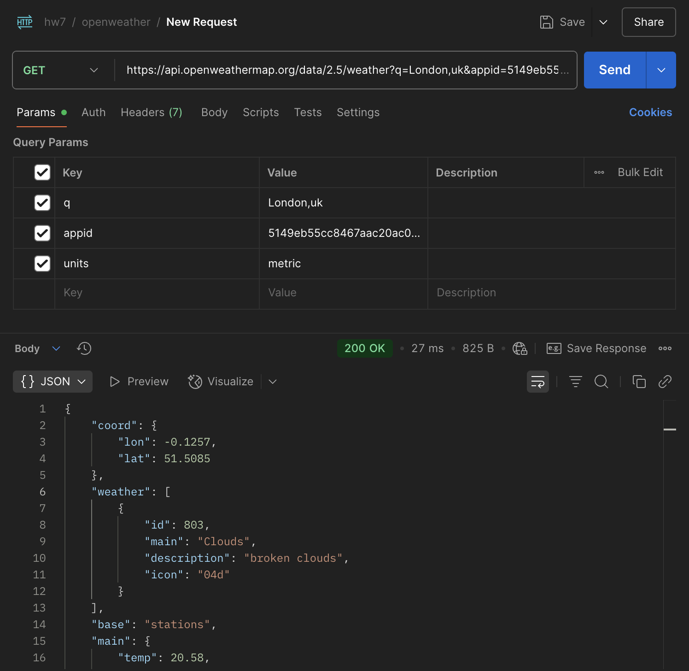
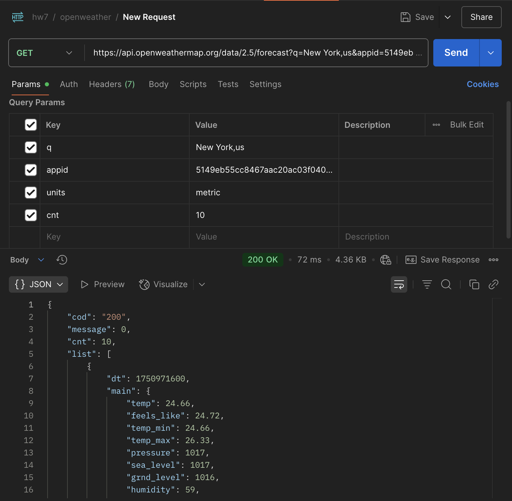
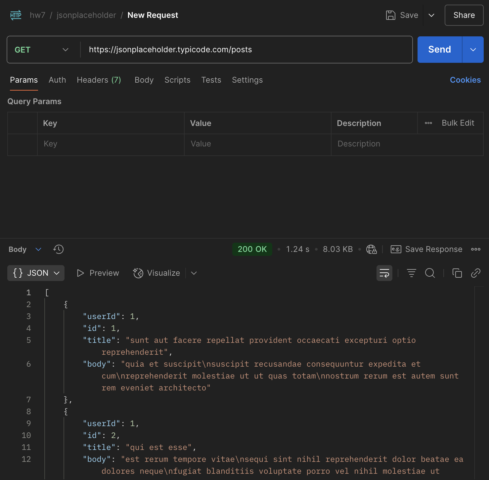
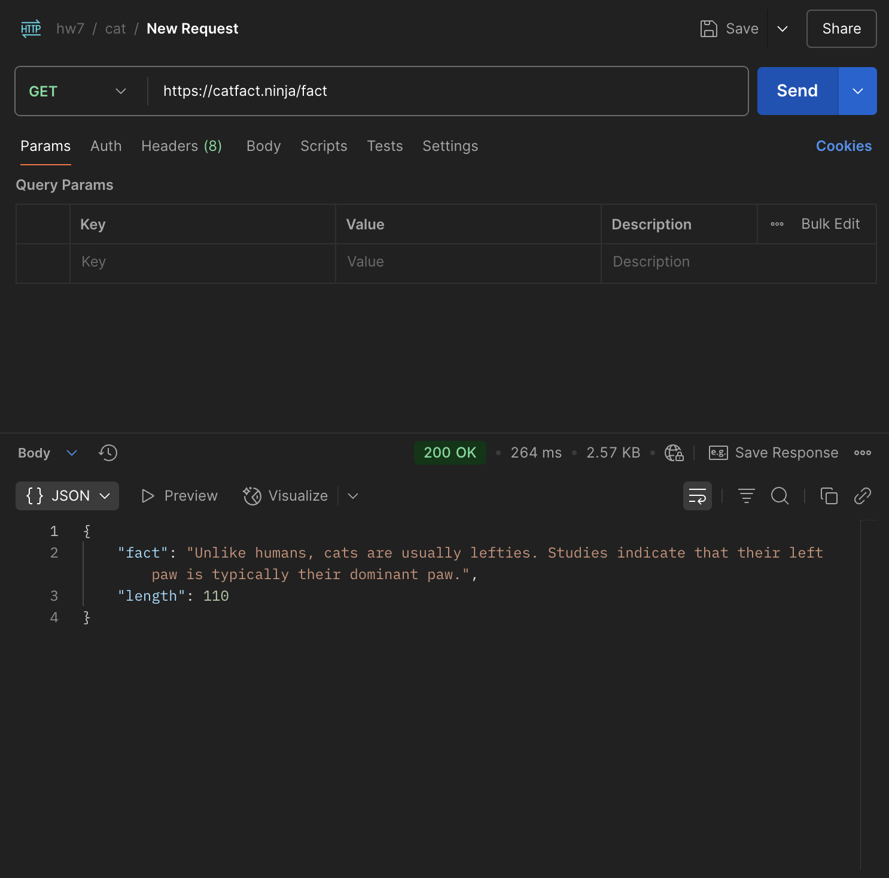
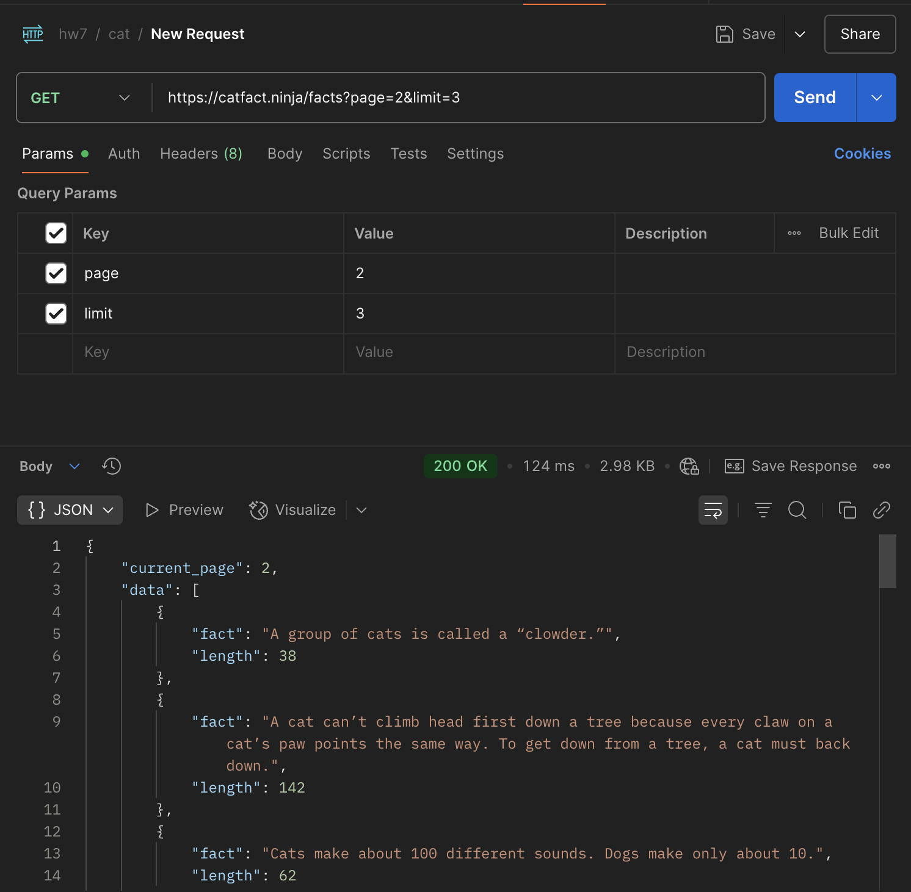
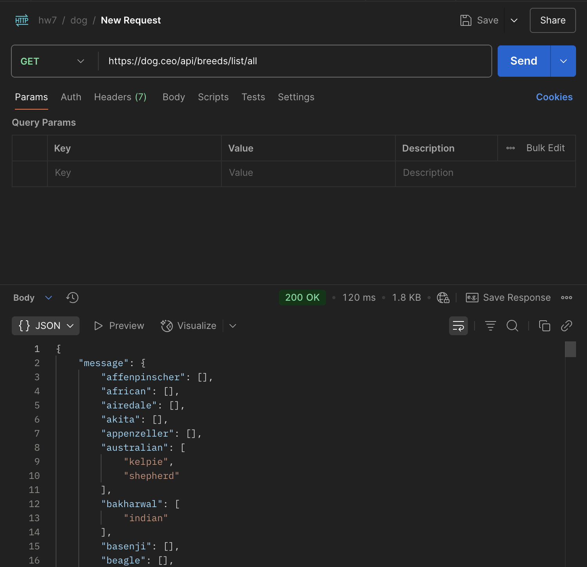
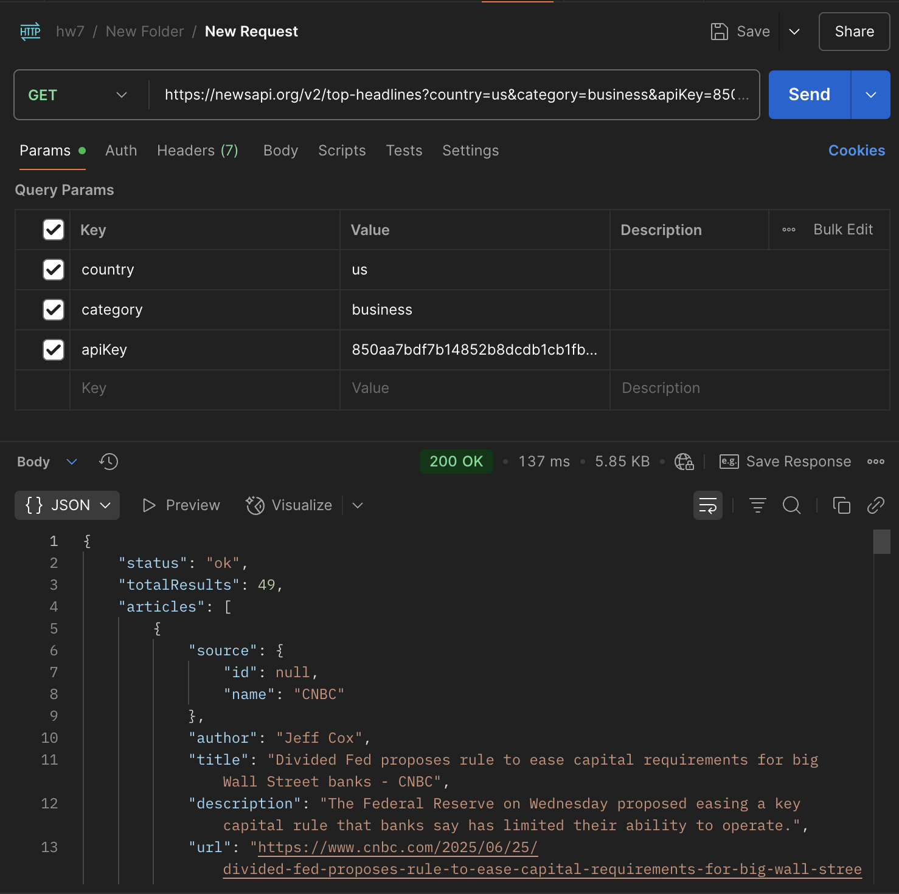

### HW 7 

#### 1. Explain the concept of API (Application Programming Interface), why do we need APIs.

An API is a contract or interface that defines how different software components or systems communicate with each other. It exposes a set of methods or endpoints that allow clients to interact with the underlying functionality without needing to understand the internal implementation.

We need APIs to promote modularity, scalability, and maintainability in software systems. They enable integration between different services, allow reuse of functionalities, and provide a standardized way to access resources. For example, in a microservices architecture, APIs are critical for inter-service communication.

#### 2. Compare developer API vs application API (normal APIs)
Developer API: These are APIs intended for use by developers to extend, customize, or integrate with a platform or service. They typically expose low-level functionalities, SDK hooks, and are well-documented for third-party development. Example: Android SDK, AWS SDK, or GitHub APIs.

Application API (Normal API): These APIs expose specific application-level functionalities or services, often consumed by front-end clients or other services. They are generally more abstracted and focused on business logic or user interactions. Example: REST APIs for a banking app or e-commerce checkout.

#### 3. Name some different types of APIs
**REST (Representational State Transfer):**
REST is the most common API type used in modern web applications. It’s stateless, uses standard HTTP methods (GET, POST, PUT, DELETE), and typically exchanges data in JSON format. It’s lightweight and easy to consume.

**SOAP (Simple Object Access Protocol):**
SOAP is a protocol-based API, XML-driven, and highly standardized. It supports advanced features like built-in error handling, WS-Security, and ACID-compliant transactions. It's commonly used in **enterprise** applications where reliability is critical.

**GraphQL:**
Developed by Facebook, GraphQL allows clients to request exactly the data they need. It reduces over-fetching and under-fetching of data, and is suitable for complex systems with multiple microservices.

**gRPC (Google Remote Procedure Call):**
gRPC uses HTTP/2 and Protocol Buffers for high performance, low latency communication. It’s suitable for microservices and internal APIs where efficiency and contract-first development are important.

**WebSockets:**
While not a typical API in the traditional REST/SOAP sense, WebSockets enable full-duplex communication over a single TCP connection, ideal for real-time applications like chat or live updates.

#### 4. Compare path variables vs request parameters in REST API.
Path Variables are part of the URL path and typically used to identify a specific resource. For example, in /users/{id}, {id} is a path variable representing a specific user ID. They are mandatory for the resource identification and generally map directly to resource hierarchy.

Request Parameters (query parameters) appear after the ? in the URL and are used to filter, sort, or provide additional options. For example, /users?role=admin&sort=name uses request parameters to filter users by role and sort by name. These parameters are optional and used to modify the response or behavior without changing the resource identity.

From a design perspective, use path variables when the value is essential to locate the resource itself, and use request parameters for optional criteria or filtering.

In Spring Boot, path variables are annotated with @`PathVariable` and request parameters with @`RequestParam`.

#### 5. Explain the different components that make up a RESTful API and what does each part do?

1. **Resources**: These are the main objects or entities the API exposes, such as users, orders, or products. Each resource is identified by a unique URI (Uniform Resource Identifier).

2. **HTTP Methods**: These define the type of operation to be performed on the resources:

   * **GET**: Retrieve data.
   * **POST**: Create a new resource.
   * **PUT**: Update an existing resource.
   * **DELETE**: Remove a resource.

3. **Endpoints**: These are the specific URLs that clients interact with to access or manipulate resources. For example, `/api/users` to manage users.

4. **Request and Response**: Clients send requests with headers and sometimes a body, and the server responds with a status code, headers, and a response body typically in JSON or XML format.

5. **Statelessness**: Each request from a client contains all the information the server needs to fulfill it, meaning the server does not store any session state between requests.

6. **Headers**: These carry metadata such as content type (`Content-Type`), authentication tokens (`Authorization`), and caching policies.

7. **Status Codes**: HTTP status codes in responses indicate the result of the request, e.g., `200 OK` for success, `404 Not Found` when a resource doesn’t exist, or `401 Unauthorized` for authentication failures.


#### 6. Explain what cURL is and why we use API testing tools like Postman instead of testing APIs directly with  cURL.
cURL (`curl`) is a command-line tool used to transfer data to or from a server using various protocols, primarily HTTP and HTTPS. It allows us to make raw HTTP requests, which makes it useful for quick, low-level testing of APIs.

However, we typically use API testing tools like Postman instead of relying solely on cURL because Postman provides a more user-friendly interface and advanced features such as:

* **Easier request construction:** Postman’s GUI allows building complex requests with authentication, headers, query parameters, and body payloads without manually crafting command-line syntax.
* **Environment management:** Postman supports environments and variables, which simplifies testing across different setups like dev, staging, and production.
* **Response visualization:** Postman formats responses nicely, making it easier to read and analyze JSON, XML, or HTML responses.
* **Automation and testing:** Postman includes built-in support for writing test scripts and running automated test suites, which is cumbersome with cURL.
* **Collaboration:** Teams can share collections and document APIs within Postman, improving communication and consistency.

In summary, while cURL is great for quick and low-level API calls, Postman enhances productivity, maintainability, and collaboration when testing APIs at scale.


#### 7. List common HTTP status codes and their meanings.

* **200 OK**: Request succeeded, and the server returned the requested resource.
* **201 Created**: Request succeeded, and a new resource was created (usually after a POST).
* **204 No Content**: Request succeeded, but there is no content to return (often after DELETE).
* **400 Bad Request**: The server could not understand the request due to invalid syntax.
* **401 Unauthorized**: Authentication is required and has failed or not been provided.
* **403 Forbidden**: Server understood the request, but refuses to authorize it.
* **404 Not Found**: The requested resource could not be found on the server.
* **500 Internal Server Error**: A generic error occurred on the server.
* **502 Bad Gateway**: Server received an invalid response from an upstream server.
* **503 Service Unavailable**: The server is currently unavailable, often due to overload or maintenance.

#### 8. List HTTP methods and their meanings, and their expected HTTP status codes.


1. **GET** – Retrieves data from the server.
   *Expected status:* `200 OK`, `404 Not Found`, `304 Not Modified`.

2. **POST** – Submits data to the server, typically creating a resource.
   *Expected status:* `201 Created`, `200 OK`, `400 Bad Request`.

3. **PUT** – Replaces an existing resource or creates it if it doesn’t exist (idempotent).
   *Expected status:* `200 OK`, `201 Created`, `204 No Content`.

4. **PATCH** – Partially updates an existing resource.
   *Expected status:* `200 OK`, `204 No Content`, `400 Bad Request`.

5. **DELETE** – Deletes a specified resource.
   *Expected status:* `200 OK`, `204 No Content`, `404 Not Found`.

- More:
6. **HEAD** – Identical to GET but only retrieves headers (no response body).
   *Expected status:* `200 OK`, `404 Not Found`.

7. **OPTIONS** – Describes the communication options for the target resource.
   *Expected status:* `200 OK`.

8. **TRACE** – Echoes the received request, mainly for debugging.
   *Expected status:* `200 OK`.


#### 9. Explain why REST API is stateless.
REST API is stateless because each HTTP request from a client to the server must contain all the information needed to understand and process the request. The server does not store any context or session information about the client between requests. This design aligns with REST architectural constraints, improving scalability and simplifying server logic by avoiding server-side session state.


#### 10. Discuss about best practices for REST API design, from performance perspective.


1. **Efficient Resource Pagination and Filtering**
   Avoid returning large datasets in a single response. Implement pagination (`limit`, `offset`) and filtering mechanisms to reduce payload size and improve response time.

2. **Use of HTTP Caching Headers**
   Leverage `ETag`, `Last-Modified`, and `Cache-Control` headers to minimize unnecessary network calls and reduce server load by enabling client-side and intermediary caching.

3. **Minimize Payload with Partial Responses**
   Support mechanisms like sparse fieldsets (e.g., `fields=name,email`) to allow clients to request only necessary data, reducing serialization/deserialization overhead.

4. **Avoid N+1 Query Problems**
   Design endpoints and data-fetching logic to avoid repeated database hits. Use techniques like eager loading or batch fetching to retrieve related entities efficiently.

5. **Use Compression (e.g., GZIP)**
   Enable compression on HTTP responses for large payloads to significantly reduce data transfer time, especially over slow or mobile networks.


#### 11. Explain the concept of XSS (Cross-Site Scripting) and CSRF (Cross Site Request Forgery) and how to  avoid them.


**XSS (Cross-Site Scripting):**
XSS is a vulnerability where an attacker injects malicious scripts into trusted websites, which then execute in the victim’s browser. This can lead to session hijacking, defacement, or redirection.

*Example:*
If a web app displays user input without proper sanitization, an attacker can inject `<script>alert('XSS')</script>` which executes when others view the page.

*How to avoid:*

* Properly validate and encode user inputs/output.
* Use frameworks that auto-escape outputs (e.g., JSP with JSTL, React).
* Implement Content Security Policy (CSP).


**CSRF (Cross-Site Request Forgery):**
CSRF tricks an authenticated user into submitting unwanted requests to a web app they’re logged into, performing actions without their consent.

*Example:*
A malicious site includes a hidden form that submits a fund transfer request to a banking site where the user is already logged in.

*How to avoid:*

* Use anti-CSRF tokens in forms and validate them on the server.
* Implement SameSite cookies to restrict cross-origin requests.
* Require re-authentication or CAPTCHA for sensitive actions.

### API Practices:

#### 1. Find at least 5 different public APIs (e.g. Weather APIs) and use them to explain what defines a REST API

**What Defines a REST API (Using OpenWeatherMap as Example)**

REST (Representational State Transfer) is an architectural style for web services. OpenWeatherMap's API demonstrates key REST principles:

*REST Principles Demonstrated:*
- **Stateless**: Each API call contains all necessary information (API key, location parameters)
- **Resource-based URLs**: `/weather`, `/forecast` represent specific weather resources
- **HTTP Methods**: Uses standard HTTP GET requests for data retrieval
- **Standard HTTP Status Codes**: Returns 200 for success, 401 for unauthorized, 404 for not found
- **Multiple Representations**: Supports JSON and XML response formats
- **Uniform Interface**: Consistent parameter naming and response structure

*Core OpenWeatherMap Endpoints:*
- Current Weather: `GET /data/2.5/weather`
- 5-Day Forecast: `GET /data/2.5/forecast`
- Weather Maps: `GET /map/{layer}/{z}/{x}/{y}`
- Air Pollution: `GET /data/2.5/air_pollution`

#### 2. Justify whether these APIs follow API design best practices, and provide your better design for them.

**Current Design Strengths:**
- Clear resource naming (`/weather`, `/forecast`)
- Consistent parameter structure
- Multiple query options (by city name, coordinates, zip code)
- Standard JSON responses

**Design Issues & Improvements:**

**Current:** Mixed parameter styles
```
/weather?q=London,uk
/weather?lat=35&lon=139
/weather?zip=94040,us
```

**Better Design:** Consistent resource hierarchy
```
/locations/cities/london,uk/weather
/locations/coordinates/35,139/weather  
/locations/zipcodes/94040,us/weather
```

**Current:** Version in URL path
```
/data/2.5/weather
```

**Better:** Version in header or separate subdomain
```
Header: API-Version: 2.5
or api.v2.openweathermap.org/weather
```

#### 3. List the above APIs in form of cURL commands, and attach Postman screenshots in your markdown  submission

- cURL commands
```bash
# 1. Current Weather by City Name
curl -X GET "https://api.openweathermap.org/data/2.5/weather?q=London,uk&appid=YOUR_API_KEY&units=metric" \
  -H "Accept: application/json" \
  -H "User-Agent: MyWeatherApp/1.0"

# 2. Current Weather by Coordinates
curl -X GET "https://api.openweathermap.org/data/2.5/weather?lat=35&lon=139&appid=YOUR_API_KEY&units=metric" \
  -H "Accept: application/json"

# 3. Current Weather by ZIP Code
curl -X GET "https://api.openweathermap.org/data/2.5/weather?zip=94040,us&appid=YOUR_API_KEY&units=imperial" \
  -H "Accept: application/json"

# 4. 5-Day Weather Forecast
curl -X GET "https://api.openweathermap.org/data/2.5/forecast?q=New York,us&appid=YOUR_API_KEY&units=metric&cnt=10" \
  -H "Accept: application/json"
```
- Postman screenshots




#### 4. List the request headers and response headers of the APIs mentioned above, and explain what each  key-value pair in the headers section does

**Common Request Headers:**

- **`Host: api.openweathermap.org`** Specifies the target server domain name
- **`User-Agent: PostmanRuntime/7.44.0`** Identifies the client application making the request
- **`Accept: application/json`** Tells server which content types the client can handle; OpenWeatherMap supports `application/json` and `application/xml`
- **`Accept-Encoding: gzip, deflate`** Indicates compression algorithms client supports; Reduces bandwidth usage for large responses

**Common Response Headers:**

- **`Content-Type: application/json; charset=utf-8`** Specifies the media type and character encoding of response body; Tells client how to parse the returned data
- **`Content-Length: 4138`** Size of response body in bytes; Helps client allocate memory and detect incomplete transfers
- **`Date: Thu, 26 Jun 2025 10:30:00 GMT`** Timestamp when response was generated
- **`Cache-Control: public, max-age=600`**  Caching directives for clients and proxies
  - `public`: response can be cached by any cache
  - `max-age=600`: cache valid for 10 minutes (weather data updates)

- **`X-Cache-Key: /data/2.5/weather?q=london,uk`**  Custom header showing cache key used internally; Helps with debugging and cache management

- **`Access-Control-Allow-Origin: *`** CORS header allowing cross-origin requests from any domain; Enables browser-based JavaScript applications to call the API

#### Example 2: JSONPlaceholder
```bash
# Get all posts
curl https://jsonplaceholder.typicode.com/posts

# Get specific post
curl https://jsonplaceholder.typicode.com/posts/1

# Create new post
curl -X POST https://jsonplaceholder.typicode.com/posts \
  -H "Content-Type: application/json" \
  -d '{"title":"foo","body":"bar","userId":1}'

# Update post (PUT)
curl -X PUT https://jsonplaceholder.typicode.com/posts/1 \
  -H "Content-Type: application/json" \
  -d '{"id":1,"title":"foo","body":"bar","userId":1}'

# Update post (PATCH)
curl -X PATCH https://jsonplaceholder.typicode.com/posts/1 \
  -H "Content-Type: application/json" \
  -d '{"title":"foo"}'

# Delete post
curl -X DELETE https://jsonplaceholder.typicode.com/posts/1
```


### Example 3: Cat Facts
```bash 
# Get a random cat fact
curl https://catfact.ninja/fact

# Get multiple random facts
curl "https://catfact.ninja/facts?limit=5"

# Get facts with pagination
curl "https://catfact.ninja/facts?page=2&limit=3"
```



### Example 4: Dog API
```bash 
# Get a random dog image
curl https://dog.ceo/api/breeds/image/random

# Get multiple random dog images
curl https://dog.ceo/api/breeds/image/random/3

# Get all breeds with sub-breeds
curl https://dog.ceo/api/breeds/list/all
```


### Example 5: NewsAPI
```bash
# Top Headlines
curl -X GET "https://newsapi.org/v2/top-headlines?country=us&apiKey=YOUR_API_KEY"

# Top Headlines by Category
curl -X GET "https://newsapi.org/v2/top-headlines?country=us&category=business&apiKey=YOUR_API_KEY"
```


