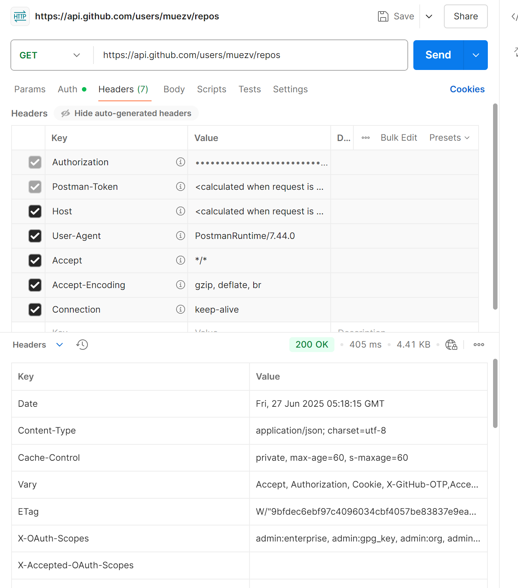
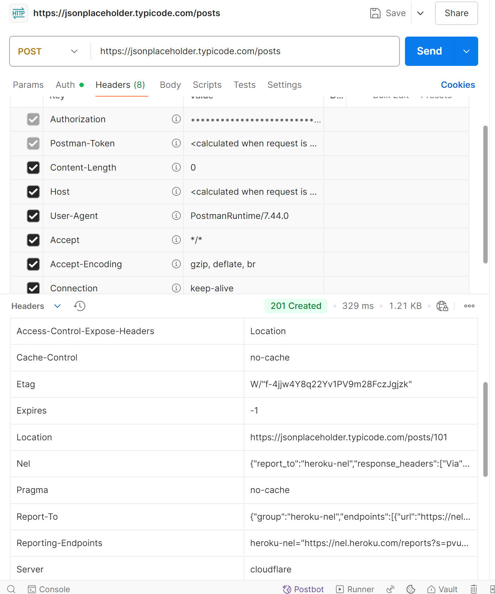
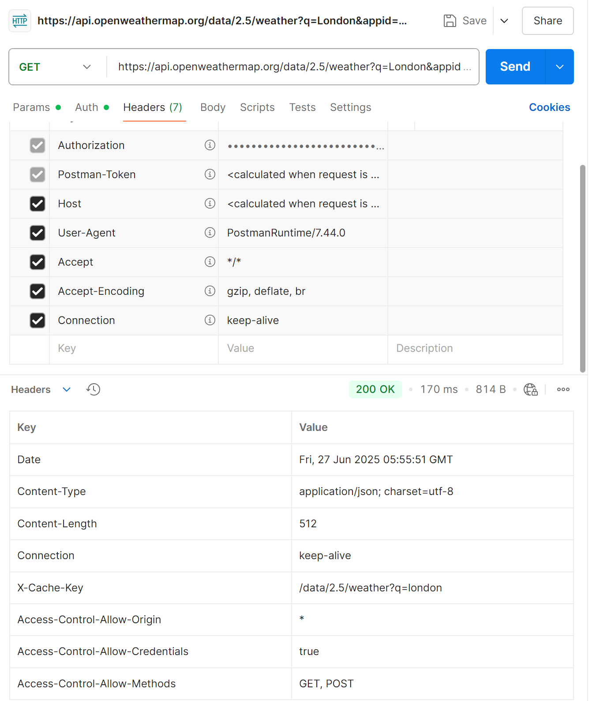
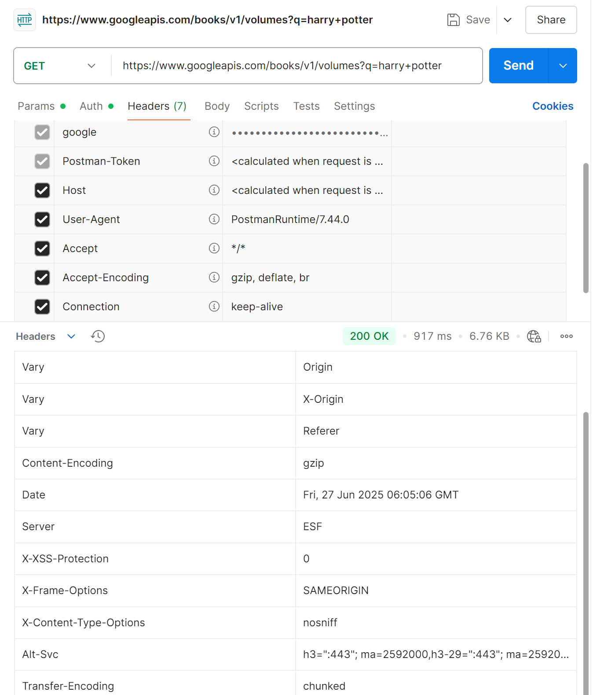
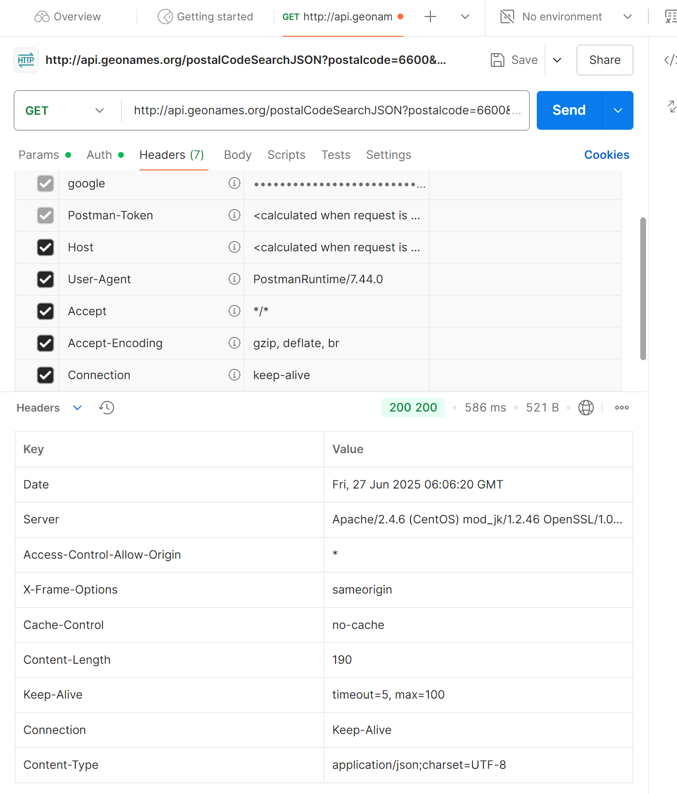

1. Explain the concept of API (Application Programming Interface), why do we need APIs.  
    An API is a set of rules and protocols that allows one software application to interact with another. It defines the methods and data formats that applications can use to communicate with each other.

    Why need APIs?
    1. APIs enable different systems to work together seamlessly
    2. Thye hide the explexity of underlying systems, exposing only the necessary functionality
    3. APIs allow developers to reuse existing functionalities instead of building them from scratch
    4. APIs allow business to scale by intergrating third-party services and extending their functionalities
   
2. Compare developer API vs application API (normal APIs)  
    | Aspect     | Developer APIS                                               | Application API                                        |
    | ---------- | ------------------------------------------------------------ | ------------------------------------------------------ |
    | Purpose    | Primarly designed for developers to use in their application | Designed for end-users to interact with an application |
    | Audience   | Developers and engineers                                     | General users or non-technical indivisuals             |
    | Examples   | Github API, Google Maps API                                  | GUI-based APIs like drag-and-drop interfaces           |
    | Complexity | Requires programming knowledge to use                        | More user-friendly and easier to understand            |


3. Name some different types of APIs  
    1. REST APIs: Use HTTP methodsa and stateless
    2. SOAP APIs: Use XML for communication and more rigid
    3. GraphQL APIs: Allow clients to request specific data
    4. WebSocketed APIs: Enable real-time communication
    5. Library APIs: Expose functionalities of a software library
    6. Operating System APIs: Allow interaction with OS-level operations

4. Compare path variables vs request parameters in REST API.  
    | Aspect   | Path Variables                       | Request Parameters                               |
    | -------- | ------------------------------------ | ------------------------------------------------ |
    | Location | Part of the URL path                 | Appended after ? in the URL                      |
    | Purpose  | Use to identidy a spefici resource   | Used to filer or modify the resource             |
    | Example  | /users/123 => fecth user with ID 123 | /users?role=admin => fetch users with admin role |

5. Explain the different components that make up a RESTful API and what does each part do?  
   1. Endpoint: URL where the API can be accessed
   2. HTTP methods: Define the yule of operation
   3. Headers: Contain metadata
   4. Body: Contains data sent or received from the server
   5. Status Codes: indicate the result of the request

6. Explain what cURL is and why we use API testing tools like Postman instead of testing APIs directly with 
cURL.  
    CURL: A command-line tool for making HTTP request. It is lightweight, scriptable and supports automation but complex for testing APIs with multiple paramters or bodies

    Postman: It is user -firendly, supports collections and provides a GUI for testing but is heavier than cURL and less suitable for automation.

7. List common HTTP status codes and their meanings.  
    200: ok (request succeed)
    201: created
    400: Bad request
    401: unauthorized
    403: forbidden
    404: Not Found
    500: Internal Server Error

8. List HTTP methods and their meanings, and their expected HTTP status codes.  
   | Method | Purpose                              | Expected Status Codes |
   | ------ | ------------------------------------ | --------------------- |
   | GET    | Retrieve data                        | 200, 404              |
   | POST   | Create a new resource                | 201, 400              |
   | PUT    | Update/ replace an existing resource | 200， 204， 400       |
   | DELETE | Delete a resource                    | 200, 204, 404         |
   | PATCH  | Partially update a resource          | 200, 204, 400         |

9.  Explain why REST API is stateless.  
    REST APIs are stateless becase each reqiest from a client contains all the information needed for the server to process it. The server does not store any client context. This design ensures scalability and reliability as servers can handle requests independently.

10. Discuss about best practices for REST API design, from performance perspective. 
    1. Use Pagination: avoid returning larget datasets in a single response
    2. Enable Caching: Use headers like Cache-Contril to reducer server load
    3. Minimize Payload: Send only necessary data
    4. Use Asynchronous Processing: For long-running tasks, use background jobs
    5. Optimize Datab Queries: Use indexing and avlid N+ 1 Query problems
    6. Compress Response: Use gzip or similar compression for large responses

11. Explain the concept of XSS (Cross-Site Scripting) and CSRF (Cross Site Request Forgery) and how to avoid them.
    XSS: An attacker injects malicouse scripts into a web page. It snitize inputs and use content secuirty policy.
    CSRF: An attacker tricks a user into performing actions without their consent. It validates HTTP referer headers


 API Practices: 
Use Postman or other API testing tools to:
 1. Find at least 5 different public APIs (e.g., GitHub APIs, Google Cloud APIs, GeoInfo APIs, Weather APIs) and use them to explain what defines a REST API. These APIs can use any HTTP methods and may also include non-REST APIs (e.g., GraphQL). Some public APIs may require API keys (user， registration required);  
    1. GitHub API: Provides access to repositories, users, and commits.
    2. JSONPlaceholder API: Fake API for testing and prototyping.
    3. OpenWeatherMap API: Provides weather data.
    4. Google Books API: Allows access to book data.
    5. GeoNames API: Provides geographical data.
   
2. Justify whether these APIs follow API design best practices, and provide your better design for them.  
    1. GitHub API: Follows best practices (e.g., pagination, versioning).
    2. JSONPlaceholder API: Simplistic but lacks authentication.
    3. OpenWeatherMap API: Well-designed but could improve error messages.
    4. Google Books API: Comprehensive but lacks detailed documentation.
    5. GeoNames API: Functional but outdated in design.

3. List the above APIs in form of cURL commands , and attach Postman screenshots in your markdown submission. 
    1. GitHub API:
        ```bash
        curl -H "Authorization: token TOKENXXXXXX" https://api.github.com/users/muezv/repos
        ```

        

   2. JSONPlaceholder API:
      ```bash
      curl https://jsonplaceholder.typicode.com/posts
      ```
       
   3. OpenWeatherMap API:
      ```bash
      curl "https://api.openweathermap.org/data/2.5/weather?q=London&appid=df1ee0cd006e20537ba2a93383adbdca"
      ```
       
   4. Google Books API:
      ```bash
      curl "https://www.googleapis.com/books/v1/volumes?q=harry+potter"
      ```
       
   5. GeoNames API:
      ```bash
      curl "http://api.geonames.org/postalCodeSearchJSON?postalcode=6600&maxRows=10&username=demo"
      ```
       

4. List the request headers and response headers of the APIs mentioned above, and explain what each key-value pair in the headers section does
    1. GitHub API
     Request Headers (Typical Examples)
        Authorization: Used to authenticate the user using a personal access token or OAuth token.
        Accept: Specifies the format of the response (e.g., application/vnd.github.v3+json for GitHub's API).
        User-Agent: Identifies the client making the request (required by GitHub).
        Content-Type: Specifies the format of the request body (e.g., application/json).
     Response Headers
        Date: The date and time the response was generated.
        Content-Type: Indicates the format of the response body (e.g., application/json; charset=utf-8).
        Cache-Control: Specifies caching directives. For example, public, max-age=60 means the response can be cached for 60 seconds.
        Vary: Indicates the headers that might cause the response to vary (e.g., Accept, Accept-Encoding).
        ETag: An identifier for a specific version of a resource, used for caching and conditional requests.
        X-GitHub-Media-Type: Specifies the version of the API (e.g., github.v3).
        Access-Control-Allow-Origin: Allows cross-origin requests from any domain (*).
        Strict-Transport-Security: Enforces secure (HTTPS) connections.
        X-RateLimit-Limit / X-RateLimit-Remaining / X-RateLimit-Used: Provide information about the API rate limits.
        X-Content-Type-Options: Prevents MIME-type sniffing (e.g., nosniff).
        X-Frame-Options: Protects against clickjacking attacks (e.g., deny).
        Content-Encoding: Specifies the encoding used to compress the response (e.g., gzip).

    2. JSONPlaceholder API
     Request Headers (Typical Examples)
        Authorization: If required, used to authenticate the user.
        Accept: Specifies the expected format of the response (e.g., application/json).
        Content-Type: Specifies the format of the request body (e.g., application/json).
     Response Headers
        Date: The date and time the response was generated.
        Content-Type: Specifies the format of the response body (e.g., application/json; charset=utf-8).
        Cache-Control: Specifies caching directives (e.g., max-age=43200 allows caching for 12 hours).
        ETag: An identifier for a specific version of a resource.
        Content-Encoding: Specifies the compression used for the response (e.g., gzip).
        Pragma: Used for backward compatibility with older HTTP/1.0 caches (e.g., no-cache).
        Vary: Indicates which headers might cause the response to vary (e.g., Origin, Accept-Encoding).
        X-RateLimit-Limit / X-RateLimit-Remaining: Provides information on API rate limits.

   3. OpenWeatherMap API
     Request Headers (Typical Examples)
        Authorization: API key is passed as a query parameter (e.g., appid=YOUR_API_KEY).
        Accept: Specifies the expected format of the response (e.g., application/json).
     Response Headers
        Date: The date and time the response was generated.
        Content-Type: Specifies the format of the response body (e.g., application/json; charset=utf-8).
        Content-Length: Specifies the size of the response body in bytes.
        Access-Control-Allow-Origin: Allows cross-origin requests from any domain (*).
        Access-Control-Allow-Credentials: Indicates whether credentials (e.g., cookies) are allowed in cross-origin requests.
        Access-Control-Allow-Methods: Specifies the allowed HTTP methods (e.g., GET, POST).

   4. Google Books API
     Request Headers (Typical Examples)
        Authorization: Includes an API key or OAuth token for authentication.
        Accept: Specifies the expected format of the response (e.g., application/json).
     Response Headers
        Content-Type: Specifies the format of the response body (e.g., application/json; charset=UTF-8).
        Vary: Indicates headers that might cause the response to vary (e.g., Origin, X-Origin, Referer).
        Content-Encoding: Specifies the compression used for the response (e.g., gzip).
        X-XSS-Protection: Protects against cross-site scripting attacks (e.g., 0 to disable it).
        X-Frame-Options: Protects against clickjacking attacks (e.g., SAMEORIGIN).
        X-Content-Type-Options: Prevents MIME-type sniffing (e.g., nosniff).

   5. GeoNames API
     Request Headers (Typical Examples)
        Authorization: Includes the username or API key for authentication.
        Accept: Specifies the expected format of the response (e.g., application/json).
     Response Headers
        Date: The date and time the response was generated.
        Server: Information about the server handling the request (e.g., Apache/2.4.6).
        Access-Control-Allow-Origin: Allows cross-origin requests from any domain (*).
        X-Frame-Options: Protects against clickjacking attacks (e.g., sameorigin).
        Cache-Control: Specifies caching directives (e.g., no-cache to prevent caching).
        Content-Length: Specifies the size of the response body in bytes.
        Connection: Indicates whether the connection should remain open or be closed (e.g., Keep-Alive).
        Content-Type: Specifies the format of the response body (e.g., application/json;charset=UTF-8).

**Explanation of Key-Value Pairs in Headers**
Headers are used to provide metadata about the request or response. Here’s what the common headers mean:

   1. Date: Timestamp of when the request/response was created.
   2. Content-Type: Specifies the media type of the resource (e.g., JSON, HTML).
   3. Authorization: Used for authentication (e.g., API keys, tokens).
   4. Cache-Control: Defines caching policies for the resource.
   5. ETag: A unique identifier for a specific version of a resource, useful for caching.
   6. Access-Control-Allow-Origin: Determines which domains are allowed to access the resource.
   7. X-RateLimit-Limit / X-RateLimit-Remaining: Provide information about API usage limits.
   8. Content-Encoding: Specifies the compression format (e.g., gzip).
   9. X-Frame-Options: Protects against clickjacking attacks.
   10. Vary: Indicates which request headers can affect the response.