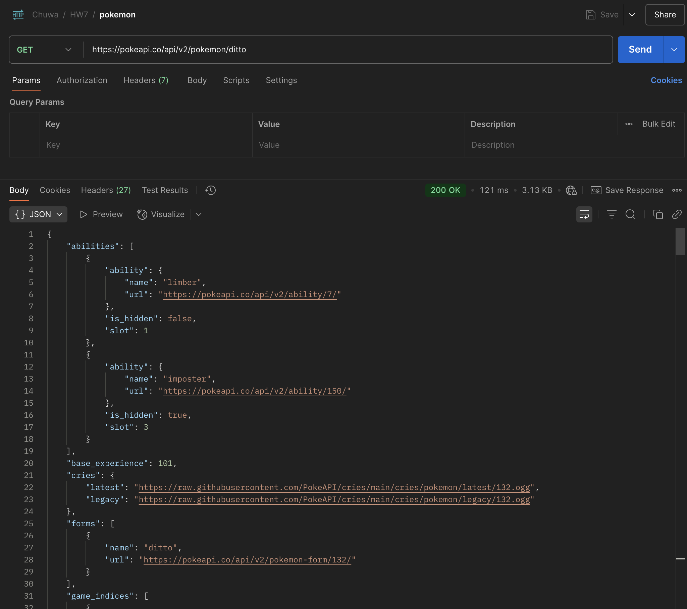
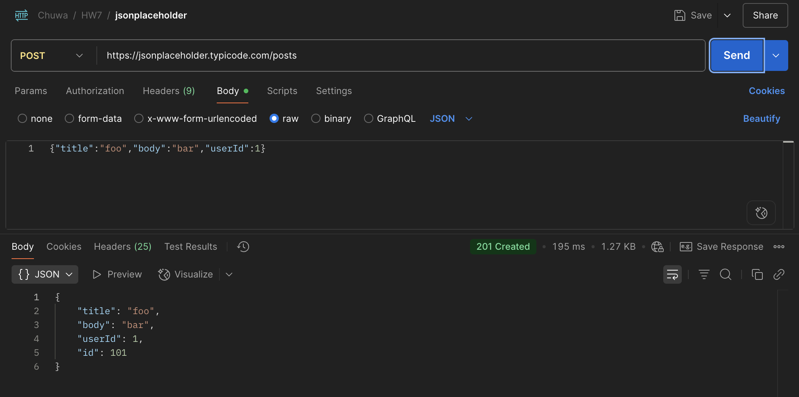
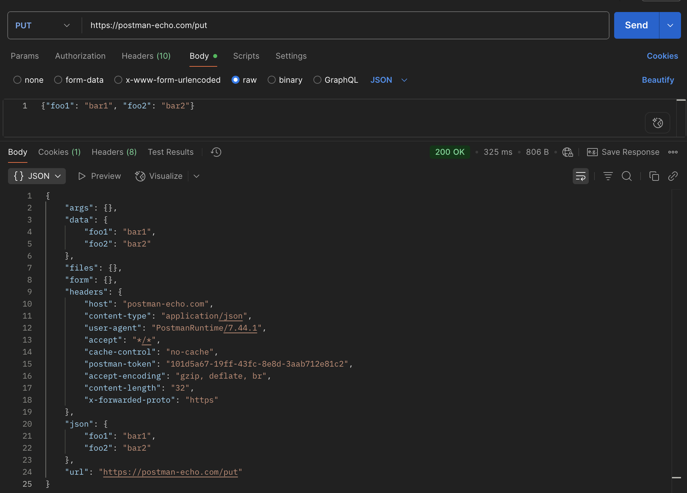
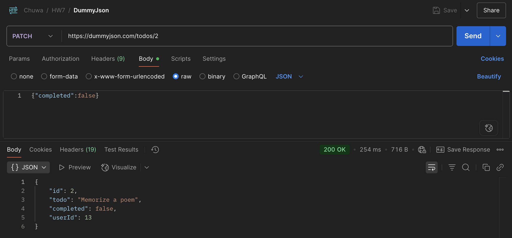
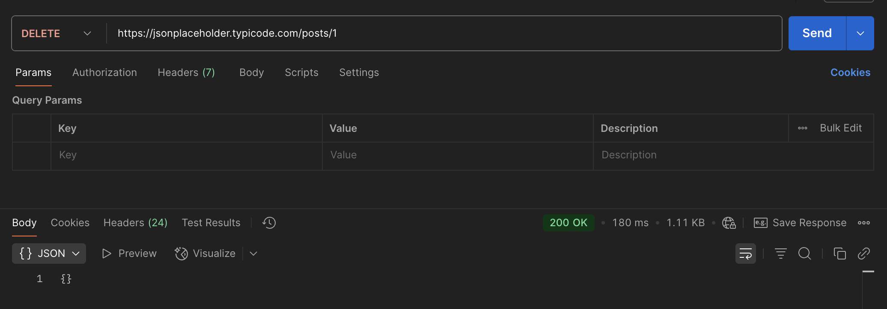

### hw7
### 1. Explain the concept of API (Application Programming Interface). Why do we need APIs?
> An API is a set of rules that allows different software systems to communicate with each other.

Key Concepts:
- **Interface**: Defines how software components interact.
- **Endpoints**: Specific URLs where functions can be accessed.
- **Request/Response**: Clients send requests; APIs return data or perform actions.

Why Do We Need APIs?
- **Communication**: Connects different systems (e.g., frontend ↔ backend).
- **Abstraction**: Hide internal logic, expose only necessary features.


---
### 2. Compare `developer API` vs `application API` (normal API).

|             | Developer API                             | Application API                         |
|-------------|-------------------------------------------|-----------------------------------------|
| Form        | Libraries (e.g., JARs), SDKs, CLI tools    | REST, HTTP endpoints, RPC, GraphQL      |
| Access      | Local method calls or command-line usage  | Remote calls over HTTP/HTTPS            |
| Example     | `java.util.List.add()`                    | `GET /users/{id}` from a web service    |
| Users       | Software developers                       | Applications or services                |

**Summary:**
- **Developer API**: Code-level interface (e.g., JAR, SDK, CLI) used *within* your application. Interacts through method calls or command-line tools.


- **Application API**: Network-level interface (e.g., REST, RPC) used to interact *between* applications or services over the internet or intranet.


---
### 3. Name some different types of APIs.

| Type        | Protocol/Format        | Use Case / Description                                |
|-------------|-------------------------|--------------------------------------------------------|
| **REST API** | HTTP + JSON             | Most common; CRUD over HTTP using standard verbs       |
| **GraphQL**  | HTTP + Query Language   | Flexible data queries; client specifies fields         |
| **gRPC**     | HTTP/2 + Protobuf       | Fast, efficient binary API for microservices           |
| **WebSocket**| TCP (Full-duplex)       | Real-time, bi-directional communication                |
| **MQTT**     | TCP/IP (Pub/Sub)        | Lightweight, ideal for IoT devices                     |
| **MCP**      | Custom/Binary           | Typically used in industrial or embedded systems       |
| **SOAP**     | HTTP + XML              | Heavyweight; supports contracts, security, WS-* specs  |


---
### 4. Compare `path variables` vs `request parameters` in REST API.

|                     | Path Variables                          | Request Parameters                      |
|---------------------|------------------------------------------|------------------------------------------|
| Location            | Part of the URL path                     | After `?` in the URL                     |
| Usage               | Identify specific resource               | Filter, sort, or modify the request      |
| Syntax Example      | `/users/{id}` → `/users/123`            | `/users?age=25&sort=asc`                |
| Annotation (Spring) | `@PathVariable`                          | `@RequestParam`                         |
| Required?           | Usually required                         | Optional or required                     |

**Summary:**  
- **Path Variables**: Used for resource identification.
- **Request Parameters**: Used for querying / filtering.


---
### 5. Explain the different components that make up a `RESTful API`, and what does each part do?

| Component                  | Description                                                                        |
|----------------------------|------------------------------------------------------------------------------------|
| **HTTP Methods**           | Define the action: `GET`, `POST`, `PUT`, `DELETE`, etc.                            |
| **URL (Endpoint)**         | Full path combining path variables + query params (e.g., `/users/123?active=true`) |
| **Request Headers**        | Metadata from client (e.g., `Authorization`, `Content-Type`)                       |
| **Request Body**           | Data sent with `POST`, `PUT`. (usually JSON)                                       |
| **Response Headers**       | Metadata from server (e.g., `Content-Type`, `Cache-Control`)                       |
| **Response Body**          | Data returned from server (usually JSON or XML)                                    |
| **Status Codes**           | Indicates result (e.g., `200 OK`, `400 Bad Request`, `404 Not Found`)              |


---
### 6. Explain what `cURL` is and why we use API testing tools like Postman instead of testing APIs directly with `cURL`.
> **cURL** is a command-line tool used to send HTTP requests.

```bash
Example:

curl -X GET "https://api.example.com/users/123"
```

**Why Use Postman Instead of cURL?**
- **Ease of Use**: GUI, no command memorization
- **History**: Auto-saves past requests
- **Environments**: Manage variables easily
- **View**: Pretty JSON & headers
- **Automation**: Collections, tests, scripts


---
### 7. List common `HTTP status codes` and their meanings.

**Common HTTP Status Codes:**

| Code | Meaning                  |
|------|--------------------------|
| 200  | OK – Request successful  |
| 201  | Created – Resource created |
| 204  | No Content – Success, no body |
| 400  | Bad Request – Invalid input |
| 401  | Unauthorized – Auth required |
| 403  | Forbidden – Access denied |
| 404  | Not Found – Resource missing |
| 409  | Conflict – Duplicate or conflict |
| 500  | Internal Server Error    |
| 503  | Service Unavailable      |

**HTTP Status Code Ranges:**

| Range  | Meaning                            |
|--------|------------------------------------|
| 1xx    | Informational – Request received   |
| 2xx    | Success – Request successful       |
| 3xx    | Redirection – Further action needed|
| 4xx    | Client Error – Request issue       |
| 5xx    | Server Error – Server failed       |


---
### 8. List `HTTP methods` and their meanings, and their expected `HTTP status codes`.

| Method | Meaning         | Typical Success Codes        |
|--------|-----------------|-------------------------------|
| GET    | Retrieve data   | `200 OK`                     |
| POST   | Create new resource | `201 Created`, `200 OK`      |
| PUT    | Update resource | `200 OK`, `204 No Content`   |
| PATCH  | Partial update  | `200 OK`, `204 No Content`   |
| DELETE | Delete resource | `200 OK`, `204 No Content`   |
| HEAD   | Headers only (no body) | `200 OK`                     |
| OPTIONS| Allowed methods info | `204 No Content`             |


---
### 9. Explain why `REST API` is `stateless`.

> Stateless = No session stored on server
>- Each request is **independent** and must contain **all needed info** (e.g., auth token).
>- Server does **not remember** past requests.


---
### 10. Discuss about best practices for `REST API design`, from `performance` perspective.

**REST API Design – Performance Best Practices:**
- **Use Pagination**: Avoid returning large datasets in one call.  
- **Use Filtering & Sorting**: Let clients request only needed data.
- **Use HTTP Caching**: Leverage `ETag`, `Cache-Control`, etc.
- **Batch Requests**: Combine multiple operations when possible.
- **Avoid Deep Nesting**: Keep JSON structure flat.


---
### 11. Explain the concept of `XSS (Cross-Site Scripting)` and `CSRF (Cross Site Request Forgery)`. How to avoid them?

> **XSS (Cross-Site Scripting):**
>
> Injection of malicious scripts into trusted websites, executed in users' browsers.

**How to avoid it?:**
- Escape output (HTML, JS, URLs)
- Validate and sanitize input
- Use Content Security Policy (CSP)
- Use HTTP-only cookies


> **CSRF (Cross-Site Request Forgery)**
>
> Tricks a user into submitting unwanted actions (e.g. form submissions) while authenticated.
>
>**How it works:**  
> User is logged in → malicious site makes a request using user's session.

**How to avoid it?:**
- Use CSRF tokens (random per request/session)
- Use SameSite cookies
- Require re-authentication for sensitive actions
- Use custom headers (not sent cross-origin)


## API Practices:
### 1. What defines a `REST API`?
A `REST API` (`Representational State Transfer`) is defined by:

- **Statelessness**: Each request contains all info needed; no session stored on server.
- **Client-Server Separation**: Client and server operate independently.
- **Uniform Interface**: Consistent structure using standard HTTP methods:
    - `GET` (read), `POST` (create), `PUT` (update/replace), `PATCH` (partial update), `DELETE` (remove)
- **Resource-Based**: Operates on resources identified by URLs.
- **Representations**: Resources are returned in formats like JSON or XML.
- **Cacheable**: Responses can be cached to improve performance.


---
### 2. API Design Best Practices & Suggestions:

> 1. GET https://pokeapi.co/api/v2/pokemon/ditto

**Critique:**
- Response is huge. No option to narrow data fields or specify format (e.g. names only).
- Allows clients to request only necessary attributes, improving efficiency.

**Better Design:**
```text
GET /pokemon/ditto
Host: pokeapi.co
Accept: application/json

Query params:
• fields=name,base_experience,types
```


------
> 2. POST https://jsonplaceholder.typicode.com/posts

**Critique:**
- POST to `/posts` is fine, but response always includes a fake id=101.  

**Better Design:**
```text
POST /v1/posts
Host: jsonplaceholder.typicode.com
Content-Type: application/json

Body:
{
"title": "...",
"body": "...",
"userId": 1
}

Query params:
?fields=id
```

------
> 3. PUT https://postman-echo.com/put

**Critique:**
- Have the word `put` as part of the URL.

**Better Design:**
```text
PUT /v1/echo
Host: postman-echo.com
Accept: application/json
Content-Type: application/json

Query: ?echo=body,headers
```


------
> 4. PATCH https://dummyjson.com/todos/2

**Critique:**
- No path versioning (/v1/).
- No ability to select response fields.

**Better Design:**
```text
PATCH /v1/todos/1
Host: dummyjson.com
Content-Type: application/json
Accept: application/json

Query:
  ?fields=id,completed
```


------
> 5. DELETE https://jsonplaceholder.typicode.com/posts/1

Critique:
- Returns an empty object ({}) regardless of existence—no status detail.

**Better Design:**
```text
DELETE /v1/posts/1
Host: jsonplaceholder.typicode.com
Accept: application/json

Query:
  ?fields=id,deletedAt,status
```


---
### 3. `cURL` Commands and Postman Screenshots:
```bash
curl -X GET \
'https://pokeapi.co/api/v2/pokemon/ditto'
````


```bash
curl -X POST \
'https://jsonplaceholder.typicode.com/posts' \
-H 'Content-Type: application/json; charset=UTF-8' \
-d '{"title":"foo","body":"bar","userId":1}'
```


```bash
curl -X PUT https://postman-echo.com/put \
  -H 'Content-Type: application/json' \
  -d '{"foo1":"bar1","foo2":"bar2"}'
```


```bash
curl -X PATCH https://dummyjson.com/todos/2 \
-H 'Content-Type: application/json' \
-d '{"completed": false}'
```


```bash
curl -X DELETE \
'https://jsonplaceholder.typicode.com/posts/1'
```



------
### 4. Request/Response Headers:
**HTTP Request Headers:**

| Header            | Description                                           |
|-------------------|-------------------------------------------------------|
| `Accept`          | Media types client can handle (e.g., `application/json`) |
| `Content-Type`    | Media type of request body (e.g., `application/json`)  |
| `User-Agent`      | Info about the client (browser, tool, etc.)            |
| `Authorization`   | Credentials (e.g., `Bearer <token>`)                   |
| `Host`            | Domain name of the server                              |
| `Accept-Encoding` | Compression types the client supports (e.g., `gzip`)   |
| `Cache-Control`   | Caching behavior request prefers                       |
| `If-None-Match`   | ETag to validate cache freshness                       |
| `Referer`         | URL of the page that made the request                  |
| `Origin`          | Origin of the request (used in CORS)                   |


**HTTP Response Headers:**

| Header            | Description                                           |
|-------------------|-------------------------------------------------------|
| `Content-Type`    | Media type of the response body                        |
| `Content-Length`  | Size of the response body in bytes                     |
| `Cache-Control`   | Caching rules for the response                         |
| `ETag`            | Identifier for a specific version of a resource        |
| `Set-Cookie`      | Stores a cookie on the client                          |
| `Location`        | Redirect or resource location (used with 3xx/201)      |
| `Access-Control-Allow-Origin` | Controls cross-origin access (CORS)       |
| `Date`            | Timestamp when response was generated                  |
| `Server`          | Info about the server handling the request             |
| `Retry-After`     | When the client can retry the request (used with 429/503) |


