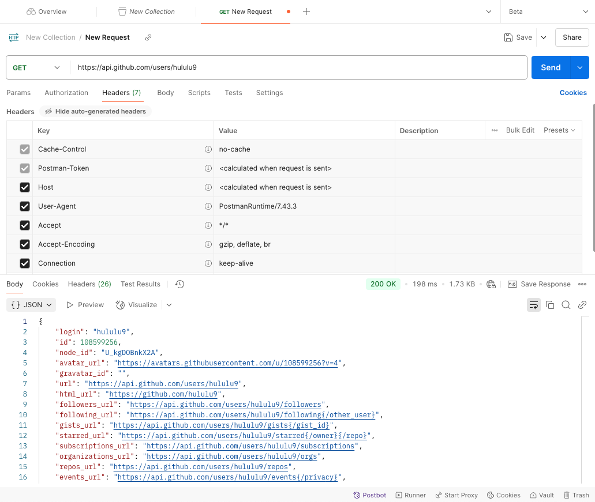
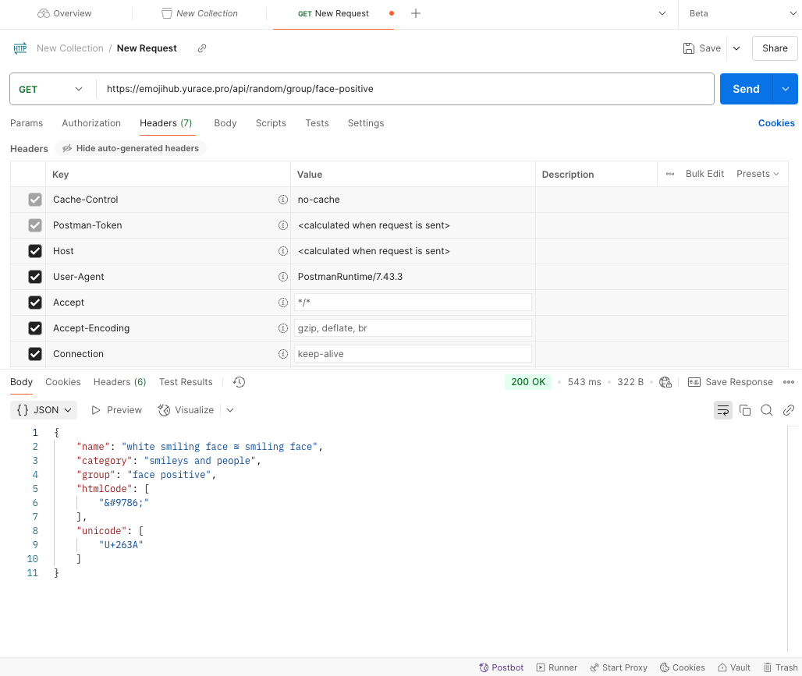
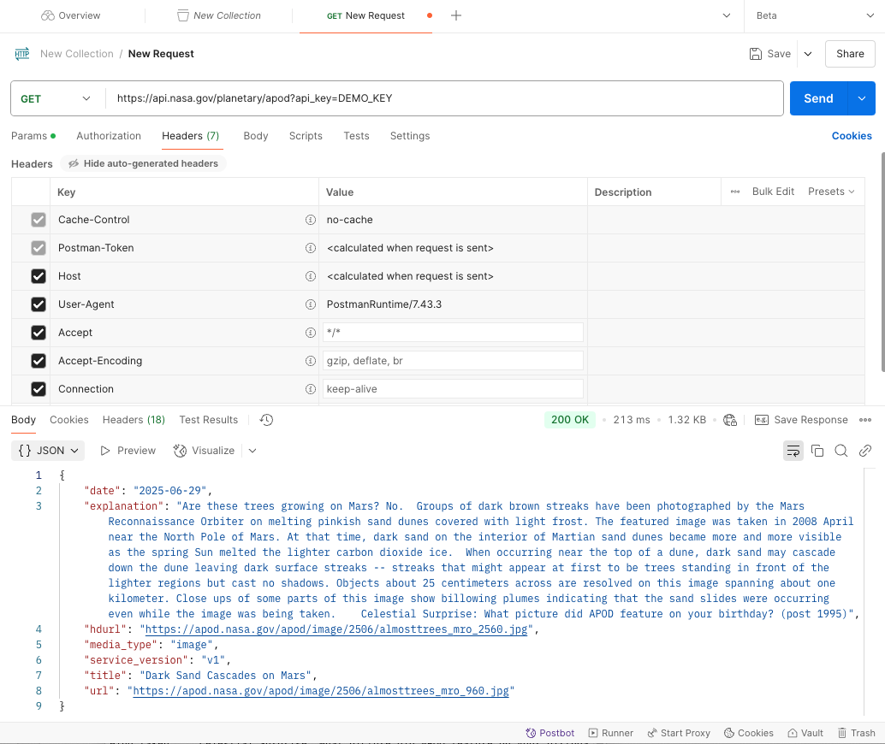
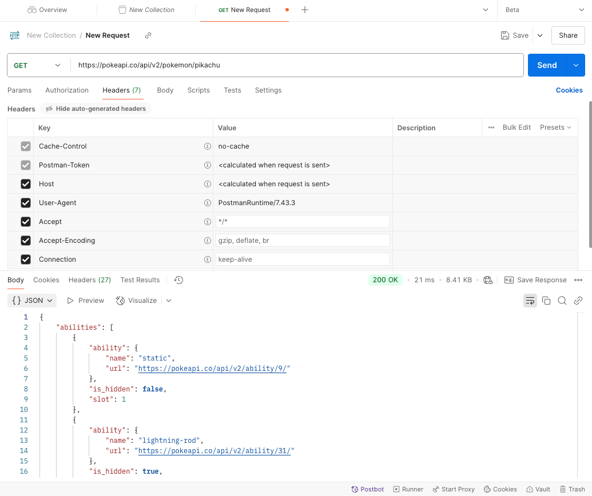
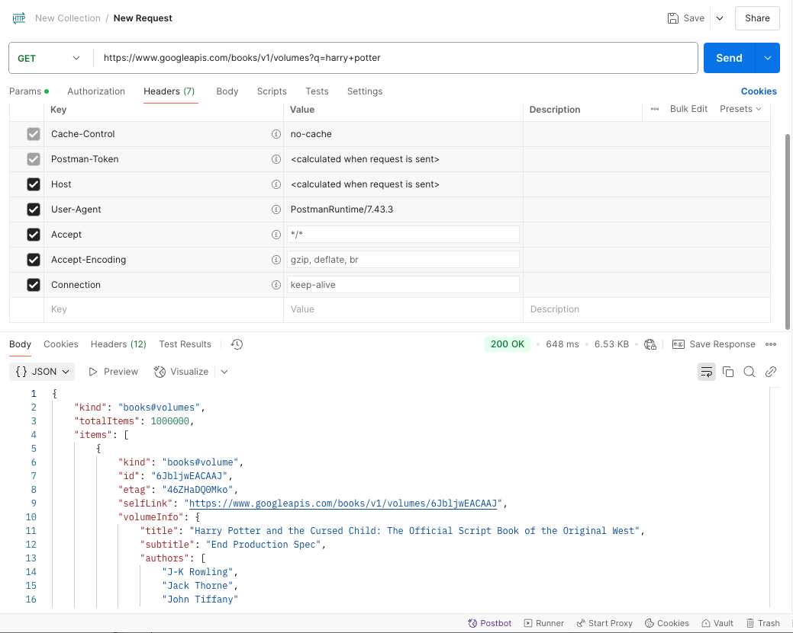

# 6.23 HW7 - API

1. Explain the concept of API (Application Programming Interface), why do we need APIs.

   API is **a set of rules(contract)** that allow different software applications to communicate with each other. The client sends a request, the server processes it and sends back the response, and the API acts as the messenger.

   Why we need APIs:

   1. Communication between systems: A frontend React app can talk to a backend server using APIs.

   2. Encapsulation and abstraction: APIs hide the internal details of how something works. We can just call the function without know the internal logic. And it's good for secruity: APIs expose only certain endpoints, keeping the internal system protected.

   3. Reusability and easier development: developers can reuse service of APIs and integrate third-party APIs instead of building from scratch.

      

2. Compare developer API vs application API (normal APIs).

   Developer API: 

   They are **programmatic libraries or modules** developers use within code like methods, jar (Java libraries), command-line application.

   Application API:

   They are Application Programming Interface that allows **software systems to talk to each other** usually over a network.

   

3. Name some different types of APIs.

   - REST API (HTTP API): Most common — uses standard HTTP methods like GET, POST, etc. Returns JSON.
   - GraphQL: A single endpoint to access **complex structured data**. Client can ask exactly what data it needs. More flexible than REST.
   - gRPC: High-performance, binary protocol built on HTTP/2, uses Protocol Buffers (binary serialization) that supports **bi-directional streaming**. Ideal for **microservices**.
   - WebSocket: Maintains a **persistent connection** for real-time, both server and client can **push data** anytime. Suitable for **real-time** apps (e.g., stock prices, multiplayer games).
   - MQTT: Lightweight **publish-subscribe** protocol used in **IoT devices**.
   - MCP(Modbus Communication Protocol): Communicates between SCADA systems, sensors, PLCs, used in **industrial settings** (e.g., factory machines).
   - SOAP: Older **XML-based** protocol. Still used in enterprise banking, government, legacy systems. Slower than REST, but supports complex operations and contracts.

   

4. Compare path variables vs request parameters in REST API.

   Path Variables(Path Parameters):

   - Part of the URL itself to identify a **specific resource**. 
   - For example: /resource/{id}, "{id}" is the path variable.

   Request Parameters:

   - Attached to the end of a URL and are followed by a question mark. Used for **filtering**, **pagination**, **sorting**, etc.

   - For example: /users?age=25&sort=name, "age=25&sort=name" is the request parameters.

     

5. Explain the different components that make up a RESTful API and what does each part do?

   1. HTTP Methods: Define **what kind of action** you want to perform on a resource.

      e.g.: GET, POST, PUT, PATCH. DELETE

   2. URL (Endpoint): The full **address** of the resource combining path variables and query params

      e.g.: /users/123?role=admin&page=2

   3. Request Headers: **Metadata** about the request from the client.

      e.g.: Authorization, Content-Type, Cookie, Accept

   4. Request Body: Contains the **data the client sends** to the server (mainly with `POST`, `PUT`, or `PATCH`). Usually JSON or XML.

      e.g.:

      ```JSON
      {
        "name": "Alice",
        "email": "alice@example.com"
      }
      
      ```

   5. HTTP Status Code: The result of the request.

      e.g.: 200 OK, 201 Created, 400 Bad Request, 404 Not Found, 500 Internal Server Error, etc

   6. Response Headers: **Metadata** about the response from the server.

      e.g.: Content-Type, Set-Cookie, Cache-Control, Access-Control-Allow-Origin

   7. Response Body

      e.g.: 

      ```json
      {
        "id": 1,
        "name": "Alice",
        "email": "alice@example.com"
      }
      ```

      

6. Explain what cURL is and why we use API testing tools like Postman instead of testing APIs directly with cURL.

   cURL stands for Client URL. It's a command-line tool used to send HTTP requests and test how your backend behaves by passing headers, request bodies, and more.

   ```bash
   curl -X POST https://api.example.com/users \
     -H "Content-Type: application/json" \
     -d '{"name": "Alice", "email": "alice@example.com"}'
   ```

   Postmanoffers a more user-friendly and feature-rich environment for API development and testing with GUI, especially for teams and complex scenarios.

   

7. List common HTTP status codes and their meanings.

   1. Informational responses (100 – 199): request was received and is being processed
   2. Successful responses (200 – 299): request was successfully received, understood, and accepted
   3. Redirection messages (300 – 399): further action needs to be taken to complete the request, specifically, a redirection to another URL
   4. Client error responses (400 – 499): the client made an error in the request
   5. Server error responses (500 – 599): the server failed to fulfill a valid request

   | Code                      | Meaning                                                      | Use Case                                                     |
   | ------------------------- | ------------------------------------------------------------ | ------------------------------------------------------------ |
   | 200 OK                    | Request succeeded                                            | GET, PUT, DELETE, PATCH success                              |
   | 201 Created               | Resource created                                             | POST request to create resource                              |
   | 202 Accepted              | Request accepted but not completed                           | POST or PUT when request need a process                      |
   | 204 No Content            | Success but no body returned                                 | DELETE or PUT with no response                               |
   | 307 Temporary Redirect    | **Temporary** redirect while preserving the request method (safe 302) | When redirecting temporarily without changing method.        |
   | 308 Permanent Redirect    | **Permanent** redirect while preserving the request method (safe 301) | When the resource has moved permanently, but client should keep the original method (e.g., POST, PUT). |
   | 400 Bad Request           | Invalid syntax or input                                      | Missing fields, wrong types                                  |
   | **401** Unauthorized      | Missing/invalid credentials                                  | Auth token missing/expired                                   |
   | **403** Forbidden         | Authenticated but no permission                              | Not allowed to access resource (e.g., admin)                 |
   | 404 Not Found             | Resource doesn’t exist                                       | Invalid path or ID                                           |
   | 405 Method Not Allowed    | HTTP method not supported                                    | PUT on a GET-only endpoint                                   |
   | 500 Internal Server Error | Generic server crash                                         | Null pointer, exception, etc.                                |
   | 502 Bad Gateway           | Server received invalid response                             | Server-to-server issue                                       |

   

8. List HTTP methods and their meanings, and their expected HTTP status codes.

   | Method    | Purpose                               | Typical Use Case                          | Expected Codes                                               |
   | --------- | ------------------------------------- | ----------------------------------------- | ------------------------------------------------------------ |
   | `GET`     | Retrieve data (read-only)             | Fetch user data, list products            | 200 OK, 204 No Content, 404 Not Found                        |
   | `POST`    | Create a new resource or trigger      | Register user, submit form, create task   | **201 Created**, 202 Accepted, 404 Not Found, **409 Conflict **(if resource already exists) |
   | `PUT`     | Replace an existing resource          | Update profile, replace object            | 200 OK, 202 Accepted, 204 No Content, 404 Not Found, **405 Method Not Allowed** |
   | `PATCH`   | Partially update a resource           | Change password, update status            | 200 OK, 204 No Content, 404 Not Found, **405 Method Not Allowed** |
   | `DELETE`  | Delete a resource                     | Delete account, remove item from cart     | 200 OK, 204 No Content, 404 Not Found                        |
   | `HEAD`    | Like GET but no response body         | Check if resource exists or is modified   | 200 OK, 204 No Content, 404 Not Found                        |
   | `OPTIONS` | Describe allowed methods for resource | CORS preflight check, API discoverability | 200 OK, 204 No Content, 404 Not Found                        |

   

9. Explain why REST API is stateless.

   Stateless means each client's request should contain **all the information needed** for the server to understand and process it, without relying on any previous requests and context. (**Each request is independent**). The server doesn't need to store any session or context between requests.

   With this feature, it ensures:

   - Scalability: any server can handle any request.

   - Reliability: if one server fails, the client can retry the request on another server.

   - Performance: cacheable and fewer server resources needed per request.

   which are important for modern web and cloud applications.

   

10. Discuss about best practices for REST API design, from performance perspective.

    - Accept and respond with **JSON**

      ```http
      // Set proper headers
      GET /users
      Accept: application/json
      Content-Type: application/json
      ```

    - Use **nouns** instead of verbs in endpoint paths

      - `POST /users` is good, `POST /createUser` is bad

    - Name collections with **plural nouns**

      - `GET /products` → list all products
      - `GET /products/42` → get product with ID 42

    -  Formatting

      - Use forward slash (/) to indicate hierarchical relationships: `GET /users/123/orders/456`
      - Do NOT use trailing forward slash (/) in URIs: **NO **` GET /users/123/`
      - Use hyphens (-) to improve the readability of URIs: GET /user-profiles
      - Do NOT use underscores ( _ ) or camelCase: **NO** `GET /user_profiles` , `GET /userProfiles`
      - Use lowercase letters in URIs

    - Handle errors gracefully and return **standard error codes**(400/500 error code)

    - Allow filtering, sorting, and pagination

      - `GET /products?category=shoes&sort=price&page=2&limit=20`

        `?filter` for filtering

        `?sort` for ordering

        `?page` + `?limit` for pagination

    - Cache data to improve performance

      ```http
      Cache-Control: public, max-age=3600
      // Use ETag and If-None-Match for conditional GETs
      ETag: "abc123"
      ```

    - Versioning our APIs

      `GET /api/v1/users`

      

11. Explain the concept of XSS (Cross-Site Scripting) and CSRF (Cross Site Request Forgery) and how to avoid them.

    **XSS (Cross-Site Scripting)**:
    The sites should be kept separate from each other, so code from one site should not be able to access objects or credentials in another site (same-origin policy). A cross-site scripting attack is an attacker is able to subvert the same-origin policy by **tricking the target site into executing malicious code within its own context**, as though it were same-origin. So the code can then do anything that the site's own code can do, including steal cookies or tokens, modify page content, perform actions as the user to acess sensitiva data, etc.

    How to avoid:

    | Strategy                          | Description                                                  |
    | --------------------------------- | ------------------------------------------------------------ |
    | Input Sanitization                | Remove or encode dangerous characters (`<`, `>`, `"` etc.) before saving or rendering |
    | Output Encoding                   | Encode dynamic content when inserting into HTML/JS/URLs      |
    | Use security libraries            | e.g., DOMPurify (JS), OWASP Java Encoder, Spring's `@HtmlEscape` |
    | Set Content Security Policy (CSP) | Restricts what scripts can run in the browser                |
    | Avoid `innerHTML` in JS           | Prefer safe DOM methods like `textContent`, `appendChild`    |

    **CSRF (Cross Site Request Forgery)**:

    CSRF tricks a logged-in user’s browser into making **unauthorized requests** on their behalf, like changing passwords or email addresses, trasferring funds, ,making purchases, etc.

    How to avoid:

    | Strategy                               | Description                                                  |
    | -------------------------------------- | ------------------------------------------------------------ |
    | Use CSRF tokens                        | Include a unique, hidden token in every form/request, and validate it server-side |
    | Use SameSite cookies                   | Set cookie attribute to `SameSite=Strict` or `Lax` to prevent cross-origin sending |
    | Require re-authentication              | For sensitive actions (like password change or money transfer) |
    | Disable GET for state-changing actions | Only allow POST/PUT/DELETE to change data                    |
    | Use custom headers                     | AJAX requests with custom headers can be blocked by CORS from other origins |


**API Practices:**

Use Postman or other API testing tools to:

1. Find at least 5 different public APIs (e.g., GitHub APIs, Google Cloud APIs, GeoInfo APIs, Weather APIs) and use them to explain what defines a REST API. These APIs can use any HTTP methods and may also include non-REST APIs (e.g., GraphQL). Some public APIs may require API keys (user registration required);
2. Justify whether these APIs follow API design best practices, and provide your better design for them.
3. List the above APIs in form of cURL commands , and attach Postman screenshots in your markdown submission.
4. List the request headers and response headers of the APIs mentioned above, and explain what each key-value pair in the headers section does.

**Public APIs as follow:**

1. **GitHub APIs**:  GET https://api.github.com/users/hululu9

   This endpoint retrieves public profile information for the GitHub user hululu9.

   This REST API follows best practices. It uses proper HTTP method; uses a plural noun (`users`) to represent a collection of resources, and followed by a path variable (hululu9). But we can add versioning.

   My improved version: GET https://api.github.com/v1/users/hululu9

   ```bash
   curl -X GET https://api.github.com/users/hululu9
   ```

   

    Request Headers (Postman default):

   | Key-Value                          | Description                                                  |
   | ---------------------------------- | ------------------------------------------------------------ |
   | Cache-Control: no-cache            | Instructs the server not to use any cached data. Useful for ensuring fresh results. |
   | Postman-Token                      | Unique token auto-generated by Postman to avoid replay attacks during testing. Not required for production. |
   | Host                               | Specifies the domain name (`api.github.com`) of the server the request is being sent to. Calculated automatically. |
   | User-Agent: PostmanRuntime/7.43.3  | Identifies the client (Postman) making the request. GitHub requires this for all requests. |
   | Accept: \*/\*                      | Tells the server that the client will accept any content type (though JSON is usually returned). |
   | Accept-Encoding: gzip, deflate, br | Client supports compressed responses (gzip = common, br = Brotli). |
   | Connection: keep-alive             | Keeps the TCP connection open for reuse, reducing latency in repeated calls. |

    Response Headers:

   | Key-Value                                      | Description                                                  |
   | ---------------------------------------------- | ------------------------------------------------------------ |
   | Date                                           | Timestamp when the response was generated.                   |
   | Content-Type: application/json; charset=utf-8  | The body format returned (JSON) and character encoding (UTF-8). |
   | Cache-Control: public, max-age=60, s-maxage=60 | Publicly cacheable; keep for 60 seconds. Good for performance. |
   | Vary: Accept, Accept-Encoding                  | Informs caches that responses may vary based on the `Accept` and `Accept-Encoding` headers. |
   | ETag                                           | Unique identifier for the response content; supports caching and conditional requests. |
   | Last-Modified                                  | Indicates when the resource was last changed. Useful with conditional requests. |
   | X-GitHub-Media-Type                            | GitHub-specific header indicating version and response format. |
   | x-github-api-version-selected                  | API version used (from client or default).                   |
   | Access-Control-Expose-Headers                  | Allows browsers to access listed headers in JavaScript (CORS). |
   | Access-Control-Allow-Origin: \*                | Allows access from any origin (for public API endpoints).    |
   | Strict-Transport-Security                      | Forces clients to use HTTPS for future requests.             |
   | X-Frame-Options: deny                          | Prevents the response from being displayed in an iframe (protects against clickjacking). |
   | X-Content-Type-Options: nosniff                | Prevents browser from MIME-sniffing the response (security). |
   | X-XSS-Protection: 0                            | Disables old browser XSS filters (modern CSP is preferred).  |
   | Referrer-Policy                                | Controls how much referrer info is shared across origins.    |
   | Content-Security-Policy: default-src 'none'    | Disallows all inline content/scripts/styles; tightest CSP (for read-only API). |
   | Content-Encoding: gzip                         | The body is compressed using gzip — reduces payload size.    |
   | Server: github.com                             | Identifies the origin server.                                |
   | Accept-Ranges: bytes                           | Indicates support for partial content (useful for resuming downloads). |
   | X-RateLimit-Limit: 60                          | Max number of requests allowed per hour (for unauthenticated users). |
   | X-RateLimit-Remaining: 57                      | Number of requests left in the current rate limit window.    |
   | X-RateLimit-Reset                              | UNIX timestamp of when rate limits will reset.               |
   | X-RateLimit-Resource                           | Resource type being rate limited (e.g., `core`).             |
   | X-RateLimit-Used                               | Number of requests already made.                             |
   | Content-Length: 462                            | Size (in bytes) of the response body.                        |
   | X-GitHub-Request-Id                            | Unique request ID — useful for debugging via GitHub support. |

2. **EmojiHub APIs**:  GET https://emojihub.yurace.pro/api/random/group/face-positive

   Returns a random emoji from the "face positive" emoji group.

   This API almost follows the best practice, but there are still some improvements. We can add versioning, optional filters or query params and use a plural noun: groups.

   My improved version: GET https://emojihub.yurace.pro/api/v1/random/groups/face-positive?tone=light

   ```bash
   curl -X GET https://emojihub.yurace.pro/api/random/group/face-positive
   ```

   

   Request Headers (Postman default) is the same as above.

   Response Headers:

   | Key-Value                      | Meaning                                                      |
   | ------------------------------ | ------------------------------------------------------------ |
   | Alt-Svc: h3=":443"; ma=2592000 | Indicates support for HTTP/3 on port 443. `ma=2592000` means the client can cache this alternative service info for 30 days (in seconds). Helps browsers use faster protocols like HTTP/3. |
   | Content-Length: 147            | Size of the response body in bytes. Tells the client how much data to expect. |
   | Content-Type: application/json | Specifies the format of the response body — here, JSON. Allows the client to parse it properly. |
   | Date                           | The timestamp when the server generated the response. Helps clients with logging, caching, and validation. |
   | Vary: Origin                   | Informs caches that the response may vary depending on the `Origin` header. This is relevant for CORS (Cross-Origin Resource Sharing). |
   | Via: 1.1 Caddy                 | Indicates that the response passed through an intermediate proxy/server — in this case, the Caddy web server. Helpful for tracing or debugging proxies and reverse proxies. |

3. **NASA APIs**:  GET https://api.nasa.gov/planetary/apod?api_key=DEMO_KEY

   Returns the picture of the day with a title, description, and media URL using the public DEMO_KEY.

   This API almost follows the best practice, but we can add versioning and better resource hierarchy.

   My improved version: GET https://api.nasa.gov/v1/planetary/apod/today?api_key=DEMO_KEY

   ```bash
   curl -X GET "https://api.nasa.gov/planetary/apod?api_key=DEMO_KEY"
   ```
	
   

	Request Headers (Postman default) is the same as above.

   Response Headers:
   
    | **Key-Value**                                                | **Meaning**                                                  |
    | ------------------------------------------------------------ | ------------------------------------------------------------ |
    | Date                                                         | Timestamp when the response was generated by the server.     |
    | Content-Type: application/json                               | Response body is in JSON format.                             |
    | Transfer-Encoding: chunked                                   | The response is sent in chunks (used for streaming or unknown-length content). |
    | Connection: keep-alive                                       | Keeps the connection open so the client can reuse it for further requests (reduces latency). |
    | Access-Control-Allow-Origin: *                               | CORS header that allows any domain to access this resource (useful for public APIs). |
    | Access-Control-Expose-Headers: X-RateLimit-Limit, X-RateLimit-Remaining | Lets browsers access these response headers in frontend JavaScript (they're normally hidden). |
    | Age: 0                                                       | Time in seconds since the response was fetched from the origin server (0 = fresh). |
    | Content-Encoding: gzip                                       | The response body is compressed with gzip to reduce size and speed up transfer. |
    | Strict-Transport-Security: max-age=31536000; includeSubDomains; preload | Enforces HTTPS for 1 year across all subdomains — improves security. |
    | Vary: Accept-Encoding                                        | Tells caches that the response may vary depending on the `Accept-Encoding` header. |
    | Via: https/1.1 api-umbrella (ApacheTrafficServer [cMsSf ])   | Indicates the request passed through the API Umbrella gateway and a caching proxy (Apache Traffic Server). |
    | X-Api-Umbrella-Request-Id: cnnn33r0qpqcrln3mp6g              | Unique ID to trace this request in API Umbrella logs (useful for debugging). |
    | X-Cache: MISS                                                | Response was not served from cache (it was a fresh call).    |
    | X-Content-Type-Options: nosniff                              | Prevents the browser from guessing the content type (security best practice). |
    | X-RateLimit-Limit: 30                                        | Maximum allowed requests per hour using `DEMO_KEY`.          |
    | X-RateLimit-Remaining: 27                                    | You have 27 requests left in the current rate window.        |
    | X-Vcap-Request-Id: baed7deb-f420-4585-6b13-beb899cb6db3      | Another unique trace ID from the underlying infrastructure (e.g., Cloud Foundry). |
    | X-Frame-Options: DENY                                        | Prevents the response from being displayed in an iframe (helps block clickjacking attacks). |

4. **Pokémon API**: GET https://pokeapi.co/api/v2/pokemon/pikachu

   Returns data about the Pokémon Pikachu.

   This API is a good example of the best practice. It has versioning, proper path variable and resource-oriented URL.  But it returns a large response body(many nested fields). We can add filtering on this endpoint to reduce response size. 

   My improved version: GET https://pokeapi.co/api/v2/pokemon/pikachu?fields=name,id,types

   ```bash
   curl -X GET "https://pokeapi.co/api/v2/pokemon/pikachu"
   ```

   

	Request Headers (Postman default) is the same as above.

	Response Headers:
   
   | **Key-Value**                                                | **Meaning**                                                  |
   | ------------------------------------------------------------ | ------------------------------------------------------------ |
   | Date                                                         | Time the response was generated.                             |
   | Content-Type: application/json; charset=utf-8                | Indicates the response body is JSON, encoded in UTF-8.       |
   | Content-Length: 7454                                         | Size of the response in bytes (before compression).          |
   | Connection: keep-alive                                       | Keeps the TCP connection open for reuse.                     |
   | Access-Control-Allow-Origin: *                               | CORS header — allows any domain to access the API (frontend/browser friendly). |
   | Cache-Control: public, max-age=86400, s-maxage=86400         | Caching: cache publicly for 1 day (86400 seconds) both in browser and shared (CDN) caches. |
   | Content-Encoding: gzip                                       | The response body is compressed with gzip to reduce size and improve performance. |
   | ETag: W/"3f890-CPBy9QF17m78962w1Jge3F+KkWk"                  | ETag (entity tag) used for cache validation — enables conditional requests (`If-None-Match`). |
   | Function-Execution-Id: sk6dgx27iute                          | Internal ID used to trace execution inside the cloud function (for debugging/logging). |
   | Server: cloudflare                                           | Cloudflare acted as the edge server for this response.       |
   | Strict-Transport-Security: max-age=31556926                  | Forces HTTPS for 1 year; improves transport security.        |
   | X-Cloud-Trace-Context                                        | Google Cloud tracing header for internal request tracking.   |
   | X-Country-Code: US                                           | Detected country from client IP (GeoIP).                     |
   | X-Orig-Accept-Language: en-US,en;q=0.9,el-GR;q=0.8,el;q=0.7  | Original language preferences sent by the client.            |
   | X-Powered-By: Express                                        | Indicates the backend is running on Node.js Express.         |
   | Accept-Ranges: bytes                                         | Supports partial content requests (e.g., download resume).   |
   | X-Served-By: cache-sjc1000086-SJC                            | CDN cache node that served the request (in San Jose, CA).    |
   | X-Cache: HIT                                                 | Response was served from cache (no need to hit origin server). |
   | X-Cache-Hits: 0                                              | Number of times this resource has been served from cache (first hit). |
   | X-Timer: S1749181541.364158,VS0,VE1                          | Internal timing diagnostics for the request (start, backend wait, and end). |
   | Vary: Accept-Encoding,cookie,need-authorization,x-fh-requested-host,accept-encoding | Caching proxy should vary responses depending on these headers (cache key varies). |
   | Alt-Svc: h3=":443"; ma=86400                                 | Server supports HTTP/3 on port 443; cache this info for 1 day. |
   | Age: 53428                                                   | How many seconds this response has been stored in cache (~14.8 hours). |
   | CF-Cache-Status: HIT                                         | Cloudflare served the response from its edge cache (great for performance). |
   | NEL                                                          | Network Error Logging config for Cloudflare’s reporting.     |
   | Report-To                                                    | URL where Cloudflare reports network issues for this API (used with `NEL`). |
   | CF-RAY: 9578f6894df92516-SJC                                 | Unique request ID assigned by Cloudflare + data center code (SJC = San Jose, CA). |

5. **Google book API**: GET https://www.googleapis.com/books/v1/volumes?q=harry+potter

   Returns data about the book Harry Potter.

   This API is a good example, it has versioning and filtering, but the query parameter q is too generic, and it cannot limit fields in response which can cause a big payload.

   My improved version: GET https://www.googleapis.com/books/v1/volumes?title=harry+potter&author=rowling&maxResults=5&fields=title,authors

   ```bash
   curl -X GET "https://www.googleapis.com/books/v1/volumes?q=harry+potter"
   ```

   

	Request Headers (Postman default) is the same as above.

	Response Headers:
	
	| **Key-Value**                                            | Meaning                                                      |
	| -------------------------------------------------------- | ------------------------------------------------------------ |
	| Content-Type: application/json; charset=UTF-8            | Specifies that the response is in JSON format, encoded in UTF-8. This helps the client correctly parse the body content. |
	| Vary: Origin                                             | Tells caches that the response may differ depending on the request's `Origin` header. Common with CORS. |
	| Vary: X-Origin                                           | Similar — tells caches that the response may vary depending on `X-Origin`, a custom Google header. |
	| Vary: Referer                                            | Adds `Referer` as another factor that may cause a variation in the response. Used for security and analytics. |
	| Content-Encoding: gzip                                   | Indicates the body is gzip-compressed to reduce size and improve performance. The client will automatically decompress. |
	| Date                                                     | Time when the response was generated by the server. Useful for caching and logging. |
	| Server: ESF                                              | Identifies the backend server as Google’s Edge Server Framework (ESF). |
	| X-XSS-Protection: 0                                      | Disables old browser XSS filters. Google disables this to avoid false positives and recommends using CSP instead. |
	| X-Frame-Options: SAMEORIGIN                              | Prevents the page from being embedded in an iframe on a different domain — helps prevent clickjacking attacks. |
	| X-Content-Type-Options: nosniff                          | Instructs browsers not to guess the MIME type — helps prevent MIME-sniffing attacks. |
	| Alt-Svc: h3=":443"; ma=2592000, h3-29=":443"; ma=2592000 | Advertises support for HTTP/3 (QUIC) on port 443 and caches that info for 30 days (2592000 seconds). Improves performance over newer protocols. |
	| Transfer-Encoding: chunked                               | The response body is sent in chunks (used when total content length is not known at start). Standard with gzip-compressed dynamic content. |