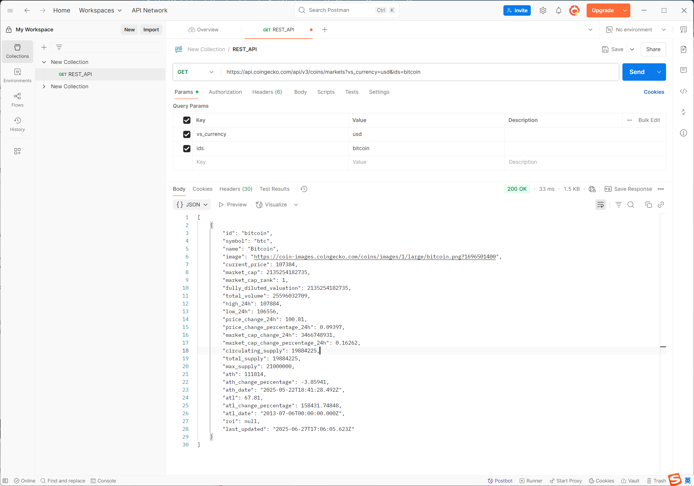
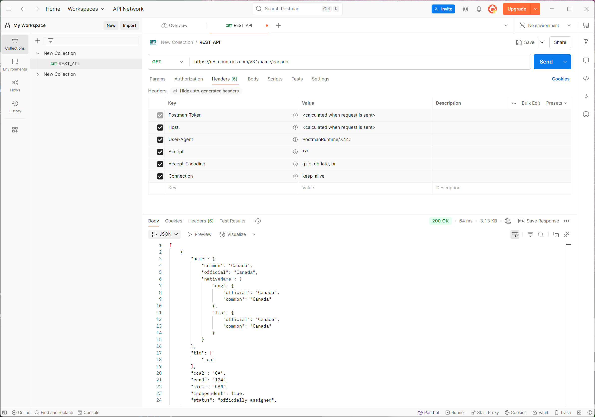
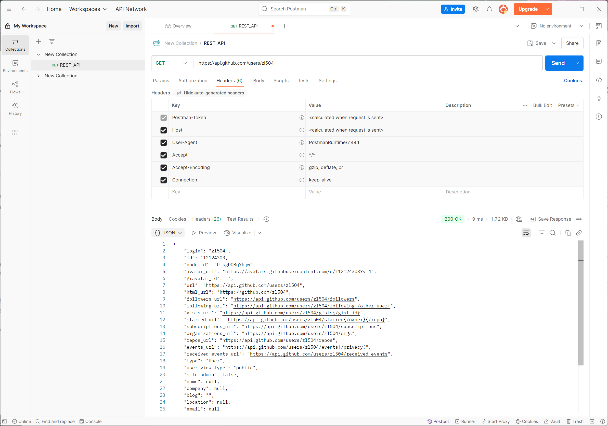
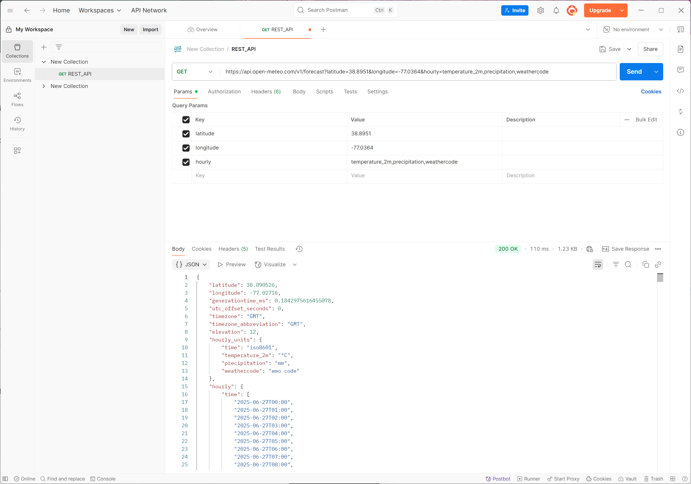
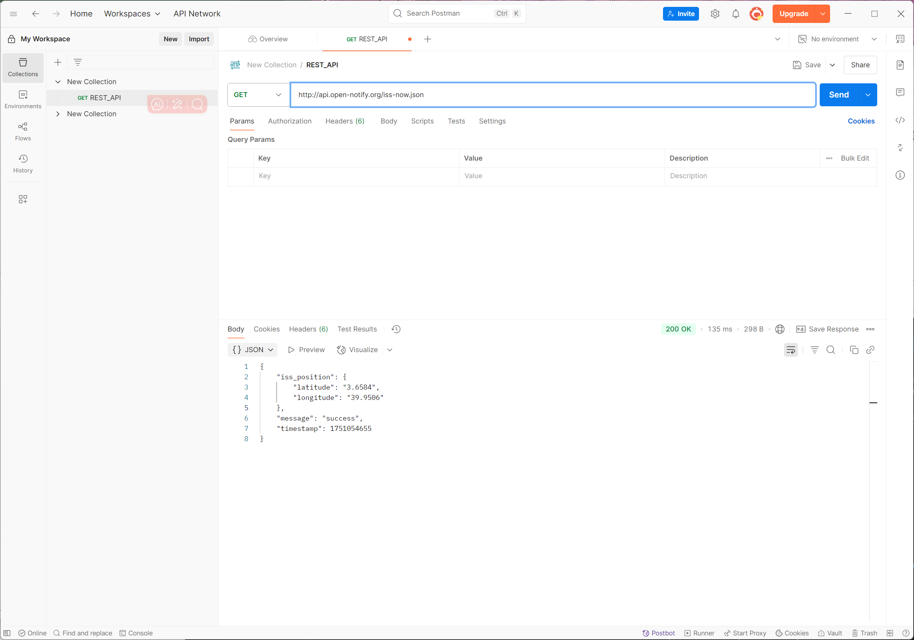

## 1. Explain the concept of API (Application Programming Interface), why do we need APIs.
* API: An API, or application programming interface, is a set of rules or protocols that enables software applications to communicate with each other to exchange data, features and functionality.
* Why need it: APIs help developers to create software programs more easily. Instead of writing complex code from scratch, they can call APIs that already provide the functions they need. APIs are also crucial in building modern websites, where heavy data transfers happen between the client (user) and the server.

## 2. Compare developer API vs application API (normal APIs)

* Developer API: API exposed to external developers, for third-party apps, plugins, etc.

* Application API: designed for interacting with or managing applications within a software environment. 

## 3. Name some different types of APIs

* Public APIs: A public API is open and available for use by any outside developer or business.

* Partner APIs: A partner API, only available to specifically selected and authorized outside developers or API consumers, is a means to facilitate business-to-business activities. 

* Internal API: An internal or private API is intended only for use within the enterprise to connect systems and data within the business.

* Composite APIs: Composite APIs generally combine two or more APIs to craft a sequence of related or interdependent operations.

## 4. Compare path variables vs request parameters in REST API.

* Path Variables:
Path variables are part of the URL itself and are typically used to identify a specific resource. 

* Request Parameters:
Request parameters are used to filter, sort, or provide more context to the specified resources. They are added to the end of a URL after a '?' symbol.

## 5. Explain the different components that make up a RESTful API and what does each part do?
* HTTP method: describes what is to be done with a resource. POST, GET, PUT, DELETE

* Endpoint: contains a Uniform Resource Identifier (URI) indicating where and how to find the resource on the Internet.

* Headers: store information relevant to both the client and server. Mainly, headers provide authentication data - such as an API key, the name or IP address of the computer where the server is installed, and the information about the response format.

* Body: is used to convey additional information to the server.

## 6. Explain what cURL is and why we use API testing tools like Postman instead of testing APIs directly with cURL.

* cURL: cURL, which stands for client URL, is a command line tool that developers use to transfer data to and from a server. At the most fundamental, cURL lets you talk to a server by specifying the location (in the form of a URL) and the data you want to send.

* Postman can be great to test quickly, to demonstrate an API response/behavior without additional coding, or as a way to validate your API calls from another script. Like IDE and notepad

## 7. List common HTTP status codes and their meanings.

* 1xx: Informational – Communicates transfer protocol-level information.
    * 100: Continue

* 2xx: Success – Indicates that the client’s request was accepted successfully.
    * 200: OK, Success

* 3xx: Redirection – Indicates that the client must take some additional action in order to complete their request.
    * 302: Found

* 4xx: Client Error – This category of error status codes points the finger at clients.

    * 404: Not Found
* 5xx: Server Error – The server takes responsibility for these error status codes.
    * 500: Internal Server Error

## 8. List HTTP methods and their meanings, and their expected HTTP status codes.

* GET: simply retrieve data from the server.
    * 200(OK)

* POST: sends data to the server for processing.
    * 201(Created)
* PUT: The PUT method replaces all current representations of the target resource with the request content.
    * 200(OK), 204(No content)
* PATCH: The PATCH method applies partial modifications to a resource.
    * return the 2xx HTTP status code

* DELETE: The DELETE method deletes the specified resource.
    * 200 (OK)

https://testfully.io/blog/http-methods/ 

## 9. Explain why REST API is stateless.

Statelessness means that every HTTP request happens in complete isolation. When the client makes an HTTP request, it includes all information necessary for the server to fulfill the request.

The server never relies on information from previous requests from the client. If any such information is important then the client will send that as part of the current request.

## 10. Discuss about best practices for REST API design, from performance perspective.

1. Cache When You Can
2. Limit Payloads
3. Simplify Database Queries
4. Optimize Connectivity and Reduce Packet Loss
5. Rate Limit to Avoid Abuse
6. Implement Pagination
7. Use Asynchronous Logging
8. Use PATCH When Possible
9. Compress Payloads
10. Use a Connection Pool

## 11. Explain the concept of XSS (Cross-Site Scripting) and CSRF (Cross Site Request Forgery) and how to avoid them.

* XSS: a web security vulnerability that allows an attacker to compromise the interactions that users have with a vulnerable application. 
    * Avoid: Treating all user input as if it is untrusted is the best way to prevent XSS vulnerabilities. 

* CSRF: Cross-Site Request Forgery (CSRF) is an attack that forces an end user to execute unwanted actions on a web application in which they're currently authenticated. 
    * The most common approach to protecting against CSRF attacks is to use the Synchronizer Token Pattern (STP). STP is used when the user requests a page with form data: The server sends a token associated with the current user's identity to the client. The client sends back the token to the server for verification.

# API Practices:

1. CoinGecko API: 
https://api.coingecko.com/api/v3/coins/markets?vs_currency=usd&ids=bitcoin
    
    RestCountries API:
https://restcountries.com/v3.1/name/canada

    Github API: https://api.github.com/users/zl504 

    Open-Meteo API: https://api.open-meteo.com/v1/forecast?latitude=38.8951&longitude=-77.0364&hourly=temperature_2m,precipitation,weathercode

    Notify API: http://api.open-notify.org
    

What defines a REST API:

* Uses HTTP methods: GET, POST, PUT, DELETE.

* URL (Path Variable + Request Parameters)

* HTTP Headers

* Request Body

* HTTP (Response) Status Code

* Response Body

* Response Headers
2. 
* CoinGecko: Yes,
Clean resource-oriented URLs.
Query params are clear (vs_currency, ids).
JSON response.
* RestCountries: Yes
* Github: Yes
* Open-Meteo: Yes
* Notify: Yes
3. curl -X GET "https://api.coingecko.com/api/v3/coins/markets?vs_currency=usd&ids=bitcoin"

curl -X GET "https://api.coingecko.com/api/v3/coins/markets?vs_currency=usd&ids=bitcoin"

curl -X GET "https://api.github.com/users/zl504"

curl -X GET "https://api.open-meteo.com/v1/forecast?latitude=38.8951&longitude=-77.0364&hourly=temperature_2m,precipitation,weathercode"

curl -X GET "http://api.open-notify.org"

4.  Notify: 
* Request Headers (From Client to Server)

Key	Value	Explanation

Postman-Token	`<calculated when request is sent>`	Postman-generated token to uniquely identify each request (used internally by Postman).

Host	`<calculated when request is sent>`	The domain of the server you're sending the request to (api.open-notify.org).

User-Agent	`PostmanRuntime/7.44.1`	Identifies the client making the request (Postman).

Accept	`*/*`	Tells the server that the client can accept any content type (*/* means any media type).

Accept-Encoding	`gzip, deflate, br`	Indicates compression algorithms that the client can accept to reduce the response size (gzip, etc.).

Connection	`keep-alive`	Keeps the TCP connection open for potential future requests, improving efficiency.

* Response Headers (From Server to Client)

Key	Value	Explanation

Server	`nginx/1.10.3`	Indicates the server software handling the request (Nginx version 1.10.3).

Date	`Fri, 27 Jun 2025 20:04:15 GMT`	The timestamp when the server generated the response.

Content-Type	`application/json`	Specifies that the response body is in JSON format.

Content-Length	`111`	The size of the response body in bytes (111 bytes).

Connection	`keep-alive`	The server is keeping the connection open for further potential requests.

access-control-allow-origin	`*`	CORS header: allows any origin (*) to access this resource (open for public API usage in browsers).

