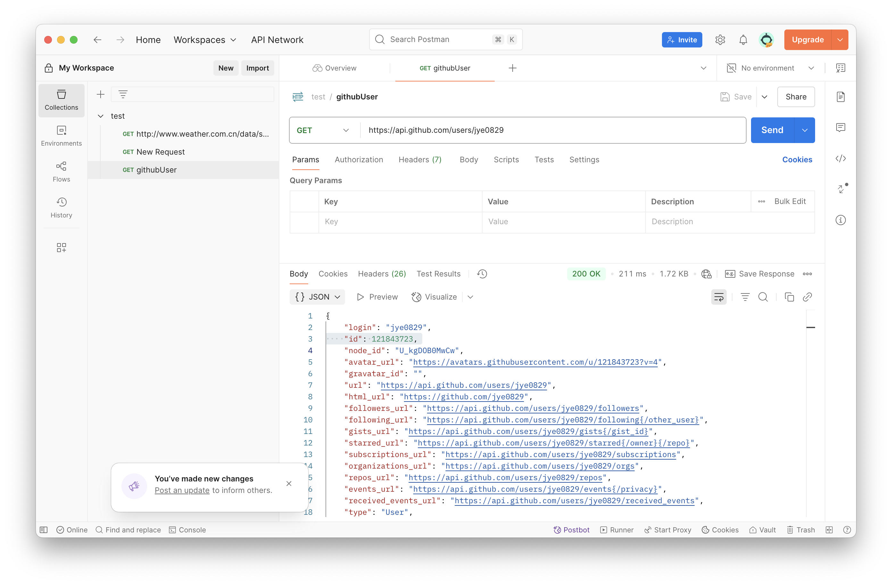
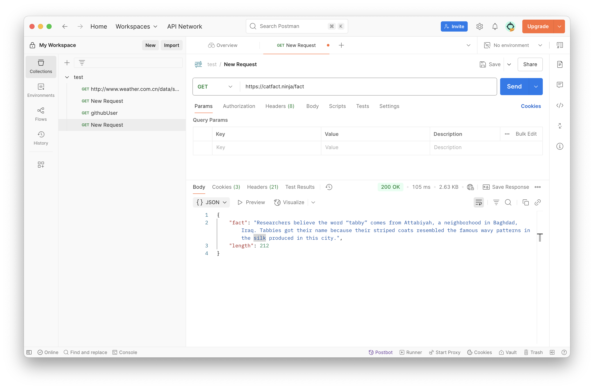
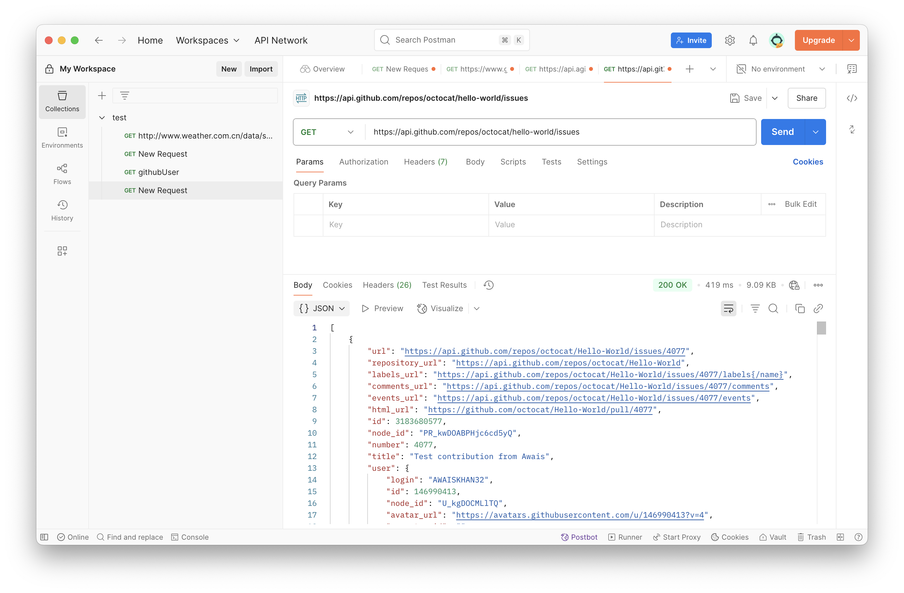
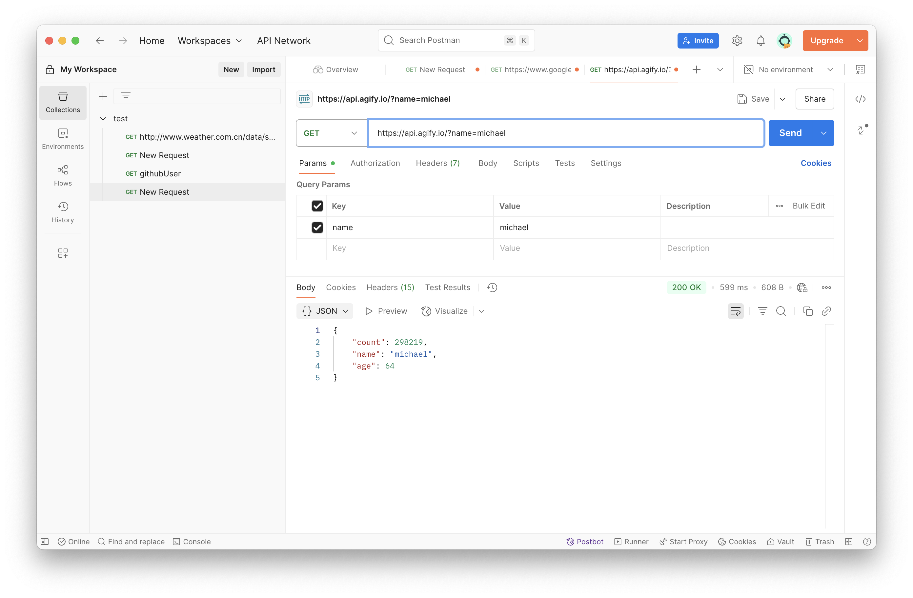
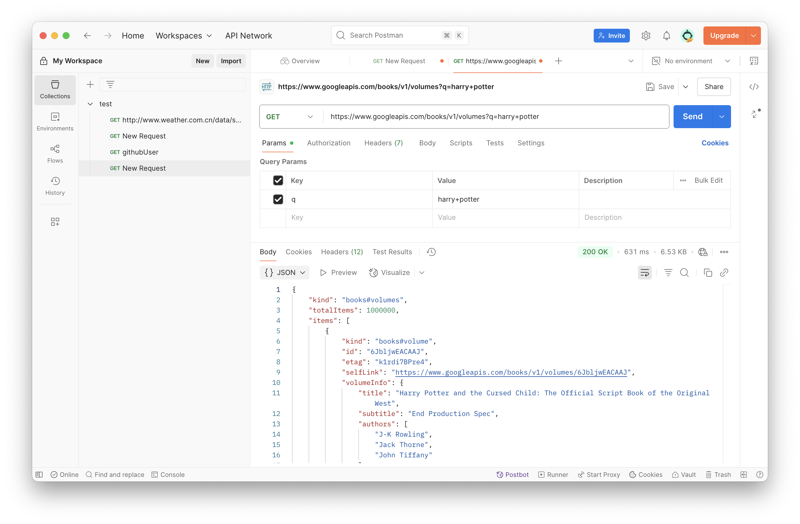

# API Concepts

1. **Explain the concept of API (Application Programming Interface)**  
   Why do we need APIs.
- An API (Application Programming Interface) is a set of defined rules and protocols that allow different software applications or components to communicate with each other. It acts as a bridge between different systems, allowing them to send and receive data in a structured way.

2. **Compare developer API vs application API (normal APIs)**
- Developer APIs are used by developers to build software (think SDKs, frameworks).
- Application APIs are used by apps to interact at runtime, typically in client-server architectures.

3. **Name some different types of APIs**
- REST APIs/ GraphQL/ GRPC

4. **Compare path variables vs request parameters in REST API**
- Use path variables when you’re pointing to a specific resource, and request parameters when you’re modifying or filtering the response.

5. **Explain the different components that make up a RESTful API**  
   What does each part do?
   1. Endpoint (URI): The unique URL that represents a resource.
   2. HTTP Methods (Verbs):GET POST PUT PATCH DELETE
   3. Headers: Metadata sent with the request/response.
   4. Body (Payload)
   5. Response (Status Code + Body)
   6. Query Parameters (Optional)

6. **Explain what cURL is**  
   Why we use **API testing tools** like **Postman** instead of testing APIs directly with cURL.
- cURL (Client URL) is a command-line tool used to transfer data to or from a server using various protocols, most commonly HTTP. It is widely used to test and interact with APIs by sending requests like GET, POST, PUT, and DELETE.
- cURL is lightweight, fast, and ideal for automation or scripting. 
- Postman is better for exploratory testing, collaboration, and debugging, especially for teams and complex APIs.
- 
7. **List common HTTP status codes** and their meanings.
- 100–299    | 1XX Informational Responses
- 2XX success status. E.g. 200/204 (created) etc. (**Mostly okay**)
- 300–399    | Redirects. For example, 301 means **Moved permanently** (e.g. redirect)
- 400–499    | Client-side errors. 400 means bad request and 404 means **resource not found**  
   (**application error**)                               
- 500–599    | Server-side errors. For example, 500 means an internal **server error** (e.g. 503) 

8. **List HTTP methods** and their expected **HTTP status codes**. 
- GET         | Retrieve data from the server          | 200 (OK), 304 (Not Modified)      |
- POST        | Create new resource                    | 201 (Created), 400 (Bad Request)  |
- PUT         | Update an existing resource completely | 200 (OK), 204 (No Content), 404 (Not Found) |
- PATCH       | Partially update a resource            | 200 (OK), 204 (No Content), 404 (Not Found) |
- DELETE      | Delete a resource                      | 200 (OK), 204 (No Content), 404 (Not Found) |

9. **Explain why REST API is stateless**
- A REST API is stateless because each HTTP request from a client to the server must contain all the information needed to understand and process the request.
The server does not store any session information about the client between requests.

10. **Discuss best practices for REST API design**, from a **performance** perspective.
    1. Use Pagination for Large Collections
    2. Enable Filtering and Sorting
    3. Cache Responses Where Appropriate
    4. Use HTTP Compression (e.g., GZIP)
    5. Avoid Over-fetching / Under-fetching
    6. Design Efficient Data Models
    7. Minimize Number of API Calls (Batching)
    8. Use Asynchronous Processing for Long Tasks
    9. Apply Rate Limiting and Throttling
    10. Profile, Monitor, and Optimize Regularly

11. **Explain the concept of XSS (Cross-Site Scripting)** and **CSRF (Cross-Site Request Forgery)**  
    How to avoid them.
- XSS (Cross-Site Scripting)
•	Definition:
A vulnerability that allows attackers to inject malicious scripts (usually JavaScript) into web pages viewed by other users.
•	Example:
An attacker inserts  into a comment field. Other users loading the page execute this script in their browser.
•	Impact:
•	Stealing session cookies or tokens
•	Redirecting users to malicious sites
•	Defacing web pages
•	Prevention:
•	Escape user input before rendering (HTML encode)
•	Use frameworks that auto-sanitize (e.g., React, Angular)
•	Content Security Policy (CSP) to restrict script execution
•	Avoid innerHTML, use textContent instead

-  CSRF (Cross-Site Request Forgery)
•	Definition:
An attack where a trusted user’s session is exploited to send unauthorized commands to a web app.
•	Example:
If a user is logged into bank.com, a malicious site causes their browser to submit a form request to bank.com/transfer?amount=1000 using the existing session cookie.
•	Impact:
•	Funds transfer
•	Password change
•	Unauthorized data manipulation
•	Prevention:
•	Use CSRF tokens in forms and validate them server-side
•	Set cookies with the SameSite attribute (SameSite=Strict or Lax)
•	Require re-authentication for sensitive operations
•	Avoid GET requests for operations that cause changes (follow RESTful design)

---

# API Practices

Use **Postman** or other **API testing tools** to:

1. **Find at least 5 different public APIs**  
   (e.g., GitHub APIs, Google Cloud APIs, GeoInfo APIs, Weather APIs)
  - Use them to explain what defines a **REST API**.
  - These APIs can use any **HTTP methods**, and may also include **non-REST APIs** (e.g., **GraphQL**).
  - Some **public APIs** may require **API keys** (user registration required).

2. **Justify whether these APIs follow API design best practices**,  
   and provide your better design for them.

3. **List the above APIs in form of cURL commands**,  
   and attach **Postman screenshots** in your markdown submission.

4. **List the request headers and response headers** of the APIs mentioned above,and explain what each key-value pair in the headers section does。

1.
- https://api.github.com/users/jye0829
- https://catfact.ninja/fact
- https://api.github.com/repos/octocat/hello-world/issues
- https://api.agify.io/?name=michael
- https://www.googleapis.com/books/v1/volumes?q=harry+potter

2. Do These APIs Follow REST API Design Best Practices?
   1. https://api.github.com/users/jye0829
   •	Method: GET
   •	RESTful? ✔️ Yes
   •	Good Practice: Uses resource-based URL (/users/{username}), returns JSON.
   •	Improvement: Add pagination fields if user data grows large in future.

   2. https://catfact.ninja/fact
   •	Method: GET
   •	RESTful? ✔️ Yes
   •	Good Practice: Stateless, descriptive endpoint name.
   •	Improvement: Could include query parameters for fact length or category filtering.

   3. https://api.github.com/repos/octocat/hello-world/issues
   •	Method: GET
   •	RESTful? ✔️ Yes
   •	Good Practice: Hierarchical resource path (/repos/{owner}/{repo}/issues), supports pagination.
   •	Improvement: Already a well-designed REST API by GitHub. No major changes needed.

   4. https://api.agify.io/?name=michael
   •	Method: GET
   •	RESTful? ✔️ Yes (query-based parameter access)
   •	Good Practice: Simple and clean, uses query parameter for flexibility.
   •	Improvement: Could group demographic predictions under /predict/age?name=... for clarity.

   5. https://www.googleapis.com/books/v1/volumes?q=harry+potter
•	Method: GET
•	RESTful? ✔️ Yes
•	Good Practice: Well-structured query-based search.
•	Improvement: Use /books/search?q=... to better express resource type.

3.
- curl https://api.github.com/users/jye0829
- 
- curl https://catfact.ninja/fact
- 
- curl https://api.github.com/repos/octocat/hello-world/issues
- 
- curl "https://api.agify.io/?name=michael"
- 
- curl "https://www.googleapis.com/books/v1/volumes?q=harry+potter"
- 

4. 
API	Header Type	Header Key	Description
All	Request	Accept: application/json	Informs server the client expects JSON format.
GitHub APIs	Response	X-RateLimit-Limit	Max number of requests allowed per hour.
GitHub APIs	Response	X-RateLimit-Remaining	Remaining request quota in current window.
All	Response	Content-Type: application/json; charset=utf-8	Indicates returned body is JSON.
Google Books	Request	User-Agent	Identifies the client making the request.
Google Books	Response	Cache-Control	Defines caching policy for the response.
