# HW8 - SQL Referential Integrity – Part1

## 1. The referenced parent table `department` has not been created yet

**Runnable SQL**

```sql
CREATE DATABASE university;
USE university;

CREATE TABLE department (
    dept_id INT PRIMARY KEY,
    dept_name VARCHAR(100) NOT NULL
);

CREATE TABLE student (
    student_id INT PRIMARY KEY,
    student_name VARCHAR(100) NOT NULL,
    gender ENUM('Male', 'Female') NOT NULL,
    birth_date DATE,
    dept_id INT,
    FOREIGN KEY (dept_id) REFERENCES department(dept_id)
);
```

---

## 2. `student` table was never created

**Runnable SQL**

```sql
-- Create parent rows first
INSERT INTO department (dept_id, dept_name)
VALUES (101,'Computer Science'),
       (102,'Electrical Engineering'),
       (201,'Law');

INSERT INTO student (student_id, student_name, gender, birth_date, dept_id)
VALUES (1001,'John Zhang','Male','2001-05-10',101),
       (1002,'Chen Li','Female','2000-11-23',102),
       (1003,'Anna Gu','Female','2001-06-15',201);
```

---

## 3 & 4: `school` and `department` schemas were created

```sql
-- Create School Schema --
CREATE TABLE school (
                        school_id INT PRIMARY KEY,
                        school_name VARCHAR(100) NOT NULL,
                        city VARCHAR(50),
                        established_year INT
);

-- Create Department Schema --
ALTER TABLE department
    ADD COLUMN building   VARCHAR(50),
    ADD COLUMN school_id  INT,
    ADD CONSTRAINT fk_dept_school
        FOREIGN KEY (school_id)
            REFERENCES school(school_id);
```

---

## 5. Various duplicate PK and one row used a non-existent `dept_id`

**Runnable SQL**

```sql
-- Insert data to student table --
INSERT INTO student (student_id, student_name, gender, birth_date, dept_id)
VALUES
    (1004, 'Dawen Wei', 'Male', '2001-05-01', 101),
    (1005, 'Ziwei Zhang', 'Female', '2002-08-12', 102),
    (1006, 'Lang Wang', 'Female', '2000-11-21', 201),
    (1007, 'Tyler A.', 'Female', '2002-08-12', 101);
```

---


## 6. Duplicate Entry
**Runnable SQL**

```sql
-- upsert departments: insert if new, otherwise update the two columns --
INSERT INTO department (dept_id, dept_name, building, school_id)
VALUES
    (101, 'Computer Science',        'Information Hall',    1),
    (102, 'Electrical Engineering',  'Main Building A',     1),
    (201, 'Law',                     'Law School Building', 2)
ON DUPLICATE KEY UPDATE
                     building  = VALUES(building),
                     school_id = VALUES(school_id);

```

---


## 7. Syntax Problem: department has 4 columns but only 3 values are provided

**Runnable SQL**

```sql
INSERT INTO department VALUES (103, 'Physics', 888, 1);
```

---


## 8. Column-count error

**Runnable SQL**

```sql
INSERT INTO student VALUES (1008, 'Nayina', 'Female', '2002-08-15', 103);
```

---


## 9. Can't delete since there are student rows referencing it

## 10. Join Result

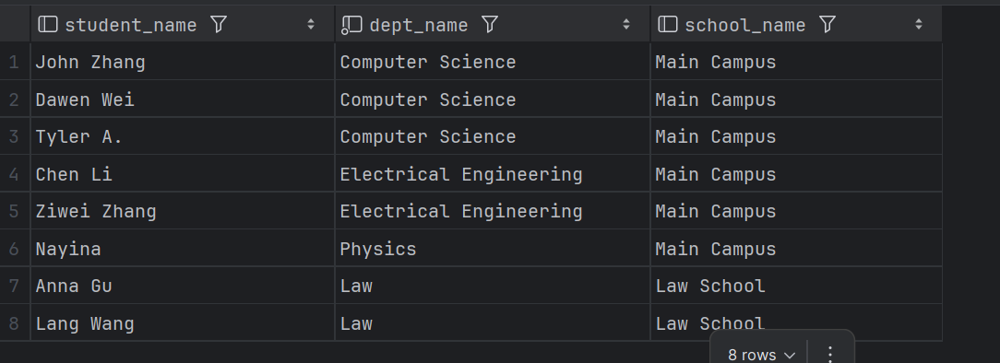

---

# SQL Referential Integrity – Part2

## 1. Manual Join: returns the Cartesian product between `department` and `school`

```sql
-- Manual Join: what will happen?
SELECT 
    s.student_name,
    d.dept_name,
    sc.school_name
FROM student s, department d, school sc;

```
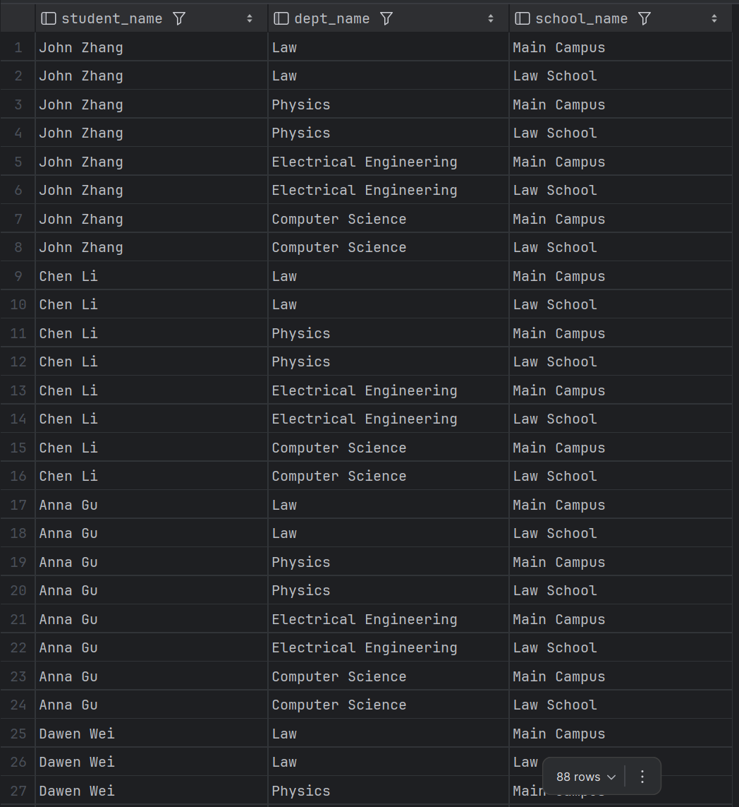
---


## 2. With Join:

```sql
-- With Join: compare results with above manual join
SELECT 
    s.student_name,
    d.dept_name,
    sc.school_name
FROM student s
JOIN department d ON s.dept_id = d.dept_id
JOIN school sc ON d.school_id = sc.school_id;
```
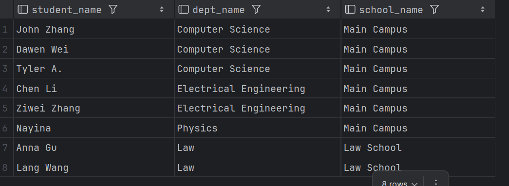

---

## 3. Inner Join: only pairs that satisfy the join condition

```sql
-- Inner Join
SELECT *
FROM student s
JOIN department d ON s.dept_id = d.dept_id;
```

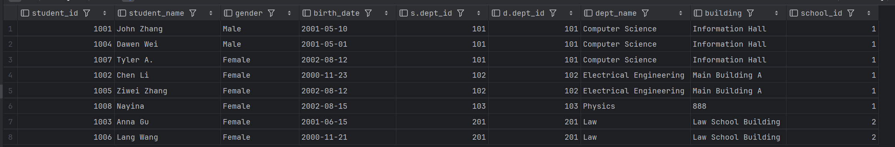

---


## 4. Left Join: All rows from the left table; unmatched right-side columns are NULL

```sql
-- Left Join
SELECT s.student_name, d.dept_name
FROM student s
LEFT JOIN department d ON s.dept_id = d.dept_id;
```

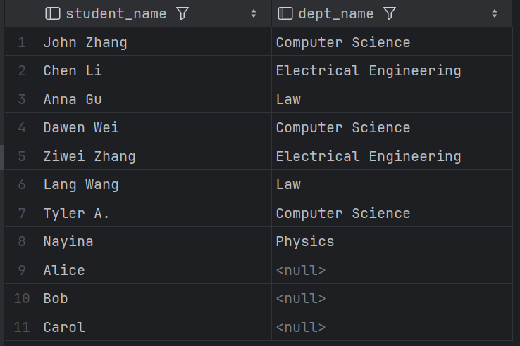


---


## 5. Right Join: All rows from the right table; unmatched left-side columns are NULL

```sql
-- Right join
SELECT s.student_name, d.dept_name
FROM student s
RIGHT JOIN department d ON s.dept_id = d.dept_id;
```

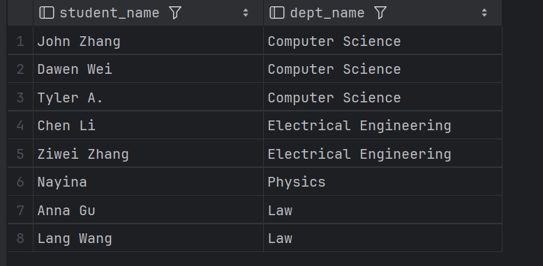


---


## 6. Full Join: every row from both tables, matching where possible; unmatched side shows NULL

```sql
-- Full Join (needs UNION keyword)
SELECT s.student_name, d.dept_name
FROM student s
LEFT JOIN department d ON s.dept_id = d.dept_id
UNION
SELECT s.student_name, d.dept_name
FROM student s
RIGHT JOIN department d ON s.dept_id = d.dept_id;
```

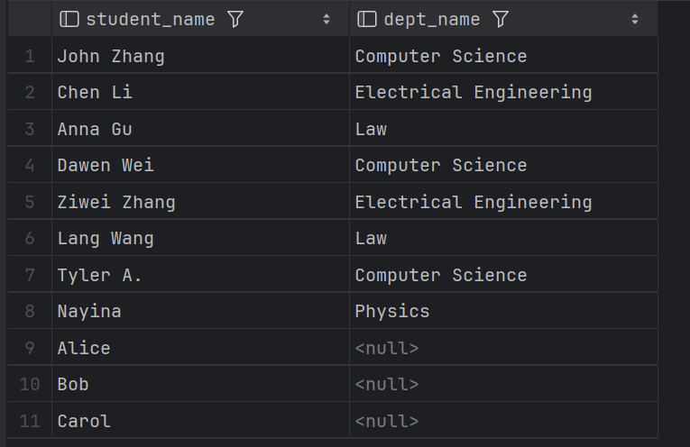


---

# Part3: Springboot Hands on

## 1. clone redbook repository and import to IntelliJ (as a maven project)
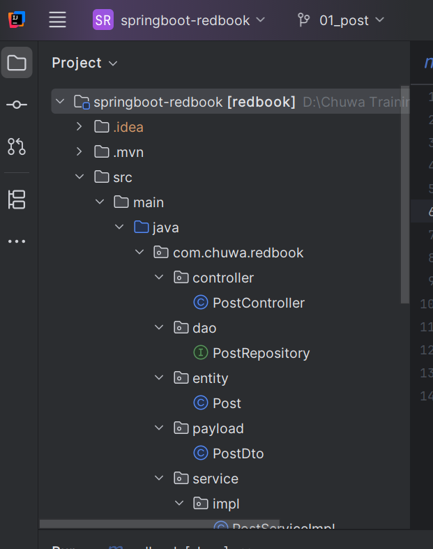
## 2. modify your application.proerties file.
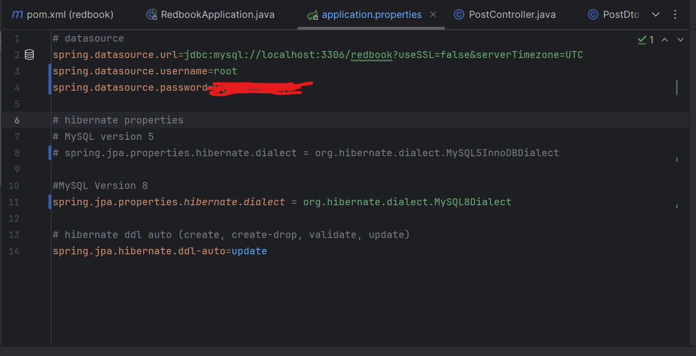
## 3. maven clean and compile.
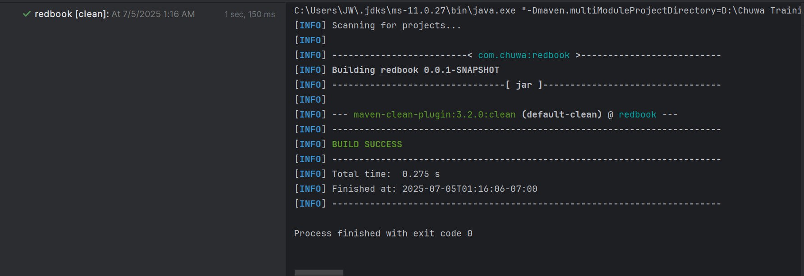
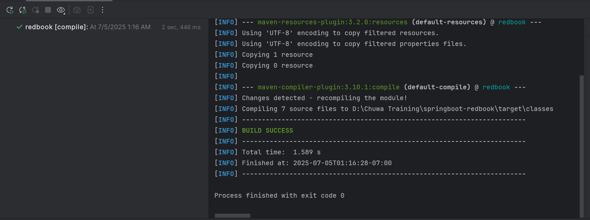
## 4. run the application. 
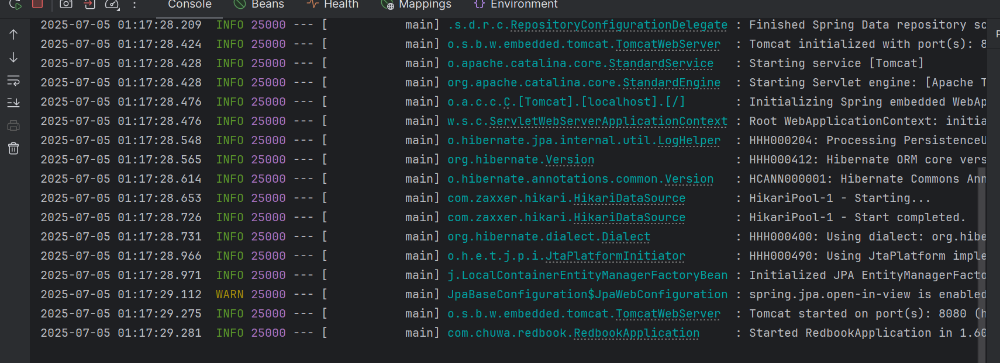
## 5. create a postman request to generate a record in database
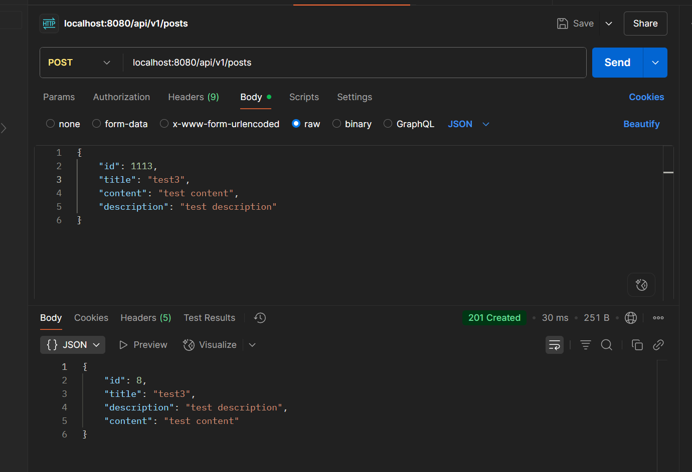
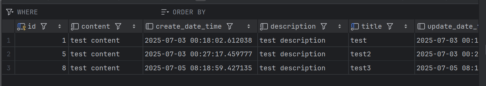

---

## Questions & Answers

### 1  Was the `POSTS` table created manually?

**Answer:** No. The table was generated automatically by **Hibernate (Spring Data JPA)** at application start‑up. Spring Boot looks at the entity class `Post` annotated with `@Entity` and, because the property:

```properties
spring.jpa.hibernate.ddl-auto=update   # or create / create-drop
```

is set in `application.properties`, Hibernate produced the DDL (`CREATE TABLE POSTS …`) for you and executed it against the configured database.

> **Can I change this behaviour?**
> Yes—set a different value for `spring.jpa.hibernate.ddl-auto`:
>
> * `none`   → Hibernate does **not** create or modify tables.
> * `create` → Drops existing schema and recreates it each run.
> * `create-drop` → Same as `create` but also drops on shutdown.
> * `update` → Tries to evolve the schema to match entities.
> * `validate` → Merely checks that the schema already matches, fails otherwise.

Alternatively, you can disable JPA DDL entirely and manage schema with Flyway/Liquibase or manual SQL.

---

### 2  Why is the `id` in the DB different from the one I sent?

In the `Post` entity the `id` field is annotated like this:

```java
@Id
@GeneratedValue(strategy = GenerationType.IDENTITY)
private Long id;
```

`@GeneratedValue` tells JPA to **ignore any value you supply** and let the database generate the primary key (commonly via an auto‑increment column). Therefore:

* The request body’s `id` is discarded (or may be `null` in typical REST usage).
* The inserted row receives the next auto‑increment value, which is what you see when you query the table.

> **How to change it?**
>
> * Remove `@GeneratedValue` (and maybe `@Id`) and control the `id` yourself.
> * Switch to `GenerationType.SEQUENCE` or `TABLE` if you need database‑agnostic IDs.
> * Use UUIDs by annotating a `String id` field with `@GeneratedValue(generator = "uuid")` plus a custom generator.

---
