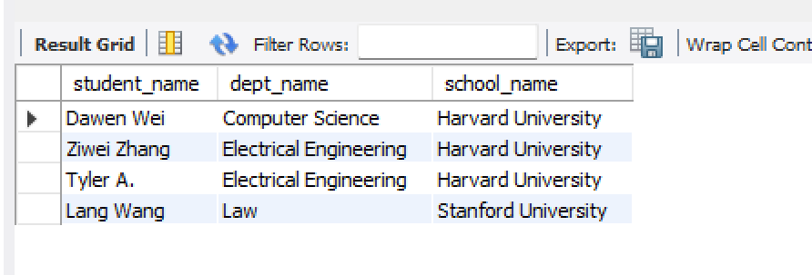

Part 1:
Please try attached SQL queries, if the query doesn't work, explain why in your mark down file. 

1. Creating the student table before the department table
Problem: The student table has a foreign key constraint referencing the department table (dept_id). In MySQL, the referenced table must exist before creating a table with a foreign key.
Solution: Create the department table first, then create the student table.
2. Creating the department table before the school table
Problem: Similarly, the department table references the school table (school_id). We must create the school table first, then the department table.
Solution: Adjust the order of table creation as follows:
Create the school table.
Create the department table.
Create the student table.
3. Inserting a department with an invalid school_id
 ```sql
INSERT INTO department VALUES (102, 'Physics', 888);
```
Problem: The school_id value 888 does not exist in the school table, violating the foreign key constraint.
Solution: Ensure that the school_id exists in the school table before inserting the department. 
4. Inserting a student with an invalid dept_id

```sql
INSERT INTO student VALUES (1002, 'Nayina', 111);
```
Problem: The dept_id value 111 does not exist in the department table. This violates the foreign key constraint.
Solution: Ensure that the dept_id exists in the department table before inserting the student. 

5. Deleting a department with existing references
```sql
DELETE FROM department WHERE dept_id = 101;
```
Problem: We cannot delete a row in the department table if it is referenced by rows in the student table due to the foreign key constraint.

6. Joining three tables
```sql
SELECT 
    s.student_name,
    d.dept_name,
    sc.school_name
FROM student s
JOIN department d ON s.dept_id = d.dept_id
JOIN school sc ON d.school_id = sc.school_id;
```
Potential Issue: If the school_id or dept_id values are missing or invalid in the respective tables, this query will not return matching rows.
Solution: Ensure that all foreign key relationships are valid and consistent across the student, department, and school tables.


Part 2:
Please try attached SQL queries (with same data and schema setup as above), explain why we need join keyword, and compare inner join, left join, right join, and full join.
Write your answers with screenshots in your markdown file. 

```sql
-- Manual 'JOIN' (NO join keyword)
SELECT 
    s.student_name,
    d.dept_name,
    sc.school_name
FROM student s, department d, school sc
WHERE 
    s.dept_id = d.dept_id
    AND d.school_id = sc.school_id;

-- Join
SELECT 
    s.student_name,
    d.dept_name,
    sc.school_name
FROM student s
JOIN department d ON s.dept_id = d.dept_id
JOIN school sc ON d.school_id = sc.school_id;
-- SAME RESULT
```



```sql
-- Manual Join: what will happen?
SELECT 
    s.student_name,
    d.dept_name,
    sc.school_name
FROM student s, department d, school sc;
```
Result:
student_name, dept_name, school_name
'Dawen Wei', 'Computer Science', 'California Institute of Technology'
'Dawen Wei', 'Electrical Engineering', 'California Institute of Technology'
'Dawen Wei', 'Law', 'California Institute of Technology'
'Dawen Wei', 'Computer Science', 'Massachusetts Institute of Technology'
'Dawen Wei', 'Electrical Engineering', 'Massachusetts Institute of Technology'
'Dawen Wei', 'Law', 'Massachusetts Institute of Technology'
'Dawen Wei', 'Computer Science', 'Stanford University'
'Dawen Wei', 'Electrical Engineering', 'Stanford University'
'Dawen Wei', 'Law', 'Stanford University'
'Dawen Wei', 'Computer Science', 'Harvard University'
'Dawen Wei', 'Electrical Engineering', 'Harvard University'
'Dawen Wei', 'Law', 'Harvard University'
'Ziwei Zhang', 'Computer Science', 'California Institute of Technology'
'Ziwei Zhang', 'Electrical Engineering', 'California Institute of Technology'
'Ziwei Zhang', 'Law', 'California Institute of Technology'
'Ziwei Zhang', 'Computer Science', 'Massachusetts Institute of Technology'
'Ziwei Zhang', 'Electrical Engineering', 'Massachusetts Institute of Technology'
'Ziwei Zhang', 'Law', 'Massachusetts Institute of Technology'
'Ziwei Zhang', 'Computer Science', 'Stanford University'
'Ziwei Zhang', 'Electrical Engineering', 'Stanford University'
'Ziwei Zhang', 'Law', 'Stanford University'
'Ziwei Zhang', 'Computer Science', 'Harvard University'
'Ziwei Zhang', 'Electrical Engineering', 'Harvard University'
'Ziwei Zhang', 'Law', 'Harvard University'
'Lang Wang', 'Computer Science', 'California Institute of Technology'
'Lang Wang', 'Electrical Engineering', 'California Institute of Technology'
'Lang Wang', 'Law', 'California Institute of Technology'
'Lang Wang', 'Computer Science', 'Massachusetts Institute of Technology'
'Lang Wang', 'Electrical Engineering', 'Massachusetts Institute of Technology'
'Lang Wang', 'Law', 'Massachusetts Institute of Technology'
'Lang Wang', 'Computer Science', 'Stanford University'
'Lang Wang', 'Electrical Engineering', 'Stanford University'
'Lang Wang', 'Law', 'Stanford University'
'Lang Wang', 'Computer Science', 'Harvard University'
'Lang Wang', 'Electrical Engineering', 'Harvard University'
'Lang Wang', 'Law', 'Harvard University'
'Tyler A.', 'Computer Science', 'California Institute of Technology'
'Tyler A.', 'Electrical Engineering', 'California Institute of Technology'
'Tyler A.', 'Law', 'California Institute of Technology'
'Tyler A.', 'Computer Science', 'Massachusetts Institute of Technology'
'Tyler A.', 'Electrical Engineering', 'Massachusetts Institute of Technology'
'Tyler A.', 'Law', 'Massachusetts Institute of Technology'
'Tyler A.', 'Computer Science', 'Stanford University'
'Tyler A.', 'Electrical Engineering', 'Stanford University'
'Tyler A.', 'Law', 'Stanford University'
'Tyler A.', 'Computer Science', 'Harvard University'
'Tyler A.', 'Electrical Engineering', 'Harvard University'
'Tyler A.', 'Law', 'Harvard University'
'Alice', 'Computer Science', 'California Institute of Technology'
'Alice', 'Electrical Engineering', 'California Institute of Technology'
'Alice', 'Law', 'California Institute of Technology'
'Alice', 'Computer Science', 'Massachusetts Institute of Technology'
'Alice', 'Electrical Engineering', 'Massachusetts Institute of Technology'
'Alice', 'Law', 'Massachusetts Institute of Technology'
'Alice', 'Computer Science', 'Stanford University'
'Alice', 'Electrical Engineering', 'Stanford University'
'Alice', 'Law', 'Stanford University'
'Alice', 'Computer Science', 'Harvard University'
'Alice', 'Electrical Engineering', 'Harvard University'
'Alice', 'Law', 'Harvard University'
'Bob', 'Computer Science', 'California Institute of Technology'
'Bob', 'Electrical Engineering', 'California Institute of Technology'
'Bob', 'Law', 'California Institute of Technology'
'Bob', 'Computer Science', 'Massachusetts Institute of Technology'
'Bob', 'Electrical Engineering', 'Massachusetts Institute of Technology'
'Bob', 'Law', 'Massachusetts Institute of Technology'
'Bob', 'Computer Science', 'Stanford University'
'Bob', 'Electrical Engineering', 'Stanford University'
'Bob', 'Law', 'Stanford University'
'Bob', 'Computer Science', 'Harvard University'
'Bob', 'Electrical Engineering', 'Harvard University'
'Bob', 'Law', 'Harvard University'
'Carol', 'Computer Science', 'California Institute of Technology'
'Carol', 'Electrical Engineering', 'California Institute of Technology'
'Carol', 'Law', 'California Institute of Technology'
'Carol', 'Computer Science', 'Massachusetts Institute of Technology'
'Carol', 'Electrical Engineering', 'Massachusetts Institute of Technology'
'Carol', 'Law', 'Massachusetts Institute of Technology'
'Carol', 'Computer Science', 'Stanford University'
'Carol', 'Electrical Engineering', 'Stanford University'
'Carol', 'Law', 'Stanford University'
'Carol', 'Computer Science', 'Harvard University'
'Carol', 'Electrical Engineering', 'Harvard University'
'Carol', 'Law', 'Harvard University'

If I correct the Manual join code 
```sql
-- Manual Join: what will happen?
SELECT 
    s.student_name,
    d.dept_name,
    sc.school_name
FROM student s, department d, school sc
WHERE 
    s.dept_id = d.dept_id
    AND d.school_id = sc.school_id;
```

# student_name, dept_name, school_name
'Dawen Wei', 'Computer Science', 'Harvard University'
'Ziwei Zhang', 'Electrical Engineering', 'Harvard University'
'Tyler A.', 'Electrical Engineering', 'Harvard University'
'Lang Wang', 'Law', 'Stanford University'

```sql
-- With Join: compare results with above manual join
SELECT 
    s.student_name,
    d.dept_name,
    sc.school_name
FROM student s
JOIN department d ON s.dept_id = d.dept_id
JOIN school sc ON d.school_id = sc.school_id;

```
# student_name, dept_name, school_name
'Dawen Wei', 'Computer Science', 'Harvard University'
'Ziwei Zhang', 'Electrical Engineering', 'Harvard University'
'Tyler A.', 'Electrical Engineering', 'Harvard University'
'Lang Wang', 'Law', 'Stanford University'

Seems like no difference

```sql
-- Inner Join
SELECT *
FROM student s
JOIN department d ON s.dept_id = d.dept_id;
```
# student_id, student_name, birth_date, dept_id, gender, dept_id, dept_name, building, school_id
'1001', 'Dawen Wei', '2001-05-01', '101', 'Male', '101', 'Computer Science', 'Information Hall', '1'
'1002', 'Ziwei Zhang', '2002-08-12', '102', 'Female', '102', 'Electrical Engineering', 'Main Building A', '1'
'1004', 'Tyler A.', '2002-08-12', '102', 'Female', '102', 'Electrical Engineering', 'Main Building A', '1'
'1003', 'Lang Wang', '2000-11-21', '201', 'Female', '201', 'Law', 'Law School Building', '2'

```sql
-- Left Join
SELECT s.student_name, d.dept_name
FROM student s
LEFT JOIN department d ON s.dept_id = d.dept_id;

```
# student_name, dept_name
'Dawen Wei', 'Computer Science'
'Ziwei Zhang', 'Electrical Engineering'
'Lang Wang', 'Law'
'Tyler A.', 'Electrical Engineering'
'Alice', NULL
'Bob', NULL
'Carol', NULL

```sql
-- Right join
SELECT s.student_name, d.dept_name
FROM student s
RIGHT JOIN department d ON s.dept_id = d.dept_id;
```
# student_name, dept_name
'Dawen Wei', 'Computer Science'
'Ziwei Zhang', 'Electrical Engineering'
'Tyler A.', 'Electrical Engineering'
'Lang Wang', 'Law'

```sql
-- Full Join (needs UNION keyword)
SELECT s.student_name, d.dept_name
FROM student s
LEFT JOIN department d ON s.dept_id = d.dept_id
UNION
SELECT s.student_name, d.dept_name
FROM student s
RIGHT JOIN department d ON s.dept_id = d.dept_id;
```
# student_name, dept_name
'Dawen Wei', 'Computer Science'
'Ziwei Zhang', 'Electrical Engineering'
'Lang Wang', 'Law'
'Tyler A.', 'Electrical Engineering'
'Alice', NULL
'Bob', NULL
'Carol', NULL


Part 3:
Hands on:
1. clone redbook repository and import to IntelliJ (as a maven project)
2. modify your application.proerties file.
3. maven clean and compile.
4. run the application. 
5. create a postman request to generate a record in database
 
take screenshots for hands on tasks, in your markdown file and answer following questions in your markdown.
 

 
Questions:
1. Did you create the table POSTS in the database? if not, who did it for you? Can I change this behavior? (Hint: look at the application.properties file)
No， it was created automatically by Hibernate, the default ORM used in SpringBoot. Hibernate generates the database schema based on the entity classes and their annotations. This behavior is controlled by the `spring.jpa.hibernate.ddl-auto` property in  `application.properties` file.
Yes, we can control how Hibernate manages the database schema by modifying the `spring.jpa.hibernate.ddl-auto` property to `create`, `create-drop`, `update`, `validate`,`none`.

2. Is your id in the database same as what you set in your request? why does this happen? (Hint: search the annotations used in your code)
 
No, the ID in the database is not the same as the one set in the request because the Post entity uses the `@GeneratedValue(strategy = GenerationType.IDENTITY)` annotation. This annotation instructs Hibernate to automatically generate the ID, typically using the database's auto-increment feature. As a result, I did not manually set the post ID.

If I want to manually set the ID, I would need to remove the `@GeneratedValue` annotation. However, doing so is generally not recommended, as it can lead to ID conflicts or errors if duplicate IDs are provided. Allowing Hibernate to manage ID generation ensures consistency and avoids such issues.