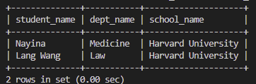
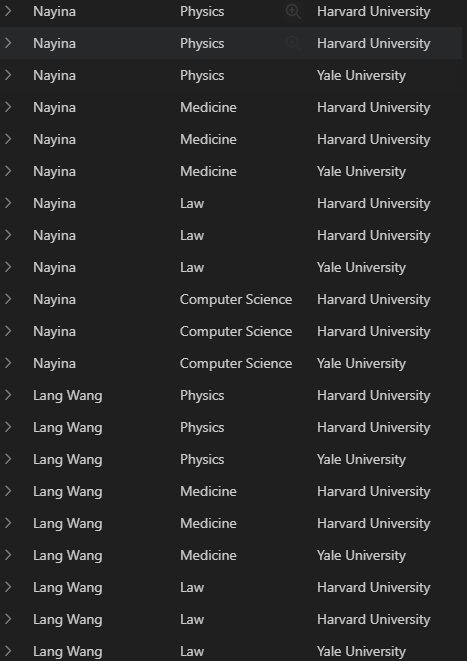
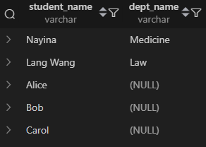
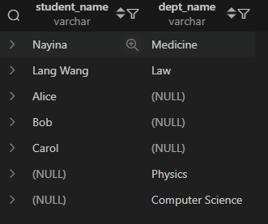
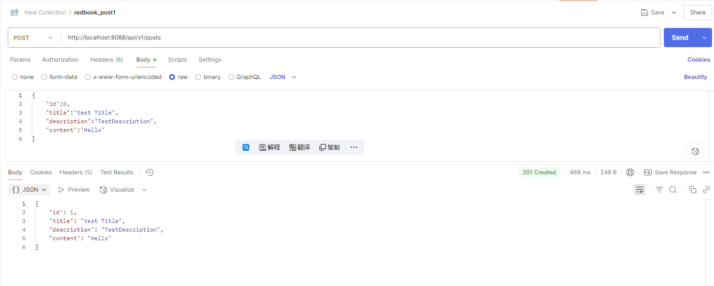
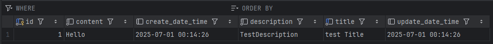

# Part 1: Referential Integrity

Please try attached SQL queries, if the query doesn't work, explain why in your mark down file.

## 1. Create tables before insert
In the SQL_Referential_Integrity.sql, before we start, we should select a Database use a query like:

```sql
USE test;
```

When we execute the first query

```sql
CREATE TABLE student (
    student_id INT PRIMARY KEY,
    student_name VARCHAR(100) NOT NULL,
    gender ENUM('Male', 'Female') NOT NULL,
    birth_date DATE,
    dept_id INT,
    FOREIGN KEY (dept_id) REFERENCES department(dept_id)
);
```

It will have error:

```
ERROR 1005 (HY000): Can't create table `test`.`student` (errno: 150 "Foreign key constraint is incorrectly formed")
```

That's because the table that in the foreignkey doesn't exist. We can't refer to a table that doesn't exist. so we should execute 4th query to create Department table.

But to create department table, because it has a foreign key to school table, we must execute 3rd query to create school table first.


So the correct order is:

1. Create school table first.

2. Create department table next.

3. Create student table last.

4. Insert data after tables are created.

## 2. Insert data that the foreign key refers to before inserting it

when Inserting data, like the second query in SQL_Referential_Integrity.sql:

```sql
INSERT INTO student (student_id, student_name, gender, birth_date, dept_id)
VALUES 
(1001, 'John Zhang', 'Male', '2001-05-01', 101),
(1002, 'Lisa Li', 'Female', '2002-08-12', 102),
(1003, 'Kevin Wang', 'Male', '2000-11-21', 201);
```

We also need  to insert the corresponding depertment data into depertment table first.

The same thing happens when executing 6th query that insert into department dable: we must first insert into school table.

So we add these lines to create schools:
```sql
INSERT INTO school VALUES (1, 'Harvard University', 'Cambridge', 1636),(2, 'Harvard University', 'Williamsburg', 1693);
```
Then we can do these 2 queries normally:

```sql
-- Insert data to department table --
INSERT INTO department (dept_id, dept_name, building, school_id)
VALUES 
(101, 'Computer Science', 'Information Hall', 1),
(102, 'Electrical Engineering', 'Main Building A', 1),
(201, 'Law', 'Law School Building', 2);
```

```sql
-- Insert Student Records --
INSERT INTO student (student_id, student_name, gender, birth_date, dept_id)
VALUES 
(1001, 'John Zhang', 'Male', '2001-05-01', 101),
(1002, 'Lisa Li', 'Female', '2002-08-12', 102),
(1003, 'Kevin Wang', 'Male', '2000-11-21', 201);
```
## 3. Allow modifying data if primary keys conflict

But this query can't be executed, since the student IDs are repeated with the data that already in the table, and the department of ID 666 is not created.

```sql
INSERT INTO student (student_id, student_name, gender, birth_date, dept_id)
VALUES 
(1001, 'Dawen Wei', 'Male', '2001-05-01', 101),
(1002, 'Ziwei Zhang', 'Female', '2002-08-12', 102),
(1003, 'Lang Wang', 'Female', '2000-11-21', 201),
(1002, 'Tyler A.', 'Female', '2002-08-12', 666);
```

To correct this, first, we insert department 666:

```sql
INSERT INTO department (dept_id, dept_name, building, school_id)
VALUES 
(666, 'Computer Science', 'Engineer School', 2);
```

And change the INSERT statement to allow us to modify rows if the primary key is duplicated:

```sql
-- Insert data to student table (override)--
INSERT INTO student (student_id, student_name, gender, birth_date, dept_id)
VALUES 
(1001, 'Dawen Wei', 'Male', '2001-05-01', 101),
(1002, 'Ziwei Zhang', 'Female', '2002-08-12', 102),
(1003, 'Lang Wang', 'Female', '2000-11-21', 201),
(1002, 'Tyler A.', 'Female', '2002-08-12', 666)
ON DUPLICATE KEY UPDATE
student_name = VALUES(student_name),
gender = VALUES(gender),
birth_date = VALUES(birth_date),
dept_id = VALUES(dept_id);
```

Finally there would be 3 rows in the table since the student with ID 1002 is duplicated within the same statement. It would update it to 'Ziwei Zhang' and then 'Tyler A.'.

## 4. Specify column name if value count less than column count

When we executing this line:

```sql
-- Insert to department
INSERT INTO department VALUES (102, 'Physics', 888);
```
because the table has 4 columns, and only 3 values are provided, we have error: `Column count doesn't match value count at row 1`.

In this case, if we don't specify column name, mySQL don't know which value correspond to which column. We can either specify the `building` field to NULL, or specify the column names:

```sql
INSERT INTO department VALUES (102, 'Physics', NULL, 888);
```

or

```sql
INSERT INTO department (dept_id, dept_name, school_id) VALUES (102, 'Physics', 888);
```

and because the primary key 102 already exists, we need to allow update:

```sql

INSERT INTO department (dept_id, dept_name, school_id) VALUES (102, 'Physics', 888)
ON DUPLICATE KEY UPDATE
dept_name = VALUES(dept_name),
school_id = VALUES(school_id);
```

For the next statement:
```sql
INSERT INTO student VALUES (1002, 'Nayina', 111);
```

Because its department 111 does not exist and the ID 1002 duplicate, we create depqrtment with ID 111:

```sql
INSERT INTO department VALUES (111, 'Medicine', 'Biology building', 1);
```

And add words to  allow duplicate:

```sql
INSERT INTO student (student_id, student_name, dept_id) VALUES (1002, 'Nayina', 111)
ON DUPLICATE KEY UPDATE
student_name = VALUES(student_name),
dept_id = VALUES(dept_id);
```

## 5. Foreign key constraint

The statement:
```sql
DELETE FROM department WHERE dept_id = 101;
```

fails to execute because the department with `dept_id` 101 has foreign key constraint. To solve this, we can either delete the students that refer to this department by 
```sql
DELETE FROM student WHERE dept_id = 101;
DELETE FROM department WHERE dept_id = 101;
```


Or we can change the foreign key setting of student table to automatically manage the future deletes:

In MySQL, the `ON DELETE` clause in a foreign key constraint determines what happens to child rows when the corresponding parent row is deleted.<br>在 MySQL 中，外键约束中的 `ON DELETE`子句确定删除相应的父行时子行会发生什么情况。

1. `CASCADE`: When a row in the parent table is deleted, all related rows in the child table are also automatically deleted.
`CASCADE`：删除父表中的一行时，子表中的所有相关行也会自动删除。


2. `SET NULL`: When a row in the parent table is deleted, the foreign key column(s) in the child table referencing the parent row are set to NULL.
`SET NULL`：删除父表中的行时，子表中引用父行的外键列将设置为 NULL。


3. `RESTRICT`: Prevents the deletion of a parent row if there are any related rows in the child table that reference it.
`RESTRICT`：如果子表中有任何引用父行的相关行，则阻止删除父行。

We can drop and recreate the student table with: 

```sql
FOREIGN KEY (dept_id) REFERENCES department(dept_id) ON DELETE CASCADE
```

The last select statement is executed successfully:




# Pare 2. Try different JOIN query

Please try attached SQL queries (with same data and schema setup as above), explain why we need join keyword, and compare inner join, left join, right join, and full join. Write your answers with screenshots in your markdown file. 


In SQL, joins are used to combine rows from two or more tables based on a related column between them.
在 SQL 中，联接用于根据两个或多个表之间的相关列来合并它们中的行。

Here's a breakdown of the differences between INNER JOIN, LEFT JOIN, RIGHT JOIN, and FULL JOIN:
以下是 INNER JOIN、LEFT JOIN、RIGHT JOIN 和 FULL JOIN 之间差异的细分：
### 1. INNER JOIN
Returns only rows with matching values in both tables. This is the default join type.
仅返回两个表中具有匹配值的行。这是默认的联接类型。

For the first 2 statements, they are inner joins and have same output:

```sql
-- Manual 'JOIN' (NO join keyword)
SELECT 
    s.student_name,
    d.dept_name,
    sc.school_name
FROM student s, department d, school sc
WHERE 
    s.dept_id = d.dept_id
    AND d.school_id = sc.school_id;
-- Join
SELECT 
    s.student_name,
    d.dept_name,
    sc.school_name
FROM student s
JOIN department d ON s.dept_id = d.dept_id
JOIN school sc ON d.school_id = sc.school_id;
```

Output:


```sql
-- Inner Join
SELECT *
FROM student s
JOIN department d ON s.dept_id = d.dept_id;
```
Output:


But if we use implicit joins (comma syntax) with no WHERE conditions, we would get a lot repeated result.

```sql
SELECT 
    s.student_name,
    d.dept_name,
    sc.school_name
FROM student s, department d, school sc;
```



The number of samples is Cartesian product.

What is Cartesian product (笛卡尔乘积):

If:

`student` has m rows,

`department` has n rows,

`school` has p rows,

then: `Total rows returned = m * n * p`
because each row in `student` is paired with every row in `department` and every row in `school`.


### 2. LEFT JOIN (LEFT OUTER JOIN)

Returns all rows from the left table and matching rows from the right table. If no match exists in the right table, NULLs are returned for right table columns.
返回左表中的所有行和右表中的匹配行。如果右表中不存在匹配项，则为右表列返回 NULL。

```sql
-- Left Join
SELECT s.student_name, d.dept_name
FROM student s
LEFT JOIN department d ON s.dept_id = d.dept_id;
```



### 3. RIGHT JOIN (RIGHT OUTER JOIN)
Returns all rows from the right table and matching rows from the left table. If no match exists in the left table, NULLs are returned for left table columns.
返回右表中的所有行和左表中的匹配行。如果左表中不存在匹配项，则为左表列返回 NULL。

```sql
-- Right join
SELECT s.student_name, d.dept_name
FROM student s
RIGHT JOIN department d ON s.dept_id = d.dept_id;
```


### 4. FULL JOIN (FULL OUTER JOIN)

Returns all rows when there is a match in either table. It combines the results of LEFT and RIGHT joins. If there is no match, NULLs are used for columns from the table without a match.
当任一表中存在匹配项时，返回所有行。它结合了 LEFT 和 RIGHT 联接的结果。如果没有匹配项，则 NULL 将用于表中没有匹配项的列。

```sql
-- Full Join (needs UNION keyword)
SELECT s.student_name, d.dept_name
FROM student s
LEFT JOIN department d ON s.dept_id = d.dept_id
UNION
SELECT s.student_name, d.dept_name
FROM student s
RIGHT JOIN department d ON s.dept_id = d.dept_id;
```




These joins can be visualized using Venn diagrams: INNER JOIN shows the intersection, LEFT JOIN shows the left circle and intersection, RIGHT JOIN shows the right circle and intersection, and FULL JOIN shows both circles completely.
这些连接可以使用维恩图进行可视化：INNER JOIN 显示交点，LEFT JOIN 显示左圆和交点，RIGHT JOIN 显示右圆和交点，FULL JOIN 完整显示两个圆。

The choice of join depends on the desired outcome: INNER JOIN for shared data, LEFT/RIGHT JOIN for all data from one table plus matching data from the other, and FULL JOIN to see all data from both tables.
联接的选择取决于所需的结果：INNER JOIN 用于共享数据，LEFT/RIGHT JOIN 用于一个表中的所有数据以及另一个表中的匹配数据，以及 FULL JOIN 用于查看两个表中的所有数据。


# Part 3. Hands on:
1. clone redbook repository and import to IntelliJ (as a maven project)
2. modify your application.proerties file.
3. maven clean and compile.
4. run the application. 
5. create a postman request to generate a record in database

take screenshots for hands on tasks, in your markdown file and answer following questions in your markdown.

Postman:


Backend Intellij:


**Questions:**
## 1. Did you create the table POSTS in the database? if not, who did it for you? Can I change this behavior? (Hint: look at the application.properties file)

I did not manually create the POSTS table in the database.

✅ It was automatically created by Spring Boot + JPA/Hibernate when I ran my application.

This behavior is controlled in application.properties (or application.yml) file with the property: 

`spring.jpa.hibernate.ddl-auto=update`


Common values:

- `create` – Drops and recreates tables each time.

- `create-drop` – Same as create, but drops tables on app shutdown.

- `update` – Updates schema to match your entities without data loss.

- `validate` – Validates schema matches your entities, throws error if not.

- `none` – Does nothing.

We can change this behavior:

- To stop automatic table creation, set:

```java
spring.jpa.hibernate.ddl-auto=none
```
- To allow automatic creation, set:

```
spring.jpa.hibernate.ddl-auto=create
```
Or
```
spring.jpa.hibernate.ddl-auto=update
```

To stop automatic table creation, set:

## 2. Is your id in the database same as what you set in your request? why does this happen? (Hint: search the annotations used in your code)

No, they are not the same. I set my post id to 0 in Postman, however it became 1 in the table.

Mt id field is auto-generated by the database (auto-increment primary key) and by JPA.

In entity class (likely Post.java):

```java
@Id
@GeneratedValue(strategy = GenerationType.IDENTITY)
private Long id;
```

The `@Id` annotation marks it as the primary key.

The `@GeneratedValue(strategy = GenerationType.IDENTITY)` annotation tells JPA to **let the database handle** `id` **generation** (typically using `AUTO_INCREMENT` in MySQL/Postgres).

Therefore:

Even if I send `id: 0` in my request, JPA ignores my input for `id`.

The database **generates the next value** (1, 2, etc.) automatically.

If we want to use our provided id, we would need to:

Remove `@GeneratedValue` from my entity,

Or switch to GenerationType.AUTO with manual id management,

but this is not recommended unless we have a strong reason, as auto-generated IDs are best practice in most CRUD APIs.


