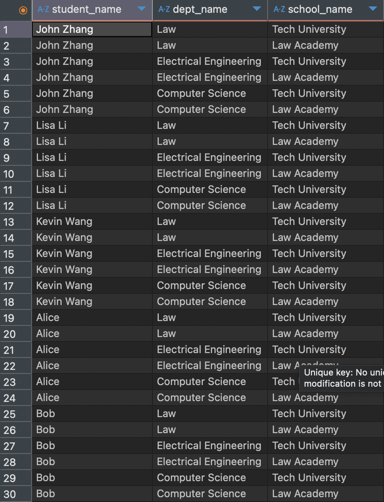
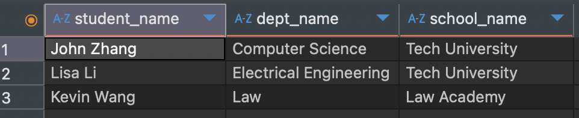
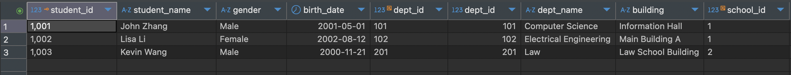
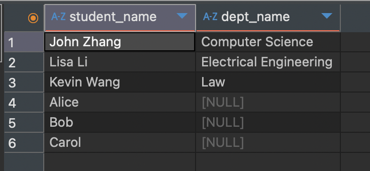
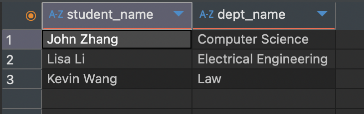
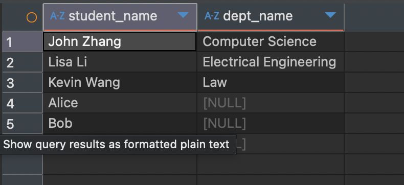

## HW 8

### Part 1
Please try attached SQL queries, if the query doesn't work, explain why in your mark down file. (Please note this SQL file is NOT supposed to run as a whole.)

**Issues:**
1. should create and select a new db before creating a new table 
```sql
CREATE DATABASE chuwa_uni_db;
USE chuwa_uni_db;
```
2. student, department, school table have dependent relationship, should create in the right order school -> department -> student 
3. `dept_id` value in the `student` table that does not exist in the referenced `department` table, should insert data to department table first 
```sql
-- Insert Student Records --
INSERT INTO student (student_id, student_name, gender, birth_date, dept_id)
VALUES 
(1001, 'John Zhang', 'Male', '2001-05-01', 101),
(1002, 'Lisa Li', 'Female', '2002-08-12', 102),
(1003, 'Kevin Wang', 'Male', '2000-11-21', 201);
```
5. duplicate primary key (e.g. 1001, 1002)
```sql
-- Insert data to student table --
INSERT INTO student (student_id, student_name, gender, birth_date, dept_id)
VALUES 
(1001, 'Dawen Wei', 'Male', '2001-05-01', 101),
(1002, 'Ziwei Zhang', 'Female', '2002-08-12', 102),
(1003, 'Lang Wang', 'Female', '2000-11-21', 201),
(1002, 'Tyler A.', 'Female', '2002-08-12', 666);
```

5. should insert data into school table first for department table reference, e.g.:
```sql 
-- Insert data into school table first --
INSERT INTO school (school_id, school_name, city, established_year)
VALUES
(1, 'Tech University', 'New York', 1985),
(2, 'Law Academy', 'Chicago', 1970);

INSERT INTO department (dept_id, dept_name, building, school_id)
VALUES 
(101, 'Computer Science', 'Information Hall', 1),
(102, 'Electrical Engineering', 'Main Building A', 1),
(201, 'Law', 'Law School Building', 2);
```

6. column count doesn't match value count 
```sql
-- Insert to department
INSERT INTO department VALUES (102, 'Physics', 888);

-- Insert to student
INSERT INTO student VALUES (1002, 'Nayina', 111);
```

7. cannot delete a parent row, because student table has reference to department table using this value
```sql 
-- Delete a department
DELETE FROM department WHERE dept_id = 101;
```

---
### Part 2
   - Please try attached SQL queries (with same data and schema setup as above)
   - explain why we need join keyword, and compare inner join, left join, right join, and full join.
   - Write your answers with screenshots in your markdown file. 

#### 1. comparing manual join with JOIN keywords
   -  explicit JOIN syntax is more readable and maintainable, especially with multiple joins
   -  encourages clearer logic separation (join conditions vs. filter conditions)

#### 2. Manual Join: what will happen?
```sql 
SELECT 
    s.student_name,
    d.dept_name,
    sc.school_name
FROM student s, department d, school sc;
```

- This is an equivalent of cross join. 
- That means: 
  - every row from student will be combined with every row from department.
  - Then, each of those combinations will be combined with every row from school.
```sql
-- With Join: compare results with above manual join
SELECT 
    s.student_name,
    d.dept_name,
    sc.school_name
FROM student s
JOIN department d ON s.dept_id = d.dept_id
JOIN school sc ON d.school_id = sc.school_id;
```

- This is the expected result.

#### 3. inner join 
```sql
-- Inner Join
SELECT *
FROM student s
JOIN department d ON s.dept_id = d.dept_id;
```

- Returns only matching rows between both tables based on the join condition. Non-matching rows are excluded.

- Use when only common data is needed.


#### 4. left join 
```sql
-- Left Join
SELECT s.student_name, d.dept_name
FROM student s
LEFT JOIN department d ON s.dept_id = d.dept_id;
```

- LEFT JOIN (or LEFT OUTER JOIN): Returns all rows from the left table, and matching rows from the right. If no match, NULLs are returned for right table columns.

- Use when all data from the left side is required regardless of matches.
- If the left side has multiple matches, each match will produce a separate row in the result set

#### 5. Right join 
```sql
-- Right join
SELECT s.student_name, d.dept_name
FROM student s
RIGHT JOIN department d ON s.dept_id = d.dept_id;
```

- RIGHT JOIN (or RIGHT OUTER JOIN): Opposite of LEFT JOIN. Returns all rows from the right table and matching ones from the left.

- Useful when the right table’s data is prioritized.

#### 6. Full join 
```sql
-- Full Join (needs UNION keyword)
SELECT s.student_name, d.dept_name
FROM student s
LEFT JOIN department d ON s.dept_id = d.dept_id
UNION
SELECT s.student_name, d.dept_name
FROM student s
RIGHT JOIN department d ON s.dept_id = d.dept_id;
```

- FULL JOIN (or FULL OUTER JOIN): Returns all rows from both tables. Matches where possible, fills NULLs where no match exists.

- MySQL doesn’t support FULL JOIN natively — workarounds use UNION of LEFT and RIGHT JOINs.
- It combines the result sets of two or more SELECT queries. Then it removes duplicate rows from the combined result.