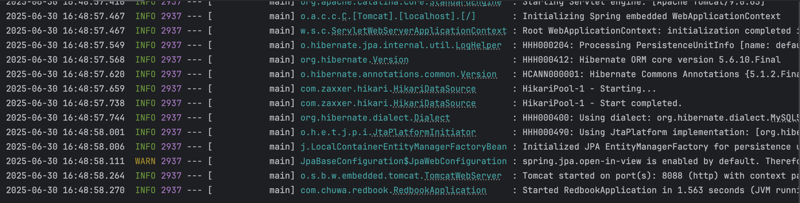
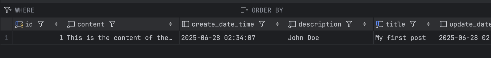

## HW 8 - Part 3

Hands on:
1. clone redbook repository and import to IntelliJ (as a maven project)
2. modify your application.proerties file.
3. maven clean and compile.
4. run the application. 
5. create a postman request to generate a record in database
 
take screenshots for hands on tasks, in your markdown file and answer following questions in your markdown.

### Screenshots:
- successfully run the application

- generate a record in database 



 
### Questions:
1. Did you create the table POSTS in the database? if not, who did it for you? Can I change this behavior? (Hint: look at the application.properties file)
   - I did not manually create the POSTS table in the database. Spring Boot created it automatically through JPA/Hibernate.
   - `spring.jpa.hibernate.ddl-auto=update` This setting tells Hibernate to automatically manage the database schema. 
   - Yes, you can change this behavior. Other options:
     - `create` Drops and recreates tables every time the app starts
     - `create-drop` Creates tables on startup, drops them on shutdown
     - `validate` No automatic changes - just validates that your entities match the existing database schema
     - `none` (or remove the property) Completely disables automatic schema management
    
2. Is your id in the database same as what you set in your request? why does this happen? (Hint: search the annotations used in your code)
   - The ID in the database is NOT the same as what I set in my request.
   - In Post entity, we have:
```java
@Id
@GeneratedValue(strategy = GenerationType.IDENTITY)
private Long id;
```
This configuration means:
- @`GeneratedValue`: The database will automatically generate the ID value
- `GenerationType.IDENTITY`: Uses the database's auto-increment feature
- the request ID is ignored/overwritten
