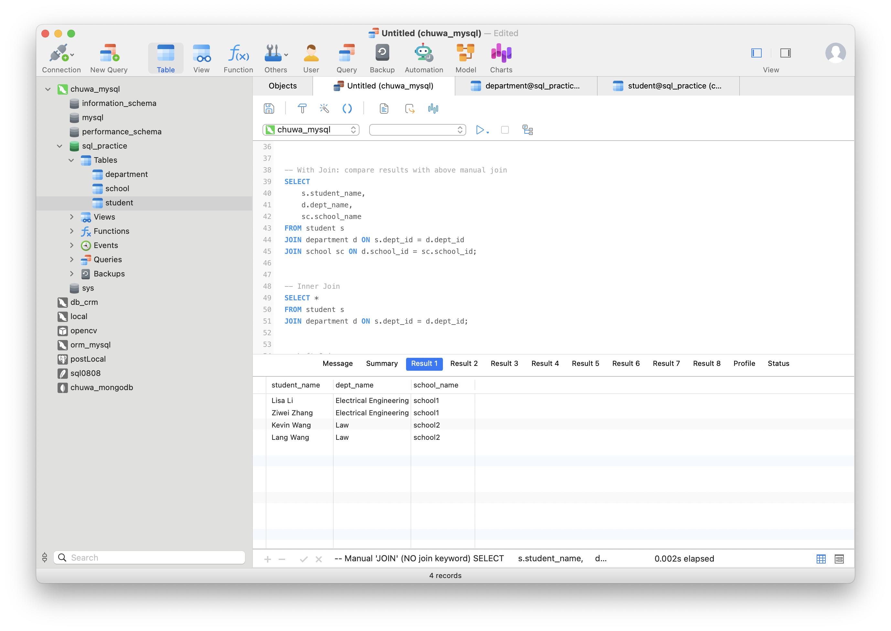
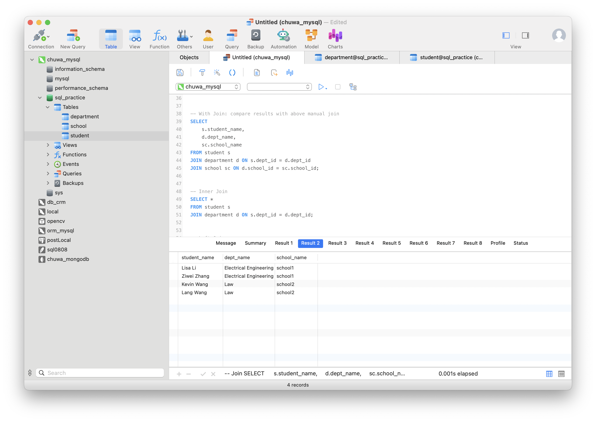
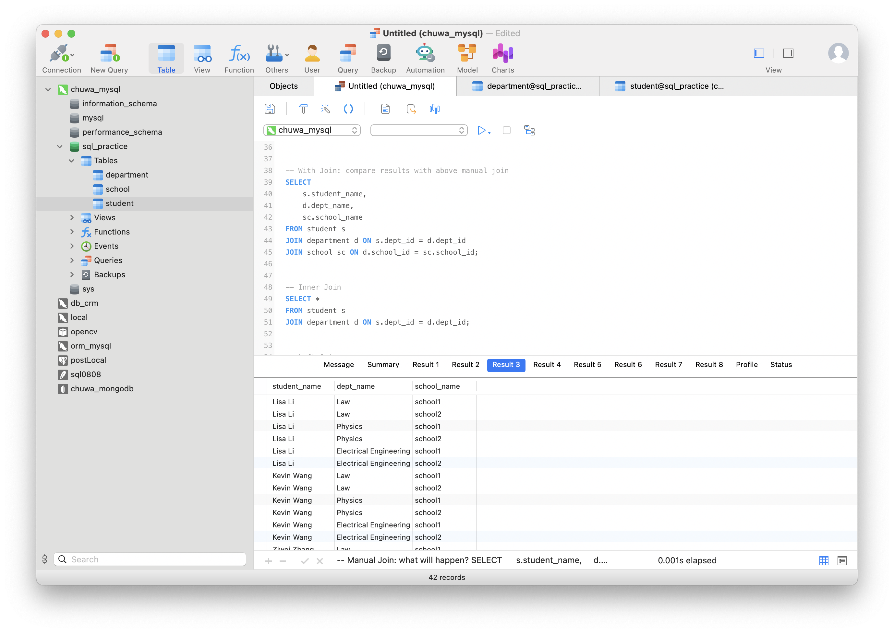
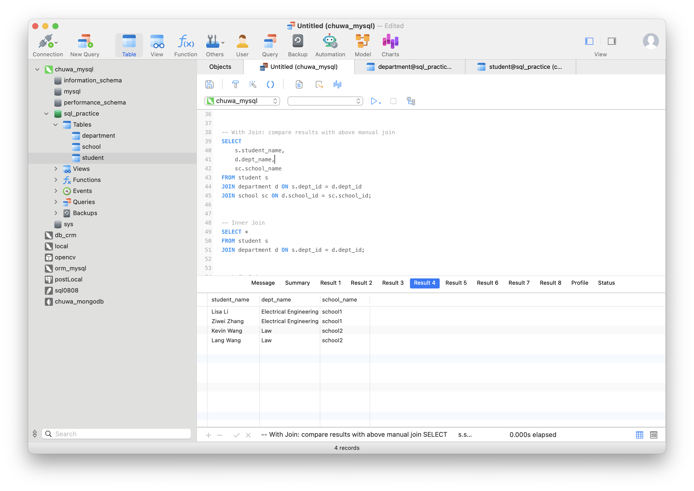
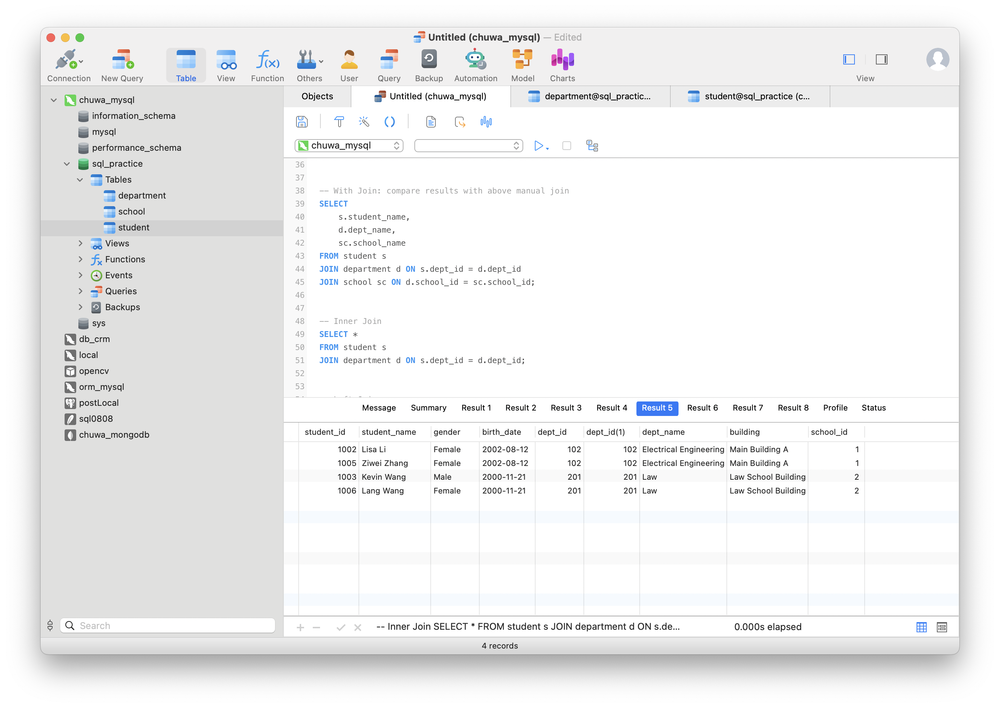
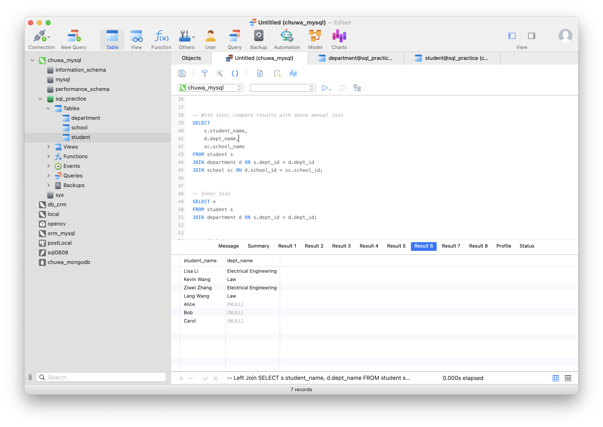
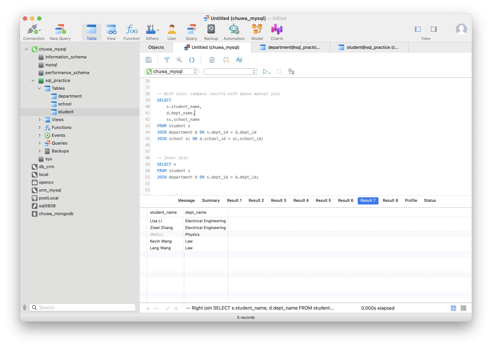
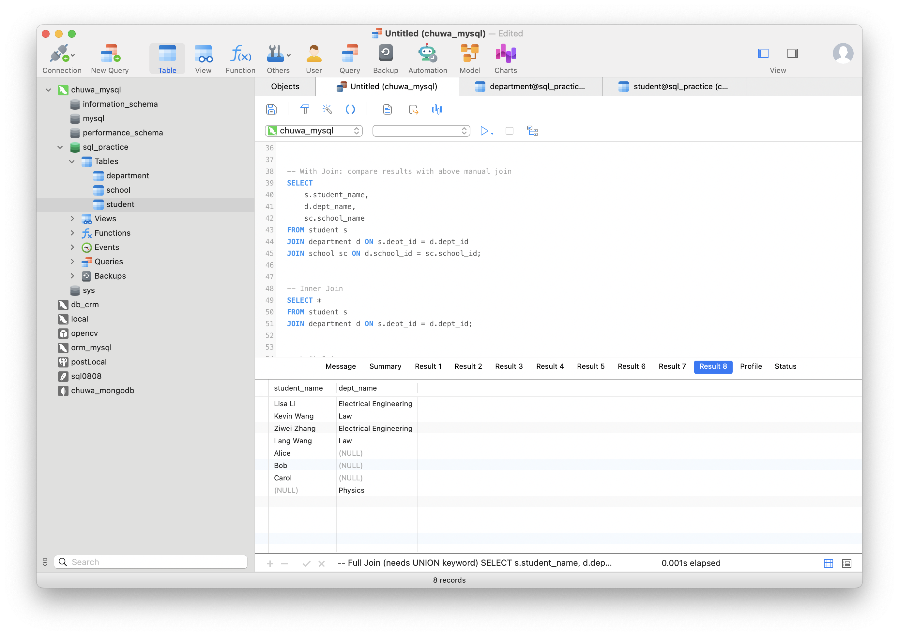
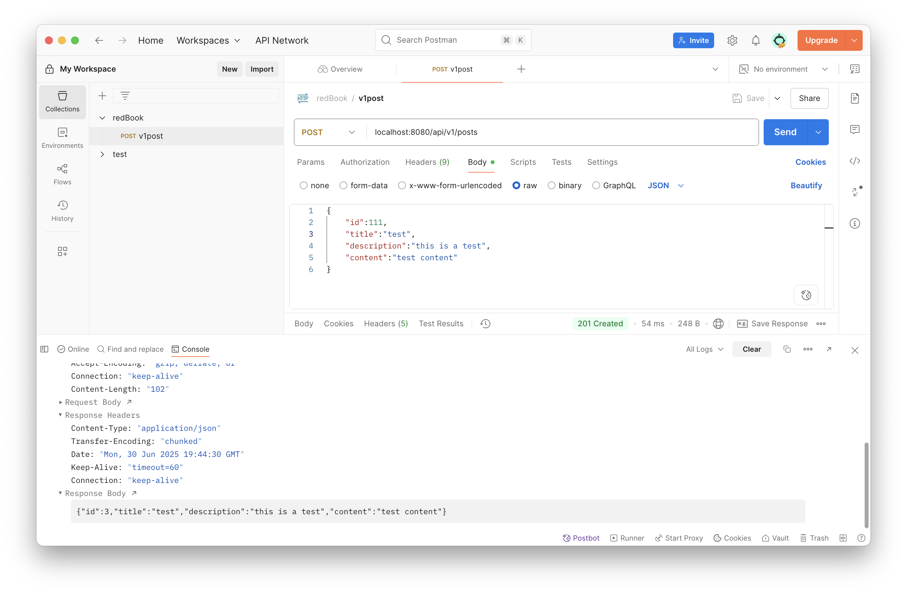

# HW8

## Part 1
- error 1 Failed to open the referenced table 'department'
- need to establish the reference table first
------
- error 2 Cannot add or update a child row: a foreign key constraint fails (`sql_practice`.`student`, CONSTRAINT `student_ibfk_1` FOREIGN KEY (`dept_id`) REFERENCES `department` (`dept_id`))
- still reference problem, we need to insert data to reference first
------
- error 3 INSERT INTO department VALUES (102, 'Physics', 888) > 1136 - Column count doesn't match value count at row 1
- dep table has 3 values – but your department table has 4 columns (dept_id, dept_name, building, school_id).
- The third value '888' is being inserted as the building, and school_id is missing, violating the schema and foreign key constraint.
- Also, school_id = 888 does not exist in the school table, so it would violate the foreign key constraint even if you provided the fourth column.
------
- error 4 -- Insert data to student table --
  INSERT INTO student (student_id, student_name, gender, birth_date, dept_id)
  VALUES
  (1001, 'Dawen Wei', 'Male', '2001-05-01', 101),
  (1002, 'Ziwei Zhang', 'Female', '2002-08-12', 102),
  (1003, 'Lang Wang', 'Female', '2000-11-21', 201),
  (1002, 'Tyler A.', 'Female', '2002-08-12', 666)
> 1062 - Duplicate entry '1001' for key 'student.PRIMARY'
- primary key is unique
-----
- error 5 -- Delete a department
  DELETE FROM department WHERE dept_id = 101
> 1451 - Cannot delete or update a parent row: a foreign key constraint fails (`sql_practice`.`student`, CONSTRAINT `student_ibfk_1` FOREIGN KEY (`dept_id`) REFERENCES `department` (`dept_id`))
> Time: 0s
- due to foreign key contraints, you need to delete the student row whose deptid is 101
-----
- result of join table
- Lisa Li	Electrical Engineering	school1
  Ziwei Zhang	Electrical Engineering	school1
  Kevin Wang	Law	school2
  Lang Wang	Law	school2

```mysql
# revised version
-- Create School Schema --
CREATE TABLE school (
    school_id INT PRIMARY KEY,
    school_name VARCHAR(100) NOT NULL,
    city VARCHAR(50),
    established_year INT
);


-- Create Department Schema --
CREATE TABLE department (
    dept_id INT PRIMARY KEY,
    dept_name VARCHAR(100) NOT NULL,
    building VARCHAR(50),
    school_id INT,
    FOREIGN KEY (school_id) REFERENCES school(school_id)
);


-- Create Student Schema --
CREATE TABLE student (
    student_id INT PRIMARY KEY,
    student_name VARCHAR(100) NOT NULL,
    gender ENUM('Male', 'Female') NOT NULL,
    birth_date DATE,
    dept_id INT,
    FOREIGN KEY (dept_id) REFERENCES department(dept_id)
);

-- Insert data to school table --
INSERT INTO school (school_id, school_name)
VALUES
    (1, 'school1'),
    (2, 'school2');

-- Insert data to department table --
INSERT INTO department (dept_id, dept_name, building, school_id)
VALUES
    (101, 'Computer Science', 'Information Hall', 1),
    (102, 'Electrical Engineering', 'Main Building A', 1),
    (201, 'Law', 'Law School Building', 2);

-- Insert to department
INSERT INTO department VALUES (105, 'Physics', 'Main Building A',1);


-- Insert Student Records
INSERT INTO student (student_id, student_name, gender, birth_date, dept_id)
VALUES
    (1001, 'John Zhang', 'Male', '2001-05-01', 101),
    (1002, 'Lisa Li', 'Female', '2002-08-12', 102),
    (1003, 'Kevin Wang', 'Male', '2000-11-21', 201);


-- Insert data to student table --
INSERT INTO student (student_id, student_name, gender, birth_date, dept_id)
VALUES
    (1004, 'Dawen Wei', 'Male', '2001-05-01', 101),
    (1005, 'Ziwei Zhang', 'Female', '2002-08-12', 102),
    (1006, 'Lang Wang', 'Female', '2000-11-21', 201),
    (1007, 'Tyler A.', 'Female', '2002-08-12', 101);

-- Delete student whose deptid is 101
DELETE FROM student WHERE dept_id = 101;
-- Delete a department
DELETE FROM department WHERE dept_id = 101;
-- 

-- Join three tables
SELECT
    s.student_name,
    d.dept_name,
    sc.school_name
FROM student s
         JOIN department d ON s.dept_id = d.dept_id
         JOIN school sc ON d.school_id = sc.school_id;
```


## Part 2
Please try attached SQL queries (with same data and schema setup as above), explain why we need join keyword, and compare inner join, left join, right join, and full join.
- manual join cerse join
- This performs a Cartesian product between all rows of all three tables.
  •	If student has 3 rows, department has 3, and school has 2 → total rows = 3 × 3 × 2 = 18
  •	Every student is matched with every department and every school → lots of irrelevant combinations
- left join
- Returns all students even if a student’s dept_id has no match, then dept_name is NULL.
- right join
- Returns all departments, even if no students are assigned to them.
- outer join
- Combines all results from LEFT and RIGHT JOIN.
- inner join
- return student only have a deptid in dept table









## Part 3

Questions:
1. Did you create the table POSTS in the database? if not, who did it for you? Can I change this behavior? (Hint: look at the application.properties file)
- No. Spring Data JPA + Hibernate automatically created it for you. yes, you can change this behavior by modifying spring.jpa.hibernate.ddl-auto.
2. Is your id in the database same as what you set in your request? why does this happen? (Hint: search the annotations used in your code)
- No. It’s because of this JPA annotation on the id field in your entity, The database automatically generate the id using its identity/auto-increment column.