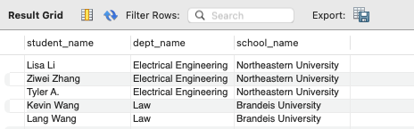
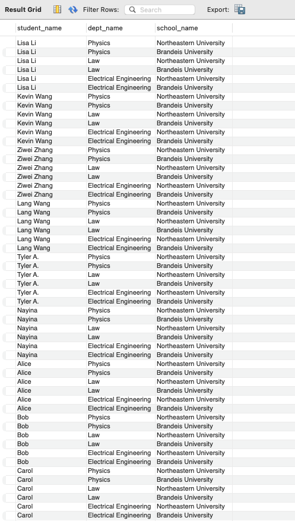
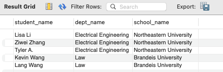
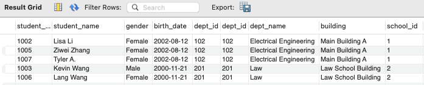
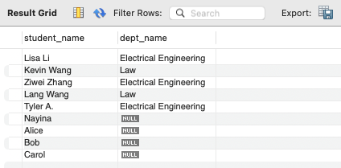
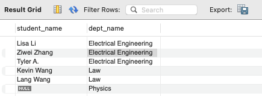
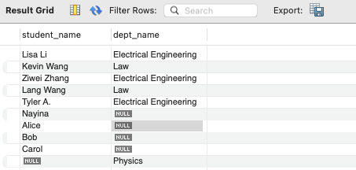
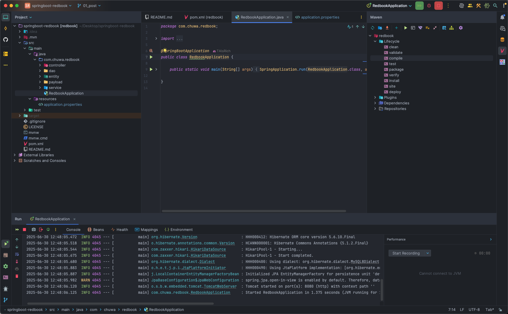
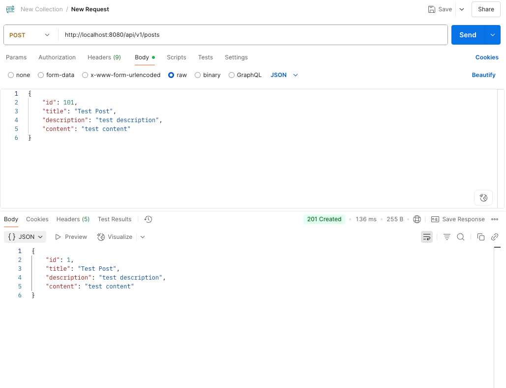
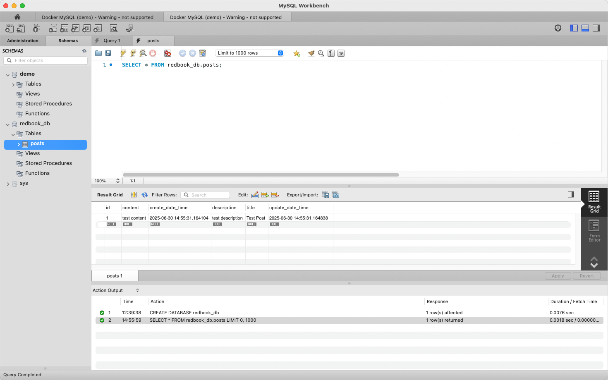

# 6.27 HW8 - Database & Project Hands On

**Part 1**: Please try attached SQL queries, if the query doesn't work, explain why in your mark down file.

[SQL_Referential_Integrity.sql](../../Coding/hw8/SQL_Referential_Integrity.sql)

**Please note this SQL file is NOT supposed to run as a whole.**

1. Create Student Schema is failed: 

   Error Code: 1824. Failed to open the referenced table 'department'

   This is because the referenced tables 'department' haven't been created. We should create the table in this order: 'school', 'department', and 'student'.

2. Then we also need to insert data to those table in that order. 

   We notice that there are some duplicate student_id when we insert data to student table, and there is a student record with invalid foreign key dept_id =666, so need to make some changes to them. Similarly, there is a duplicate dep_id .

   And the two queries that insert data into the department and student tables have the problem of that the records don't match the table schema.

3. The operation of deleting a department gets an error. Because `student.dept_id` has a **foreign key constraint** referencing `department.dept_id`, which means there are students still assigned to dept_id = 101(**referential integrity**). So we need to delete those students or update dept_id = NULL for those students first, then we can delete the department.

The completed and correct SQL queries should be:

```sql
-- Create School Schema first
CREATE TABLE school (
    school_id INT PRIMARY KEY,
    school_name VARCHAR(100) NOT NULL,
    city VARCHAR(50),
    established_year INT
);

-- Then create Department Schema -- 
CREATE TABLE department (
    dept_id INT PRIMARY KEY,
    dept_name VARCHAR(100) NOT NULL,
    building VARCHAR(50),
    school_id INT,
    FOREIGN KEY (school_id) REFERENCES school(school_id)
);

-- Finally Create Student Schema --
CREATE TABLE student (
    student_id INT PRIMARY KEY,
    student_name VARCHAR(100) NOT NULL,
    gender ENUM('Male', 'Female') NOT NULL,
    birth_date DATE,
    dept_id INT,
    FOREIGN KEY (dept_id) REFERENCES department(dept_id)
);

-- Insert data to school table --
INSERT INTO school (school_id, school_name, city, established_year)
VALUES 
(1, 'Northeastern University', 'Boston', 1898),
(2, 'Brandeis University', 'Boston', 1948);

-- Insert data to department table --
INSERT INTO department (dept_id, dept_name, building, school_id)
VALUES 
(101, 'Computer Science', 'Information Hall', 1),
(102, 'Electrical Engineering', 'Main Building A', 1),
(201, 'Law', 'Law School Building', 2);

-- Insert Student Records --
INSERT INTO student (student_id, student_name, gender, birth_date, dept_id)
VALUES 
(1001, 'John Zhang', 'Male', '2001-05-01', 101),
(1002, 'Lisa Li', 'Female', '2002-08-12', 102),
(1003, 'Kevin Wang', 'Male', '2000-11-21', 201);

-- Insert data to student table (fixed) --
INSERT INTO student (student_id, student_name, gender, birth_date, dept_id)
VALUES 
(1004, 'Dawen Wei', 'Male', '2001-05-01', 101),
(1005, 'Ziwei Zhang', 'Female', '2002-08-12', 102),
(1006, 'Lang Wang', 'Female', '2000-11-21', 201),
(1007, 'Tyler A.', 'Female', '2002-08-12', 102); 

-- Insert to department
INSERT INTO department VALUES (202, 'Physics', 'Science Hall', 1);

-- Insert to student
INSERT INTO student VALUES (1008, 'Nayina', 'Female', '2001-01-01', 101);

-- Delete a department
DELETE FROM student WHERE dept_id = 101;
DELETE FROM department WHERE dept_id = 101;

-- Join three tables
SELECT 
    s.student_name,
    d.dept_name,
    sc.school_name
FROM student s
JOIN department d ON s.dept_id = d.dept_id
JOIN school sc ON d.school_id = sc.school_id;
```


**Part 2**: Please try attached SQL queries (with same data and schema setup as above), explain why we need join keyword, and compare inner join, left join, right join, and full join.

Write your answers with screenshots in your markdown file. 

 [SQL_Join.sql](../../Coding/hw8/SQL_Join.sql) 

1. Manual 'JOIN' vs use JOIN keyword: both of them return the same result. 

   

2.  After inserting more students WITHOUT associated schools, manual join's result:

   

   JOIN result:

   

   So when there are some invalid dept_id existing, manual join does a **Cartesian product** (cross join). It returns  #students × #departments × #schools result, which is meaningless. But with JOIN, the result is more accurate. It matches only related rows based on keys.

3. Inner join vs Left join vs Right join vs Full join

   - Inner join - **intersection**: only rows with **matching values in both tables**

     - Shows only students who **have a valid department**.

     

   - Left join -  All rows from the **left table** + matched rows from the right table (NULL if none)

     - Shows **all students**, even if they don’t belong to any department.

     

   - Right join - All rows from the **right table** + matched rows from the left table (NULL if none)

     - Shows **all departments**, even if no students belong to them.

     

   - Full join - All rows from **both tables**, matched where possible (NULL if no match on either side)

     - Combines students with and without departments and departments with and without students

     

**Part 3 Hands on**:

1. clone redbook repository and import to IntelliJ (as a maven project)
2. modify your application.proerties file.
3. maven clean and compile.
4. run the application. 
5. create a postman request to generate a record in database

Take screenshots for hands on tasks, in your markdown file and answer following questions in your markdown.



Have configured the database and modified the application.proerties file. The application started successfully. The POST request in Postman and data generated in the database are below:





Questions:

1. Did you create the table POSTS in the database? if not, who did it for you? Can I change this behavior? (Hint: look at the application.properties file)

   No, I didn't create the table "posts" in the database manually. Spring Hibernate did that for me.

   Because we used the `@Entity` annotation on the Entity/Post.java, and in the application.properties file, we have:

   ```properties
   # hibernate ddl auto (create, create-drop, validate, update)
   spring.jpa.hibernate.ddl-auto=update
   ```

   which tells Hibernate to **automatically generate or update the database schema** based on your entity classes.

   We can change this behavior via set:

   ```properties
   spring.jpa.hibernate.ddl-auto=validate
   ```

   which will force Hibernate to **only validate schema** instead of auto-creating it.
2. Is your id in the database same as what you set in your request? why does this happen? (Hint: search the annotations used in your code)

   No, they are not the same. Because in Post entity:

   ```java
   @Id
   @GeneratedValue(strategy = GenerationType.IDENTITY)
   private Long id;
   ```

   The `@GeneratedValue(strategy = GenerationType.IDENTITY)` annotation tells JPA don't use the ID from the request and let the **database auto-generate** the ID. So MySQL handle IDs automatically, which reduces bugs and makes data insertion easier.

