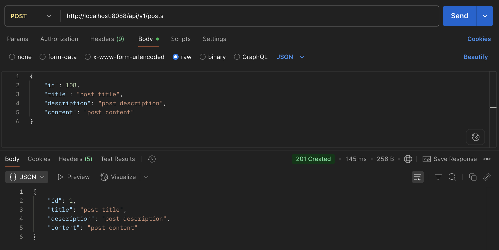
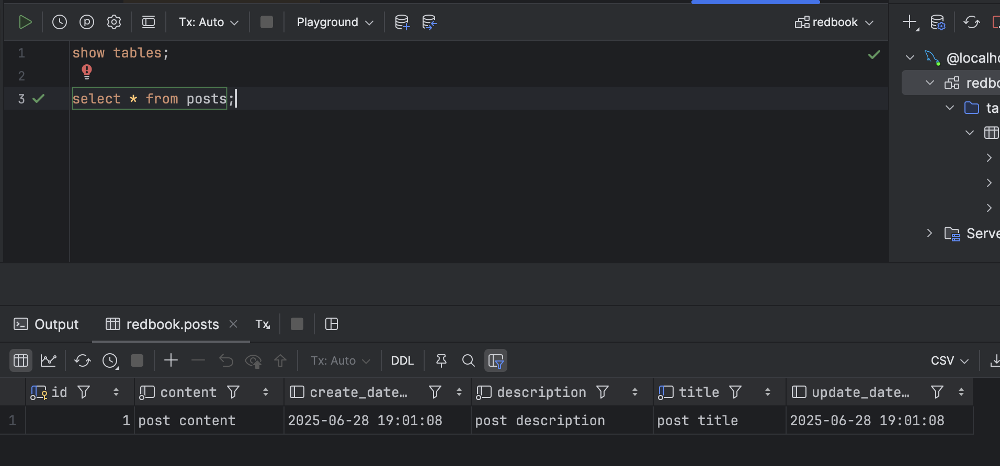

### hw 8

----
### Part 3

Create a postman request to generate a record in database:  




**Questions:**
1. Did you create the table `posts` in the database?   
   If not, who did it for you? Can I change this behavior?   
   (Hint: look at the `application.properties` file.)

**No**, I did not manually create the `posts` table in the database.  
Hibernate created the table automatically at runtime.  
This behavior is controlled by:
```properties
spring.jpa.hibernate.ddl-auto=update
```
in the `application.properties` file.

This line makes Hibernate compare the structure of our **Java entity classes** (e.g., `Post`) to the tables, columns, types, and constraints defined in the **database** (e.g., `redbook`), then update the **database** as needed to match the **Java entity classes**.

I can change this behavior by changing the value of `spring.jpa.hibernate.ddl-auto`:  

| Value        | Behavior                                                                 |
|--------------|--------------------------------------------------------------------------|
| `none`       | Do nothing (schema must be created manually)                             |
| `validate`   | Validate that the schema matches entities. Throws error if mismatch.     |
| `update`     | Update the schema to match the entities. (Default for development)       |
| `create`     | Drop and recreate schema on each app start                               |
| `create-drop`| Same as `create`, but also drops schema when app stops                   |

Recommendation:
- For **development**, `update` is fine.
- For **production**, use `validate` or `none` to avoid accidental schema changes.


---
2. Is the `id` in the database the same as what you set in your request?   
   Why does this happen? (Hint: search the annotations used in your code.)  

**No**, the `id` in the database is **auto-generated**, not taken from my request.  
This is due to the annotation `@GeneratedValue` in code:

```java
@Id
@GeneratedValue(strategy = GenerationType.IDENTITY)
private Long id;
```

- `@Id` → Marks the field as the **primary key**.

- `@GeneratedValue(...)` → Tells Hibernate to let the database generate the ID automatically.

- `GenerationType.IDENTITY` → Uses the database's auto-increment feature to generate unique IDs.

In Summary,
- In my HTTP request, the `id`  is ignored.
- The database auto-generates a new, unique ID for each inserted row.