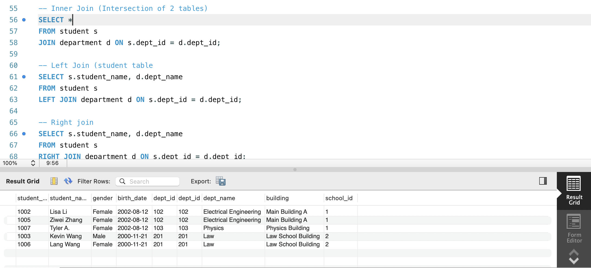
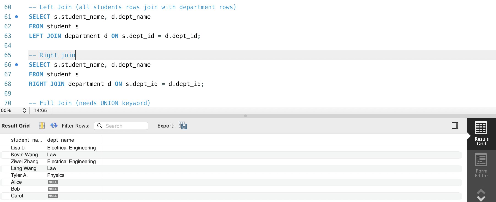
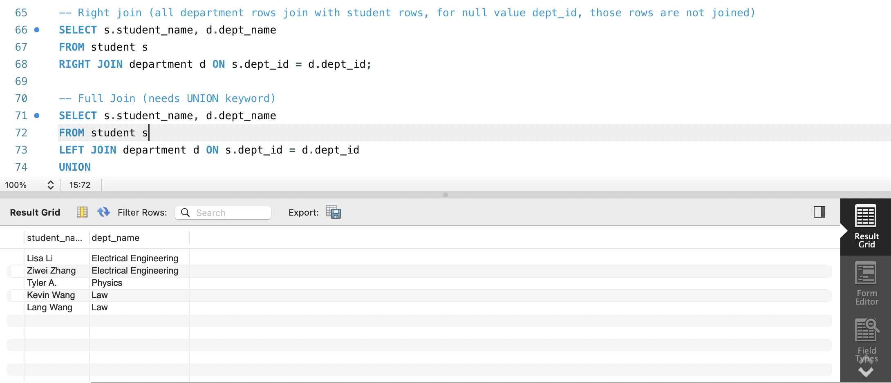
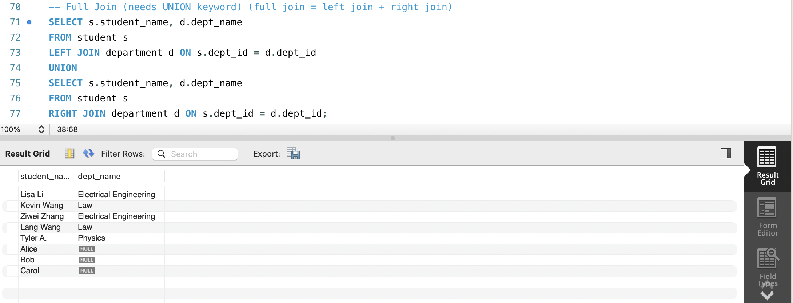
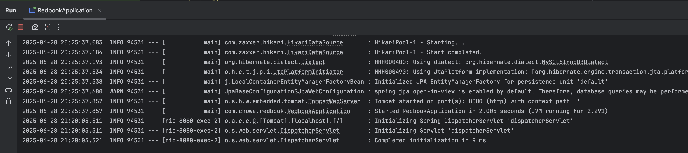
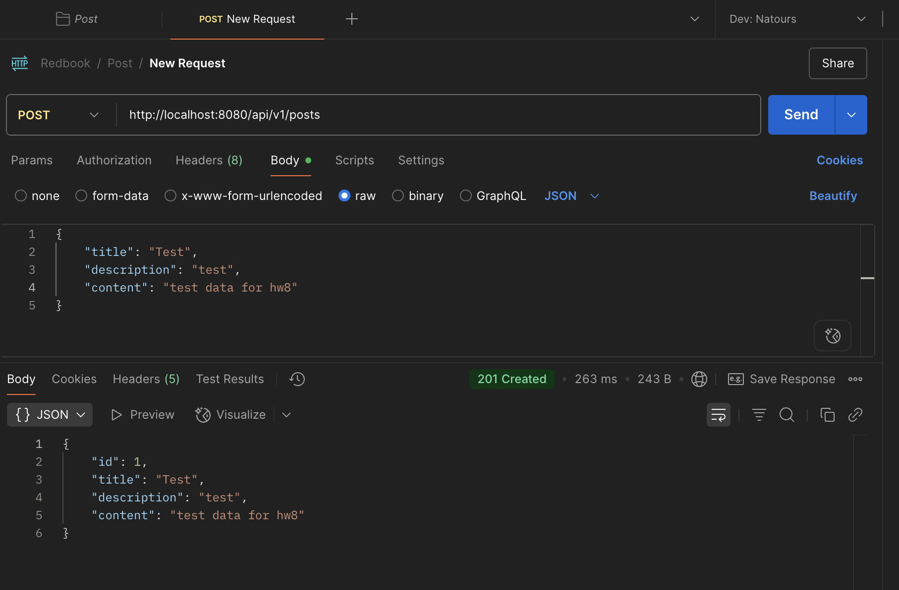
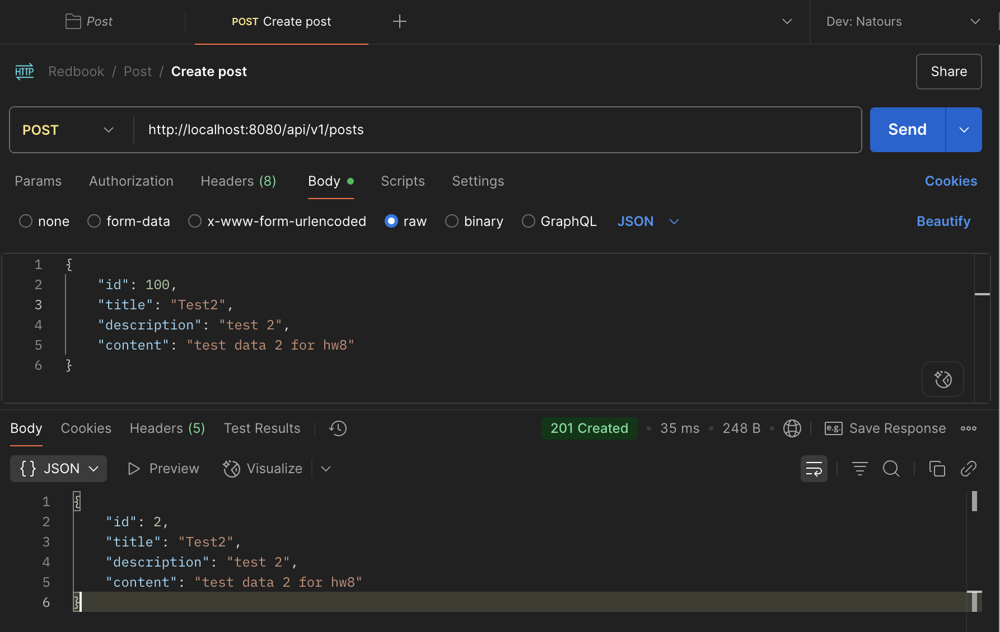

 Assignment Part 1 

 Please try attached SQL queries, if the query doesn't work, explain why in your markdown file. 

<pre>
CREATE SCHEMA IF NOT EXISTS HW8; 

USE HW8;

-- Create School Schema --
CREATE TABLE school (
school_id INT PRIMARY KEY,
school_name VARCHAR(100) NOT NULL,
city VARCHAR(50),
established_year INT
);

-- Create Department Schema -- using ON DELETE CASCADE automatic deletion of dependent rows
CREATE TABLE department (
dept_id INT PRIMARY KEY,
dept_name VARCHAR(100) NOT NULL,
building VARCHAR(50),
school_id INT,
FOREIGN KEY (school_id) REFERENCES school(school_id) ON DELETE CASCADE
);

-- Create Student Schema -- using ON DELETE CASCADE automatic deletion of dependent rows
CREATE TABLE student (
student_id INT PRIMARY KEY,
student_name VARCHAR(100) NOT NULL,
gender ENUM('Male', 'Female') NOT NULL,
birth_date DATE,
dept_id INT,
FOREIGN KEY (dept_id) REFERENCES department(dept_id) ON DELETE CASCADE
);

-- Insert data to School table -- (School table should be inserted before department and student)
INSERT INTO school (school_id, school_name, city, established_year)
VALUES
(1, 'Boston University', 'Boston', 1890),
(2, 'New York University', 'New York', 1990);

-- Insert data to department table --
INSERT INTO department (dept_id, dept_name, building, school_id)
VALUES
(101, 'Computer Science', 'Information Hall', 1),
(102, 'Electrical Engineering', 'Main Building A', 1),
(201, 'Law', 'Law School Building', 2);

-- Insert to department (number of variables should match)
INSERT INTO department VALUES (103, 'Physics', 'Physics Building', 1);

-- Insert Student Records --
INSERT INTO student (student_id, student_name, gender, birth_date, dept_id)
VALUES
(1001, 'John Zhang', 'Male', '2001-05-01', 101),
(1002, 'Lisa Li', 'Female', '2002-08-12', 102),
(1003, 'Kevin Wang', 'Male', '2000-11-21', 201);

-- Insert data to student table -- (id is primary key, should be unique)
INSERT INTO student (student_id, student_name, gender, birth_date, dept_id)
VALUES
(1004, 'Dawen Wei', 'Male', '2001-05-01', 101),
(1005, 'Ziwei Zhang', 'Female', '2002-08-12', 102),
(1006, 'Lang Wang', 'Female', '2000-11-21', 201),
(1007, 'Tyler A.', 'Female', '2002-08-12', 103);

-- Insert to student (number of variables should match)
INSERT INTO student VALUES (1008, 'Nayina', 'female', '2001-06-01', 101);

-- Delete a department
DELETE FROM department WHERE dept_id = 101;

-- Join three tables
SELECT
s.student_name,
d.dept_name,
sc.school_name
FROM student s
JOIN department d ON s.dept_id = d.dept_id
JOIN school sc ON d.school_id = sc.school_id;

DROP TABLE student;
DROP TABLE department;
DROP TABLE school;
</pre>

 Part 2 

 Please try attached SQL queries (with same data and schema setup as above), explain why we need join keyword, and compare inner join, left join, right join, and full join.
Write your answers with screenshots in your markdown file. 

<pre>
-- Manual 'JOIN' (NO join keyword)
SELECT 
    s.student_name,
    d.dept_name,
    sc.school_name
FROM student s, department d, school sc
WHERE 
    s.dept_id = d.dept_id
    AND d.school_id = sc.school_id;

-- Join
SELECT 
    s.student_name,
    d.dept_name,
    sc.school_name
FROM student s
JOIN department d ON s.dept_id = d.dept_id
JOIN school sc ON d.school_id = sc.school_id;

-- Insert more students WITHOUT associated schools
INSERT INTO student (student_id, student_name, gender, birth_date, dept_id)
VALUES 
(2001, 'Alice', 'Male', '2000-01-01', NULL),
(2002, 'Bob', 'Female', '2002-01-12', NULL),
(2003, 'Carol', 'Female', '2000-08-21', NULL);

Select * from student;

Select * from department;

Select * from school;

-- Manual Join: what will happen? 
-- Cross join occurs. Every row from student is joined with every row 
-- from department, and then every resulting row is joined with every row from school.
SELECT 
    s.student_name,
    d.dept_name,
    sc.school_name
FROM student s, department d, school sc;

-- With Join: compare results with above manual join
SELECT 
    s.student_name,
    d.dept_name,
    sc.school_name
FROM student s
JOIN department d ON s.dept_id = d.dept_id
JOIN school sc ON d.school_id = sc.school_id;

-- Inner Join (Intersection of 2 tables)
SELECT *
FROM student s
JOIN department d ON s.dept_id = d.dept_id;

-- Left Join (all students rows join with department rows)
SELECT s.student_name, d.dept_name
FROM student s
LEFT JOIN department d ON s.dept_id = d.dept_id;

-- Right join (all department rows join with student rows, for null value dept_id, those rows are not joined)
SELECT s.student_name, d.dept_name
FROM student s
RIGHT JOIN department d ON s.dept_id = d.dept_id;

-- Full Join (needs UNION keyword) (full join = left join + right join)
SELECT s.student_name, d.dept_name
FROM student s
LEFT JOIN department d ON s.dept_id = d.dept_id
UNION
SELECT s.student_name, d.dept_name
FROM student s
RIGHT JOIN department d ON s.dept_id = d.dept_id;

DROP TABLE student;
DROP TABLE department;
DROP TABLE school;
</pre>

Inner join

Left join

Right join

Full join

 Part 3 

<pre>
1. clone redbook repository and import to IntelliJ (as a maven project)
2. modify your application.proerties file.
3. maven clean and compile.
4. run the application.
5. create a postman request to generate a record in database
</pre>

Questions:

 1. Did you create the table POSTS in the database? if not, who did it for you? Can I change this behavior? (Hint: look at the application.properties file) 

No. spring.jpa.hibernate.ddl-auto helps drop the table POSTS.  Changing spring.jpa.hibernate.ddl-auto=none will not automatically drop the table.

 2. Is your id in the database same as what you set in your request? why does this happen? (Hint: search the annotations used in your code) 

No. @GeneratedValue(strategy = GenerationType.IDENTITY) It automatically increments id value. 

 

