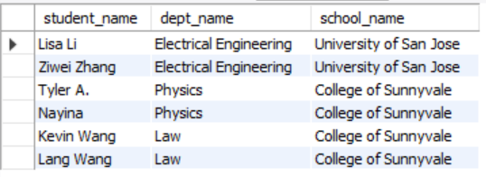
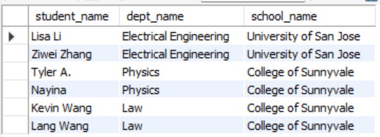
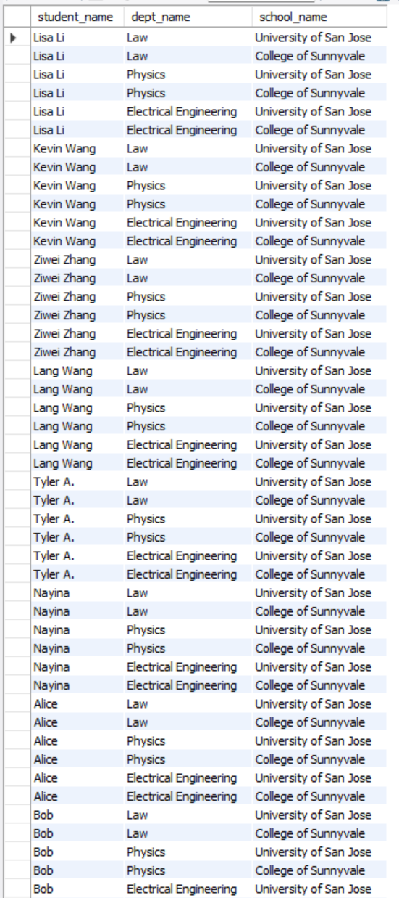
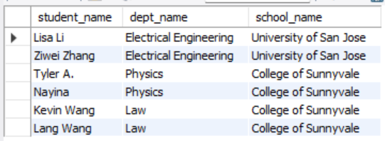
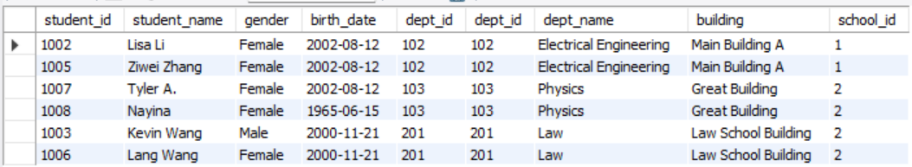
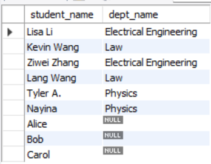
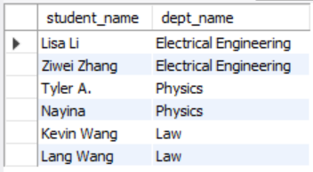
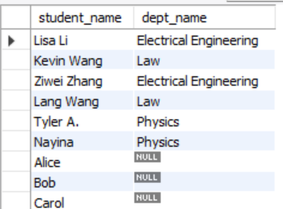
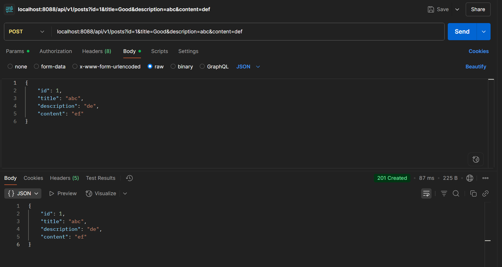

# Assignment 2
We use the JOIN keyword to combine data from multiple tables based on a related column. 

Comparing JOIN Types
- INNER JOIN: Returns only the rows that have a match in both tables. If a student has no department, they won't appear.
- LEFT JOIN: Returns all rows from the left table (the first one listed) and any matching rows from the right table. If a student has no department, they will still appear, but their department information will be NULL.
- RIGHT JOIN: Returns all rows from the right table (the second one listed) and any matching rows from the left table. If a department has no students, it will still appear, but the student information will be NULL.
- FULL JOIN: Returns all rows from both tables. It combines the results of a LEFT JOIN and a RIGHT JOIN, showing all students and all departments, regardless of whether they have a match.

# Assignment 3

## Question 1
spring.jpa.hibernate.ddl-auto=update is what makes Spring Boot creates the database table. 
To change the behavior, you can modify the value of this property to one of the following:
- none: No action will be taken.
- create: The database schema will be created on startup.

## Question 2
@GeneratedValue(strategy = GenerationType.IDENTITY) makes the id not the same as what was input in POST request.