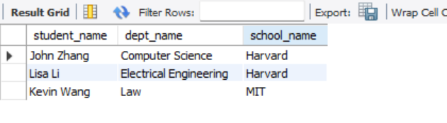
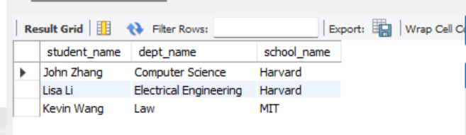
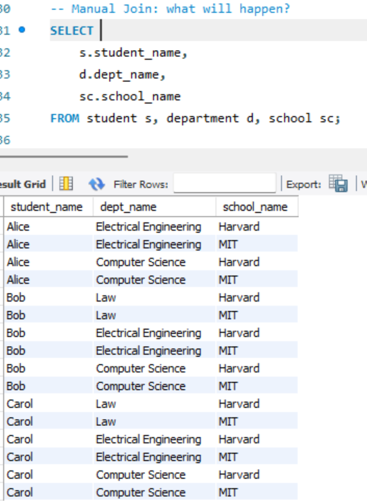
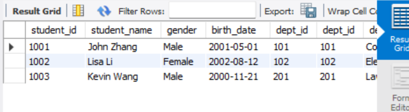
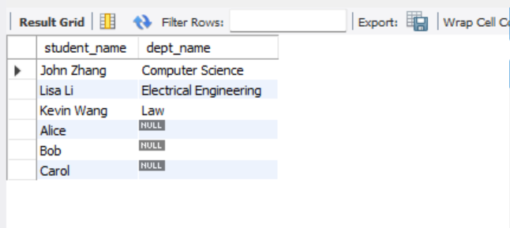
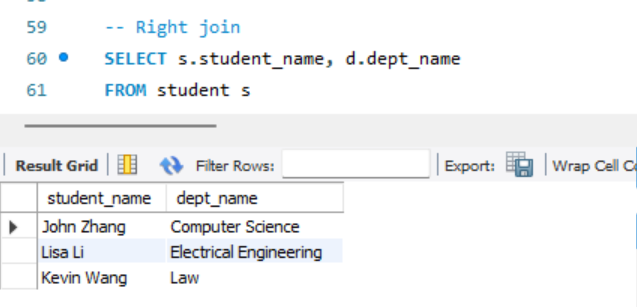
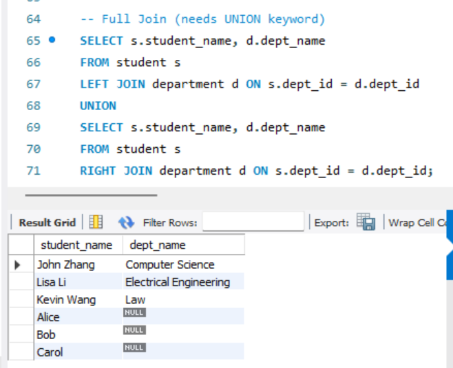
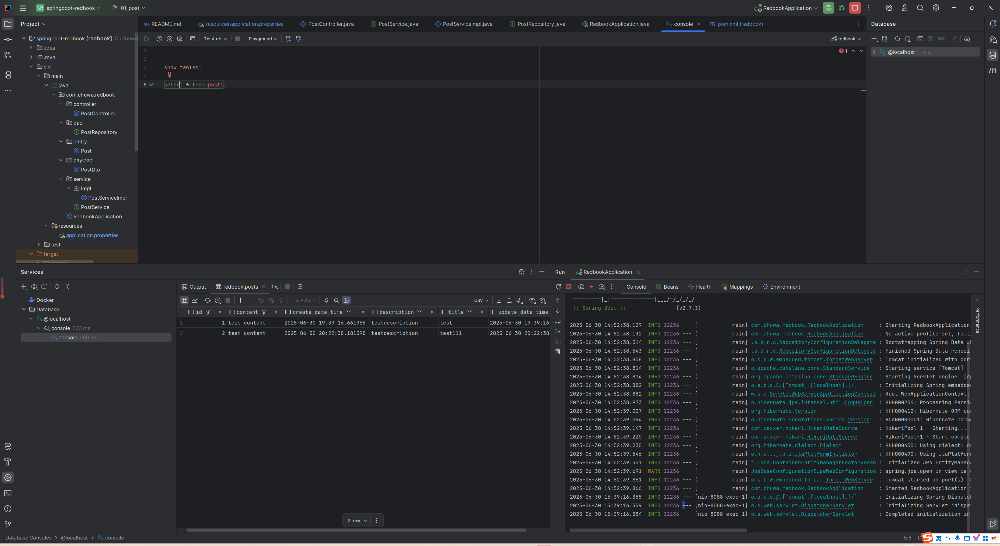

## Part1:

* Before creating a table, we need to create a database and select it using the USE statement.

* When creating the student table, it has a foreign key referencing the department table. However, the department table does not exist yet.

* To fix this, we need to create the department table first. But the department table also has a foreign key referencing the school table.

* Therefore, the correct order is: create the school table first, then the department table, and finally the student table.

* This order applies not only to table creation but also to inserting data. We must insert data in the order of school → department → student. Otherwise, foreign key constraint errors will occur.

* For inserting into the student table, ensure that `student_id` (as a primary key) has no duplicate values. Duplicate student_id will cause insertion errors.

* For the department insertion statement like `INSERT INTO department VALUES (102, 'Physics', 888)`;, make sure the number of values matches the number of columns. If there are four columns, four values are required instead of three.

* When trying to delete a department where `dept_id = 101`, the deletion will fail if this `dept_id` is being referenced in other tables due to foreign key constraints.

## Part 2:
explain why we need join keyword, and compare inner join, left join, right join, and full join.

* Difference between Manual JOIN and Explicit JOIN (Inner Join)

They are same output
Manual: 
JOIN: 

* Manual Join: what will happen? (Without Where)

There is no WHERE clause specifying the relationship between tables.

Result: Cartesian Product (Cross Join)

The query matches every row in student with every row in department and every row in school.

Total rows =
#students × #departments × #schools

* -- With Join: compare results with above manual join. 

This is Inner Join rather than Cross join

* Inner Join

Returns only matching rows where student.dept_id = department.dept_id.

* Left Join

 Returns all students, even if they don't belong to any department.
If there's no matching department, dept_name will be NULL.

* Right Join

Returns all departments, even if no students are enrolled in them.
If there's no matching student, student_name will be NULL.

* Full Join

Returns all students and all departments.

Combines LEFT JOIN and RIGHT JOIN.

* Part 3
Questions:
1. Did you create the table POSTS in the database? if not, who did it for you? Can I change this behavior? (Hint: look at the application.properties file)

No, I didn't manually create the POSTS table.

The table was automatically created by Spring Boot + JPA/Hibernate when the application started.

This behavior is controlled by the application.properties file with this key:

spring.jpa.hibernate.ddl-auto=update

This setting tells Hibernate to automatically manage the database schema based on the entity classes.

2. Is your id in the database same as what you set in your request? why does this happen? (Hint: search the annotations used in your code)

No

Code in the entity:

    @Id
        @GeneratedValue(strategy = GenerationType.IDENTITY)
        private Long id;

This means the id is auto-generated by the database, not manually set by your request.

Even if you send an id in the POST request, it will be ignored, and the database will generate a new unique ID.

