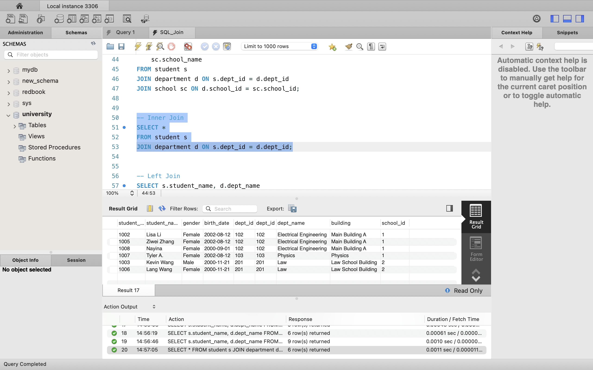
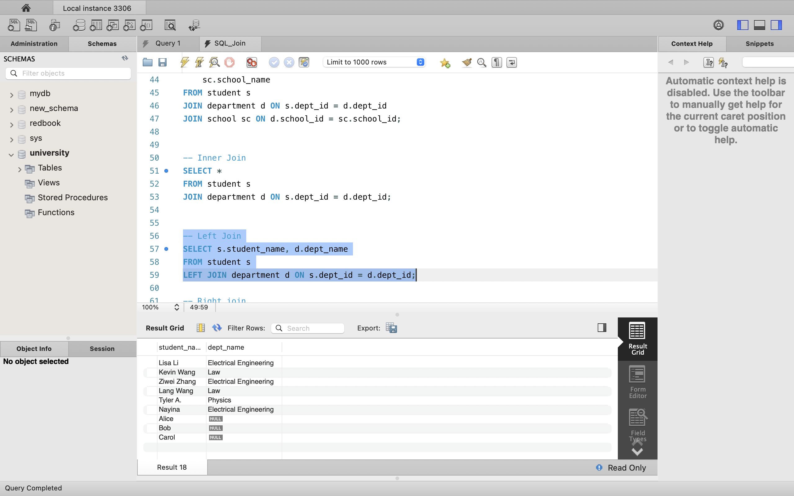
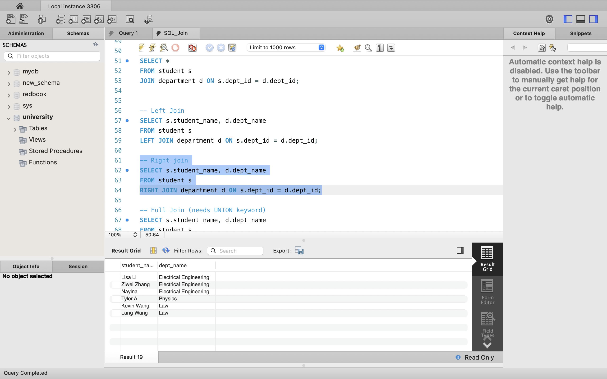
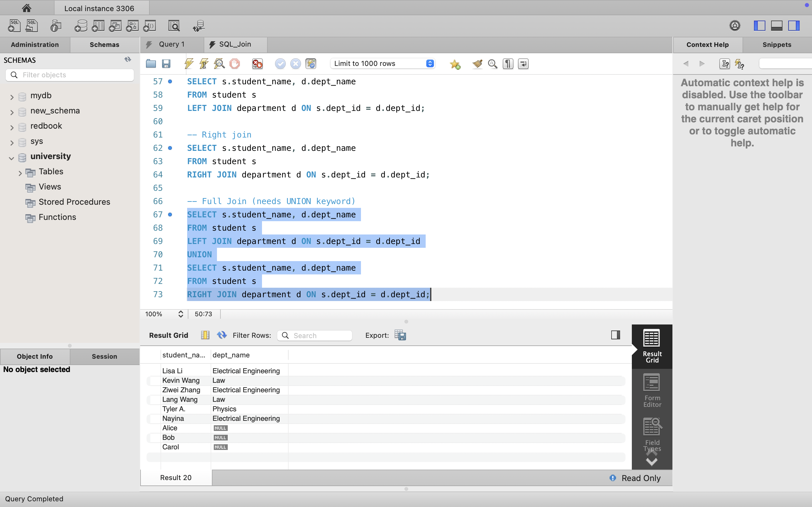
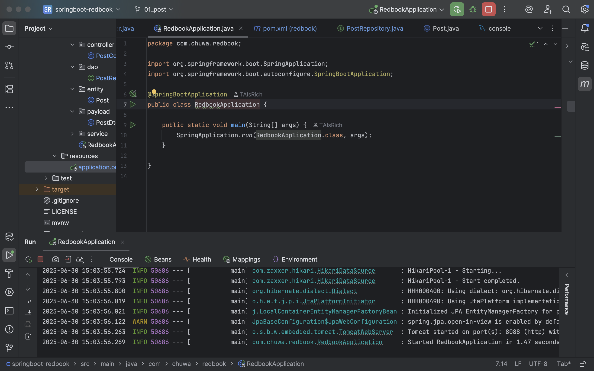
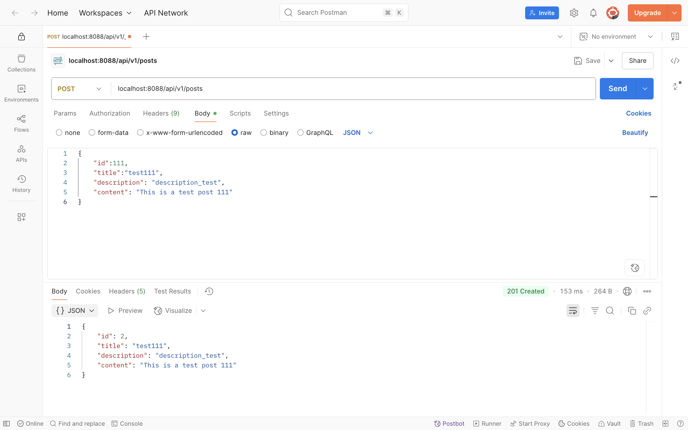

# HW8 

---

## Part 1

### Fix Steps:

#### 1. Database issue: Create and select a database if not already done, add sql on the top:

```sql
DROP DATABASE IF EXISTS university;
CREATE DATABASE university;
USE university;

```

#### 2. Create table issue: Must create the referenced tables first before any tables that reference them via FOREIGN KEY.

```sql
-- Step 1: Drop and recreate the database, then use the database
DROP DATABASE IF EXISTS university;
CREATE DATABASE university;
USE university;

-- Step 2: Create school table first
CREATE TABLE school (
    school_id INT PRIMARY KEY,
    school_name VARCHAR(100) NOT NULL,
    city VARCHAR(50),
    established_year INT
);

-- Step 3: Then create department table (references school)
CREATE TABLE department (
    dept_id INT PRIMARY KEY,
    dept_name VARCHAR(100) NOT NULL,
    building VARCHAR(50),
    school_id INT,
    FOREIGN KEY (school_id) REFERENCES school(school_id)
);

-- Step 4: Finally create student table (references department)
CREATE TABLE student (
    student_id INT PRIMARY KEY,
    student_name VARCHAR(100) NOT NULL,
    gender ENUM('Male', 'Female') NOT NULL,
    birth_date DATE,
    dept_id INT,
    FOREIGN KEY (dept_id) REFERENCES department(dept_id)
);

```
#### Inserting data issue:
#### Must ensure that any inserted fk value exists in the parent table. So the better practice is to change the sequence of inserting data to be first school, second department, last student
#### Primary Key Conflict in student and department table
#### Fix invalid fk like 666, 888
```sql
-- Step 5: Insert data into school
INSERT INTO school VALUES 
(1, 'Engineering School', 'New York', 1990),
(2, 'Law School', 'Chicago', 1985);

-- Step 6: Insert data into department
INSERT INTO department (dept_id, dept_name, building, school_id)
VALUES
    (101, 'Computer Science', 'Information Hall', 1),
    (102, 'Electrical Engineering', 'Main Building A', 1),
    (201, 'Law', 'Law School Building', 2),
    (103, 'Physics', 'Physics', 1);

-- Step 7: Insert data into student
INSERT INTO student VALUES
                        (1001, 'John Zhang', 'Male', '2001-05-01', 101),
                        (1002, 'Lisa Li', 'Female', '2002-08-12', 102),
                        (1003, 'Kevin Wang', 'Male', '2000-11-21', 201),
                        (1004, 'Dawen Wei', 'Male', '2001-05-01', 101),
                        (1005, 'Ziwei Zhang', 'Female', '2002-08-12', 102),
                        (1006, 'Lang Wang', 'Female', '2000-11-21', 201),
                        (1007, 'Tyler A.', 'Female', '2002-08-12', 103),
                        (1008, 'Nayina', 'Female', '2000-09-01',102);
```

#### Deletion issue:
#### Delete a department fail with a foreign key constraint error if there are students in the student table who reference dept_id = 101.
#### We need to delete dependent students first
```sql
-- Step 8: Deletion
DELETE FROM student WHERE dept_id = 101;
DELETE FROM department WHERE dept_id = 101;

```

#### Join Tables
```sql
-- Step 9: Join three tables
SELECT 
    s.student_name,
    d.dept_name,
    sc.school_name
FROM student s
JOIN department d ON s.dept_id = d.dept_id
JOIN school sc ON d.school_id = sc.school_id;
```


---

## Part 2
### Why we need join keyword, and compare inner join, left join, right join, and full join.

#### Why we need join keyword?

- The JOIN keyword is essential in SQL for combining data from multiple tables in a clear, efficient, and controlled manner.
- Provide better readability for complex queries.
- Prevent Cartesian product mistakes

#### Compare inner join, left join, right join, and full join
| Join Type      | Description                                                                  | Rows Returned                                                          |
| -------------- | ---------------------------------------------------------------------------- | ---------------------------------------------------------------------- |
| **INNER JOIN** | Returns rows where **matching values exist in both tables**.                 | Only students that belong to a department.                             |
| **LEFT JOIN**  | Returns **all rows from the left table**, and matched rows from right table. | All students, even those without a department (e.g., `dept_id = NULL`) |
| **RIGHT JOIN** | Returns **all rows from the right table**, and matched rows from left table. | All departments, even if no students belong to them.                   |
| **FULL JOIN**  | Returns rows where there is a match in **either** left or right table.       | All students and departments, including those with no match.           |

- inner join
- 
- left join
- 
- right join
- 
- full join
- 


___ 

## Part 3
### screenshots of hands on tasks:




---

#### q1: Did you create the table POSTS in the database? if not, who did it for you? Can I change this behavior? (Hint: look at the application.properties file)
- I did not manually create the POSTS in tables
- Spring Boot (via Hibernate) auto-created it by scanning the JPA entity classes.
- This is controlled by: `spring.jpa.hibernate.ddl-auto=update`
- Yes, this behavior can be changed.
- Options for ddl-auto include:
  - `none`: Don’t auto-create/update schema
  - `update`: Update the schema (default for dev)
  - `create`: Drop and recreate schema on startup
  - `validate`: Validate schema matches entities
  - `create-drop`: Drop schema on app shutdown

---

#### q2: Is your id in the database same as what you set in your request? why does this happen? (Hint: search the annotations used in your code)
- No, the id in the DB is not the same as in the request.
- This happens because the entity `Post` uses this annotation:
```java
    @Id
    @GeneratedValue(strategy = GenerationType.IDENTITY)
    private Long id;
```
- So even if I send id: 10, Hibernate ignores it and lets the database auto-generate the ID.
  To accept custom IDs, remove @GeneratedValue with caution.

---

