### hw 8

### Part 1: SQL Referential Integrity
```sql
-- [1] Create School Schema FIRST (no dependencies) --
CREATE TABLE school (
   school_id INT PRIMARY KEY,
   school_name VARCHAR(100) NOT NULL,
   city VARCHAR(50),
   established_year INT
);


-- [2] Create Department Schema (depends on school) --
CREATE TABLE department (
    dept_id INT PRIMARY KEY,
    dept_name VARCHAR(100) NOT NULL,
    building VARCHAR(50),
    school_id INT,
    FOREIGN KEY (school_id) REFERENCES school(school_id)
);


-- [3] Create Student Schema (depends on department) --
CREATE TABLE student (
    student_id INT PRIMARY KEY,
    student_name VARCHAR(100) NOT NULL,
    gender ENUM('Male', 'Female') NOT NULL,
    birth_date DATE,
    dept_id INT,
    FOREIGN KEY (dept_id) REFERENCES department(dept_id)
);


-- [4] Insert School Records (must come before department inserts) --
INSERT INTO school (school_id, school_name, city, established_year)
VALUES
    (1, 'Engineering School', 'Seattle', 1990),
    (2, 'Law School', 'Boston', 1985);


-- [5] Insert Department Records (school_id exists) --
INSERT INTO department (dept_id, dept_name, building, school_id)
VALUES
    (101, 'Computer Science', 'Information Hall', 1),
    (102, 'Electrical Engineering', 'Main Building A', 1),
    (201, 'Law', 'Law School Building', 2),
    (202, 'Physics', 'Science Block', 1); -- Fixed: Changed from duplicate 102 to new 202

   
-- [6] Insert Student Records (dept_id exists, valid gender values) --
INSERT INTO student (student_id, student_name, gender, birth_date, dept_id)
VALUES
    (1001, 'Dawen Wei', 'Male', '2001-05-01', 101),
    (1002, 'Ziwei Zhang', 'Female', '2002-08-12', 102),
    (1003, 'Lang Wang', 'Female', '2000-11-21', 201),
    (1004, 'Tyler A.', 'Female', '2002-08-12', 202), -- Fixed: dept_id 666 → valid 202
    (1005, 'Nayina', 'Female', '2001-09-01', 101);     -- Fixed: added full data & valid gender


-- [7] Delete department record --
-- Option 1: Use `ON DELETE CASCADE` to allow automatic deletion of students in that department

-- Recreate student table with cascading delete
CREATE TABLE student (
     student_id INT PRIMARY KEY,
     student_name VARCHAR(100) NOT NULL,
     gender ENUM('Male', 'Female') NOT NULL,
     birth_date DATE,
     dept_id INT,
     FOREIGN KEY (dept_id) REFERENCES department(dept_id) ON DELETE CASCADE
);

-- Now, this delete will also remove any students in department 101
DELETE FROM department WHERE dept_id = 101;


-- Option 2: Prevent deletion if students exist (default FK behavior)
-- `Cannot delete or update a parent row: a foreign key constraint fails.`

-- Check if any students exist in the department
SELECT * FROM student WHERE dept_id = 101;

-- If no rows are returned, then it's safe to delete:
DELETE FROM department WHERE dept_id = 101;

-- Use Option 1 if you want automatic cleanup.
-- Use Option 2 if you prefer no deletion or restricted deletion.
-- For this exercise, I choose to do opetion 1 - add `ON DELETE CASCADE` on the `student` table schema to allow automatic deletion.

   
-- [8] Join all three tables --
SELECT
   s.student_name,
   d.dept_name,
   sc.school_name
FROM student s
     JOIN department d ON s.dept_id = d.dept_id
     JOIN school sc ON d.school_id = sc.school_id;
```

**In Summary, for SQL Referential Integrity:**
1. **Create tables in proper order:**
    - First: `school`
    - Then: `department` (which references `school`)
    - Then: `student` (which references `department`)

2. **Insert data only after referenced rows exist in parent tables.**
    - Insert into `school` first
    - Then into `department`
    - Finally into `student`

3. **Avoid duplicate primary key values.**
    - Ensure each `PRIMARY KEY` (e.g., `student_id`, `dept_id`) is unique.

4. **Validate `ENUM` values strictly.**
    - Only insert values defined in the enum (e.g., `'Male'`, `'Female'`)

5. **Define cascading behavior if needed.**
    - Use `ON DELETE CASCADE` or `ON DELETE SET NULL` when deleting parent rows should affect child rows.

6. **Avoid raw `INSERT INTO table VALUES (...)`**
    - Prefer `INSERT INTO table (column1, column2, ...) VALUES (...)`
    - Ensures clarity and avoids errors from column order mismatch.  


---
### Part 2: SQL JOINs

Explain why we need the `join` keyword.  
Compare `inner join`, `left join`, `right join`, and `full join`.

- The `JOIN` keyword makes relationships **explicit** and **readable** by clearly defining how tables are connected.  
- It prevents unintended **Cartesian products** (all combinations of rows) that occur with comma-separated table lists.


**JOIN Types Comparison:**

| Join Type     | Description                                                                 | Includes Rows From                |  
|---------------|-----------------------------------------------------------------------------|------------------------------------| 
| **INNER JOIN** | Returns matching rows in both tables based on the join condition.           | Both tables only if match exists   |  
| **LEFT JOIN**  | Returns all rows from the left table + matched rows from right table.       | All from **left**, matched from right |  
| **RIGHT JOIN** | Returns all rows from the right table + matched rows from left table.       | All from **right**, matched from left |  
| **FULL JOIN**  | Returns all rows from both tables, matched where possible.                  | All from both sides                |  


**Example:**  

school:
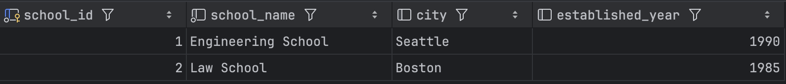

department:
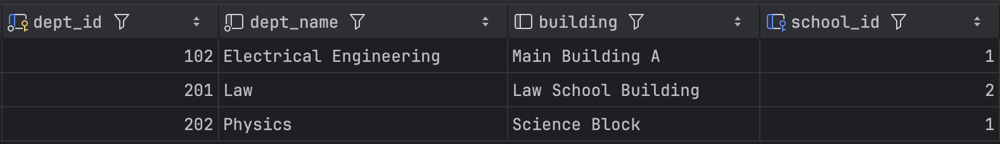

student:
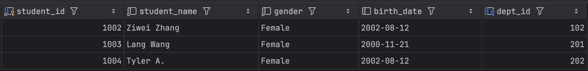


```sql
-- Manual Join (NO JOIN keyword)
SELECT 
    s.student_name,
    d.dept_name,
    sc.school_name
FROM student s, department d, school sc
WHERE 
    s.dept_id = d.dept_id
    AND d.school_id = sc.school_id;
```
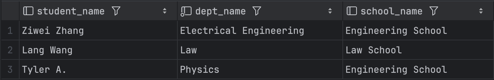


```sql
-- with JOIN keyword
SELECT 
    s.student_name,
    d.dept_name,
    sc.school_name
FROM student s
JOIN department d ON s.dept_id = d.dept_id
JOIN school sc ON d.school_id = sc.school_id;
```
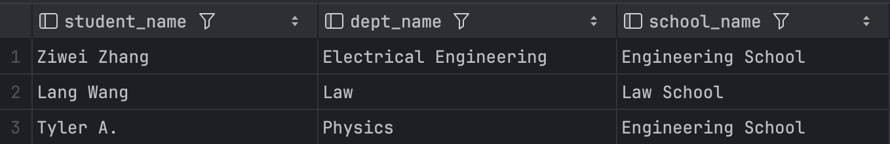


```sql
-- Insert more students WITHOUT associated schools
INSERT INTO student (student_id, student_name, gender, birth_date, dept_id)
VALUES 
	(2001, 'Alice', 'Male', '2000-01-01', NULL),
	(2002, 'Bob', 'Female', '2002-01-12', NULL),
	(2003, 'Carol', 'Female', '2000-08-21', NULL);
```
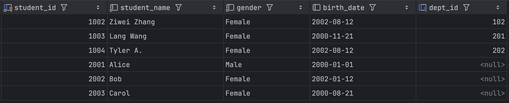


```sql
-- Manual Join: what will happen?
SELECT 
    s.student_name,
    d.dept_name,
    sc.school_name
FROM student s, department d, school sc;
```
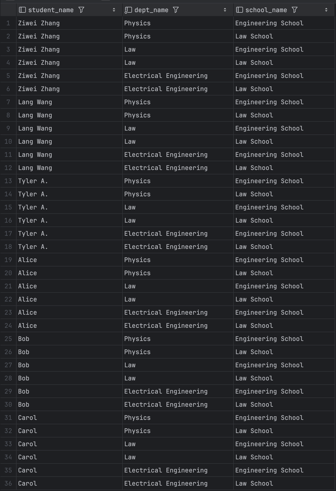


```sql
-- With JOIN keyword: compare results with above Manual Join
SELECT 
    s.student_name,
    d.dept_name,
    sc.school_name
FROM student s
JOIN department d ON s.dept_id = d.dept_id
JOIN school sc ON d.school_id = sc.school_id;
```
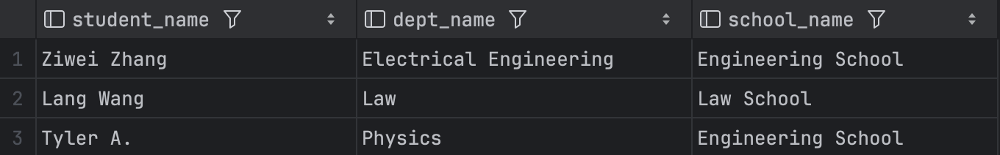


```sql
-- Inner Join
SELECT *
FROM student s
JOIN department d ON s.dept_id = d.dept_id;
```
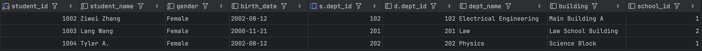


```sql
-- Left Join
SELECT s.student_name, d.dept_name
FROM student s
LEFT JOIN department d ON s.dept_id = d.dept_id;
```
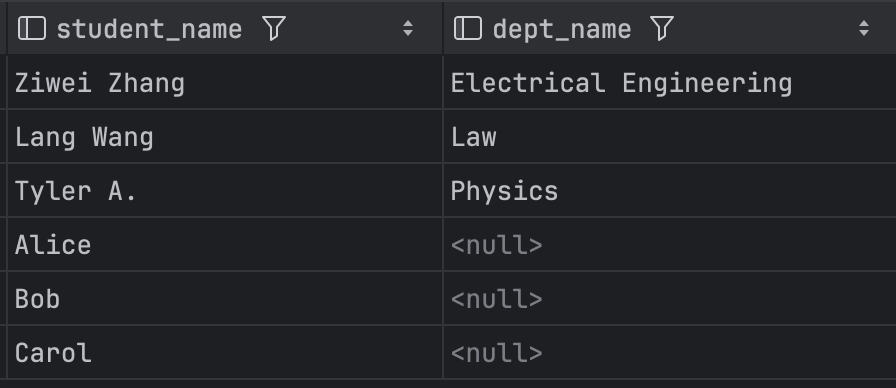


```sql
-- Right Join
SELECT s.student_name, d.dept_name
FROM student s
RIGHT JOIN department d ON s.dept_id = d.dept_id;
```
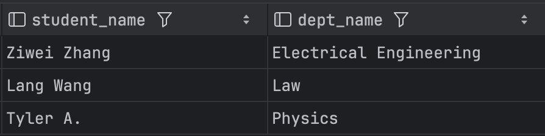


```sql
-- Full Join (needs UNION keyword)
SELECT s.student_name, d.dept_name
FROM student s
LEFT JOIN department d ON s.dept_id = d.dept_id
UNION
SELECT s.student_name, d.dept_name
FROM student s
RIGHT JOIN department d ON s.dept_id = d.dept_id;
```
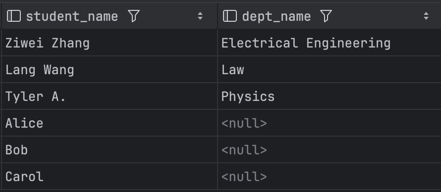


----
### Part 3: Sprint Boot

Create a postman request to generate a record in database:  


**Questions:**
1. Did you create the table `posts` in the database?   
   If not, who did it for you? Can I change this behavior?   
   (Hint: look at the `application.properties` file.)

**No**, I did not manually create the `posts` table in the database.  
Hibernate created the table automatically at runtime.  
This behavior is controlled by:
```properties
spring.jpa.hibernate.ddl-auto=update
```
in the `application.properties` file.

This line makes Hibernate compare the structure of our **Java entity classes** (e.g., `Post`) to the tables, columns, types, and constraints defined in the **database** (e.g., `redbook`), then update the **database** as needed to match the **Java entity classes**.

I can change this behavior by changing the value of `spring.jpa.hibernate.ddl-auto`:  

| Value        | Behavior                                                                 |
|--------------|--------------------------------------------------------------------------|
| `none`       | Do nothing (schema must be created manually)                             |
| `validate`   | Validate that the schema matches entities. Throws error if mismatch.     |
| `update`     | Update the schema to match the entities. (Default for development)       |
| `create`     | Drop and recreate schema on each app start                               |
| `create-drop`| Same as `create`, but also drops schema when app stops                   |

Recommendation:
- For **development**, `update` is fine.
- For **production**, use `validate` or `none` to avoid accidental schema changes.


---
2. Is the `id` in the database the same as what you set in your request?   
   Why does this happen? (Hint: search the annotations used in your code.)  

**No**, the `id` in the database is **auto-generated**, not taken from my request.  
This is due to the annotation `@GeneratedValue` in code:

```java
@Id
@GeneratedValue(strategy = GenerationType.IDENTITY)
private Long id;
```

- `@Id` → Marks the field as the **primary key**.

- `@GeneratedValue(...)` → Tells Hibernate to let the database generate the ID automatically.

- `GenerationType.IDENTITY` → Uses the database's auto-increment feature to generate unique IDs.

In Summary,
- In my HTTP request, the `id`  is ignored.
- The database auto-generates a new, unique ID for each inserted row.