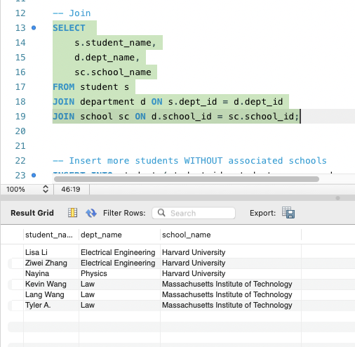
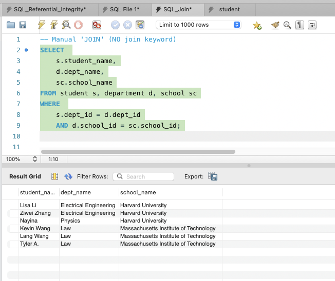
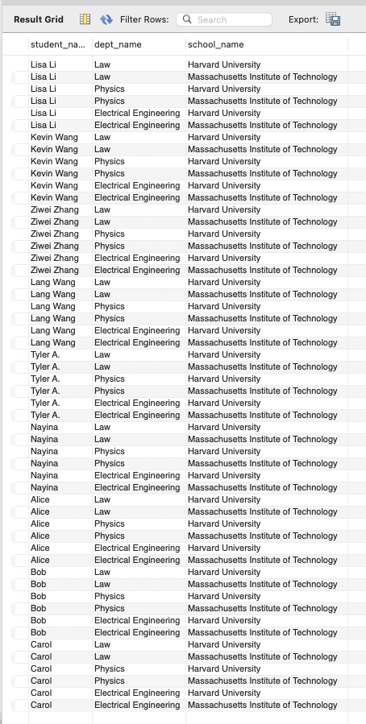
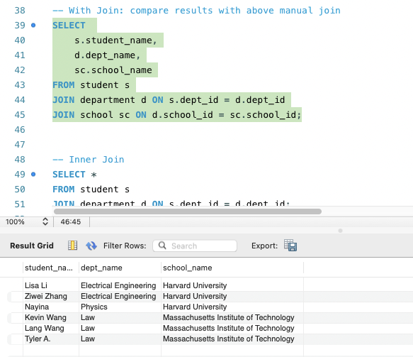
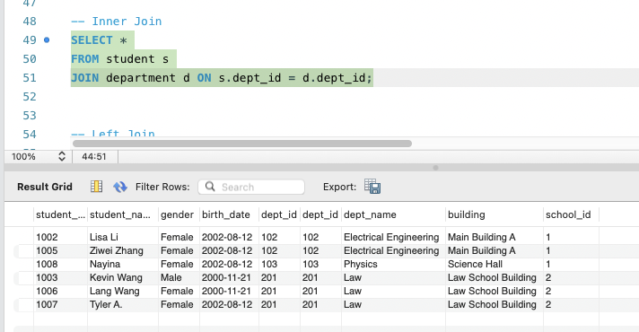
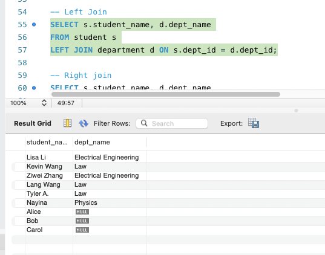
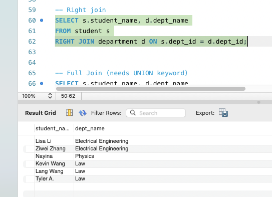
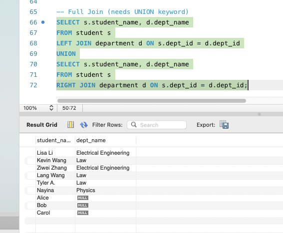

#### Please try attached SQL queries (with same data and schema setup as above), explain why we need join keyword, and compare inner join, left join, right join, and full join. Write your answers with screenshots in your markdown file.  

### explain why we need join keyword, and compare inner join, left join, right join, and full join.

##### 1. JOIN VS Manual JOIN 

Implicit JOIN -- Manual JOIN  
Implicit JOIN uses concise syntax, but mixes join and filter logic—making it easy to omit conditions and produce Cartesian products—and doesn’t support outer joins.

Explicit JOIN -- JOIN  
Explicit JOIN separates join and filter logic and supports various join types

**Result**  
   

##### 2. Manual 'JOIN' NO WHERE  VS INNER JOIN

Manual join: A Manual JOIN lists multiple tables separated by commas in the FROM clause and places the join predicates in the WHERE clause. It first computes the Cartesian product of the tables, then filters rows according to the WHERE conditions.  
Without a WHERE clause, a manual join produces the Cartesian product of the tables—that is, every row of the first table paired with every row of the second (and so on).  
  

INNER JOIN: It returns all rows from two (or more) tables that satisfy the specified join condition, and by default excludes any rows that don’t match in either table.  
In this case, it joining only rows where s.dept_id = d.dept_id and d.school_id = sc.school_id  

Compare:  
A manual (implicit) JOIN essentially produces a Cartesian product of the tables, whereas an INNER JOIN applies matching conditions to filter that product and retain only logically related rows, so we should use INNER JOIN to ensure correct and efficient results.

##### 3. Inner Join  
  
INNER JOIN: takes the Cartesian product of the two tables and then filters it by the ON condition, returning only rows that logically match.  
ON s.dept_id = d.dept_id is the join predicate: only rows where s.dept_id equals d.dept_id are paired and returned.

##### 4. Left Join  
  
LEFT OUTER JOIN: Performs a LEFT OUTER JOIN of student (the “left” table) with department. All students appear in the output—even those without a valid department (e.g., Alice, Bob, Carol)—with their dept_name shown as NULL.   
Retrieves every row from student.  
Attempts to match each s.dept_id with d.dept_id in department.  
If a match exists, returns dept_name; if not, returns NULL for the department columns.  

##### 5. Right join  
  
RIGHT JOIN: A RIGHT JOIN returns all rows from the right table and the matching rows from the left table; non-matching rows in the left table are filled with NULL. This case it anchors on the right table (department d), ensuring all department rows appear.  
The ON s.dept_id = d.dept_id clause matches students to departments; if no match exists, student_name is returned as NULL.  

##### 6. Full Join (needs UNION keyword)  
  
A FULL [OUTER] JOIN returns all rows from both tables: it merges rows that satisfy the ON condition, fills NULL for unmatched columns on the left side when there’s no match in the right table, and vice versa.  

