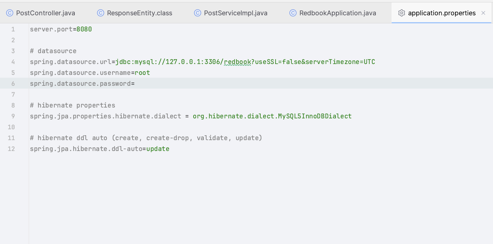
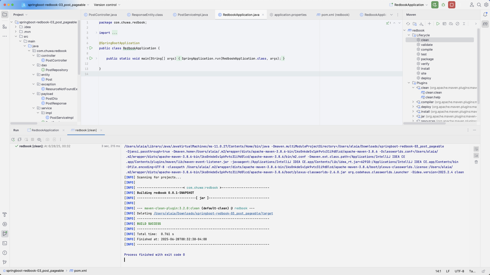
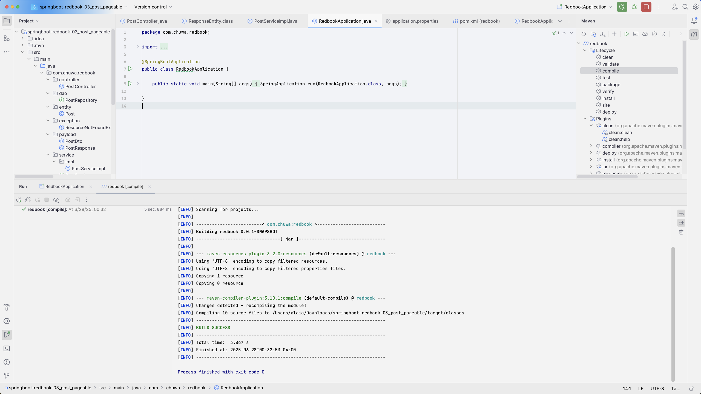
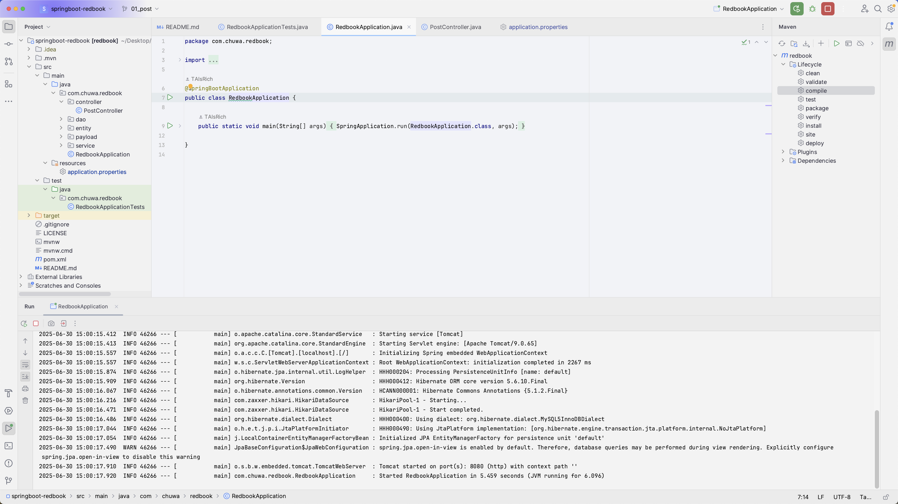
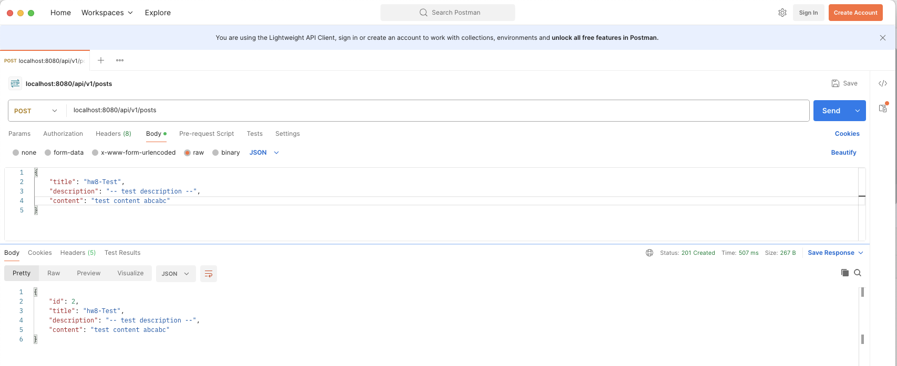

## SpringBoot Redbook Setup
Hands on:  
1. clone redbook repository and import to IntelliJ (as a maven project)  
2. modify your application.proerties file.  
3. maven clean and compile.  
4. run the application.  
5. create a postman request to generate a record in database  

#### (1) application.proerties file  


#### (2) maven clean and compile




#### (3) Application running  



#### (4) Postman Testing request  



### Questions:
#### 1. Did you create the table POSTS in the database? if not, who did it for you? Can I change this behavior? (Hint: look at the application.properties file)  
**A**: No. Spring Boot’s integration with Hibernate will automatically generate or update the database schema at startup 

```java
# hibernate ddl auto (create, create-drop, validate, update)
spring.jpa.hibernate.ddl-auto=update

```
**A**: Yes, we can change this behavior. We can do it by changing the spring.jpa.hibernate.ddl-auto properties.  
We could pick one of these modes:
- none: don’t alter the database at all (must manage tables oneself)

- validate: check that the existing schema matches the entities but don’t apply any changes

- update: modify the schema to match the entity classes (this is your current setting)

- create: drop and recreate the schema every time the app launches

- create-drop: same as create, and also drop the schema when the app shuts down


#### 2. Is your id in the database same as what you set in your request? why does this happen? (Hint: search the annotations used in your code)
**A**: No.
```java
@Id
@GeneratedValue(strategy = GenerationType.IDENTITY)
private Long id;
```

This marks the field as the entity’s primary key and tells JPA/Hibernate to use the database’s IDENTITY (auto-increment) strategy to generate its value upon insertion.
