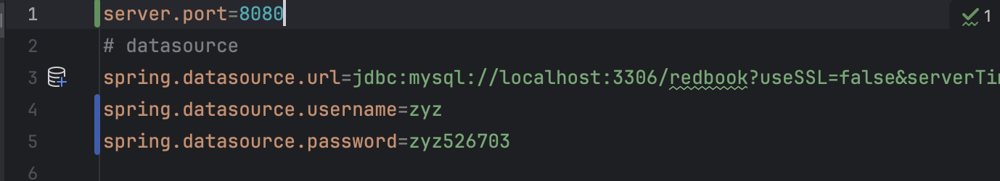
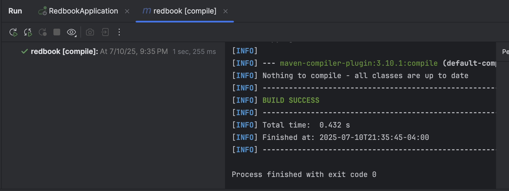
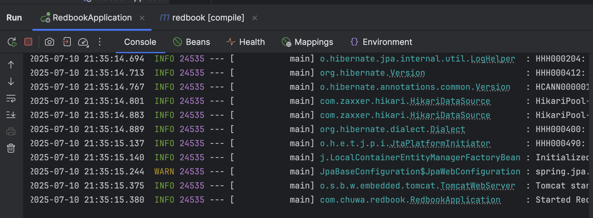
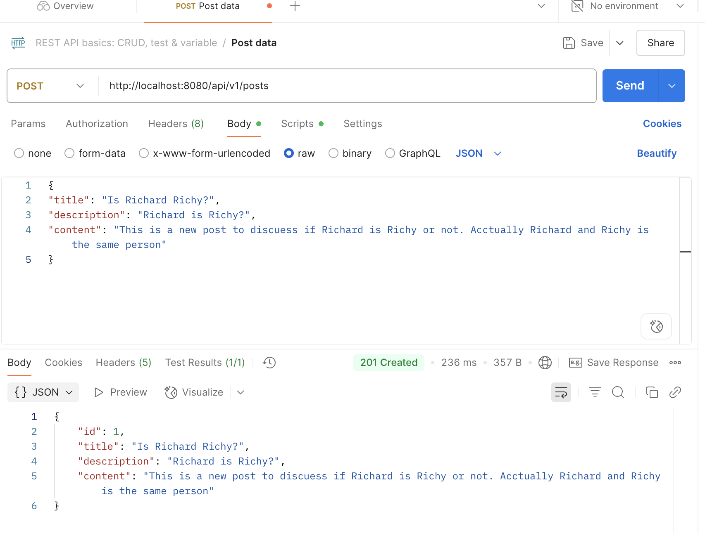
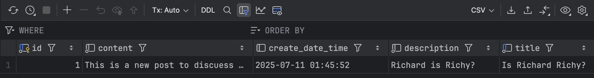
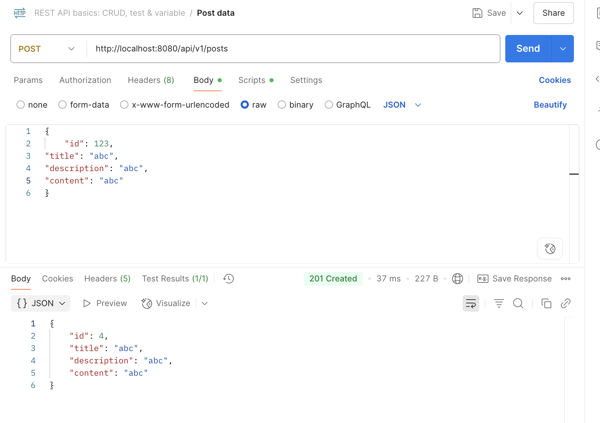

Changes: 

mvn: 

app run: 

postman: 

Database record: 

Questions:
1. Did you create the table POSTS in the database? if not, who did it for you? Can I change this behavior? (Hint: look at the application.properties file)

No, Java Spring created the database automatically using Hibernate as we set ```spring.jpa.hibernate.ddl-auto=update``` To change behavior we can set ddl-auto to create, create-drop, validate, or none.

2. Is your id in the database same as what you set in your request? why does this happen? (Hint: search the annotations used in your code)


No, the id is not the same even set explicitly. Post.java explicitly sets 
```
@Id
@GeneratedValue(strategy = GenerationType.IDENTITY)
private Long id;
```
that forces automatically generated id for IDENTITY type.