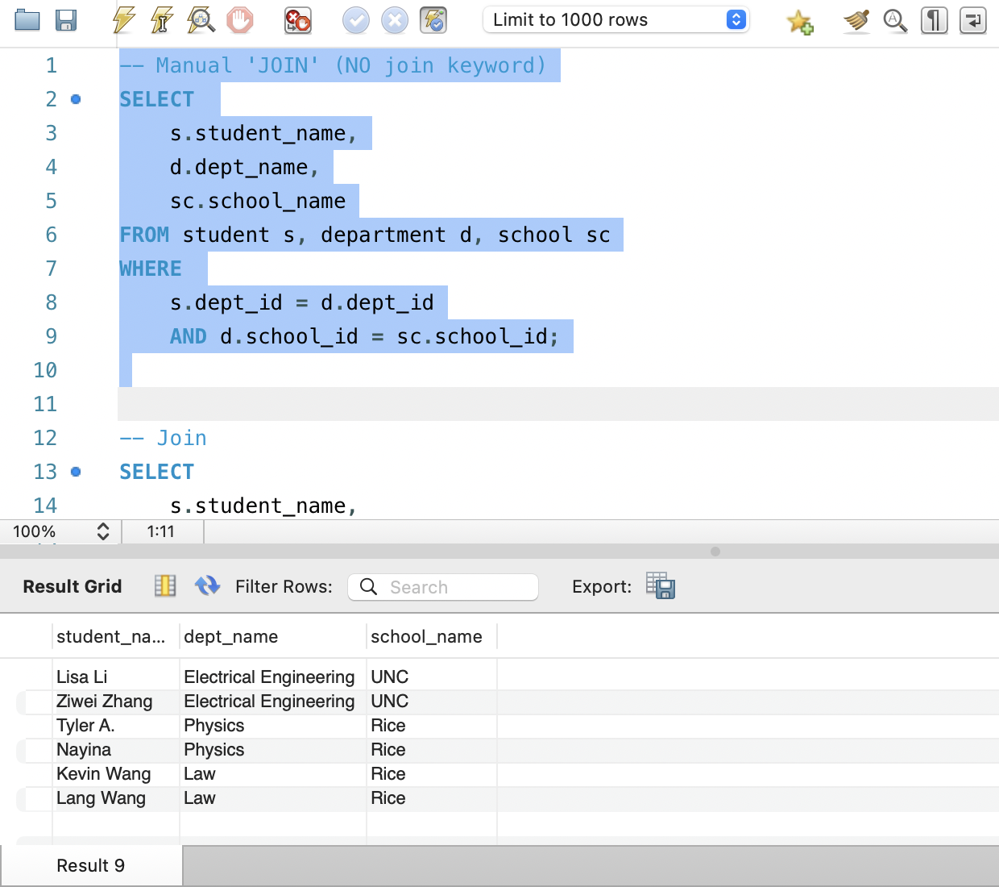
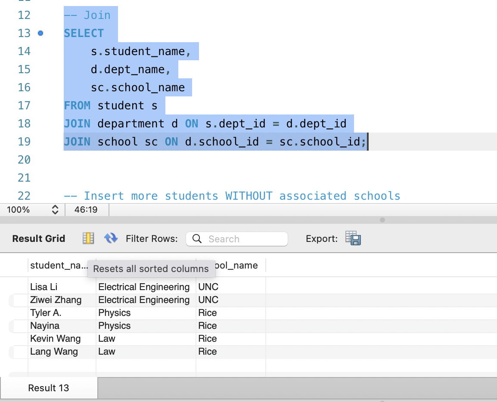
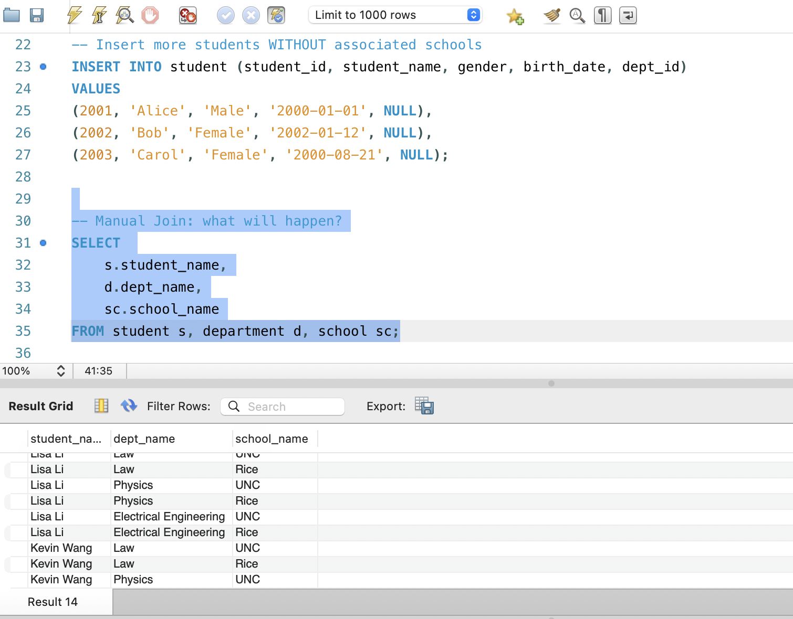
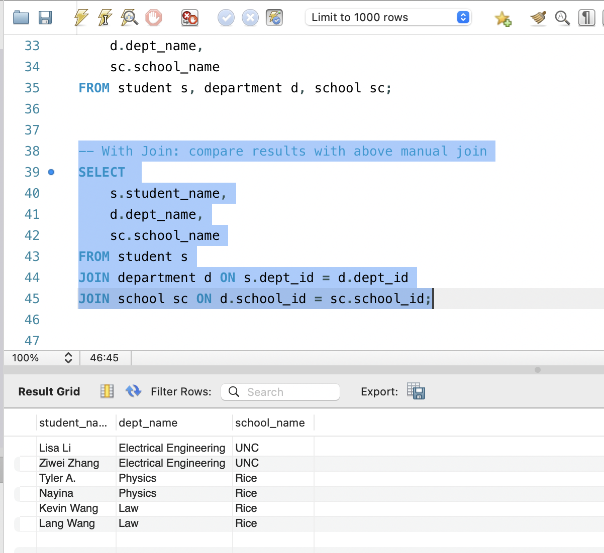

Manual join: 

Join: 

Manual join2: 
No JOIN clause and result will contain every student with every department with every school.

Join2: 
Only students with s.dept_id = d.dept_id and d.school_id = sc.school_id; are returned.

JOIN explicitly sets the join rule with ON clause that prevents the risk of forgetting the WHERE clause when using implicit join.

Inner join: 
Combines student and department table with s.dept_id = d.dept_id;

Left join: 
All rows from left table with matching in the right table.

Right join: 
All rows from right table with matching in the left table.

Full join: 
All matching rows from left and right table (left UNION right)