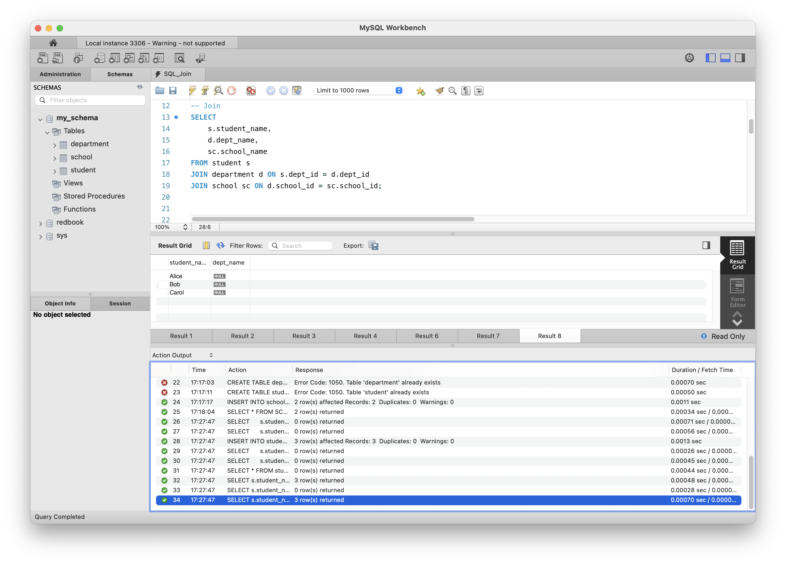

## Why we need `JOIN`

Data is usually split across tables. `JOIN` lets us bring those tables together so we can ask questions that span them—like “which student belongs to which department and school?” Without a join we’d have to run several separate queries and merge the results by hand.

### Join cheat‑sheet

| JOIN          | What you get                                                            |
|---------------|-------------------------------------------------------------------------|
| `INNER JOIN`  | Only rows that match in **both** tables                                 |
| `LEFT JOIN`   | All rows from the **left** table, plus matches from the right (no match → `NULL`) |
| `RIGHT JOIN`  | All rows from the **right** table, plus matches from the left           |
| `FULL JOIN`*  | Every row from both tables—matched rows once, unmatched rows with `NULL`s |

\* MySQL doesn’t have a native `FULL JOIN`; use `LEFT JOIN … UNION RIGHT JOIN …`.

### Example (see screenshot)

```sql
SELECT
    s.student_name,
    d.dept_name,
    sc.school_name
FROM student s
JOIN department d  ON s.dept_id  = d.dept_id      -- INNER JOIN
JOIN school     sc ON d.school_id = sc.school_id;
```

This returns the three students whose departments and schools exist (Alice, Bob, Carol in the screenshot).  

- If we change the first `JOIN` to `LEFT JOIN`, we’d also see students whose `dept_id` is missing, with `NULL` for `dept_name` and `school_name`.  
- Swapping to `RIGHT JOIN` flips the logic.  
- Combine `LEFT` and `RIGHT` with `UNION` to mimic a `FULL JOIN`.


## Screenshot

Below is the screenshot showing the result of the join query:


