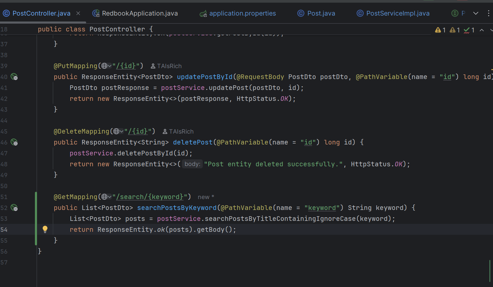
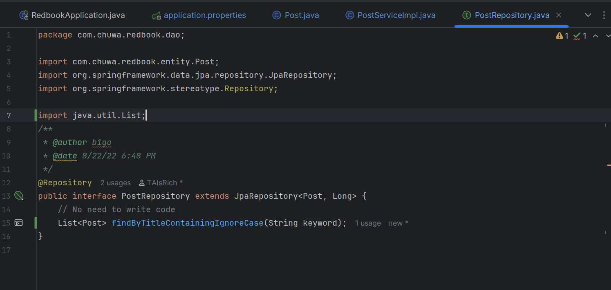
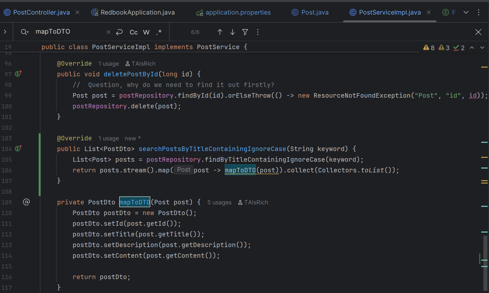
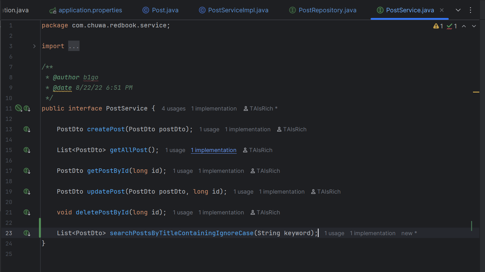
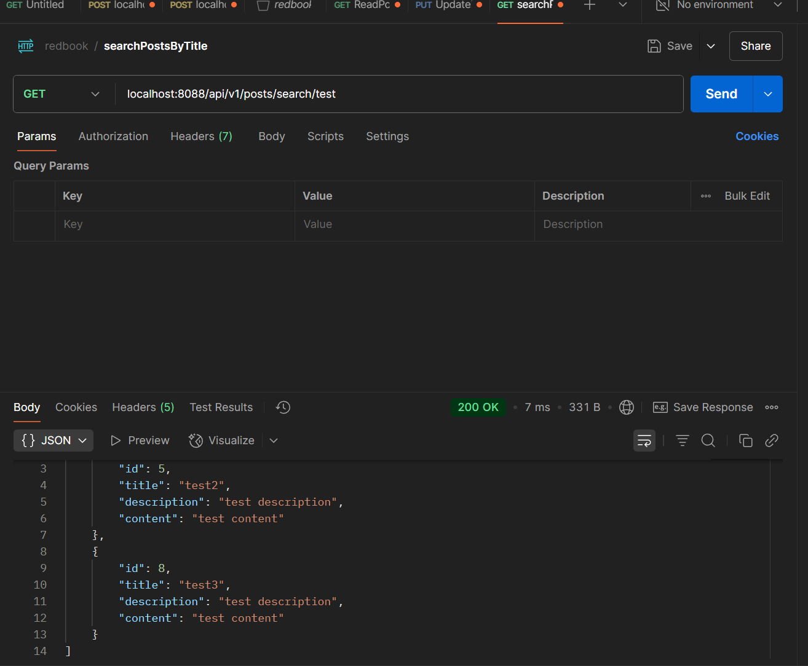
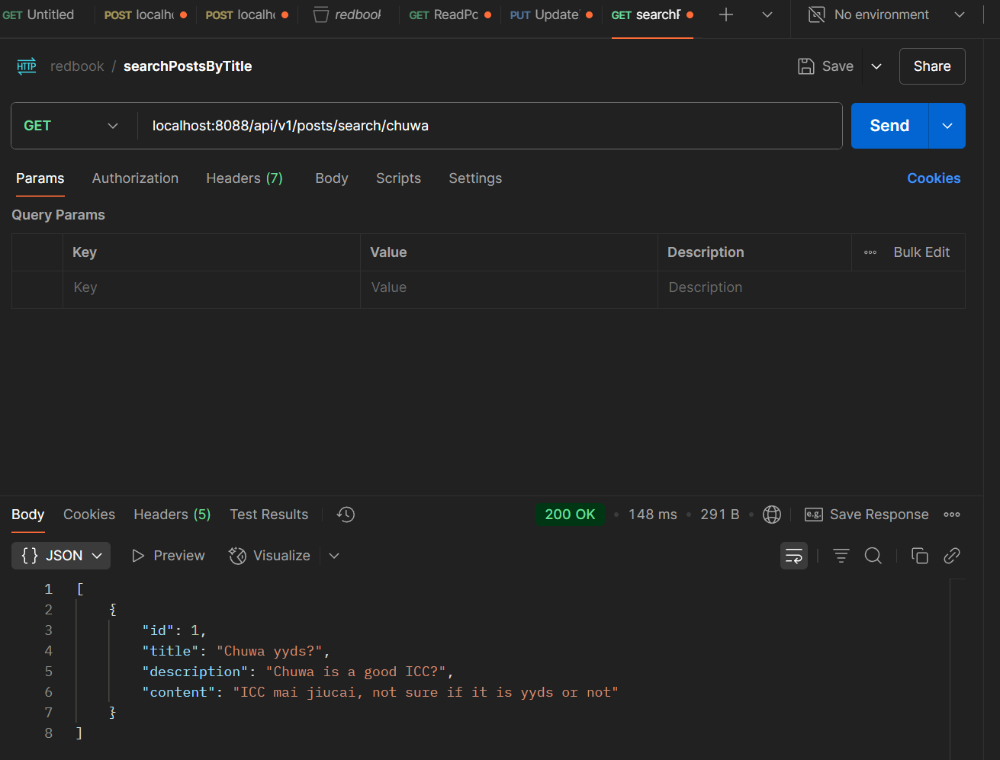

## HW9 – Homework Submission

### 1. Why is it better to use a custom exception class (e.g. `ResourceNotFoundException`)?

* **Better Error Handling** – Instead of throwing every type of error as one we can categorize type of erros
* **Meaningful Error Messages** – we can customize the return error messages for debug and maintainance
* **Proper HTTP Status Codes** – We can map specific HTTP error status code to the responses instead of throwing back 500 every time

### 2. Explain how `@Table`, `@Column`, and `@Id` work. What is the default behaviour if you don’t use them?

* **`@Table Annotation:`** Maps the entity class to a database table and Specifies table name and constraints
    * ***`Table name:`*** posts (instead of default Post)
    * ***`Unique constraint:`***: The title column must be unique across all records

if omitted JPA uses the entity class name converted by the current naming strategy (e.g., `Post` → `post`).

* **`@Column Annotation:`** Maps a field to a database column and Specifies column properties (name, nullable, length, etc.)
    * ***`Column names:`*** title, description, content (snake_case)
    * ***`Nullable:`*** false (NOT NULL constraint)
    * ***`Default length:`*** 255 characters for String fields
Without it, JPA uses the entity class name converted into camelCase

* **`@Id Annotation`** – Marks a field as the primary key
and is Required for JPA entities

    * ***`Primary key:`*** id field
    * ***`NAuto-generation:`*** MySQL AUTO_INCREMENT
    * ***`Strategy:`*** IDENTITY (database generates the value)

Without it, JPA would cause an error

### 3. What happens if you don’t annotate a class with `@Entity`, but still try to save it with JPA?

The class isn’t part of the persistence context. Trying to pass an unmanaged object to `EntityManager.persist()` or a Spring Data repository throws `IllegalArgumentException: Not an entity`. Hibernate also logs that the class is unmapped when the session factory starts.

#### JPA Entity Scanning Process

1. **Startup** – Spring Boot scans for `@Entity` classes.
2. **Registration** – Only classes annotated with `@Entity` are registered with Hibernate.
3. **Runtime** – When you attempt to save, Hibernate looks up the entity.
4. **Failure** – If the class isn’t registered, Hibernate throws an exception.

### 4. What happens if we forget to annotate a controller with `@RestController` and only use `@RequestMapping`?

`@RestController` is a meta‑annotation wrapping `@Controller + @ResponseBody`. Without it:

* Spring still maps the request to the method (because of `@RequestMapping`).
* But the return value is resolved **as a view name**, not serialized JSON.

### 5. What is JPA’s default naming strategy when no explicit table/column name is given?

Hibernate’s default is camel case **`PhysicalNamingStrategyStandardImpl`**, which leaves names unchanged: `Post` → `Post`, `createdAt` → `createdAt`. Spring Boot can auto‑switch to `SpringPhysicalNamingStrategy`, translating camel‑case to snake‑case (`Post` → `post`, `createdAt` → `created_at`) if `spring.jpa.hibernate.naming.physical-strategy` isn’t overridden.

### 6. How does `@PathVariable` differ from `@RequestParam`?

| Aspect    | `@PathVariable`                            | `@RequestParam`                                       |
| --------- | ------------------------------------------ | ----------------------------------------------------- |
| Location  | Part of the **URL path** (`/posts/{id}`)   | After the `?` in the **query string** (`/posts?id=1`) |
| Use cases | Identify a specific resource               | Optional filters, pagination, sorting                 |
| Decoding  | Matched by position / name in URI template | Parsed like key‑value pairs                           |

---

## Hands‑On: find posts whose title contains a keyword

### Repository method

### Screenshots

1. **File changes in IntelliJ**
   

   

   

   

2. **Postman query and DB results**
   
   

