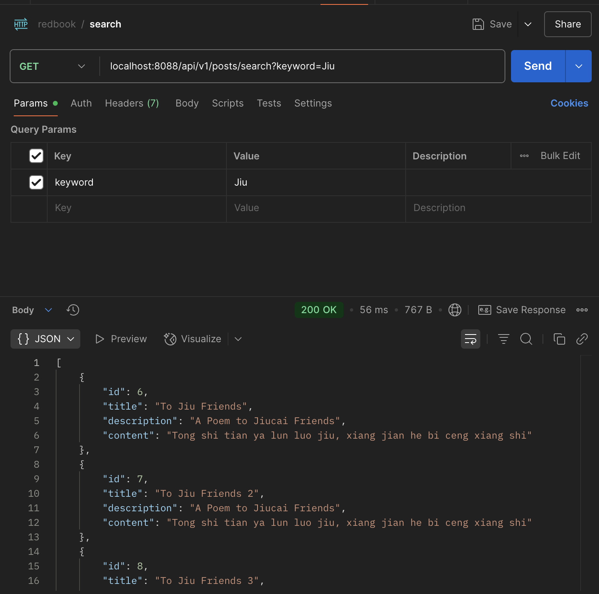

## HW 9

#### 1. Why is it better to use a custom exception class (e.g. ResourceNotFoundException ) in your application?

**1. Semantic Clarity and Intent**
Instead of throwing a generic `RuntimeException` or `IllegalArgumentException`, custom exception immediately communicates the specific problem. This makes the code self-documenting and easier for other developers to understand.

**2. Structured Exception Information**
The custom exception encapsulates relevant context:
```java
private String resourceName;  // "Post"
private String fieldName;     // "id" 
private long fieldValue;      // 123
```
This structured data is invaluable for logging, debugging, and providing meaningful error messages to clients.

**3. HTTP Status Code Integration**
The `@ResponseStatus(value = HttpStatus.NOT_FOUND)` annotation automatically maps this exception to a 404 response. This eliminates boilerplate in controllers and ensures consistent HTTP semantics across the API.


#### 2. Explain how `@Table` , `@Column` , and `@Id` work. What is the default behavior if you don’t use them?
In JPA/Hibernate, these annotations control how your entity classes map to database tables and columns.

**@Table**
```java
@Table(
    name = "posts",
    uniqueConstraints = {
         @UniqueConstraint(columnNames = {"title"})
    }
)
```
Controls table-level mapping. Default behavior without @Table: Hibernate uses the entity class name as the table name. So `Post` class would map to a table named `Post` . 
(Without explicit annotations, field names become column names, class names become table names)

 **@Column**
Maps entity fields to specific database columns:
```java
@Column(name = "title", nullable = false)
private String title;
```
Default behavior without @Column: Hibernate uses the field name as the column name. So `private String title` would map to a column named `title`. All columns are nullable by default (`nullable = false`) unless you specify constraints. (Always be explicit with these annotations in production code to avoid naming conflicts and make your intent clear)

 **@Id**
Marks the primary key field:
```java
@Id
@GeneratedValue(strategy = GenerationType.IDENTITY)
private Long id;
```
**No default behavior**: @Id is mandatory. Every JPA entity must have exactly one field marked with @Id, otherwise you'll get a runtime exception during entity scanning.
**@GeneratedValue**: Usually paired with @Id to define how primary keys are generated. IDENTITY means database auto-increment.


#### 3. What happens if you don’t annotate a class with @Entity , but still try to save it with JPA?

The key error message is: `Not a managed type: class com.chuwa.redbook.entity.Post`
This happens during application startup, not at runtime when you try to save. Here's the sequence:

- Spring Boot starts up and scans for JPA repositories
- Spring Data JPA tries to create your `PostRepository` bean
- JPA Repository Factory attempts to analyze the generic type `JpaRepository<Post, Long>`
- Hibernate's Metamodel looks for the `Post` entity in its managed types registry
- Fails because `Post` isn't annotated with @`Entity`, so it was never registered as a managed type


#### 4. What happens if we forget to annotate a controller with @RestController and only use  @RequestMapping ?

- Spring won't recognize it as a controller 
  - Without @Controller or @RestController, Spring's component scanning won't register this class as a Spring-managed bean or web controller.
- No request mapping registration 
  - Spring won't process the @RequestMapping annotations because the class isn't identified as a controller component.
- 404 Not Found errors 
  - All endpoints will return HTTP 404 because Spring's DispatcherServlet has no knowledge of these request mappings.
```json
{
    "timestamp": "2025-07-01T22:36:01.055+00:00",
    "status": 404,
    "error": "Not Found",
    "path": "/api/v1/posts"
}
```


#### 5. What is the default naming strategy of JPA for tables and columns when no explicit name is given?
For Tables: 
- The entity class name is used as the table name
- By default, it uses the exact class name, e.g., 
  - Post class → post table
  - camelCase to snake_case: UserProfile → user_profile

For Columns:

- Field names are used as column names
- Similar naming conversion applies e.g., firstName → first_name

```java
@Table(name = "posts")  // Explicit table name
@Column(name = "title", nullable = false)  // Explicit column name
```

#### 6. How does @PathVariable differ from @RequestParam
In Spring Boot, @PathVariable and @RequestParam are both used to extract data from HTTP requests

@PathVariable:

- Extracts values from the URL path itself 
- Used when the parameter is part of the URL structure
- Typically used in RESTful APIs for resource identification
- The parameter is mandatory by default

@RequestParam:

- Extracts values from query parameters (after the ? in the URL), used for `optional` parameters or filtering/pagination
- Parameters can be made optional with `required = false`, and can have default values

```java
// @PathVariable example
@GetMapping("/{id}")
public ResponseEntity<PostDto> getPostById(@PathVariable(name = "id") long id) {
    return ResponseEntity.ok(postService.getPostById(id));
}

// @RequestParam example 
@GetMapping
public List<PostDto> getAllPosts(@RequestParam(value = "page", defaultValue = "0") int page,
                                @RequestParam(value = "size", defaultValue = "10") int size) {
```

### Hands on:  
Write a method in a repository to find all posts with the title containing a certain keyword. (Create some  test posts if necessary) share screen shots in your mark down file.

