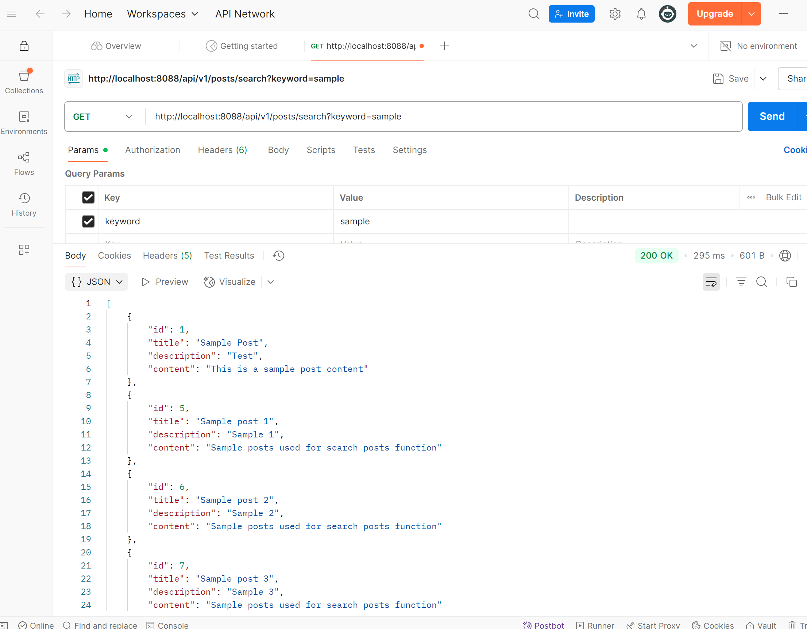

**1. Why is it better to use a custom exception class (e.g. `ResourceNotFoundException` ) in your application?**
   1. Clarity and specificity: customer exceptions make it clear what type of error occurred, improving code readabiliy and debugging
   2. Granular Error Handling: Allows for more precise exception handling, enabling different responses or actions for different exceptions
   3. Consistency: helps maintain a consistent structure for error handling throughout the application 
   4. Better Integration: custom excepions can be easily integrated with frameworks like Spring, allowing for custom error responses
   
**2. Explain how `@Table` , `@Column` , and  `@Id` work. What is the default behavior if you don’t use them?**
   @Table: Specifies the table name in the database that the entity maps to
   @Column: maps a specific field to a column in the datbase and allows customization
   @Id: marks a field as the primary key of the entity

**3. What happens if you don’t annotate a class with `@Entity` , but still try to save it with JPA?**
   If a class is not recognize it as an entity, and any attempt to persist it will result in a runtime exception. The class will not be maaped to a database table and its fields will not be presisted.

**4. What happens if we forget to annotate a controller with `@RestController` and only use `@RequestMapping` ?**
   If a controller is not annotated with   `@RestController`, the controller will not automatically serialize the returned objects into JSON or XML. Instead, it will return a view name (If using Spring MVC's `ModelAndView` mechanism). To return JSON or XML responses, we would need to explicitly annotate the method with `@ResponseBody`.

**5. What is the default naming strategy of JPA for tables and columns when no explicit name is given?**
    The default naming strategy of JPA depends on the implementation. By default, the table name is derived from the entity class name, converted to lowercase or snake_case. The column name is derived from the field name, also converted to lowercase or snake_case.

**6. How does `@PathVariable` differ from `@RequestParam` ?**
    `@PathVariable`: Used to extract values from the URI path. Typically used for RESTful URLs.
    `@RequestParam`: Used to extract query parameters from the URL. Typically used for optional or additional parameters.

    `@PathVariable` is for extract vaues from the path, while `@RequestParam` is for extracting values from query parameters.


Hands on: 
1. Write a method in a repository to find all posts with the title containing a certain keyword. (Create some test posts if necessary) share screen shots in your mark down file. 

```java

//PostController.java

package com.chuwa.redbook.controller;

import com.chuwa.redbook.payload.PostDto;
import com.chuwa.redbook.service.PostService;
import org.springframework.beans.factory.annotation.Autowired;
import org.springframework.http.HttpStatus;
import org.springframework.http.ResponseEntity;
import org.springframework.web.bind.annotation.*;

import java.util.List;

/**
 * @author b1go
 * @date 8/22/22 7:14 PM
 */
@RestController
@RequestMapping("/api/v1/posts")
public class PostController {

    @Autowired
    private PostService postService;

    @PostMapping
    public ResponseEntity<PostDto> createPost(@RequestBody PostDto postDto) {
        PostDto postResponse = postService.createPost(postDto);
        return new ResponseEntity<>(postResponse, HttpStatus.CREATED);
    }

    @GetMapping
    public List<PostDto> getAllPosts() {
        return postService.getAllPost();
    }

    @GetMapping("/{id}")
    public ResponseEntity<PostDto> getPostById(@PathVariable(name = "id") long id) {
        return ResponseEntity.ok(postService.getPostById(id));
    }

    @PutMapping("/{id}")
    public ResponseEntity<PostDto> updatePostById(@RequestBody PostDto postDto, @PathVariable(name = "id") long id) {
        PostDto postResponse = postService.updatePost(postDto, id);
        return new ResponseEntity<>(postResponse, HttpStatus.OK);
    }

    @DeleteMapping("/{id}")
    public ResponseEntity<String> deletePost(@PathVariable(name = "id") long id) {
        postService.deletePostById(id);
        return new ResponseEntity<>("Post entity deleted successfully.", HttpStatus.OK);
    }

    @GetMapping("/search")
    public ResponseEntity<List<PostDto>> searchPosts(@RequestParam String keyword){
        List<PostDto> posts = postService.getPostByKeyword(keyword);
        return new ResponseEntity<>(posts, HttpStatus.OK);
    }

}


//PostService.java
package com.chuwa.redbook.service;

import com.chuwa.redbook.payload.PostDto;

import java.util.List;

/**
 * @author b1go
 * @date 8/22/22 6:51 PM
 */
public interface PostService {

    PostDto createPost(PostDto postDto);

    List<PostDto> getAllPost();

    PostDto getPostById(long id);

    PostDto updatePost(PostDto postDto, long id);

    void deletePostById(long id);

    List<PostDto> getPostByKeyword(String keyword);
}

//PostServiceImpl.java
package com.chuwa.redbook.service.impl;

import com.chuwa.redbook.dao.PostRepository;
import com.chuwa.redbook.entity.Post;
import com.chuwa.redbook.exception.ResourceNotFoundException;
import com.chuwa.redbook.payload.PostDto;
import com.chuwa.redbook.service.PostService;
import org.springframework.beans.factory.annotation.Autowired;
import org.springframework.stereotype.Service;

import java.util.List;
import java.util.Optional;
import java.util.stream.Collectors;

/**
 * @author b1go
 * @date 8/22/22 6:56 PM
 */
@Service
public class PostServiceImpl implements PostService {

    @Autowired
    private PostRepository postRepository;

    @Override
    public PostDto createPost(PostDto postDto) {
        // 把payload转换成entity，这样才能dao去把该数据存到数据库中。
//        Post post = new Post();
//        if (postDto.getTitle() != null) {
//            post.setTitle(postDto.getTitle());
//        } else {
//            post.setTitle("");
//        }
//        post.setDescription(postDto.getDescription());
//        post.setContent(postDto.getContent());
        // 此时已成功把request body的信息传递给entity

        // covert DTO to Entity
        Post post = mapToEntity(postDto);

        // 调用Dao的save 方法，将entity的数据存储到数据库MySQL
        // save()会返回存储在数据库中的数据
        Post savedPost = postRepository.save(post);

        // 将save() 返回的数据转换成controller/前端 需要的数据，然后return给controller
//        PostDto postResponse = new PostDto();
//        postResponse.setId(savedPost.getId());
//        postResponse.setTitle(savedPost.getTitle());
//        postResponse.setDescription(savedPost.getDescription());
//        postResponse.setContent(savedPost.getContent());

        PostDto postResponse = mapToDTO(savedPost);

        return postResponse;
    }

    /**
     * 此处练习了lambda， stream API
     * @return
     */
    @Override
    public List<PostDto> getAllPost() {
        List<Post> posts = postRepository.findAll();
        List<PostDto> postDtos = posts.stream().map(post -> mapToDTO(post)).collect(Collectors.toList());
        return postDtos;
    }

    /**
     * 此处顺便练习Optional
     * @param id
     * @return
     */
    @Override
    public PostDto getPostById(long id) {
//        Optional<Post> post = postRepository.findById(id);
//        post.orElseThrow(() -> new ResourceNotFoundException("Post", "id", id));

//        Post post = postRepository.findById(id).get();

        Post post = postRepository.findById(id).orElseThrow(() -> new ResourceNotFoundException("Post", "id", id));

        return mapToDTO(post);
    }

    @Override
    public PostDto updatePost(PostDto postDto, long id) {
        //  Question, why do we need to find it out firstly?
        Post post = postRepository.findById(id).orElseThrow(() -> new ResourceNotFoundException("Post", "id", id));
        post.setTitle(postDto.getTitle());
        post.setDescription(postDto.getDescription());
        post.setContent(postDto.getContent());

        Post updatePost = postRepository.save(post);
        return mapToDTO(updatePost);
    }

    @Override
    public void deletePostById(long id) {
        //  Question, why do we need to find it out firstly?
        Post post = postRepository.findById(id).orElseThrow(() -> new ResourceNotFoundException("Post", "id", id));
        postRepository.delete(post);
    }

    private PostDto mapToDTO(Post post) {
        PostDto postDto = new PostDto();
        postDto.setId(post.getId());
        postDto.setTitle(post.getTitle());
        postDto.setDescription(post.getDescription());
        postDto.setContent(post.getContent());

        return postDto;
    }

    private Post mapToEntity(PostDto postDto){
        Post post = new Post();
        post.setTitle(postDto.getTitle());
        post.setDescription(postDto.getDescription());
        post.setContent(postDto.getContent());

        return post;
    }

    public List<PostDto> getPostByKeyword(String keyword){
        List<Post> posts = postRepository.findByTitleContainingIgnoreCase(keyword);
            List<PostDto> postDtos = posts.stream().map(this::mapToDTO).collect(Collectors.toList());
            return postDtos;
    }
}


//PostRepository
package com.chuwa.redbook.dao;

import com.chuwa.redbook.entity.Post;
import org.springframework.data.jpa.repository.JpaRepository;
import org.springframework.stereotype.Repository;

import java.util.List;
import java.util.Optional;

/**
 * @author b1go
 * @date 8/22/22 6:48 PM
 */
@Repository
public interface PostRepository extends JpaRepository<Post, Long> {
    // No need to write code
    List<Post> findByTitleContainingIgnoreCase(String keyword);
}


```


