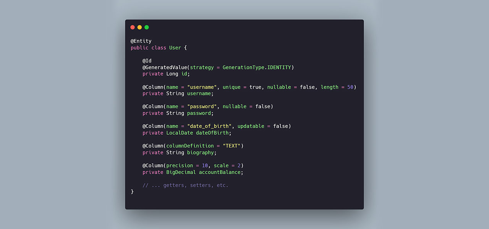
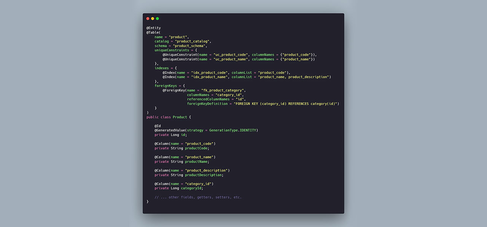
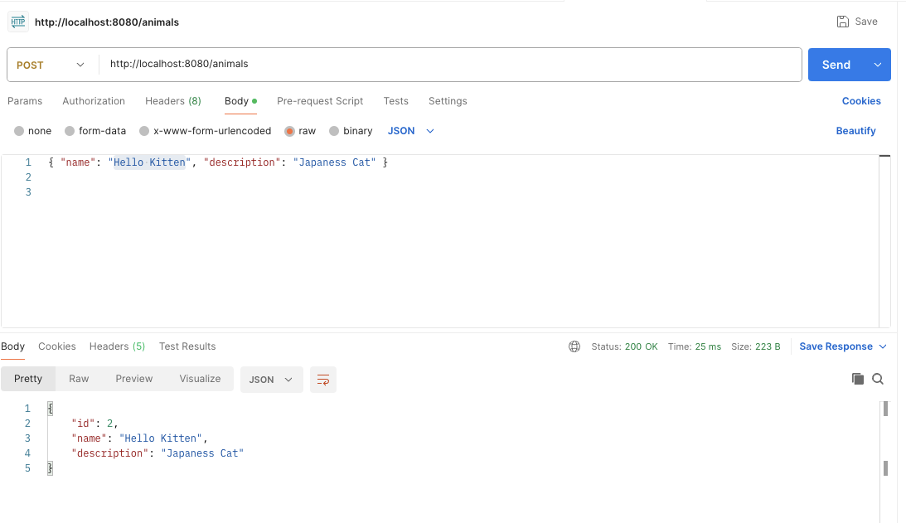
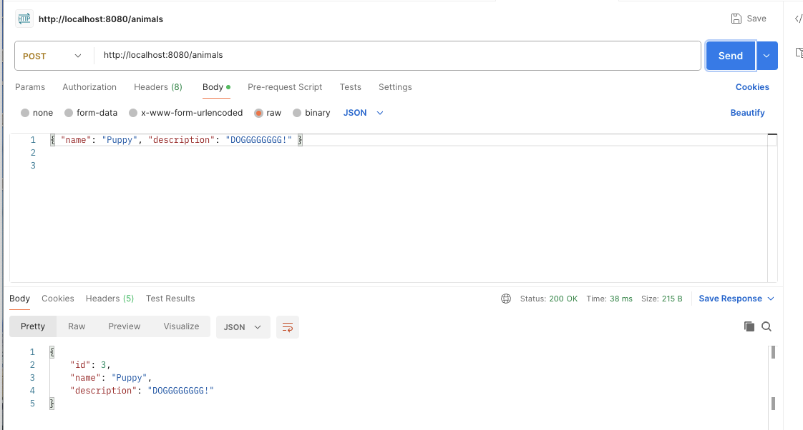
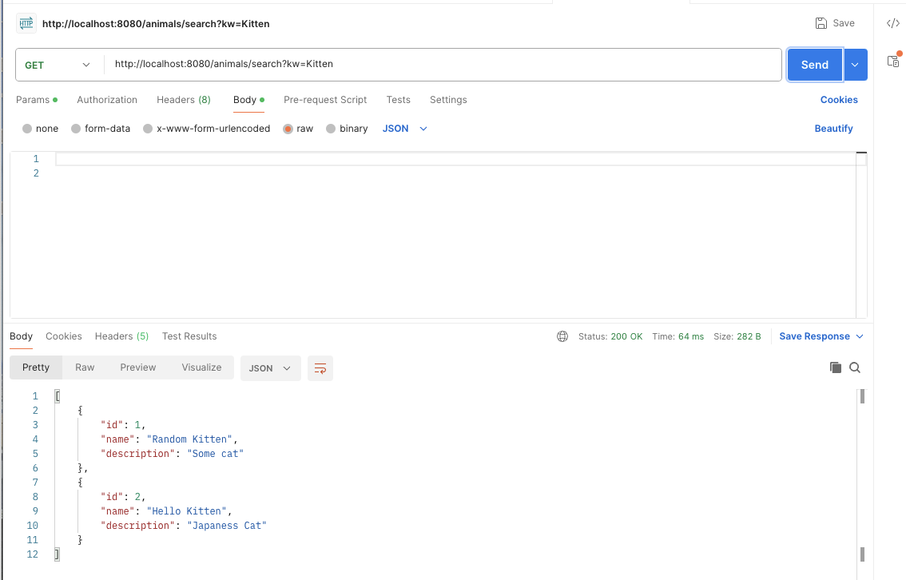

## HW9

#### 1. Why is it better to use a custom exception class (e.g. ResourceNotFoundException ) in your application?   [ref0](https://www.abstractapi.com/guides/other/spring-boot-exception-handling)   [ref1](https://medium.com/@bubu.tripathy/effective-exception-handling-6c0ce043d96f)  [ref2](https://heshanu97.medium.com/custom-exception-in-spring-boot-eac017209c69)   [ref3](https://stackoverflow.com/questions/62920296/implementing-custom-exceptions-in-spring-boot)

(1) Improved Code Readability  
Custom exceptions can communicate the intent of the error clearly. A ResourceNotFoundException is self-explanatory, makes the codebase easier to navigaet and maintain over time.

(2) More Precise Error Handling
Custom exceptions let you catch and respond to specific failure cases. For example, if a payment gateway fails, a PaymentFailedException can trigger a different recovery path than a DatabaseConnectionException, enabling smarter business logic.  

(3) Better API Design  -- explicit and consistent   
APIs become easier to consume when errors are explicit and consistent. Returning **error responses tied to specific exception types** (e.g., 404 for ResourceNotFoundException, 400 for InvalidInputException) helps frontend developers or third-party integrators quickly understand and respond to issues.  
explicit -- A ResourceNotFoundException is mapped to HTTP 404, meaning “the resource does not exist”; an InvalidInputException is mapped to HTTP 400, meaning “the request parameters are invalid.”
consistent -- Errors of the **same type** always return the **same status code** and the **same response‐body format**.  

(4) Encapsulation of Business Logic  
By defining exceptions for specific business rules, such as “User already registered” or “Insufficient account balance,” you encapsulate domain knowledge in a clear, reusable way. This helps keep business logic modular and testable.  

#### 2. Explain how @Table , @Column , and @Id work. What is the default behavior if you don’t use them? [ref](https://www.revocaresolutions.com/development/hibernate-jpa-annotations/#:~:text=The%20%40Table%20annotation%20in%20JPA,use%20to%20customize%20the%20mapping.)

- @Column: this annotation is used in JPA (Java Persistence API) to specify the mapped column for a persistent property or field. It comes with various attributes to define and customize the column's details in the database.  
  a list of the attributes available within the @Column annotation:  
  - name : Specifies the name of the column in the database.
  - unique : Indicates whether the column is a unique key.  
  - nullable : Indicates whether the database column is nullable.
  - insertable : Whether the column is included in SQL INSERT statements generated by the persistence provider.
  - updatable : Whether the column is included in SQL UPDATE statements generated by the persistence provider.
  - column Definition : Used to define the SQL fragment for the column definition.
  - length : Specifies the column length. Particularly useful for string values.
  - precision : The precision for a decimal (exact numeric) column. This represents the number of digits in a number.
  - scale : The scale for a decimal (exact numeric) column. This represents the number of digits to the right of the decimal point.
  - table : Indicates the specific table in the database where the column resides. This attribute becomes essential when the entity’s properties or fields are spread across multiple tables, allowing you to pinpoint which secondary table the column belongs to. 
Example: Here’s a sample entity (User) demonstrating various @Column attributes:  
    

- @Entity: this annotation defines that a class can be mapped to a table.  

- @Table: this annotation is used to specify the details of the table that will be used to persist an entity in the database. It has several attributes (or annotations within) that you can use to customize the mapping.  
  Some primary attributes you can use inside @Table:  
  - name : Specifies the name of the table.   
  - catalog : Specifies the catalog of the table. It’s mainly used when you want to define the catalog for DB schemas.   
  - schema : Specifies the schema of the table. Useful in databases that support schemas.    
  - unique Constraints : This allows you to specify that a particular combination of columns should have unique values. This is a way to define unique constraints on your table other than the primary key.  
  - indexes : Used to specify indexes on the table for performance optimization.    
  - foreign Keys : (Added in JPA 2.1) Allows defining foreign key constraints. Note that in many cases, the relationships like @ManyToOne or @OneToMany define the foreign keys, but this attribute gives you a way to provide further customizations.  
  - inherits : A rare attribute, usually related to inheritance strategies in JPA. Not a standard JPA attribute but can be found in some specific JPA implementations or extensions.  
  - applies To : Another non-standard attribute. It might be used in certain JPA extensions but not part of the core JPA spec.  
Example: (comprehensive example that integrates all of the attributes within the @Table annotation)  
  

- @Id: This annotation marks a field as the primary key of an entity. It is used by Hibernate and Spring Data JPA for object-relational mapping. When combined with @GeneratedValue, it enables automatic ID generation.

##### default behavior if you don’t use them
- @Id, the persistence provider will throw an exception at startup (e.g. org.hibernate.AnnotationException: No identifier specified for entity: …).  
- @Column: If you omit it, each field or property maps to a column with the exact same name as the Java field or getter method.  
- @Table: If you omit it, the entity maps to a table named after the class (as determined by JPA’s implicit naming strategy, e.g. the class name)  

#### 3. What happens if you don’t annotate a class with @Entity , but still try to save it with JPA?
A: JPA **only manages classes explicitly marked with @Entity**. If you try to save an object whose class isn’t annotated with @Entity, the **persistence provider doesn’t recognize it as an entity** and will **throw a runtime mapping error**.

eg: org.hibernate.MappingException: Unknown entity: com.example.YourClass

#### 4. What happens if we forget to annotate a controller with @RestController and only use @RequestMapping?
A: Spring won't instantiate the class as a bean or register it in the application context. All requests to those paths return 404

#### 5. What is the default naming strategy of JPA for tables and columns when no explicit name is given?  
Table Names:  
Default to the unqualified (simple) class name of the entity.  
Example: An entity com.example.User maps to table User.  

Column Names:  
Default to the exact field/property name of the entity.  
Example: A field firstName maps to column firstName.  
  
#### 6. How does @PathVariable differ from @RequestParam ?
@PathVariable:   
Extracts values from URI path segments, e.g. in /users/{id}, id is part of the path.  
Always required (URL structure breaks without it)      
Resource identification (/users/123, /products/abc)      

@RequestParam:     
Extracts values from query parameters - the key-value pairs **after the ?** in the URL.      
Can be optional with required = false or defaultValue.      
Filtering, pagination, optional parameters (/users?sort=name&page=1)    

### Hands on: 
#### Write a method in a repository to find all posts with the title containing a certain keyword. (Create some test posts if necessary)

Code in Coding repository.

(1) POST request: POST http://localhost:8080/animals  
Body (JSON): { "name": "Kitten", "description": "One and only King of the jungle" }  

(2) GET request -- find all posts with the title containing a certain keyword(Kitten in this example): GET http://localhost:8080/animals/search?kw=Kitten  
**Result:**  

