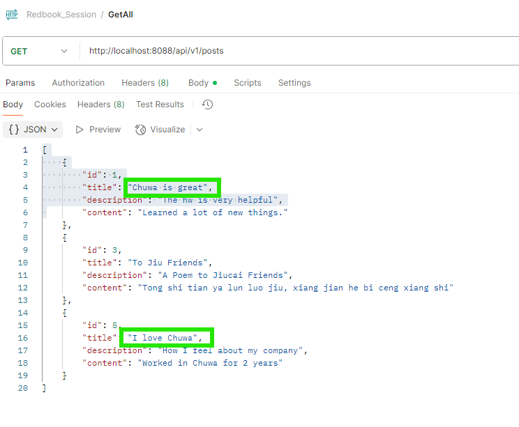
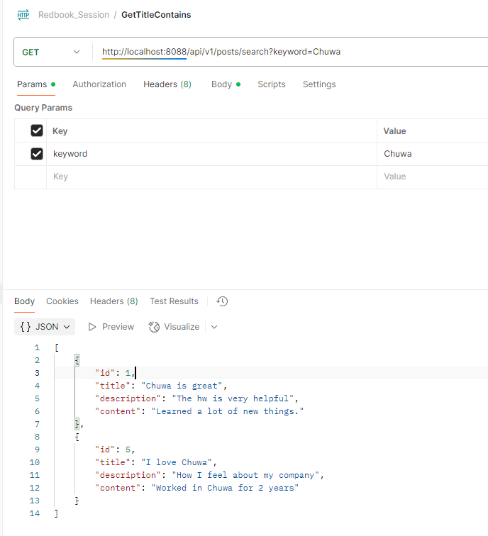

# Questions

## 1. Why is it better to use a custom exception class (e.g.  ResourceNotFoundException ) in your application?
为什么在应用程序中使用自定义异常类（例如 ResourceNotFoundException）更好？

### 1. Clear, descriptive error handling
清晰、描述性的错误处理
Using:
使用：
```java
throw new ResourceNotFoundException("Post", "id", id);
```
makes it clear what went wrong, specifying:
可以清楚地显示出错原因，具体说明：

which resource is missing (Post),
缺少哪个资源（ Post ）,

which field (id),
哪个字段（ id ）

which value (e.g., 5).
哪个值（例如， 5 ）。

Compared to using a generic RuntimeException, it improves clarity for both developers and API consumers.
与使用通用 RuntimeException 相比，它提高了开发者和 API 使用者的清晰度。

### 2. Allows centralized global exception handling
允许集中全局异常处理

With a custom exception, you can easily configure a @ControllerAdvice to globally handle and format responses consistently:使用自定义异常，您可以轻松配置一个 @ControllerAdvice 来全局处理和格式化响应，保持一致性：

```java
@ExceptionHandler(ResourceNotFoundException.class)
public ResponseEntity<ErrorDetails> handleResourceNotFoundException(ResourceNotFoundException ex) {
    ErrorDetails errorDetails = new ErrorDetails(LocalDateTime.now(), ex.getMessage(), ...);
    return new ResponseEntity<>(errorDetails, HttpStatus.NOT_FOUND);
}
```

This enables returning consistent error JSON with 404 instead of a generic 500 or a vague stack trace.
这使得能够返回一致的错误 JSON，用 404 代替通用的 500 或模糊的堆栈跟踪。

### 3. Avoids code duplication
避免代码重复

Instead of manually checking and returning different error responses in each controller/service:
与其在每个控制器/服务中手动检查并返回不同的错误响应：

```java
if (post == null) {
    throw new ResourceNotFoundException(...);
}
```
you centralize and reuse the exception.
你集中并重用异常。

### 4. Maps cleanly to HTTP status codes
清晰映射到 HTTP 状态码

`ResourceNotFoundException` naturally maps to: 
`ResourceNotFoundException` 自然映射到：

```java
HTTP 404 Not Found
```

You can create other exceptions like:你可以创建其他异常，如：

`BadRequestException` → `400 Bad Request`

`UnauthorizedExceptio`n → `401 Unauthorized`

`ConflictException` → `409 Conflict`

for a clean, RESTful design.为了实现简洁的 RESTful 设计。

### 5. Easier debugging and logging
更容易调试和记录日志

Custom exceptions allow:
自定义异常允许：

Including resource-specific context.
包含特定资源的上下文信息。

Consistent logging with clear messages in logs/monitoring tools.
使用日志文件/监控工具进行一致且清晰的记录。

Easier filtering and alerting in monitoring systems like ELK, Datadog, or CloudWatch.
在 ELK、Datadog 或 CloudWatch 等监控系统中更容易进行过滤和告警。

## 2. Explain how `@Table` , `@Column` , and  `@Id` work. What is the default behavior if you don’t use them?

### 1️⃣ @Table

✅ What it does:
✅ 它的作用：

Specifies the table in the database that the entity will map to.
指定实体将映射到的数据库表。

Placed at the class level.
位于类级别。

Syntax:
语法：

```java
@Entity
@Table(name = "posts")
public class Post { ... }
```

If you don’t use @Table:
如果你不使用 @Table ：

✅ The default behavior is:
✅ 默认行为是：

JPA will map the entity to a table with the same name as the class.
JPA 会将实体映射到与类名相同的表。

If your class is named Post, it will map to a table named Post (or post depending on your JPA naming strategy).
如果你的类名为 Post ，它将映射到名为 Post 的表（或根据你的 JPA 命名策略映射到 post ）

### 2️⃣ @Column

✅ What it does:
✅ 它的作用：

Specifies the column in the database table that the entity field will map to.
指定实体字段将映射到数据库表中的列。

Placed on fields or getters.
放在字段或获取器上。

Syntax:
语法：

```java
@Column(name = "post_title", nullable = false, length = 100)
private String title;
```

You can use it to:
您可以使用它来：

Change the column name in the table.
更改表中的列名。

Specify constraints like nullable, unique, length, precision, etc.
指定约束，如 nullable 、 unique 、 length 、 precision 等。

If you don’t use @Column:
如果你不使用 @Column :

✅ The default behavior is:
✅ 默认行为是：

JPA will map the field to a column with the same name as the field.
JPA 将字段映射到与字段同名的列。

If your field is title, the column will be title.
如果您的字段是 title ，列将是 title 。

### 3️⃣ @Id

✅ What it does:
✅ 它的作用：

Specifies the primary key of the entity.
指定实体的主键。

Must be applied to exactly one field or getter in the entity.
必须应用于实体的一个字段或获取器上。

Syntax:
语法：

```java
@Id
@GeneratedValue(strategy = GenerationType.IDENTITY)
private Long id;
```

It marks the field as the unique identifier for your entity.
它将字段标记为实体的唯一标识符。

You can pair it with @GeneratedValue to specify how the ID is generated (e.g., auto-increment).
你可以将其与 @GeneratedValue 配合使用，以指定 ID 的生成方式（例如，自动递增）。

If you don’t use @Id:
如果你不使用 @Id ：

🚩 JPA cannot manage your entity because:
🚩 JPA 无法管理您的实体，因为：

Every JPA entity requires a primary key.
每个 JPA 实体都需要一个主键。

If you omit @Id, you will get:
如果您省略 @Id ，您将得到：

```java
javax.persistence.PersistenceException: No identifier specified for entity
```


at runtime.
在运行时。

## 3. What happens if you don’t annotate a class with  @Entity , but still try to save it with JPA? 
如果你没有用 @Entity 注解一个类，但仍然尝试用 JPA 保存它，会发生什么？

Without @Entity, JPA will throw an error and refuse to save your object because it does not know how to map it to your database.
没有 @Entity ，JPA 将会抛出错误并拒绝保存您的对象，因为它不知道如何将其映射到您的数据库。

## 4. What happens if we forget to annotate a controller with @RestController and only use @RequestMapping ?
如果我们忘记用@RestController 注解控制器，而只使用@RequestMapping 会怎样？

Spring will not detect this class as a controller, and it will not handle any HTTP requests.
Spring 不会将这个类识别为控制器，它也不会处理任何 HTTP 请求。

| Case                                      | Result                                                                                       |
| ----------------------------------------- | -------------------------------------------------------------------------------------------- |
| **`@RequestMapping` only**                | 🚩 Nothing happens; Spring ignores the class, `404 Not Found`.                               |
| `@Controller` + `@RequestMapping`         | 🚩 Maps requests but interprets return values as view names unless `@ResponseBody` is added. |
| **`@RestController` + `@RequestMapping`** | ✅ Best practice for REST APIs; methods return JSON automatically.                            |


## 5. What is the default naming strategy of JPA for tables and columns when no explicit name is given?
JPA 在未给出显式名称时，表和列的默认命名策略是什么？

It will converts camel case to snake case and makes table names lowercase. So, an entity like PetType might be mapped to pet_type.

它将把驼形大小写转换为蛇形大小写，并使表名小写。因此，像PetType这样的实体可能被映射为pet类型。

## 6.  How does @PathVariable differ from @RequestParam ?

|Feature|@PathVariable|@RequestParam|
|------|------|------|
|Usage|Path variables路径变量|Query parameters查询参数|
|Mapping|Maps to URL template variables映射到URL模板变量|Maps to request parameters with matching names映射到具有匹配名称的请求参数|
|Position|Must be placed directly on the method parameter必须直接放置在方法参数上|Can be placed anywhere in the method parameter list可以将其放置在方法参数列表中的任何地方|
|Required|Always required始终必需|Can be optional or required(default is required)可以是可选的或必需的（默认是必需的）|
|Binding|Binds directly to the URI template variable直接绑定到URI模板变量|Optional binding to a default value if not present可选绑定与默认值如果不存在|
|URL Encoding|Automatically decoded自动解码|Required for special characters in parameter values. Failing to do so can lead to unexpected behavior, errors, and misinterpretation of the URL by web servers and browsers.参数值中的特殊字符需要URL编码。 否则可能会导致 Web 服务器和浏览器对 URL 的意外行为、错误和误解。|
|Example|@PathVariable("varName")String varValue|@RequestParam("paramName")String paramValue|

# Hands on

Write a method in a repository to find all posts with the title containing a certain keyword. (Create some 
test posts if necessary)
share screen shots in your mark down file.


A:
Branch: hw05_02_slides_JPQL_EntityManager_Session


```java
// serviceImpl:
    @Override
    public List<PostDto> getPostsByTitleContains(String keyword) {
        List<Post> posts = postRepository.findByTitleContaining(keyword);
        List<PostDto> postDtos = posts.stream().map(post -> mapToDTO(post)).collect(Collectors.toList());
        return postDtos;
    }


// Service:
List<PostDto> getPostsByTitleContains(String title);


// PostRepo:
List<Post> findByTitleContaining(String keyword);


// Controller:
    @GetMapping("/search")
    public List<PostDto> getPostsByTitleContains(@RequestParam(value = "keyword", required = false) String keyword) {
        return postService.getPostsByTitleContains(keyword);
    }


// application.properties:

server.port=8088
# datasource
spring.datasource.url=jdbc:mysql://localhost:3306/redbook?useSSL=false&serverTimezone=UTC
spring.datasource.username=root
#spring.datasource.password=springstudent

# hibernate properties
spring.jpa.properties.hibernate.dialect = org.hibernate.dialect.MySQL5InnoDBDialect

# hibernate ddl auto (create, create-drop, validate, update)
spring.jpa.hibernate.ddl-auto=update
```

Screenshots:
All Posts:


Posts that titles contain Chuwa:


