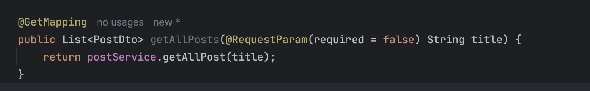
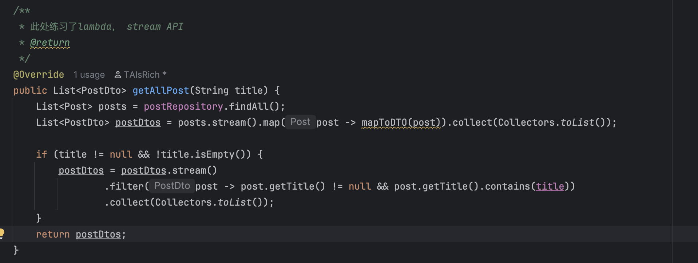
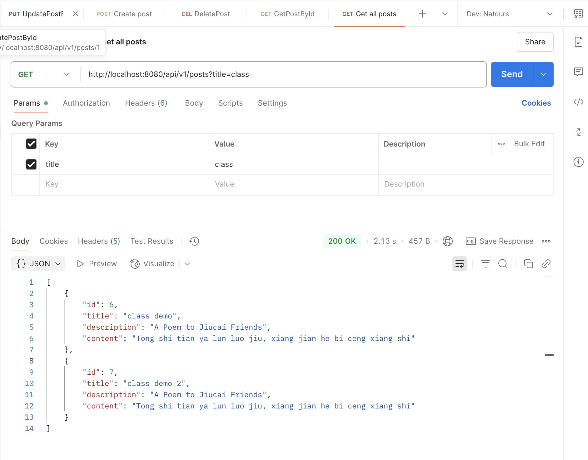

 1. Why is it better to use a custom exception class (e.g. ResourceNotFoundException ) in your application? 

Custom exceptions can be mapped to specific HTTP status codes; it can also specify the problems, and help developers
to solve the issues if there is a bug; Add more fields like error code, additional metadata. 

 Explain how @Table , @Column , and @Id work. What is the default behavior if you don’t use them? 

@Table is the table name is database. @Column specifies the column mapping for a field in the entity, @Id marks a field as the primary key of the entity. 
If @Table is not specified, class name is used as the table name. If @Column is not specified, field name is used as the column name in database.
If @Id is not specified, the entity won't exist, a runtime error will be thrown. 

 What happens if you don’t annotate a class with @Entity , but still try to save it with JPA? 

A runtime error occurs. JPA will not recognize the class as something it should manage. 
No mapping is registered in the persistence context

 What happens if we forget to annotate a controller with @RestController and only use
@RequestMapping? 

When you call the api, 404 not found error will be thrown. Without @RestController or @Controller, 
the class is not registered as a controller. Spring does not process its @RequestMapping methods. 
The endpoint does not exist.

 What is the default naming strategy of JPA for tables and columns when no explicit name is given?
Hibernate applies snake_case conversion and lowercase when no explicit name is given.

 How does @PathVariable differ from @RequestParam ? 

@PathVariable is part of the URL path. It typically represents specific resources, like passing a specific id value. 
@RequestParam is part of the query string after the ? in a URL. It's used to filter, sort, paginate or control a response.

 Write a method in a repository to find all posts with the title containing a certain keyword. (Create some
test posts if necessary) 

