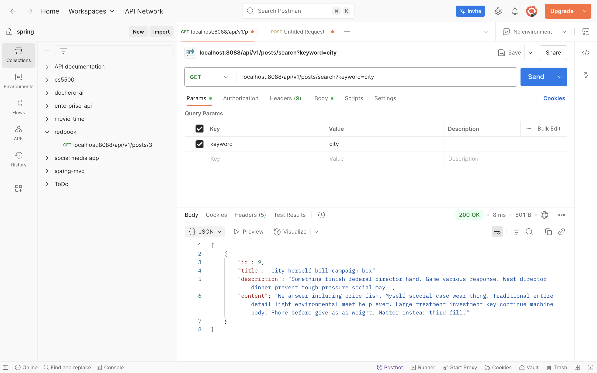

# HW9 Spring && Spring Boot

---

### 1. Why is it better to use a custom exception class (e.g. `ResourceNotFoundException` ) in your application?

#### Using a custom exception like ResourceNotFoundException is better because:
- It gives clear meaning:
  - The name tells you exactly what went wrong.
  - Easier to understand than a generic RuntimeException.
- We can control the HTTP status code:
  - We used @ResponseStatus(HttpStatus.NOT_FOUND)
  - This makes Spring automatically return a 404 error to the client.
- We can add cleaner and consistent error messages:
  - we can customize the error message like: "Post not found with id : '1'".
- It makes global error handling easier
  - Wou can catch and handle it in one place using @ControllerAdvice.
- It scales better
  - As app grows, we can create different exceptions for different problems (e.g. BadRequestException, UnauthorizedException).


---

### 2. Explain how `@Table` , `@Column` , and `@Id` work. What is the default behavior if you don’t use them?

```java
@Table(name = "posts")
```
- It specifies the table name.
- **Default**: Uses the class name (e.g., UserAccount in camelCase → user_account in snake_case).
---

```java
@Column(name = "title", nullable = false)
private String title;
```
- Maps a field to a specific DB column.
- **Default**: Uses the field name (e.g., firstName in camelCase → first_name in snake_case).
---

```java
@Id
@GeneratedValue(strategy = GenerationType.IDENTITY)
private Long id;
```
- Marks a field as the primary key.
- **Required**: JPA won't work correctly without this; it won’t know how to identify rows.

---

### 3. What happens if you don’t annotate a class with `@Entity` , but still try to save it with JPA?
- JPA will ignore the class – it’s not registered as a database entity.
- The repository bean will fail to initialize at startup.
- When trying to save it using a JPA repository, it will throw an error like: `Not a managed type: class com.example.YourClass`
#### More specific:
- This doesn't happen when calling `save()` — it actually fails during application startup. Here's what happens step by step:
  - Spring Boot starts and scans for `@Repository` beans (like `PostRepository`).
  - Spring Data JPA sees `PostRepository` extends `JpaRepository<Post, Long>`.
  - JPA tries to analyze the `Post` class as an entity.
  - But `Post` doesn’t have the `@Entity` annotation, so: Hibernate never registered it as a "managed type".
  - It throws an error: "Not a managed type".


---

### 4. What happens if we forget to annotate a controller with `@RestController` and only use `@RequestMapping` ?

-   Without `@RestController` (or `@Controller`), Spring won’t recognize the class as a controller at all.
-   Even if you use `@RequestMapping`, the routes won’t be registered, and no request will be handled. 
-   All endpoints will return HTTP 404 because Spring's DispatcherServlet has no knowledge of these request mappings.
-   If using only `@Controller`, your methods must return views (e.g., `.jsp`) unless you also add `@ResponseBody` to methods.

---

### 5. What is the default naming strategy of JPA for tables and columns when no explicit name is given?

- By default, JPA (specifically Hibernate) uses the ImplicitNamingStrategy, which:

#### Tables (Class → Table)
- By default, JPA uses the class name as the table name.
- It applies camelCase → snake_case conversion.

| Java Class    | Table Name     |
| ------------- | -------------- |
| `Post`        | `post`         |
| `UserProfile` | `user_profile` |

- We can also set a custom table name, use:
```java
@Table(name = "posts")  // Explicit table name, while class name is Post
```

#### Columns (Field → Column)
- By default, JPA uses the field name as the column name.
- It applies camelCase → snake_case conversion.

| Java Field  | Column Name  |
| ----------- | ------------ |
| `firstName` | `first_name` |
| `createdAt` | `created_at` |

- We can also set a custom column name, use:
```java
@Column(name = "title", nullable = false)  // Explicit column name and constraint
```

---

### 6. How does `@PathVariable` differ from `@RequestParam` ?

| Aspect         | `@PathVariable`                                                 | `@RequestParam`                                            |
| -------------- | --------------------------------------------------------------- | ---------------------------------------------------------- |
| Source         | Extracted from the **URL path**                                 | Extracted from the **query string**                        |
| Example URL    | `/users/123`                                                    | `/users?id=123`                                            |
| Method Example | `@GetMapping("/users/{id}")`<br>`getUser(@PathVariable int id)` | `@GetMapping("/users")`<br>`getUser(@RequestParam int id)` |
| Use case       | When the value is part of the URI structure                     | When passing optional or filter parameters                 |

---

### Hands on:
#### Write a method in a repository to find all posts with the title containing a certain keyword. (Create some test posts if necessary) share screenshots in your markdown file.

#### Step1 Add method in PostRepository
```java
List<Post> findPostsByTitleContainingIgnoreCase(String keyword);
```

#### Step2 Add method in PostService
```java
List<PostDto> searchPostsByTitle(String keyword);
```

#### Step3 Implement method in PostServiceImpl
```java
@Override
public List<PostDto> searchPostsByTitle(String keyword) {
  List<Post> posts = postRepository.findPostsByTitleContainingIgnoreCase(keyword);
  return posts.stream()
          .map(this::mapToDTO)
          .collect(Collectors.toList());
}

```

#### Step4 Add GetMapping in PostController
```java
@GetMapping("/search")
public ResponseEntity<List<PostDto>> searchPosts(@RequestParam(required = false, defaultValue = "") String keyword) {
  List<PostDto> searchedPosts = postService.searchPostsByTitle(keyword);
  return ResponseEntity.ok(searchedPosts);
}
```


