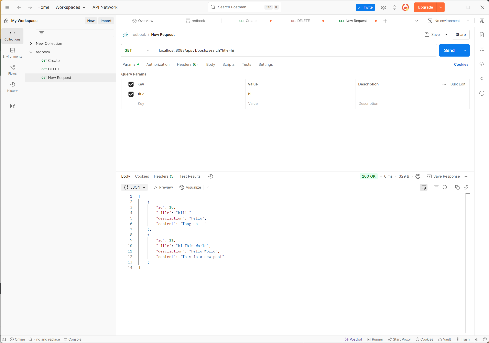

## Why is it better to use a custom exception class (e.g. ResourceNotFoundException ) in your application?

Custom exceptions allow you to describe errors in a (much) more meaningful way than generic exceptions, improving code readability. 
For example, ResourceNotFoundException clearly indicates that a specific resource couldn't be found, rather than a generic error.

## Explain how @Table , @Column , and @Id work. What is the default behavior if you don‘t use them?

the annotations @Table, @Column, and @Id are used to map Java classes and fields to database tables and columns.

@Table
Purpose: Specifies the name of the table in the database that the entity maps to.

Used on: A class level.

Default behavior:
If you don't use @Table, the table name defaults to the class name

@Column
Purpose: Specifies the mapping between a Java field and a table column.

Used on: Field or getter method.

Default behavior:
If you don't use @Column, JPA maps the field name directly to the column with the same name

@Id
Purpose: Marks a field as the primary key of the entity.

Used on: Field or getter method.

Default behavior:
 If you don't use @Id, the class cannot be a valid entity, and you'll get a runtime error.
 
## What happens if you don't annotate a class with @Entity , but still try to save it with JPA?

JPA will not recognize the class as an entity: The @Entity annotation is the primary way to tell JPA that a Java class maps to a database table.
There will be error.

## What happens if we forget to annotate a controller with @RestController and only use @RequestMapping ?

* Only @RequestMapping (no @Controller or @RestController)
Spring will not recognize the class as a controller.

    The methods inside will not be mapped or called, and endpoints will not work.

## What is the default naming strategy of JPA for tables and columns when no explicit name is given?
The JPA default table name is the name of the class (minus the package) with the first letter capitalized. Each attribute of the class will be stored in a column in the table.
## How does @PathVariable differ from @RequestParam ?

@PathVariable - Extracts from the URL path
Used when the value is part of the URI.
Example URL: /users/123

@RequestParam - Extracts from the query string
Used when the value is passed as a query parameter.
Example URL: /search?keyword=java

## HandsOn

