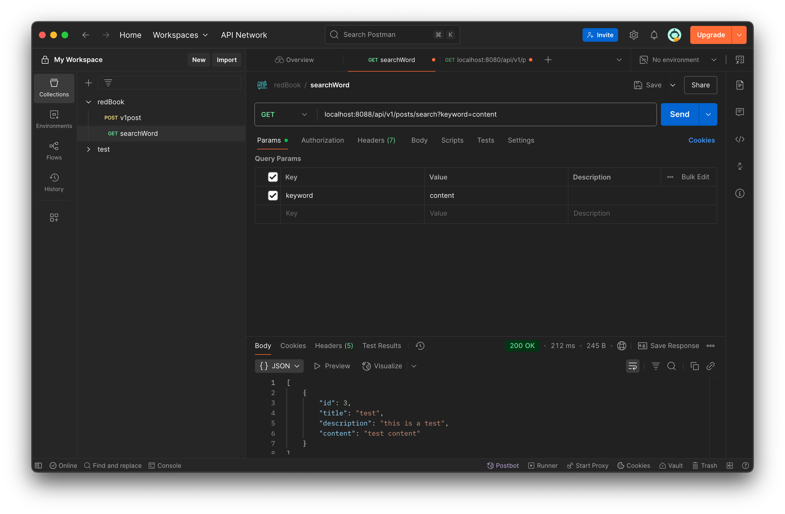

# HW9

### Why is it better to use a custom exception class (e.g. ResourceNotFoundException ) in your application?
- Custom exceptions improve code clarity, allow precise error handling, and help standardize API error responses. They make your application more robust and maintainable.

### Explain how @Table , @Column , and @Id work. What is the default behavior if you don’t use them?
- @Table maps an entity to a table (defaults to class name if missing).
- @Column maps a field to a column (defaults to field name and nullable=true).
- @Id defines the primary key—if missing, JPA throws a runtime error.

### What happens if you don’t annotate a class with @Entity , but still try to save it with JPA?
- If you define a class in your code and don’t annotate it with @Entity, but still try to save it using JPA’s EntityManager.persist() or a Spring Data JPA Repository.save(), JPA won’t recognize it as a managed entity.

### What happens if we forget to annotate a controller with @RestController and only use @RequestMapping?
- Class not registered → 404 on all endpoints

### What is the default naming strategy of JPA for tables and columns when no explicit name is given?
- Tables (from class names) / Columns (from field/property names)

### How does @PathVariable differ from @RequestParam ? @PathVariable: Used to extract values from the URI path.
- @PathVariable：Used to bind a template variable in the URI path to a method parameter /Useful for RESTful APIs where IDs or names are part of the path.
- @RequestParam：Used to extract values from the query string or HTML form data. /Good for optional parameters, filters, or search criteria.

### Write a method in a repository to find all posts with the title containing a certain keyword. (Create some test posts if necessary) share screen shots in your mark down file.
