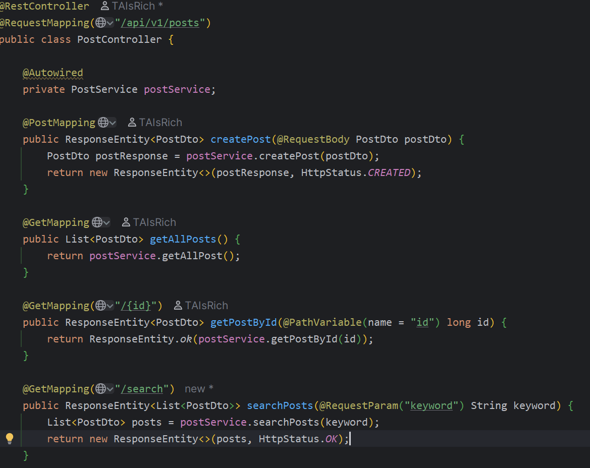
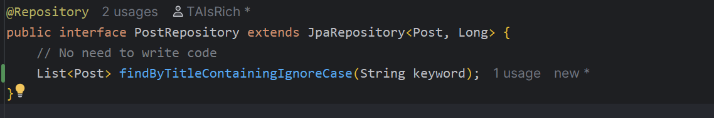
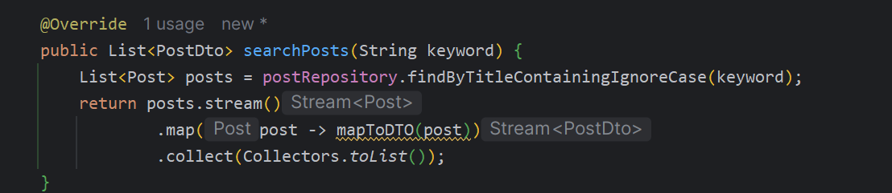
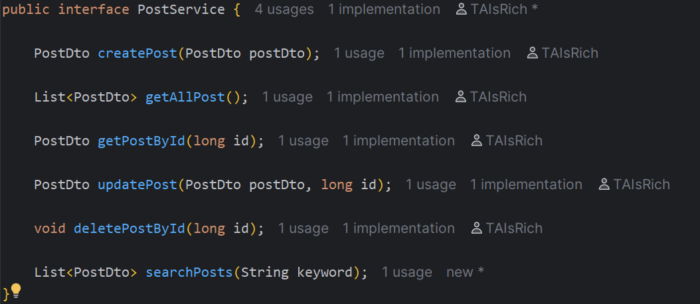

## Question 1

Using a custom exception class is better because it makes your code clearer and allows you to handle specific errors in a centralized way, which simplifies debugging.

## Question 2
 - @Table sets the name of the table in the database. Without it, the default table name would be the same as the class name.
 - @Column sets the name of the column in the database. If not specified, it defaults to the field name.
 - @Id marks the field as the primary key of the table. It has no default value. 

## Question 3
If you try to save a class without the @Entity annotation, JPA will throw an IllegalArgumentException because it doesn't recognize the object as a database entity.

## Question 4
If you only use @RequestMapping, Spring treats the controller as a standard web controller, not a REST controller. It will try to find a view (like a web page) instead of sending back data (like JSON), causing an error.

## Question 5
JPA default naming strategy: By default, JPA converts camelCase class and field names to snake_case for table and column names. 

## Question 6
@PathVariable extracts values directly from the URL path (e.g., /products/{id}).
@RequestParam extracts values from the query string at the end of a URL (e.g., /products?sort=asc).

