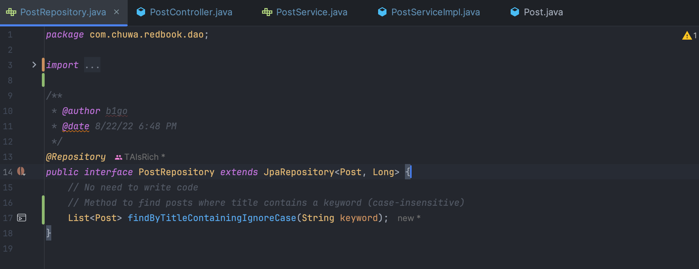
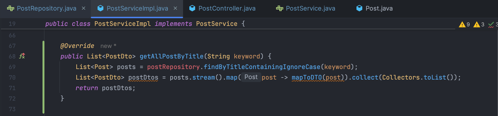
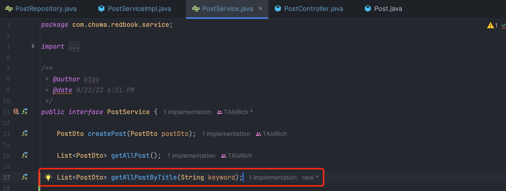
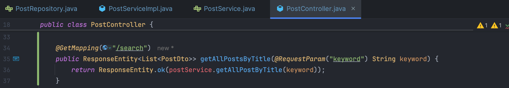
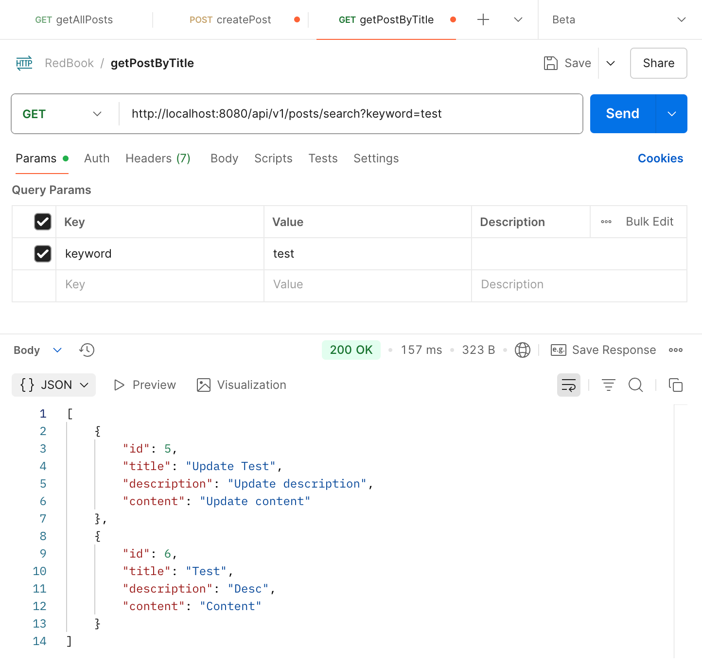

# 6.30 HW9 - Project Hands On

### Questions

Write answers in your mark down file.

1. Why is it better to use a custom exception class (e.g. `ResourceNotFoundException` ) in your application?

   Because if we don't use a custom exception class, the app will return a generic status code "500 Internal Server Error", and throw an unhandled exception (NullPointerException), which make us hard to debug.

   However, with the custom exceptions, we can see a specific error log message in console like (need to add `spring.mvc.log-resolved-exception=true` in `application.properties`): 

   ```
   Resolved [com.chuwa.redbook.exception.ResourceNotFoundException: Post not found with id : '1']
   ```

   And we can return the customized status code with a clear response like:

   ```json
   {
       "timestamp": "2025-07-02T19:20:45.227+00:00",
       "status": 404,
       "error": "Not Found",
       "path": "/api/v1/posts/1"
   }
   ```

   which helps us to easily debug and client to handle the error properly.

   

2. Explain how `@Table` , `@Column` , and `@Id` work. What is the default behavior if you don’t use them?

   These JPA annotations are how entity classes map to database tables and columns. 

   `@Table`: It maps a class to a specific name, which means if we have a table in the database with that specific name, we can map this class to that table. This is useful when the **table name doesn't match the class name**. But if we don't use it, JPA will use the class as the table name and convert  it to snake_case name in the database (class postDatabase -> post_database).

   `@Column`: It maps a field to a specific column and we can specify column name, nullability, uniqueness, length, etc. If we don't use it, JPA will use the field name as the column name.

   `@Id`: It marks the primary key, telling JPA which field is the unique identifier for the entity. If we don't use it, JPA will fail to map the entity, and we'll get an error "No identifier specified for entity: com.chuwa.redbook.entity.Post".

   

3. What happens if you don’t annotate a class with `@Entity`, but still try to save it with JPA?

   When we annotate a class with @Entity, we are telling JPA this class is used to mapped to database. If we don't annotate it, JPA won't know which class is an entity and we will get a runtime error.

   

4. What happens if we forget to annotate a controller with `@RestController` and only use `@RequestMapping` ?

   `@RestController` is an annotation which marks a class as a Spring MVC controller. It tells spring that this class is a **web controller**, need to register it as a bean and scan its handler methods.

   If we don't use it, Springboot won't recognize it as a controller, ans no endpoint will br mapped. We will get a 404 Not Found when we test the api.

   

5. What is the default naming strategy of JPA for tables and columns when no explicit name is given?

   **Converts camelCase to snake_case**. For example, if we have an entity class like this:

   ```java
   @Entity
   public class PostEntity {
       private String postTitle;
       private String createdAt;
   }
   
   ```

   The default mapping will be:

   | Java Class / Field   | DB Table / Column Name |
   | -------------------- | ---------------------- |
   | `PostEntity` (class) | `post_entity`          |
   | `postTitle` (field)  | `post_title`           |
   | `createdAt` (field)  | `created_at`           |

   

6. How does `@PathVariable` differ from `@RequestParam` ?

   They are both used to extract values from the request URI.

   `@PathVariable` extract values from the **URL path**. We should use it when the value is part of the resource path.

   ```
   @GetMapping("/api/v1/posts/{id}")
   @ResponseBody
   public String getFooById(@PathVariable String id) {
       return "ID: " + id;
   }
   ```

   URL: http://localhost:8080//api/v1/posts/111

   `@RequestParam` extract values from the **query string**. We should use it when the value is is a filter, flag, or optional data.

   ```
   @GetMapping("/api/v1/posts/{id}")
   @ResponseBody
   public String getFooByIdUsingQueryParam(@RequestParam String id) {
       return "ID: " + id;
   }
   ```

   URL: http://localhost:8080//api/v1/posts?id=111


### Hands on:

Write a method in a repository to find all posts with the title containing a certain keyword. (Create some test posts if necessary). 

Share screenshots in your mark down file.









