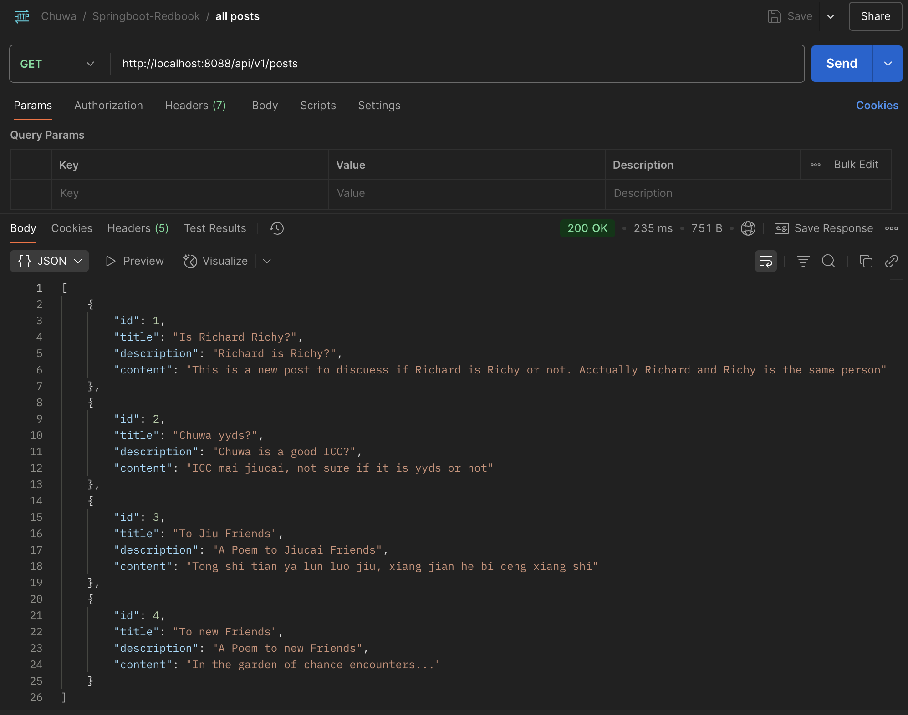
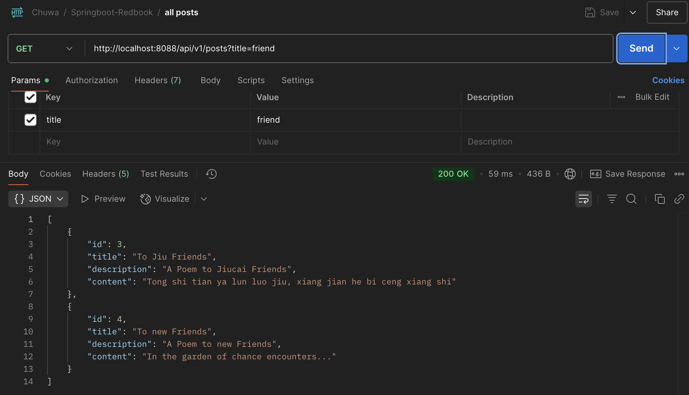
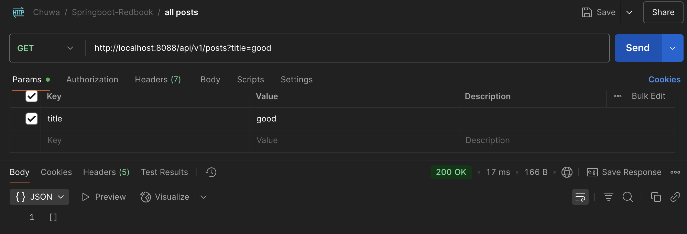

### hw9

### 1. Why is it better to use a custom exception class (e.g. `ResourceNotFoundException`) in your application?
- Externally: Returns clear, user-friendly error messages to the API client (e.g., "Post with ID 1 not found").
- Internally: Allows logging of stack traces and context-specific debug info, making debugging easier for developers.
- Enables centralized error handling when used with `@ControllerAdvice`.


---
### 2. Explain how `@Table`, `@Column`, and `@Id` work. What is the default behavior if you don’t use them?
JPA Annotations: `@Table`, `@Column`, `@Id`  

>@Table
>- Specifies the table name in the DB.
>- Default: Uses class name as table name (e.g., `Post` → `post`, `homeAddress` → `home_address`).

>@Column
>- Maps a field to a specific DB column.
>- Default: Uses field name as column name.

>@Id
>- Marks the field as the primary key.
>- Required: Must be present for JPA to identify the entity.


**Default Behavior If Annotation Is Omitted:**

| Annotation | If Omitted                      |
|------------|----------------------------------|
| `@Table`   | Class name is used as table name |
| `@Column`  | Field name is used as column name|
| `@Id`      | ❌ Must be defined (required)     |


---
### 3. What happens if you don’t annotate a class with `@Entity`, but still try to save it with JPA?
JPA **ignores** the class.   
You’ll get a **runtime error** when trying to persist it:  
```error
Not an entity: class com.example.YourClass
```
Reason:  
JPA only manages classes annotated with `@Entity`.


---
### 4. What happens if we forget to annotate a controller with `@RestController` and only use `@RequestMapping`?
What Happens If we Forget `@RestController`?

- Spring won't register the class as a controller.
- Requests to mapped endpoints (via `@RequestMapping`) will return:
```error
404 Not Found (no handler found)
```
Reason:  
`@RestController` (or `@Controller`) is required to mark the class as a Spring MVC handler.
```java
@RestController  // Must be present
@RequestMapping("/api")
public class MyController { ... }
```


---
### 5. What is the default naming strategy of JPA for tables and columns when no explicit name is given?

>Table Name:
>- Defaults to **entity class name**, converted to snake_case.
>- Example: `Post` → `post`, `PostComment` → `post_comment`

>Column Name:
>- Defaults to **field name**, converted to snake_case.
>- Example: `createdAt` → `created_at`

Note: you can give explicit name by using:
```java
@Table(name = "...")
@Column(name = "...")
```


---
### 6. How does `@PathVariable` differ from `@RequestParam`?
- `@PathVariable`: For **dynamic path segments**.
- `@RequestParam`: For **optional or filter parameters**.

|        | Source                    | Example URL                      |  
|--------|---------------------------|----------------------------------| 
| `@PathVariable` | From the **URL path**     | `/api/posts/10`                 |  
| `@RequestParam` | From the **query string** | `/api/posts?id=10`              |  


---
### 7. Hands On:
#### Write a method in a repository to find all posts with the title containing a certain keyword.  
{For myself: code is in springboot-redbook/`lang_wang_hw9` branch}


PostRepository:
```java
@Repository
public interface PostRepository extends JpaRepository<Post, Long> {
    List<Post> findByTitleContainingIgnoreCase(String title);
}
```

PostServiceImpl:
```java
@Override
public List<PostDto> getAllPosts(String title) {
    List<Post> posts = postRepository.findAll();
    List<PostDto> postDtos = posts.stream().map( post -> mapToDTO(post)).collect(Collectors.toList());

    if (title != null && !title.isEmpty()) {
        posts = postRepository.findByTitleContainingIgnoreCase(title);
        postDtos = posts.stream()
                .map(this::mapToDTO)
                .collect(Collectors.toList());
    }
    return postDtos;
}
```

PostController:
```java
@GetMapping
public ResponseEntity<List<PostDto>> getAllPosts(@RequestParam(required = false) String title) {
    List<PostDto> result = postService.getAllPosts(title);
    return new ResponseEntity<>(result, HttpStatus.OK);
}
```

Client (Postman):  
_Get all posts without the query parameter `title`:_


_Get all posts with the query parameter `title`:_


_Get all posts with the query parameter `title`, but no title matches, so return an empty list:_



