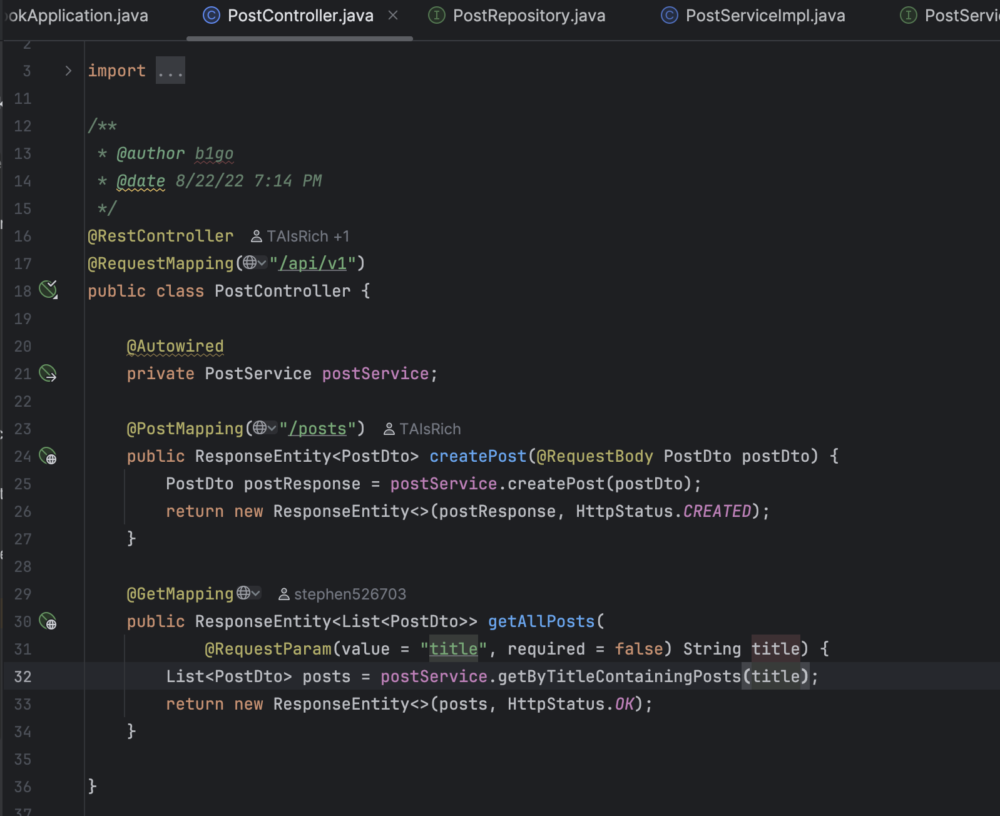
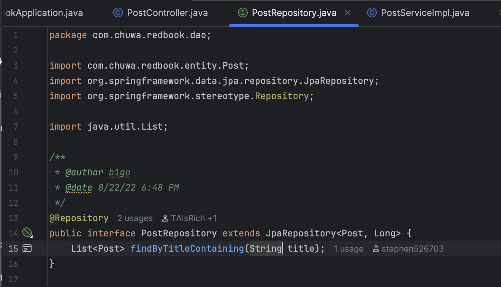
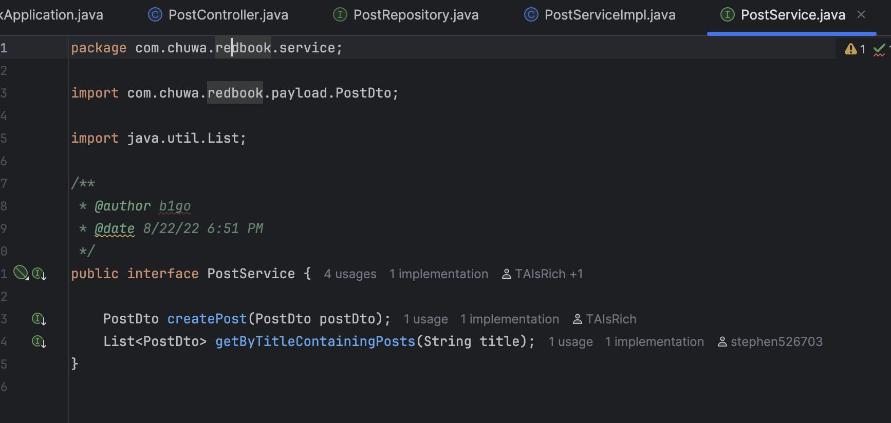
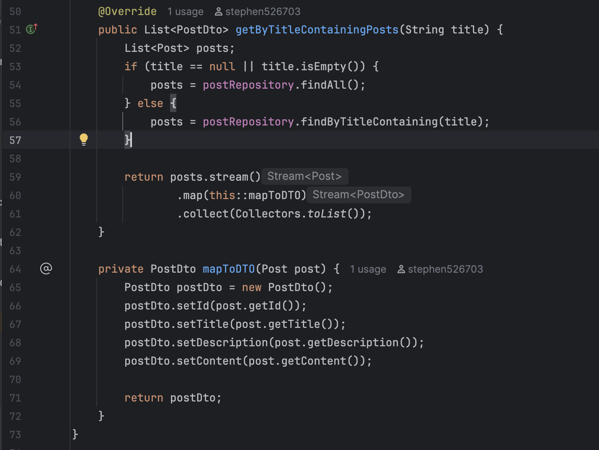
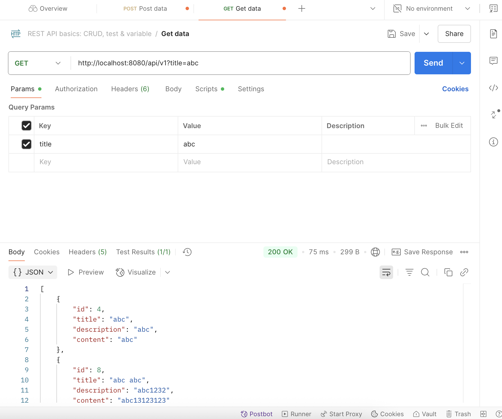

Questions
1. Why is it better to use a custom exception class (e.g. ResourceNotFoundException ) in your application?

By using custom exception class we can clarify exact exception type compared to RuntimeException or Exception and thus can root cause the problem when encountering exception. Also we could hide error messages from emitting publicly to the client (e.g. postman response body contains error message).

2. Explain how @Table , @Column , and @Id work. What is the default behavior if you don’t use them?

@Table : Used to locate the table name, which maps the Java class to a specific database table, usually placed on top of an @Entity class, and by default JPA uses class name as table name (UserAccount -> user_account).
@Column: Used to specify the information for the column, which maps class to a column, allows customization (name=, nullability=), and by default JPA uses field name as column name (userAccount -> user_account).
@Id: Marks the field (column) as the primary key of the entity, required @GeneratedValue annotation and to be unique, and mandatory for JPA Entity.

3. What happens if you don’t annotate a class with @Entity , but still try to save it with JPA?

JPA will throw a Runtime Exception because it won't recognize the class as an @Entity.

4. What happens if we forget to annotate a controller with @RestController and only use
@RequestMapping?

Spring will not recognize the class as a web controller and request-handling methods will not be mapped. @RestController tells Spring to: 
1. Register the class as a Spring Bean (making it a component managed by Spring). 
2. Register the class as a web controller and maps them to HTTP endpoints.
3. Automatically convert return values of methods to JSON or other HTTP responses. (@RequestBody)

5. What is the default naming strategy of JPA for tables and columns when no explicit name is given?

Class name are converted to snake_case table names (e.g. UserAccount -> user_account)

Field names are converted to snake_case column names ((e.g. userAccount -> user_account))

6. How does @PathVariable differ from @RequestParam?

@PathVariable: 
1. Extracts a value from the URL path.
2. Used when the value is part of the URI itself.

@RequestParam
1. Extracts a value from the query string (?id=42).

2. Used when the value is passed as a key-value parameter in the URL.

RedBook:

PostController: 

PostRepository: 

PostService: 

PostServiceImpl:

Postman: 