# HW9:  Spring Data
@ Jul 8, 2025 _Gloria Wang_

# Part 1: Spring Annotation Cheatsheet
> Please check `annotations.md`

# Part 2: Hands-on Project Work

## 2. Setup Starter Project & Test APIs 📸

### Create Post — POST /api/v1/posts
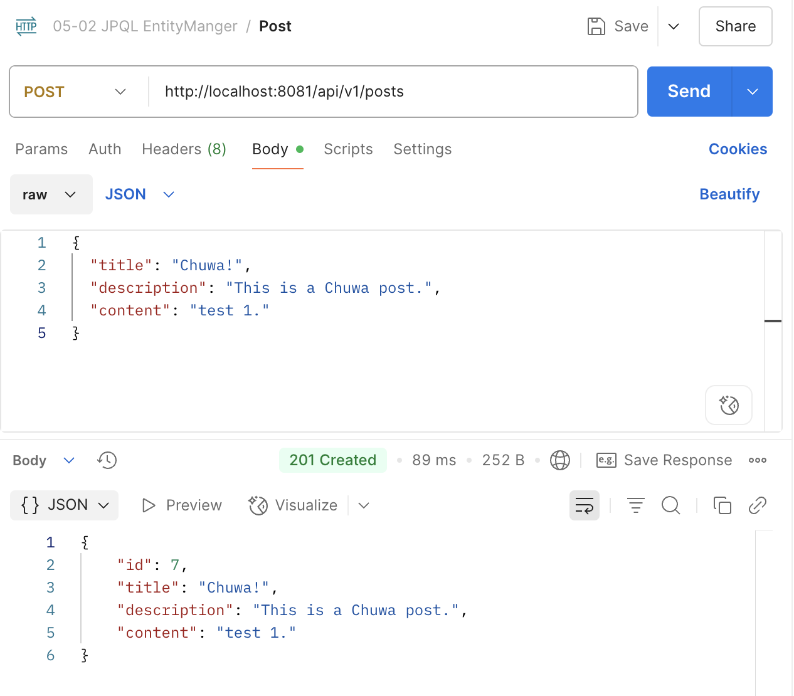
---
### Get All Posts — GET /api/v1/posts

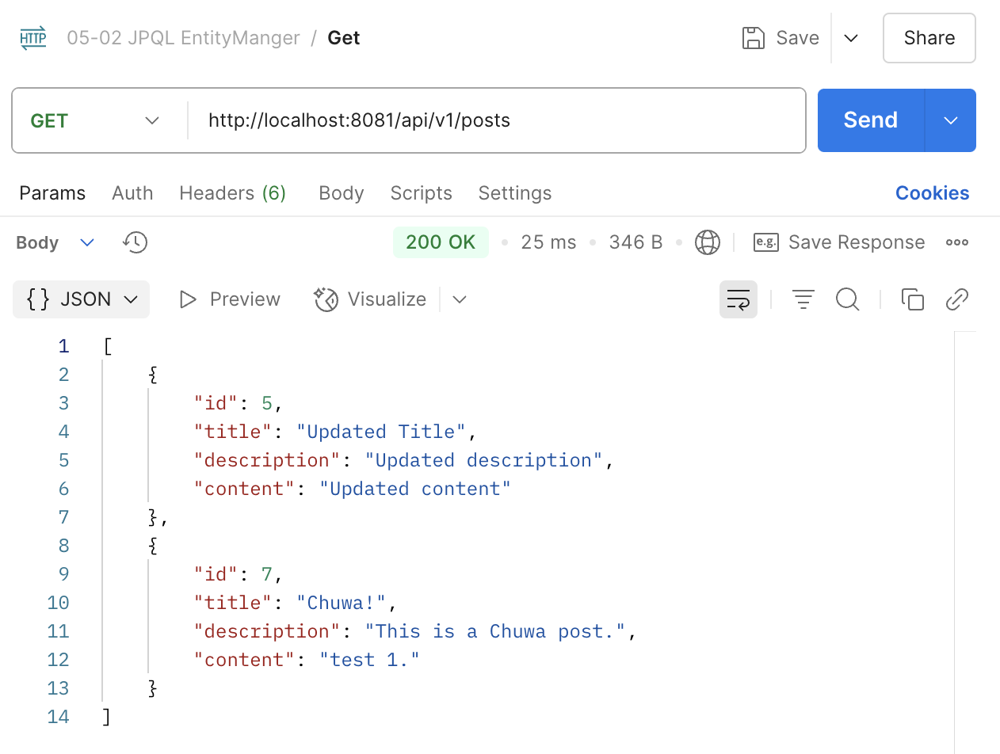
---
### Get All Posts (JPQL) — GET /api/v1/posts/jpql

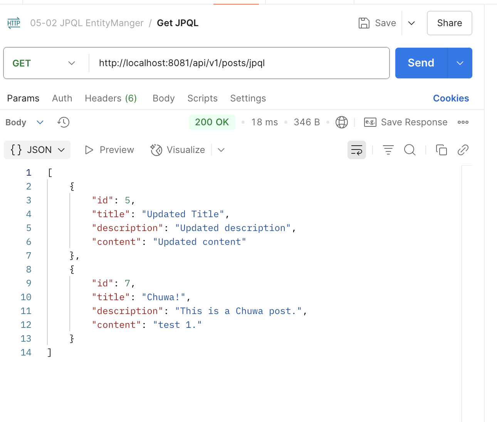
---
### Get Post by ID — GET /api/v1/posts/{id}

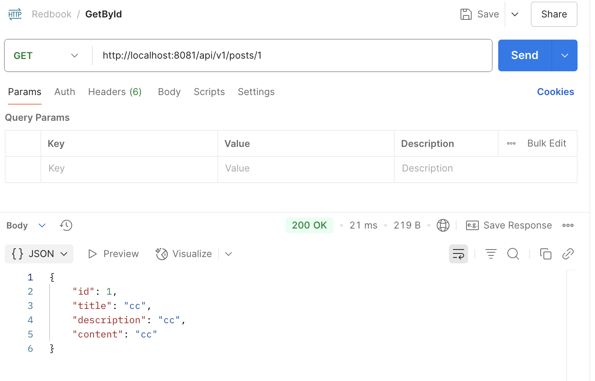
---
### Get Post by ID or Title (JPQL Indexed) — GET /api/v1/posts/jpql-index/{id}?title=...

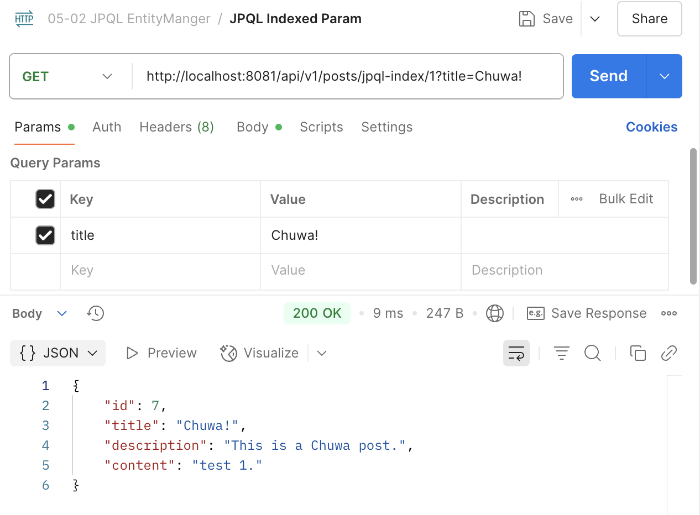
---
### Get Post by ID or Title (JPQL Named) — GET /api/v1/posts/jpql-named/{id}?title=...

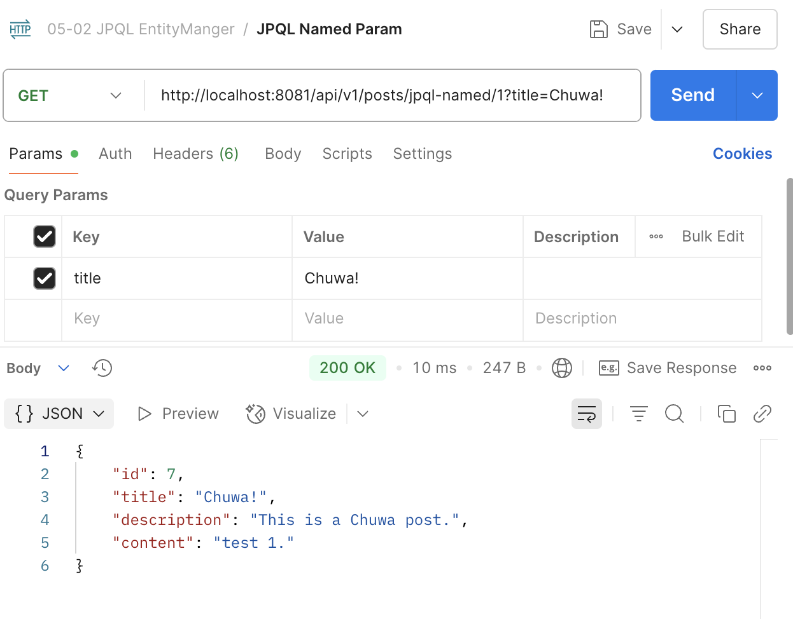
---
### Get Post by ID or Title (SQL Indexed) — GET /api/v1/posts/sql-index/{id}?title=...

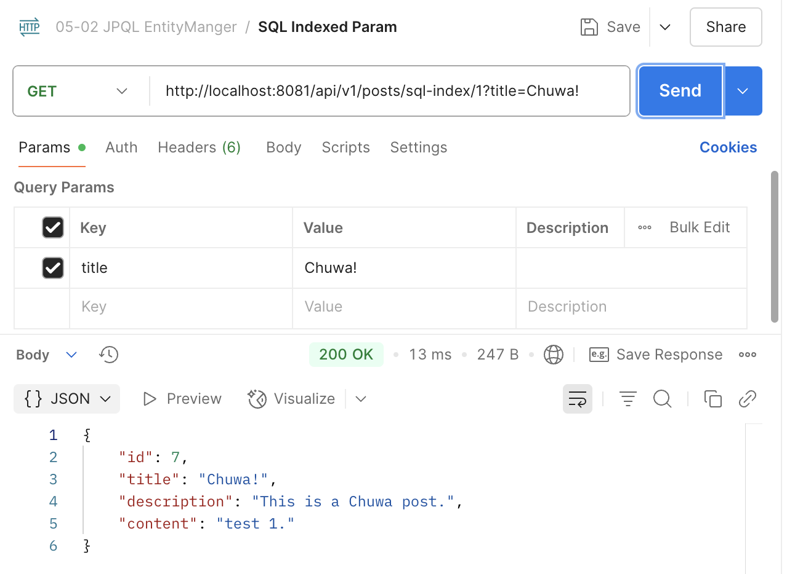
---
### Get Post by ID or Title (SQL Named) — GET /api/v1/posts/sql-named/{id}?title=...

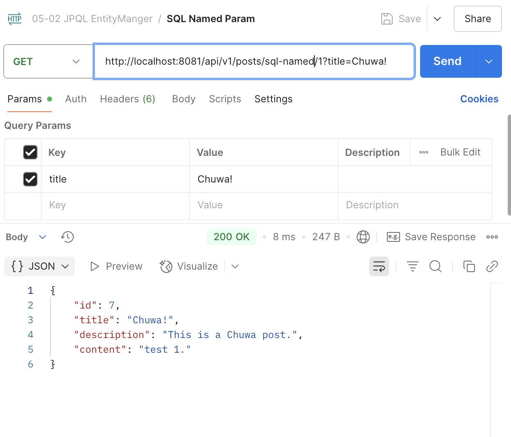
---
### Update Post — PUT /api/v1/posts/{id}

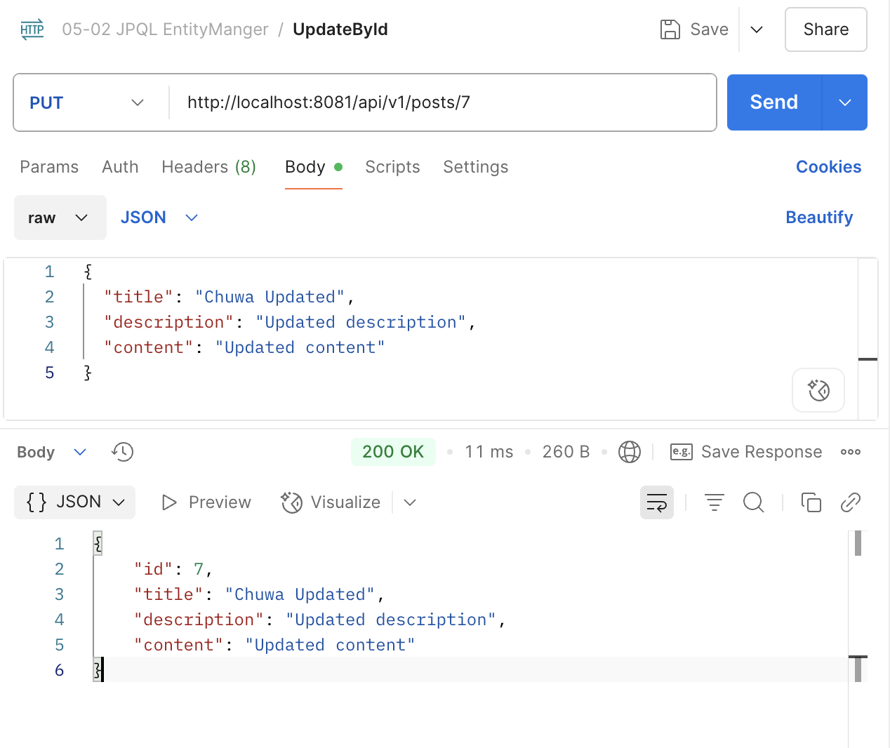
---
### Delete Post — DELETE /api/v1/posts/{id}

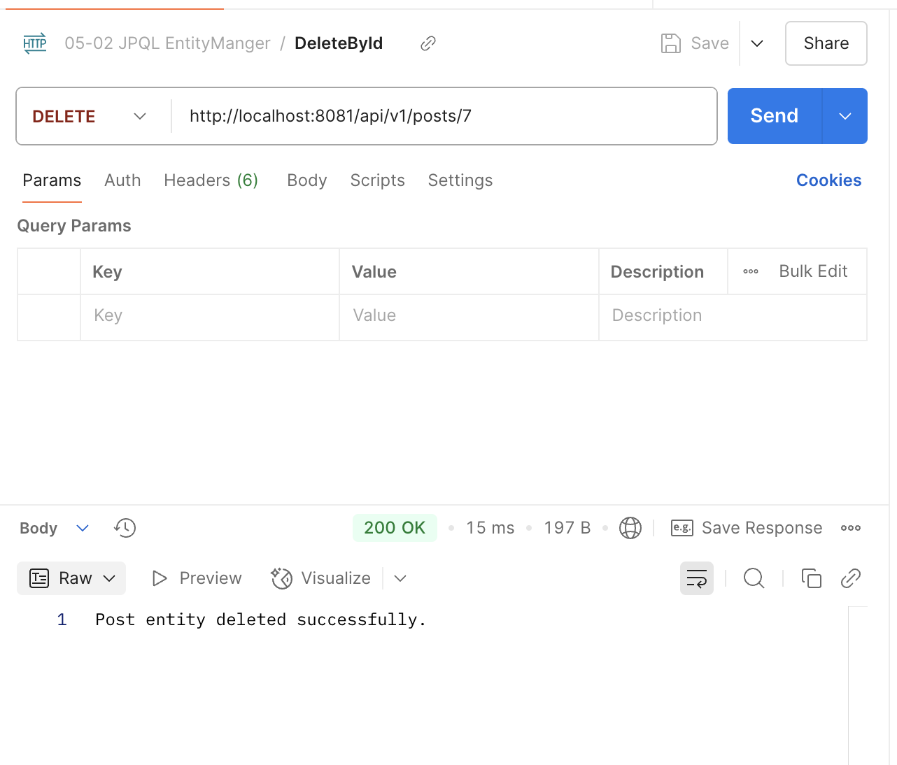
---

## 3. Custom JPA Methods and Validate Syntax

### custom JPA methods using Spring Data JPA naming conventions
```Java
// Find by exact title
List<Post> findByTitle(String title);

// Find posts where the title contains a keyword (LIKE %keyword%)
List<Post> findByTitleContaining(String keyword);

// Case-insensitive title match
List<Post> findByTitleIgnoreCase(String title);

// Match either title OR description
List<Post> findByTitleOrDescription(String title, String description);

// Match both title AND content
List<Post> findByTitleAndContent(String title, String content);

// Find posts created after a specific date/time
List<Post> findByCreateDateTimeAfter(LocalDateTime date);

// Find posts where content starts with a given prefix
List<Post> findByContentStartingWith(String prefix);
```

### Demonstrate how JPA performs compile-time syntax checks on method names
If we create the following method:
```java
List<Post> findByAuthor(String author); // ❌ Field 'author' does not exist in Post entity
```

There will be an error: `Error: No property 'author' found for type 'Post'`
since author is not a field in the Post entity

-> Spring Data JPA validates custom query method names at application startup,
ensuring correctness before the app runs -> compile-time syntax checks

## 4. Implement JPQL and Native SQL Queries

### Repository Layer - PostRepository.java
- Responsible for talking to the database
- Defines JPQL and native SQL queries using @Query
- Called only by the Service Layer
```java
// JPQL query using @Query
@Query("select p from Post p where p.title = :title" )
List<Post> getPostsByExactTitleJPQL(@Param("title") String title);

// Native SQL query using @Query(nativeQuery = true)
@Query(value = "SELECT * FROM posts p WHERE p.description LIKE %:keyword%", nativeQuery = true)
List<Post> getPostsByDescriptionKeywordSQL(@Param("keyword") String keyword);
```

### Service  
- Contains business logic (e.g. mapping Post → PostDto)
- Decides how to use repository methods
- Called only by the Controller Layer 

#### Post Interface - PostService.java

```java
// JPQL: get posts by exact title
List<PostDto> getPostsByExactTitleJPQL(String title);

// Native SQL: get posts where description contains keyword
List<PostDto> getPostsByDescriptionKeywordSQL(String keyword);
```
#### Service Implementation - PostServiceImpl.java
```java
@Override
public List<PostDto> getPostsByDescriptionKeywordSQL(String keyword) {
    return postRepository.getPostsByDescriptionKeywordSQL(keyword)
            .stream()
            .map(this::mapToDTO)
            .collect(Collectors.toList());
}

@Override
public List<PostDto> getPostsByExactTitleJPQL(String title) {
    return postRepository.getPostsByExactTitleJPQL(title)
            .stream()
            .map(this::mapToDTO)
            .collect(Collectors.toList());
}
```

### Controller Layer - PostController.java
- Handles HTTP requests (e.g. from browser or Postman)
- Accepts input (like query params), calls the service, and returns results as JSON
- This is what clients (frontend or APIs) interact with
```java
@GetMapping("/jpql-title")
public List<PostDto> getPostsByExactTitleJPQL(@RequestParam(name = "title") String title) {
    return postService.getPostsByExactTitleJPQL(title);
}

@GetMapping("/sql-description")
public List<PostDto> getPostsByDescriptionKeywordSQL(@RequestParam(name = "keyword") String keyword) {
    return postService.getPostsByDescriptionKeywordSQL(keyword);
}
```

```text
[GET /jpql-title?title=Spring]
         ⬇
PostController.getPostsByExactTitleJPQL("Spring")
         ⬇
PostServiceImpl.getPostsByExactTitleJPQL("Spring")
         ⬇
PostRepository.getPostsByExactTitleJPQL("Spring")
         ⬇
[DB executes JPQL query]
         ⬆
Mapped results returned to client as JSON
```
The interface (PostService) defines what the service does.

The class (PostServiceImpl) defines how it does it.
### Postman Test

**getPostsByExactTitleJPQL**  
`GET http://localhost:8081/api/v1/posts/jpql-title?title=Chuwa!` 

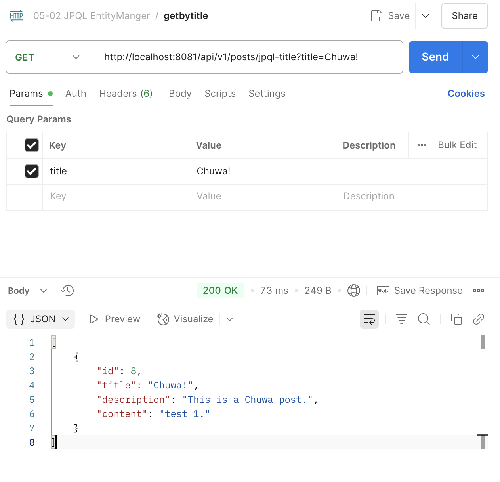

**Native SQL get by description keyword**
`GET http://localhost:8081/api/v1/posts/sql-description?keyword=post`
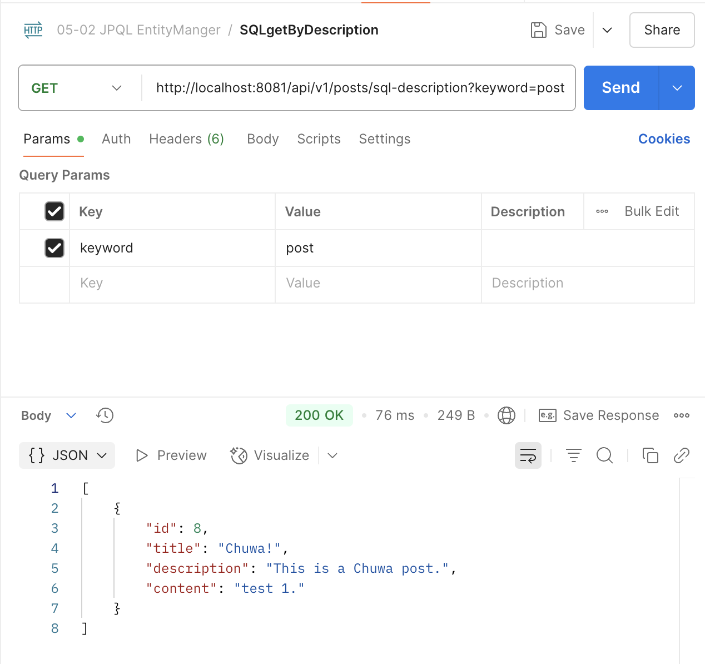

# Part 3: Core Conceptual Understanding
## 5. Technology Comparison

| Technology          | Layer               | Description                                                                                                                                                                    |
|---------------------|---------------------|--------------------------------------------------------------------------------------------------------------------------------------------------------------------------------|
| **Spring Data JPA** | High-level API      | A Spring abstraction over JPA that lets you define repository interfaces and automatically generate SQL queries using method names (e.g., `findByTitle`). Reduces boilerplate. |
| **Hibernate**       | JPA Provider        | A popular ORM framework that implements JPA. It maps Java objects to database tables and handles entity states, relationships, and SQL generation.                             |
| **HikariCP**        | Infrastructure      | A high-performance JDBC connection pool manager. Manages and reuses database connections efficiently. Default in Spring Boot.                                                  |
| **JDBC**            | Low-level API       | The core Java API for interacting with relational databases. Developers use it to execute SQL statements, manage connections, and process results — manually.                  |


## 6. JPA Relationships

### @OneToMany
Defines a one-to-many relationship. 
- A single entity (e.g., Post) can be related to multiple instances of another entity (e.g., Comment).
```java
@OneToMany(mappedBy = "post", cascade = CascadeType.ALL, fetch = FetchType.LAZY)
private Set<Comment> comments = new HashSet<>();
```

**mappedBy**: The field in the child entity (Comment) that owns the relationship.
- "there will be a post_id in comment table means that this comment belongs to which post"

**cascade**: Determines operations that should cascade to child entities.
  - CascadeType.ALL → propagate all operations (persist, remove, merge, etc.)
  - "when I change post → comments will be changed in the same operations as well"

**fetch**: Specifies when related data should be loaded.
  - FetchType.LAZY (default) → load only when accessed
  - FetchType.EAGER → load immediately

### @ManyToOne
Defines a many-to-one relationship. 
- Many entities (e.g., Comment) can relate to a single parent (e.g., Post).

```java
@ManyToOne(fetch = FetchType.LAZY)
@JoinColumn(name = "post_id", nullable = false)
private Post post;
```

**@JoinColumn**: Defines the foreign key column in the database.
- name = "post_id": the FK column
- lable = false: cannot be null

**fetch**: LAZY is usually preferred for performance.

### @ManyToMany
Defines a many-to-many relationship. A typical example is users and roles.
```java
@Entity
public class User {

    @Id
    private Long id;

    private String name;

    @ManyToMany(fetch = FetchType.LAZY)
    @JoinTable(
            name = "user_roles",
            joinColumns = @JoinColumn(name = "user_id"),              
            inverseJoinColumns = @JoinColumn(name = "role_id")       
    )
    private Set<Role> roles = new HashSet<>();  
}
```
**@JoinTable**: Defines the join (intermediate) table.
- joinColumns: FK to the current entity (user_id)
- inverseJoinColumns: FK to the other entity (role_id)

**fetch**: Choose LAZY to avoid fetching all related entities unless needed.

#### mappedBy
- Only used on the inverse side of a bidirectional relationship.
- Indicates the field name that owns the relationship.
- Avoids creating an additional join table.
  
#### cascade (CascadeType)
- Controls what operations should cascade to related entities.

#### fetch (FetchType)
- Determines when associated entities are loaded.
- EAGER (default for `@ManyToOne / @OneToOne`) -> Load related entities immediately
- LAZY (default for `@OneToMany / @ManyToMany`) -> Load only when accessed — improves performance

## 7. Cascade Options in JPA

### cascade = CascadeType.ALL
**Meaning**: This enables all cascading behaviors — it is equivalent to applying all of the following:
- PERSIST, MERGE, REMOVE, REFRESH, DETACH.

> When saving a Post entity, any associated Comment entities will also be saved automatically.
```java
@OneToMany(mappedBy = "post", cascade = CascadeType.ALL)
private List<Comment> comments;
```

### orphanRemoval = true
**Meaning**: If a child entity is removed from its parent’s collection, it is also deleted from the database.
> **Common use case**: In `@OneToMany` relationships, when remove a child from the list/set, comment becomes an “orphan” and will be deleted.
```java
post.getComments().remove(comment); // this comment will be deleted from DB too
```

### CascadeType
| CascadeType | Description                                                             | Use Case Example                                           |
|-------------|-------------------------------------------------------------------------|------------------------------------------------------------|
| PERSIST     | Owning entity saved ⇒ related entity saved                              | Save `Post`, automatically save associated `Comment`       |
| MERGE       | Owning entity merged ⇒ related entity merged                            | Update `Post`, automatically update associated `Comment`   |
| REFRESH     | Owning entity refreshed ⇒ related entity refreshed                      | Refresh `Post`, automatically refresh associated `Comment` |
| REMOVE      | Owning entity removed ⇒ related entity removed                          | Delete `Post`, automatically delete associated `Comment`   |
| DETACH      | Owning entity manually detached ⇒ related entity detached               | Detach `Post`, automatically detach associated `Comment`   |
| ALL         | All cascade operations on owning entity applied to related entity       | Perform all above operations automatically on `Comment`    |

## 8. Fetch Types in JPA

### 💤 FetchType.LAZY (Lazy Loading)
- **Meaning**: Related entities are not loaded immediately. They are fetched only when accessed.
- **Default for**: `@OneToMany`, `@ManyToMany` _X -> Many_
- **Use Case**:
  - When the related data is large or not always needed
  - Helps improve performance and reduce memory usage
> comments are not queried until you explicitly call post.getComments().
```java
@OneToMany(fetch = FetchType.LAZY)
private List<Comment> comments;
```

### ⚡️ FetchType.EAGER (Eager Loading)
- **Meaning**: Related entities are loaded immediately with the parent entity.
- **Default for**: `@ManyToOne`, `@OneToOne`  _X -> One_
- **Use Case**:
  - When related data is small or always required with the parent
  - Reduces the need for additional queries

> post will be loaded as soon as the Comment is fetched.
```java
@ManyToOne(fetch = FetchType.EAGER)
private Post post;
```
LAZY -> Child data is large, optional, or rarely accessed

EAGER -> Child data is small, required immediately, or critical to parent logic

# Querying and Data Access
## 9. JPQL Overview
> JPQL stands for Java Persistence Query Language.
It is a query language similar to SQL, but operates on Java entity objects (like Post, User), not database tables.

### 🔍 JPQL vs. SQL: Key Differences
| Feature             | JPQL                           | SQL                             |
|---------------------|--------------------------------|---------------------------------|
| Operates on         | Java entity classes & fields   | Database tables & columns       |
| Object-oriented     | ✅ Yes                          | ❌ No                            |
| Returns             | Entity objects                 | Raw data (rows, columns)        |
| Used in             | JPA / Hibernate                | JDBC / raw database access      |
| Portable across DBs | ✅ Yes                          | ❌ Depends on DB dialect         |

### 🌰 Example - Select
#### JPQL Example: Select Post by title = 'Spring Boot'
```java
@Query("select p from Post p where p.title = 'Spring Boot'")
List<Post> findPostWithSpringBootTitle();
```

#### Equivalent SQL:
```sql
SELECT * FROM posts WHERE title = 'Spring Boot';
```

### 🌰 Example - Join
#### JPQL Example: c.post is a mapped relationship (e.g. @ManyToOne)
```java
@Query("select c from Comment c join c.post p where p.id = :postId")
List<Comment> findCommentsByPostId(@Param("postId") Long postId);
```
- `Comment c` -> from the Comment entity
- `join c.post p` -> join the Post entity via the post field in Comment
- `p.id = :postId` -> filter by a specific post ID

#### Equivalent SQL:
```sql
SELECT c.* FROM comment c JOIN post p ON c.post_id = p.id WHERE p.id = ?
```

## 10. Using the @Query Annotation
### What is @Query?
The `@Query` annotation allows us to define custom queries directly in our Spring Data repository interfaces, instead of relying on method naming conventions.


### Where is it used?
- Inside repository interfaces (e.g., JpaRepository, CrudRepository)
- Above methods that perform custom JPQL or native SQL queries

### JPQL Example
```java
@Query("SELECT p FROM Post p WHERE p.author = :author")
List<Post> findPostsByAuthor(@Param("author") String author);
```
- `p.author` is a Java field, not a table column
- `:author` is a named parameter

### Native SQL Example
```java
@Query(value = "SELECT * FROM posts WHERE author = :author", nativeQuery = true)
List<Post> findPostsByAuthorNative(@Param("author") String author);
```
- `nativeQuery = true` tells Spring to treat the query as raw SQL
- Table and column names are used directly

> JPQL → use when working with entities and want DB independence

> Native SQL → use when need complex DB-specific features or raw tables


### 💡Tips
- `:paramName` → used inside the query string
- `@Param("paramName")` → binds a method argument to that placeholder
- must match the names exactly for it to work!

# Part 5: Hibernate and Entity Management

## 11. EntityManager vs SessionFactory
### EntityManager ⚡️ SessionFactory
| Aspect                    | EntityManager (JPA)                                    | SessionFactory (Hibernate)                               |
|---------------------------|--------------------------------------------------------|----------------------------------------------------------|
| Where it's used           | `PostJPQLRepositoryImpl` class                         | `PostJPQLRepositoryImplTest()` test method               |
| Configuration source      | Auto-configured by Spring Boot (via `application.yml`) | Manual config via `hibernate.cfg.xml`                    |
| Injection method          | `@PersistenceContext EntityManager entityManager;`     | `SessionFactory sessionFactory = new Configuration()...` |
| Session opening           | Handled by Spring automatically                        | `Session session = sessionFactory.openSession();`        |
| Transaction management    | Handled by Spring / JPA via `@Transactional`           | Manual: `session.beginTransaction()`                     |
| CRUD method used          | `entityManager.merge(post)`                            | `session.merge(post)`                                    |
| Query example             | `entityManager.createNamedQuery("Post_getAll")`        | Manual save after modifying fields in test               |
| Resource management       | No manual close (Spring manages lifecycle)             | Manual: `session.close()`                                |
| Portability               | ✅ Portable JPA API                                     | ❌ Hibernate-specific                                     |

### ⛓️ Relationship 
**EntityManager**
- The JPA standard interface for interacting with the persistence context

**SessionFactory**
- The Hibernate-specific factory for creating Session objects

#### From codebase:
In `PostJPQLRepositoryImpl.java`, use `EntityManager` via `@PersistenceContext`
```java
@PersistenceContext
private EntityManager entityManager;
```
This is auto-configured by Spring Boot — we don’t manually create or manage it.

- Internally, this `EntityManager` wraps a `Hibernate Session`, which is created by a `SessionFactory` behind the scenes.

This means 
```
👩‍💻 → EntityManager (JPA API)
        → Session (Hibernate)
            → SessionFactory (Hibernate core)
```
even though we never manually configure it.

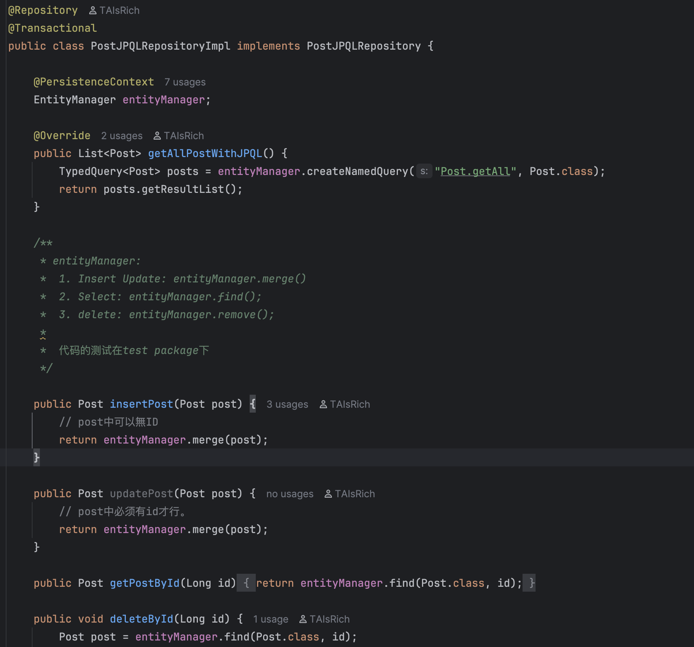

The code uses `entityManager` to perform:
- `merge()` → for insert or update → Internally calls `session.merge()`
- `find()` → to retrieve data by ID → Internally calls `session.get()` or `session.find()`

## 12. SessionFactory vs Session

### SessionFactory
- A heavyweight factory that creates Session instances. 
- It’s thread-safe and usually created once per application.
- Manages Hibernate’s configuration and caching.
- Expensive to create — should be reused.

```java
SessionFactory sessionFactory = new Configuration()
    .configure("hibernate.cfg.xml")
    .buildSessionFactory();
```
### Session
- A lightweight, single-use object that represents a connection to the database. 
- It’s not thread-safe and is used to perform CRUD operations.
- Used to perform CRUD operations, run queries, and manage entity states.
- Internally used by JPA’s EntityManager in Hibernate.

```text
Session session = sessionFactory.openSession();
session.beginTransaction();
session.save(entity);
session.getTransaction().commit();
session.close();
```

| Feature            | SessionFactory                            | Session                                   |
|--------------------|-------------------------------------------|-------------------------------------------|
| Purpose            | Creates `Session` objects                 | Used for actual DB operations             |
| Thread-safe        | ✅ Yes                                     | ❌ No (use per transaction/request)        |
| Lifecycle          | Application-wide (singleton)              | Short-lived, per use                      |
| Creation Cost      | High (builds config & mappings)           | Low (lightweight)                         |
| Examples of usage  | `buildSessionFactory()`                   | `session.save()`, `session.merge()`, etc. |


# Part 6: Database Fundamentals
## 13. SQL Transactions
### What is a Transaction (in Relational Databases)?

A transaction is a sequence of one or more database operations (like INSERT, UPDATE, DELETE) that must be executed as a single unit of work.
> All operations must succeed together 🏅 OR none of them should take effect ☹️

Transaction follows the ACID properties

### How Spring & Hibernate Manage Transactions
Spring + Hibernate provide declarative transaction management, so we don’t need to manage transactions manually.
#### Spring Boot
```java
@Transactional
public void createPost(Post post) {
    postRepository.save(post);
}
```
The `@Transactional` annotation tells Spring to:
- Open a transaction at the start of the method
- Commit it if everything succeeds
- Roll it back automatically if an exception occurs

#### Hibernate
When we call `EntityManager.persist()` or `session.save()`:
- Hibernate tracks changes in the persistence context
- It flushes and commits the SQL only at the end of the transaction

```java
Session session = sessionFactory.openSession();
Transaction tx = session.beginTransaction();

session.save(post);

tx.commit();  // or tx.rollback() on error
session.close();
```

> But in Spring Boot, all of this is handled automatically via `@Transactional`.

## 14. Hibernate Caching
Hibernate uses caching to improve performance by reducing the number of database hits. 
- It stores frequently accessed data in memory so that repeated queries can avoid going to the database.

### 🥇 First-Level Cache (Session Scope)
- Enabled by default
- Scope: Per Hibernate Session
- Stored in memory while the session is open
- Every entity retrieved in a session is stored in the first-level cache
- If you fetch the same entity again by ID, Hibernate returns it from cache — no DB query

```java
Session session = sessionFactory.openSession();
Post p1 = session.get(Post.class, 1);  // First fetch: Hits the DB
Post p2 = session.get(Post.class, 1);  // Second fetch: Returned from cache, no need to check DB
```
✅ Default behavior, no config needed
❌ Cache is cleared when the session is closed

### 🥈 Second-Level Cache (Global Scope)
- Optional — must be explicitly enabled
- Scope: Shared across sessions and transactions
- Uses providers like Ehcache, Redis, Infinispan, etc.
- Caches entities at the SessionFactory level (application-wide)
- Useful for read-mostly data (e.g., categories, products)

```java
@Cacheable // Marks this entity as eligible for second-level caching.
@Cache(usage = CacheConcurrencyStrategy.READ_ONLY) // Hibernate-specific annotation. READ_ONLY：entity is never modified, only read.
@Entity // Declares this class as a JPA/Hibernate entity (mapped to a database table)
public class Product { ... }
```
✅ Reduces DB load across sessions
❌ More complex to configure and manage

### Summary
| Feature               | First-Level Cache                            | Second-Level Cache                               |
|-----------------------|----------------------------------------------|--------------------------------------------------|
| Scope                 | Single Session                               | All Sessions (SessionFactory-wide)               |
| Enabled by default    | ✅ Yes                                        | ❌ No                                             |
| Shared across sessions| ❌ No                                         | ✅ Yes                                            |
| Lifespan              | Until session closes                         | Until application shuts down                     |
| Configuration needed  | ❌ None                                       | ✅ Yes (provider + annotations)                   |
| Disabling possible    | ❌ No                                         | ✅ Yes (by not configuring)                       |
| Use case              | Avoid duplicate DB hits within session       | Improve performance for shared read-only data    |
