# HW11:  Mapper-Exception-Validation-SpringBasics
@ Jul 11, 2025 _Gloria Wang_

## 1. Add newly learned annotations & add explanations for these annotations.
> `annotations.md` can be checked in folder ShortQuestions

## 2. Bring up the App on my local
> yes, run success after reloading Maven

## 3. Explain why do we need model mappers in Spring, and in what scenario we need it

### What Is ModelMapper?

ModelMapper is a Java library that automates the mapping between objects. It can:
- Copy matching field names automatically 
- Support custom mappings (for differently named fields)
- Work well with nested or complex structures (like lists or inner objects)

###  Why Do We Need ModelMapper in Spring?
In Spring-based applications, especially those following layered architecture (Controller → Service → Repository), we often need to transfer data between different object models, such as:
- Entities (Post, User, Comment, etc.)
- DTOs (Data Transfer Objects like PostDto, UserDto, etc.)

Manually copying properties from one object to another is:
- Verbose – lots of boilerplate code (e.g., `dto.setTitle(entity.getTitle())`)
- Error-prone – might forget to copy a field or mismatch types
- Hard to maintain – every time class changes, we have to update the mapping

### Scenarios We Need ModelMapper
#### Mapping Entity ↔ DTO
Use case: When we don't want to expose database models directly to clients
```java
PostDto postDto = modelMapper.map(postEntity, PostDto.class)
```
#### Avoiding Boilerplate
Use case: When DTOs and entities have many fields and doing get/set manually would clutter the code.

#### Nested Object Conversion
Use case: Entity contains nested objects (e.g., Post has Set<Comment>). ModelMapper can convert them recursively.

#### Bidirectional Conversion
Use case: When we need to convert both from Entity → DTO and DTO → Entity, such as when receiving input from the frontend and saving it to DB.

#### Multiple DTO Variants
Use case: When have different views of the same object (e.g., a short summary DTO vs. a full details DTO).

#### Spring REST APIs with Clean Separation
Use case: When exposing RESTful APIs and want to clean separation between domain model and response/request formats.

## 4. Provide 3 examples in which model mapper will NOT map succesfully, explain why

### Example 1: Field Names Don’t Match
```java
public class User {
    private String username;
}

public class UserDto {
    private String name;
}
```
- ModelMapper maps fields based on name equality by default.
- `username != name`, so it doesn’t know these fields are related.

### Example 2: Nested Source Field to Flat Destination
```java
public class Order {
    private Customer customer;
}

public class OrderDto {
    private String customerName;
}
```
- The source has a nested structure: `order.getCustomer().getName()`
- The destination expects a flat field: `customerName`
- ModelMapper doesn’t automatically map nested to flat without configuration.

### Example 3: Incompatible Collection Types
```java
public class Book {
    private List<Author> authors;
}

public class BookDto {
    private Set<AuthorDto> authors;
}
```
- The source uses List<Author> and the destination expects Set<AuthorDto>
- ModelMapper cannot automatically map:
  - Between different collection types (List vs. Set)
  - Between different element types (Author vs. AuthorDto)

## 5. How model mapper cast different data types between source object and target class

### Primitive to Wrapper and vice versa
- Supported automatically
```java
public class User {
    private int age;
}
public class UserDto {
    private Integer age;
}
```
ModelMapper will automatically convert `int → Integer` and vice versa.

### String ↔ Primitive Types
- Supported for common types like int, double, boolean, etc.
```java
public class Product {
    private String price; // "19.99"
}
public class ProductDto {
    private double price;
}
```
ModelMapper will parse the String into a double.
- Internally, it uses Java’s type conversion (e.g., Double.parseDouble("19.99"))

### Date ↔ String
- Not automatically supported
- must provide a custom converter, e.g., for Date ↔ String in a certain format.
```java
Converter<Date, String> dateToString = ctx ->
    new SimpleDateFormat("yyyy-MM-dd").format(ctx.getSource());

modelMapper.addConverter(dateToString);
```
### Enum ↔ String
- Not always automatic unless names match exactly
```java
public enum Status {
    ACTIVE, INACTIVE
}
public class UserDto {
    private String status;
}
```
- If the string value matches the enum name exactly, it may work.
- Otherwise, need to provide a custom mapping or converter.

### Custom Class ↔ Another Custom Class
- Not automatic unless fields match exactly (type and name)
- If structure differs or nested types are involved, will need:
  - `TypeMap`
  - `Custom Converter`
  - `PropertyMap`

## 6. Add your own API exceptions so that when something wrong happens in service layer, your rest API will return your customized response and status code.

### Add Exception Handler in GlobalExceptionHandler.java
```java
// custom exception
@ExceptionHandler(InvalidRequestException.class)
public ResponseEntity<ErrorDetails> handleInvalidRequestException(InvalidRequestException exception,
                                                                    WebRequest webRequest) {
    ErrorDetails errorDetails = new ErrorDetails(new Date(), exception.getMessage(),
            webRequest.getDescription(false));

    return new ResponseEntity<>(errorDetails, HttpStatus.BAD_REQUEST);
}
```
### Add InvalidRequestException class under exception package

```java
package com.chuwa.redbook.exception;

import org.springframework.http.HttpStatus;
import org.springframework.web.bind.annotation.ResponseStatus;

@ResponseStatus(value = HttpStatus.UNPROCESSABLE_ENTITY)
public class InvalidRequestException extends RuntimeException {
    public InvalidRequestException(String message) {
        super(message);
    }
}
```

### Add custom validation checks in PostServiceImpl
#### createPost(PostDto postDto)
```java
if (postDto.getTitle() == null || postDto.getTitle().length() < 2) {
        throw new InvalidRequestException("Post title must be at least 2 characters long.");
}
```
Purpose: Prevent creating a post with a short or null title.

#### updatePost(PostDto postDto, long id)
```java
if (id <= 0) {
    throw new InvalidRequestException("Post ID must be greater than 0.");
}

if (postDto.getTitle() == null || postDto.getTitle().length() < 2) {
    throw new InvalidRequestException("Post title must be at least 2 characters long for updates.");
}
```
Purpose:
- Validate the id
- Enforce stricter title rules during update

#### deletePostById(long id)
```java
if (id <= 0) {
    throw new InvalidRequestException("Post ID must be greater than 0.");
}
```

#### getAllPost(int pageNo, int pageSize, String sortBy, String sortDir)
```java
if (pageNo < 0 || pageSize <= 0) {
    throw new InvalidRequestException("Page number must be >= 0 and page size must be > 0.");
}
```
Purpose: Validate pagination input to avoid invalid database queries.

## 7. Explain how Controller Advices work, is there any other approach to do same/similar global API exception handling?
### What is `@ControllerAdvice`
`@ControllerAdvice` is a Spring annotation used to define global exception handlers that apply to all `@Controller` and `@RestController` classes in application.
- It allows centralized management of errors so that all exceptions can be caught and translated into meaningful HTTP responses from a single place.

### How It Works
- Annotate a class with `@ControllerAdvice`
- Inside that class, define methods with `@ExceptionHandler(ExceptionType.class)` to handle specific exceptions.
- When a controller method throws that exception, Spring will route it to the appropriate handler method inside `@ControllerAdvice` class.
```java
@ControllerAdvice
public class GlobalExceptionHandler {

    @ExceptionHandler(ResourceNotFoundException.class)
    public ResponseEntity<ErrorDetails> handleNotFound(ResourceNotFoundException ex, WebRequest request) {
        ErrorDetails error = new ErrorDetails(new Date(), ex.getMessage(), request.getDescription(false));
        return new ResponseEntity<>(error, HttpStatus.NOT_FOUND);
    }
}
```
### Other Approaches to do same/similar global API exception handling

#### `@ExceptionHandler` in individual controllers
- Annotate methods within a specific `@RestController` to handle exceptions locally.
- Downside: need to repeat the same logic in every controller.
```java
@RestController
public class PostController {

    @ExceptionHandler(ResourceNotFoundException.class)
    public ResponseEntity<String> handleLocal(ResourceNotFoundException ex) {
        return new ResponseEntity<>(ex.getMessage(), HttpStatus.NOT_FOUND);
    }
}
```
#### HandlerExceptionResolver interface
For advanced customization (e.g. logging, metrics), we can implement Spring’s low-level `HandlerExceptionResolver` interface.
- It gives full control over how exceptions are processed but is more complex and verbose.

## 8. What's the difference between throwing a regular exception and a customized API exception that will be eventually thrown to Controller Advice codes? 

### Comparison: Regular Exception vs. Custom API Exception with ControllerAdvice
In Spring Boot, both regular exceptions (like RuntimeException) and custom API exceptions (like InvalidRequestException) can be thrown from the service layer. The key difference lies in how they are handled and what kind of HTTP response the client receives.

When using `@ControllerAdvice`, both types can be caught, but:

| Feature                             | Regular Exception                         | Custom API Exception (`InvalidRequestException`, etc.)   |
|-------------------------------------|-------------------------------------------|----------------------------------------------------------|
| Type                                | Java built-in (e.g. `RuntimeException`)   | User-defined class extending `RuntimeException`          |
| Controlled HTTP status              | ❌ No – defaults to 500                    | ✅ Yes – via `@ResponseStatus` or `@ControllerAdvice`     |
| Structured JSON response            | ❌ Often generic or raw HTML               | ✅ Custom JSON (timestamp, message, details, etc.)        |
| Reusable for business logic         | ❌ Not meaningful semantically             | ✅ Can represent domain-specific errors (e.g. BadInput)   |
| Centralized handling with Advice    | ❌ Not automatically routed                | ✅ Handled by `@ExceptionHandler` in `@ControllerAdvice`  |
| Custom error message                | ⚠️ Only if you manually construct it      | ✅ Full control over message content                      |
| Helpful for client-side debugging   | ❌ Limited                                 | ✅ Yes, returns descriptive and structured error data     |

### 📸 Screenshots
#### Regular Exception

```java
@Override
public PostDto getPostById(long id) {
    
  if (id < 0) {
    throw new RuntimeException("Invalid ID: must be >= 0");
  }

  Post post = postRepository.findById(id).orElseThrow(() -> new ResourceNotFoundException("Post", "id", id));
  return modelMapper.map(post, PostDto.class);
}
```
response with 500 error
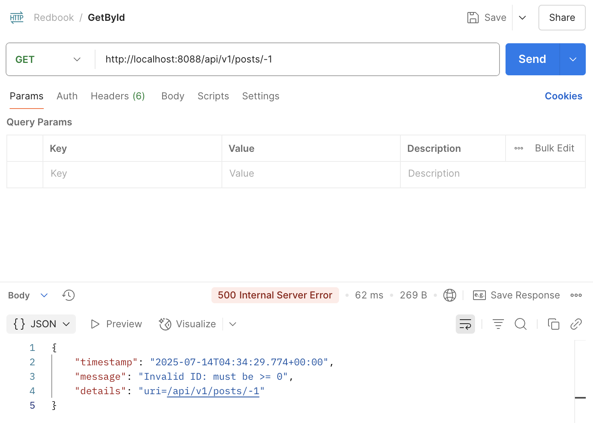

#### Custom API Exception
```java
@Override
public PostDto getPostById(long id) {
    
  if (id < 0) {
    throw new RuntimeException("Invalid ID: must be >= 0");
  }

  Post post = postRepository.findById(id).orElseThrow(() -> new ResourceNotFoundException("Post", "id", id));
  return modelMapper.map(post, PostDto.class);
}
```
response handled by `@ControllerAdvice` with 400 Bad Request
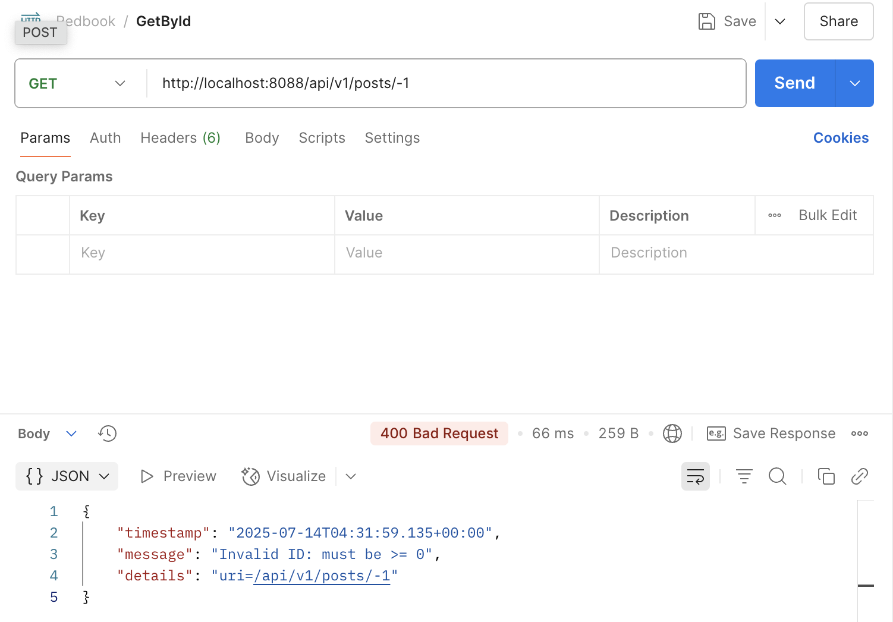

With ControllerAdvice:
- Both exceptions bubble up from the service layer to `GlobalExceptionHandler`
- But only the custom exception is caught by a specific `@ExceptionHandler(InvalidRequestException.class)`
- The regular one falls through to the generic handler (`@ExceptionHandler(Exception.class)`) and returns 500

| Input (id = -1)   | Exception Type             | Thrown From        | Handled By                          | HTTP Status  | JSON Response Type       |
|-------------------|----------------------------|--------------------|-------------------------------------|--------------|--------------------------|
| -1                | `RuntimeException`         | Manual throw       | `handleGlobalException()`           | 500          | Generic error format     |
| -1                | `InvalidRequestException`  | Manual throw       | `handleInvalidRequestException()`   | 400          | Custom structured JSON   |

## 9. Write some regular expression to restrict the value of attributes that your Post or Comment can have. 
You may use https://regex101.com/ to construct and test/validate your regular expression.

### Post Title 
Only allows letters, numbers, common punctuation, and spaces. 5–100 characters.
```java
@Pattern(
    regexp = "^[\\p{L}\\p{N} .,!?'\"-]{5,100}$",
    message = "Title must be 5–100 characters and can include letters, numbers, and punctuation."
)
```

### Post Description
Allows sentence-style input, limited to 300 characters
```java
@Pattern(
    regexp = "^[\\p{L}\\p{N} .,!?'\"()\\-]{5,300}$",
    message = "Description must be 5–300 characters and may contain punctuation."
)
```
### Post Tags
Comma-separated lowercase words only (no spaces).
```java
@Pattern(
    regexp = "^([a-z]+,)*[a-z]+$",
    message = "Tags must be comma-separated lowercase words (e.g., java,spring,boot)."
)
```

### Comment Body
Supports long-form messages with punctuation, 5–500 characters.
```java
@Pattern(
    regexp = "^[\\p{L}\\p{N} .,!?()'\"\\-]{5,500}$",
    message = "Comment must be 5–500 characters with standard punctuation."
)
```

## 10. Explain Spring framework fundamental principles. And how can they help build business applications?
### 1. IoC (Inversion of Control)

- Objects (beans) are **not created manually**, but are managed by the Spring container.
- Control is **inverted** from developers to the framework.
- This enables **centralized object lifecycle management**.


#### Without IoC (Manual Control):

```java
Post post = new Post();
post.setComment(new Comment());
post.getComment().setSubComment(new SubComment());
```
#### With IoC:
```java
@Autowired
private Post post; // Spring injects and wires it automatically
```
> IoC helps manage dependencies consistently across large systems. 
> - This reduces repetitive code and manual wiring, making it faster to develop features and easier for teams to collaborate on enterprise-scale projects.

### 2. DI (Dependency Injection)
Dependencies are injected into a class by Spring instead of the class creating them.
- Promotes loose coupling and testability.
> Loose coupling allows modules (like PaymentService, UserService) to change or scale independently. 
> 
> It also enables unit testing by easily mocking dependencies, improving code quality and reducing bugs.

### 3.  Beans in Spring
- A Bean is any Java object that is managed by the Spring container.
- Spring automatically scans and registers these components at startup.

#### Bean Registration Methods:
| Method       | Description                                       |
|--------------|---------------------------------------------------|
| `@Component` | On top of a class – auto-registered by scanning   |
| `@Bean`      | On a method – returns a new instance manually     | 

> Automatic bean registration and lifecycle management reduces boilerplate configuration. Developers can focus on business logic instead of setup code, which improves productivity and reduces errors.

## 11. Explain different types of dependency injection, explain their suitable use cases, and why field injection is not recommended in general. 
Please provide necessary code snippets and screenshots if possible.

### Constructor Injection (Recommended)

```java
@Service
public class PostService {

    private final PostRepository postRepository;

    // Dependency injected via constructor
    @Autowired
    public PostService(PostRepository postRepository) {
        this.postRepository = postRepository;
    }
}
```
Use When:
- Want to enforce mandatory dependencies
- Writing unit tests 
- Working with final fields for immutability 

Spring calls the constructor and passes in the dependency.
- can declare postRepository as final
- Fails fast at runtime if the bean isn’t available
- Very easy to test via constructor parameters

### Setter Injection
```java
@Service
public class PostService {

    private PostRepository postRepository;

    // Dependency injected via setter method
    @Autowired
    public void setPostRepository(PostRepository postRepository) {
        this.postRepository = postRepository;
    }
}
```
- Spring creates the object first, then calls the setter.
- ostRepository is nullable unless you validate it
- Easy to forget setting it during testing
- Allows optional dependencies or bean replacement later

### Field Injection
```java
@Service
public class PostService {

    @Autowired
    private PostRepository postRepository;
}
```
- Spring injects directly into the private field
- Hard to unit test — can’t pass a mock without using reflection
- No visibility — constructor doesn’t reveal the required dependency
- Can’t mark the field final

### Comparison of Dependency Injection Types in Spring

| Injection Type      | How It Works            | Pros                                                                                           | Cons                                                                  | Suitable When                               |
|---------------------|-------------------------|------------------------------------------------------------------------------------------------|-----------------------------------------------------------------------|---------------------------------------------|
| **Constructor**     | via constructor         | ✅ Enforces mandatory dependencies  <br> ✅ Supports `final` fields <br> ✅ Best for unit testing | ❌ Slightly more verbose                                               | When dependencies are required              |
| **Setter**          | via setter method       | ✅ Flexible <br> ✅ Good for optional or reconfigurable dependencies                             | ❌ Dependency is optional by default <br> ❌ Might not fail fast        | When dependency is optional or configurable |
| **Field**           | direct to private field | ✅ Short and concise                                                                            | ❌ Hard to test <br> ❌ Breaks encapsulation <br> ❌ Hidden dependencies | Only for quick prototypes or demos          |

## 12. Explain different types of application context in Spring framework, with screenshots. 
You may take https://github.com/CTYue/springIOC for reference.

### AnnotationConfigApplicationContext

- Used for **Java-based configuration** (i.e., `@Configuration`, `@ComponentScan`, `@Bean`)
- Commonly used in Spring Boot and modern Spring apps

#### GetBeanMain.java
```java
 ApplicationContext context = new AnnotationConfigApplicationContext(BeanConfig.class);
```
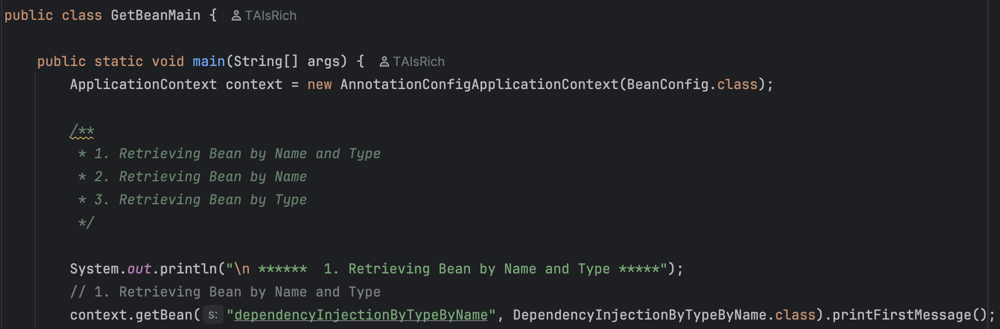

#### BeanConfig.java
```java
@ComponentScan(basePackages = {"com.chuwa.springbasic"})

```
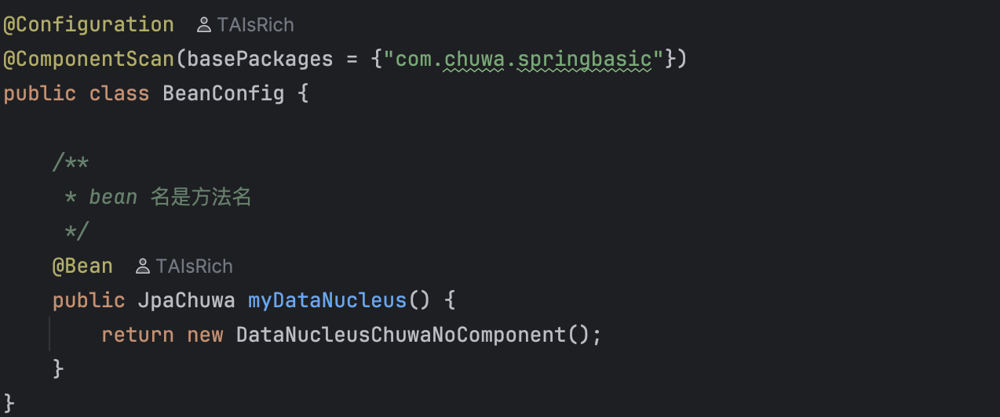


### ClassPathXmlApplicationContext
- Loads Spring context from an XML file in the classpath
- Traditional method before Spring Boot and annotation-based config

#### SpringIocContainerApplication.java
```java
ApplicationContext context = new ClassPathXmlApplicationContext("bean.xml");
```
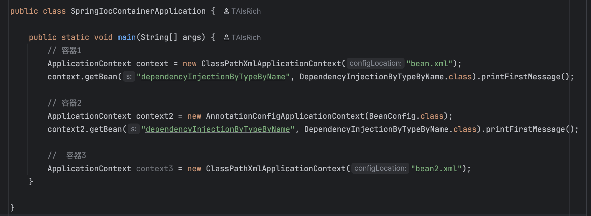

#### bean.xml
```xml
<context:component-scan base-package="com.chuwa.springbasic"/>
```
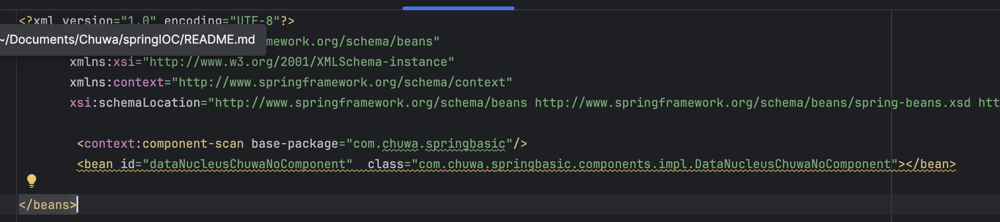

| Context Type                       | Configuration Style          | When to Use                          |
|------------------------------------|------------------------------|--------------------------------------|
| AnnotationConfigApplicationContext | Java (`@Bean`, `@Component`) | ✅ Modern Spring applications         |
| ClassPathXmlApplicationContext     | XML (classpath)              | ⚠️ Legacy or XML-heavy projects      |

## 13. Compare @Component and @Bean and in which scenario they should be used

| Feature          | `@Component`                                | `@Bean`                                      |
|------------------|---------------------------------------------|----------------------------------------------|
| Target           | Used on **classes**                         | Used on **methods** inside `@Configuration`  |
| Instantiation    | Spring scans the class and creates a bean   | Method manually returns the bean             |
| Where to use     | On self-defined POJOs with `@ComponentScan` | When working with **third-party classes**    |
| Control Level   | Less control over bean creation             | Full control — can add parameters/logic      |
| Discovery      | Automatic via classpath scanning            | Manual declaration                           |


### ✅ When to Use

#### **Use `@Component`**  
- When own the class and can annotate it directly.  
- Example: Service, DAO, Controller classes.

```java
@Component
public class DependencyInjection {
  @Autowired
  private JpaICC jpaICC;

  public void printMessage() {
    jpaICC.printMessage();
  }
}
```

#### **Use `@Bean`**  
When need to register a third-party class (cannot annotate it), or when bean creation requires custom logic.
```java
@Configuration
@ComponentScan(basePackages = {"com.chuwa.springbasic"})
public class BeanConfig {

  @Bean
  public JpaChuwa myDataNucleus() {
    return new DataNucleusChuwaNoComponent(); 
  }
}
```

## 14. Explain Spring bean scopes and how to pick the correct bean scope

In Spring, a **bean scope** defines how many instances of a bean Spring creates and how it shares them.  
- Using `@Scope("scopeName")` on a bean class or method to specify scope

### Common Bean Scopes

| Scope Name   | Description                                                                 | When to Use                             |
|--------------|-----------------------------------------------------------------------------|------------------------------------------|
| `singleton`  | (Default) Only one instance per Spring container                            | Most services and stateless components   |
| `prototype`  | A new instance is created **every time** it is requested                    | When you need mutable, short-lived beans |
| `request`    | One instance per **HTTP request** (Web context only)                        | For per-request data in web apps         |
| `session`    | One instance per **HTTP session**                                           | To store user-specific session data      |
| `application`| One instance per **ServletContext** (shared across entire app)              | For app-wide caches or metadata          |
| `websocket`  | One instance per WebSocket session                                          | For real-time messaging apps             |

### `singleton` vs `prototype`

```java
@Component
@Scope("singleton")  // Only one instance (default)
public class MySingletonBean {
}
```
```java
@Component
@Scope("prototype")  // New instance every time
public class MyPrototypeBean {
}
```
| Use Case                                 | Recommended Scope   |
|------------------------------------------|---------------------|
| Stateless services (e.g. business logic) | `singleton`         |
| Non-thread-safe objects                  | `prototype`         |
| Per-user session storage                 | `session`           |
| Temporary data during a single request   | `request`           |
| Realtime messaging with WebSockets       | `websocket`         |

#### ⚠️
- `singleton` is the default and most commonly used — it’s efficient and works well for stateless services.
- `prototype` beans are not managed after creation — must handle cleanup manually.
- `request`, `session`, `application`, and `websocket` are only available in Spring Web context.


## 15. Explain the difference between bean id and bean class

- **`id`**: a unique **name** for the bean in the Spring container
  - The name use to The name used to reference the bean (myService)
- **`class`**: the **Java class** used to create the bean
  - The actual Java class Spring uses to create the object (MyService)
```java
MyService service = context.getBean("myService", MyService.class);
```
```java
@Component("myService") // bean id
public class MyService { } // bean class
```
#### Why It Matters
- May have multiple beans of the same class with different purposes → use different ids
- Inject or fetch beans using either `@Qualifier("id")` or `getBean("id", Class.class)`

## 16. Explain that when a bean has multiple alternative implementations, how will Spring decide which bean implementation to inject/autowire?

### `@Primary` – Set a Default Bean

Use `@Primary` to **mark one bean as the default** when multiple candidates are found.

```java
@Component
@Primary
public class MySqlRepository implements DataRepository { }

@Component
public class MongoRepository implements DataRepository { }
```
```java
@Autowired
private DataRepository dataRepository; // Injects MySqlRepository (first one)
```
Spring chooses the @Primary bean automatically.

### `@Qualifier` – Select a Bean by Name
Use `@Qualifier("beanName")` to explicitly specify which bean to inject
```java
@Component("mysqlRepo")
public class MySqlRepository implements DataRepository { }

@Component("mongoRepo")
public class MongoRepository implements DataRepository { }
```
```java
@Autowired
@Qualifier("mongoRepo")
private DataRepository dataRepository; // Injects MongoRepository
```

###  Bean Method Name (for `@Bean`)

If using `@Bean` in a config class, the method name becomes the bean name:
```java
@Configuration
public class AppConfig {
    @Bean
    public DataRepository mysqlRepo() {
        return new MySqlRepository();
    }
    
    @Bean
    public DataRepository mongoRepo() {
        return new MongoRepository();
    }
}
```
Then we also use `@Qualifier("mongoRepo")` to specify the name we want to inject

```java
@Autowired
@Qualifier("mongoRepo")
private DataRepository dataRepository; // Injects MongoRepository
```

### Priority Order

| Priority   | Mechanism       | Description                                          |
|------------|-----------------|------------------------------------------------------|
| 🥇 1st     | `@Qualifier`    | **Always wins** — explicitly specifies bean name     |
| 🥈 2nd     | `@Primary`      | Default fallback when multiple candidates exist      |
| 🥉 3rd     | Bean name/order | Ignored unless only **one bean** of that type exists |


### Example

```java
@Configuration
public class AppConfig {
    @Bean
    @Primary
    public DataRepository mysqlRepo() { // default
        return new MySqlRepository();
    }

    @Bean
    public DataRepository mongoRepo() {
        return new MongoRepository();
    }
}
```
```java
@Autowired
@Qualifier("mongoRepo")
private DataRepository repo;  // Injects mongoRepo (overrides @Primary)
```
If `@Qualifier` is removed:
```java
@Autowired
private DataRepository repo;  // Injects mysqlRepo (because of @Primary)
```
If both `@Qualifier` and `@Primary` are removed:
Spring will throw an error because it can’t decide which one to pick.

## Logging

### 1. Add Proper Logging with SLF4J
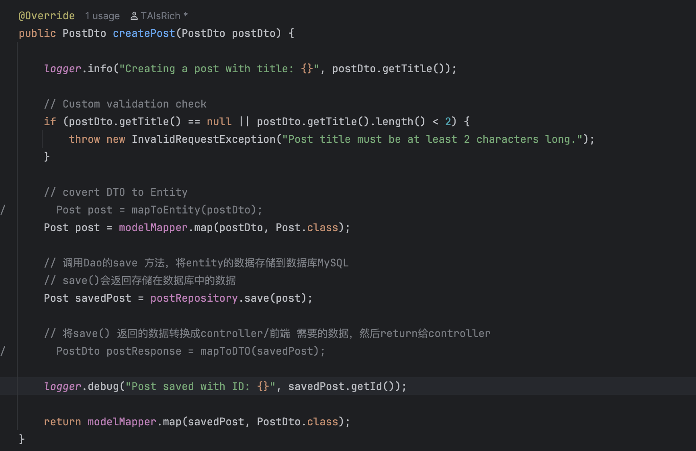

### 2. Set up proper logging level
Application Properties
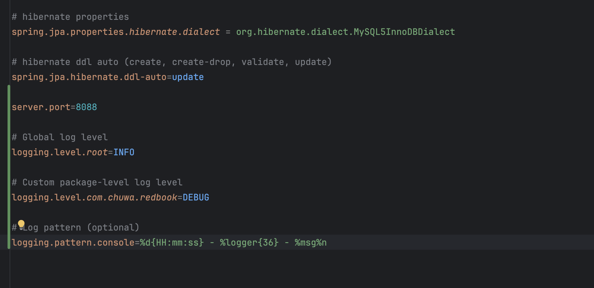

### 3. 📸 Screenshots
#### Tomcat Version
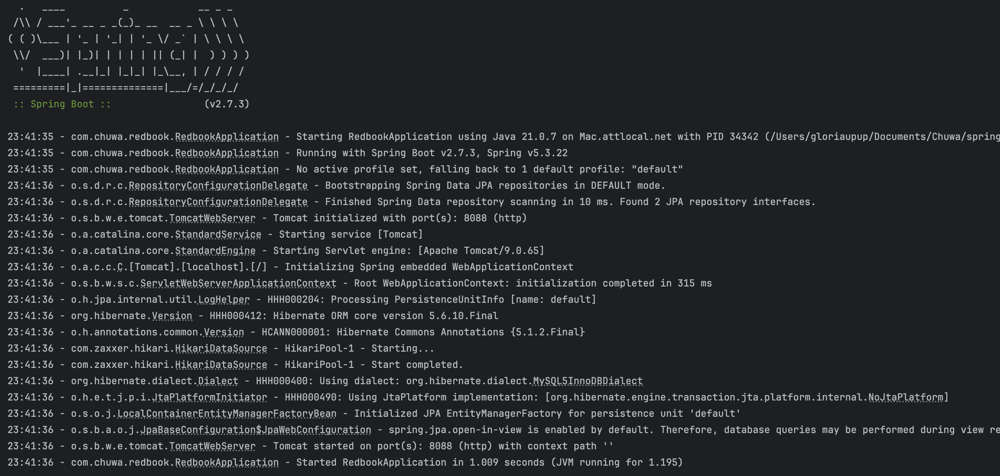

### 4. Setup an external tomcat server to bring up above application

#### .war file under /target
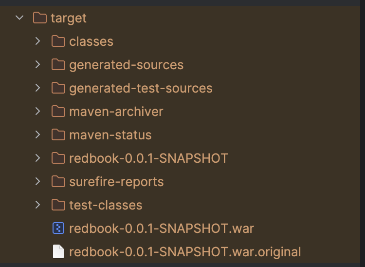

#### Application Properties
> comment server.port = 8088
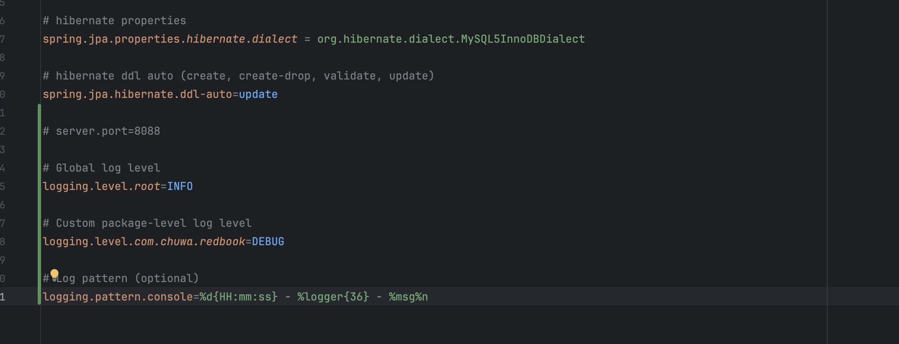

#### webapps folder
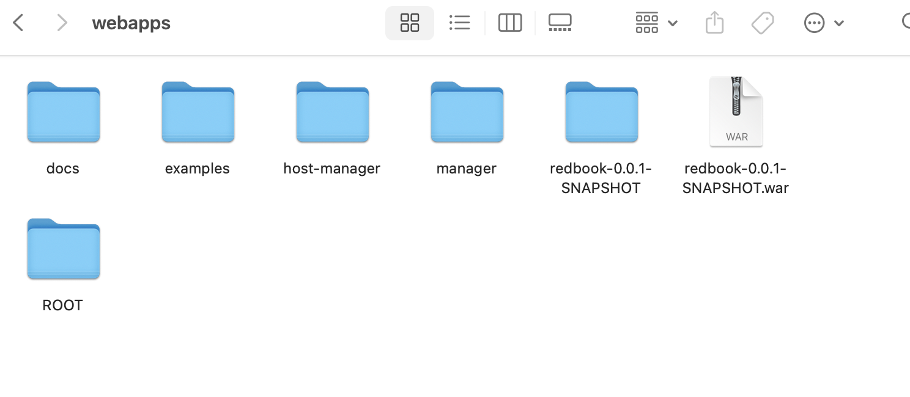

#### Successful browser response from external Tomcat
> http://localhost:8080/redbook-0.0.1-SNAPSHOT/api/v1/posts

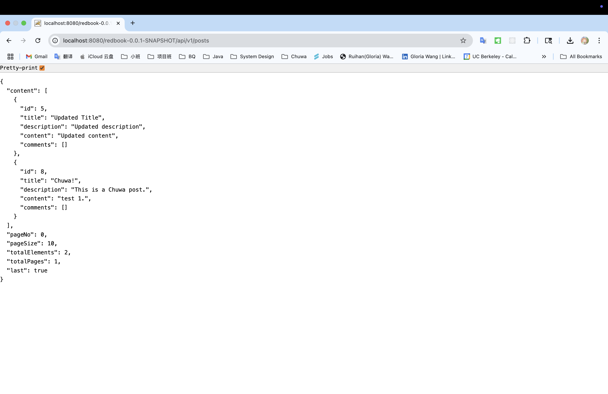


