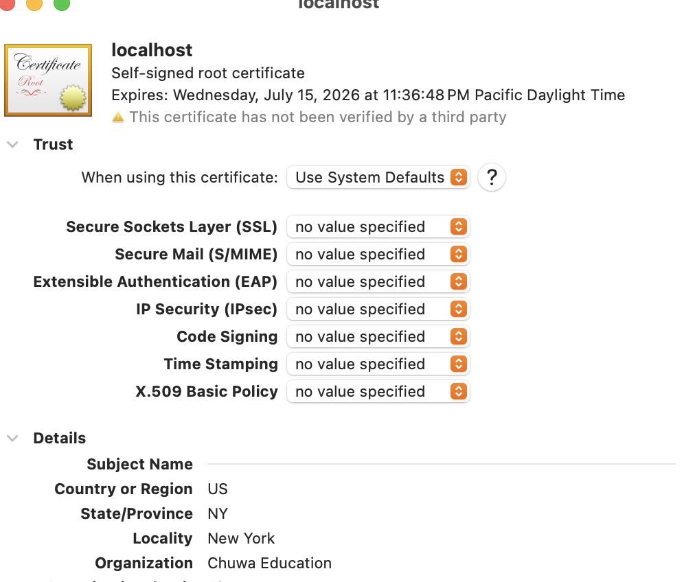
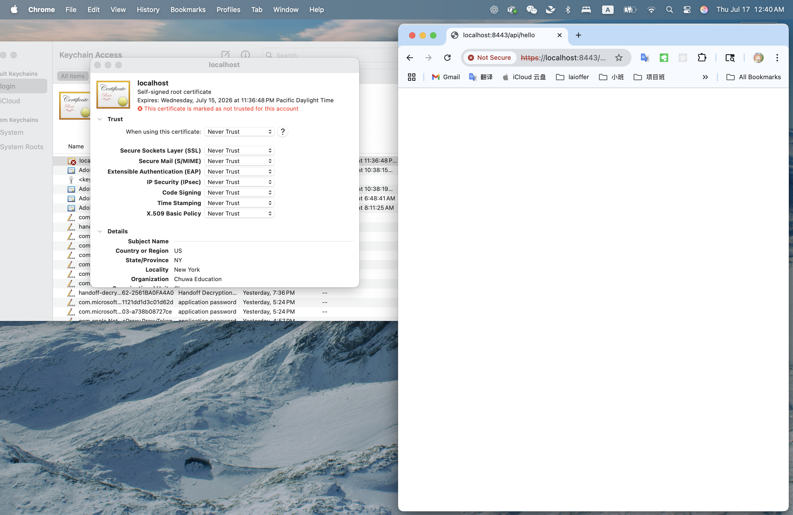
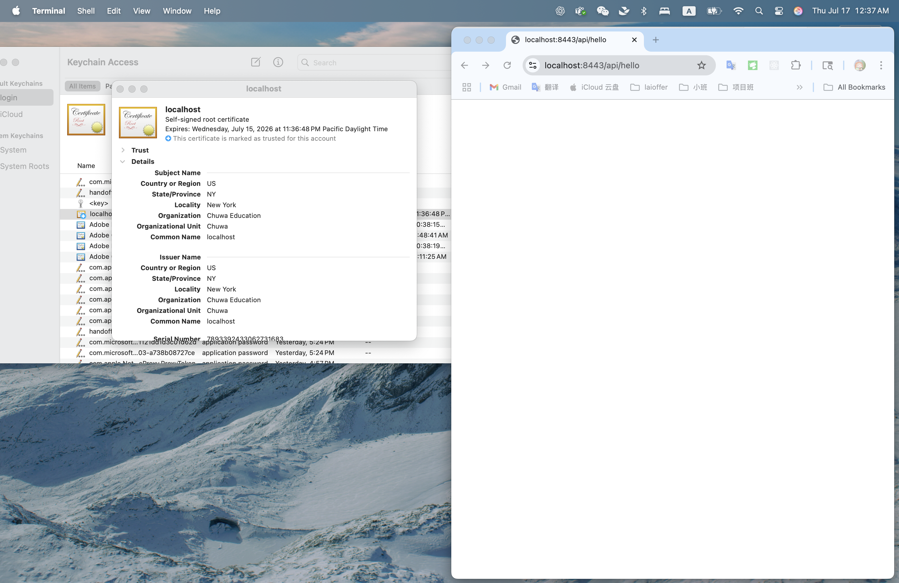
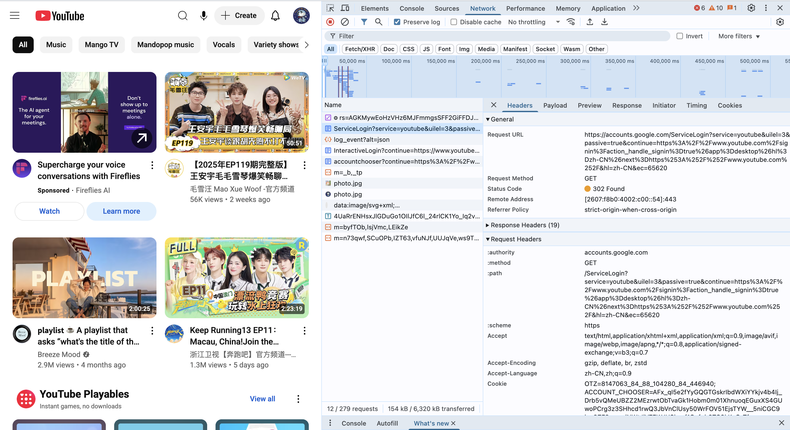
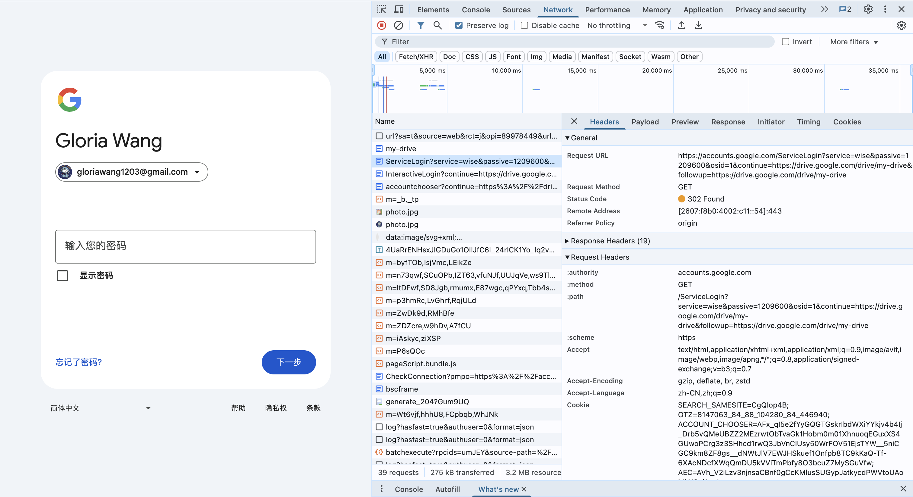

# HW12: Spring Security
@ Jul 15, 2025 _Gloria Wang_

## 1. List all of the annotations you learned from class and homework to `annotaitons.md`
> check `annotaitons.md`
## 2. Explain TLS, PKI, certificate, public key, private key, and signature.

### 🔐 TLS (Transport Layer Security)
* TLS is a **security protocol** that ensures **encrypted communication** over the internet.
* It provides **confidentiality, integrity, and authentication**.
* TLS is the modern version of SSL and is used in HTTPS.
* During the TLS **handshake** 🤝, the client and server:
  * Authenticate each other using certificates
  * Agree on encryption algorithms
  * Exchange keys to encrypt further communication

#### One-Way TLS (Server Authentication)
* Only the **server is authenticated** using a certificate issued by a trusted root CA.
* Common in most web interactions (e.g., visiting websites).
* The client verifies the server’s identity before exchanging data, but the server does not verify the client.


#### Two-Way TLS (Mutual Authentication)
* **Both the client and server present certificate**s, and both must be verified by each other’s trusted root CAs.
* This ensures mutual trust and is used in secure environments like banking systems or microservices.

### 🏛️ PKI (Public Key Infrastructure)
* PKI is a framework for managing public-key encryption.
* It supports:
  * Issuing, distributing, and revoking digital certificates
  * Authenticating identities (e.g., websites, users, services)
* PKI relies on a hierarchy of Certificate Authorities (CAs):
  * Root CA → Intermediate CA → End-entity (server/client)

### 📄 Certificate
* A digital certificate is a signed document that proves the ownership of a public key.
* It contains:
  * Public key
  * Subject identity (e.g., domain name)
  * Issuer info (e.g., CA)
  * Digital signature of the issuer
* Used to establish trust in TLS.

### 🔑 Public Key
* A cryptographic key that is shared publicly.
* Used to:
  * **Encrypt data** (only decryptable by the private key)
  * **Verify signatures** created with the private key

### 🔐 Private Key
* A secret cryptographic key kept by the owner.
* Used to:
  * **Decrypt data** encrypted with the public key
  * **Sign data** to prove its origin and integrity

### ✍️ Signature (Digital Signature)
* A mathematical proof that a message comes from a trusted source and hasn’t been altered.
* Created by:
  * **Hashing** the message content
  * Encrypting the hash using the **private key**
* The receiver:
  * Decrypts the signature using the **public key**
  * Recomputes the hash and compares it to ensure authenticity

## 3. Spring security based application

### 1. Self-Signed Certificate in JKS Format

#### Step 1: Generate Self-Signed Certificate in JKS Format

```bash
  keytool -genkeypair -alias springhttps -keyalg RSA -keysize 2048 -storetype JKS \
    -keystore src/main/resources/springhttps-keystore.jks -validity 365 \
    -storepass password -keypass password \
    -dname "CN=localhost, OU=Chuwa, O=Chuwa Education, L=New York, S=NY, C=US" \
    -ext SAN=dns:localhost,ip:127.0.0.1
```
Key Parameters:
- `-alias springhttps` - Proper naming for the certificate
- `-storetype JKS` - Java KeyStore format
- `-keystore src/main/resources/springhttps-keystore.jks` - Packed in application
  resources
- `CN=localhost` - Matches the hostname I'll use
- `-ext SAN=dns:localhost,ip:127.0.0.1` - Subject Alternative Names

  

  
#### Step 2: Configure Application Properties
```properties
# HTTPS Configuration
server.port=8443
server.ssl.enabled=true
server.ssl.key-store-type=JKS
server.ssl.key-store=classpath:springhttps-keystore.jks
server.ssl.key-store-password=password
server.ssl.key-password=password
server.ssl.key-alias=springhttps

# Security Configuration
spring.security.user.name=admin
spring.security.user.password=password
spring.security.user.roles=USER
```

#### Step 3: Verify Certificate is Properly Packed
```bash
# Check if file exists in resources
ls -la src/main/resources/springhttps-keystore.jks
# output: -rw-r--r--@ 1 gloriaupup  staff  2276 Jul 15 23:36 src/main/resources/springhttps-keystore.jks

# Verify certificate details
keytool -list -v -keystore src/main/resources/springhttps-keystore.jks -storepass password
# output:
#
#  Keystore type: JKS
#  ...
#  Alias name: springhttps
#  ...
#  Owner: CN=localhost, OU=Chuwa, O=Chuwa Education, L=New York, ST=NY, C=US
#  Issuer: CN=localhost, OU=Chuwa, O=Chuwa Education, L=New York, ST=NY, C=US
#  ...
#  Valid from: Tue Jul 15 23:36:48 PDT 2025 until: Wed Jul 15 23:36:48 PDT 2026
#  ...
#  Subject Public Key Algorithm: 2048-bit RSA key
#  ...
#  DNSName: localhost
#  IPAddress: 127.0.0.1
```

### 2. Test Without Importing Certificate
> If i choose "Never Trust" -> can't open https://localhost:8443/api/hello



### 3. Make HTTPS Work WITHOUT Bypassing TLS/SSL
> After adding it to keychain and make "Always Trust" it worked



## 4. List all http status codes that related to authentication and authorization failures
### 4xx Client Error Codes:

#### 401 Unauthorized

- **Meaning**: Authentication required or failed
- **When**: Missing or invalid credentials
- **Example**: No username/password provided, expired token
- **WWW-Authenticate header**: Usually included to specify auth method

#### 403 Forbidden

- **Meaning**: Authentication successful but access denied
- **When**: Valid credentials but insufficient permissions
- **Example**: User authenticated but doesn't have required role/scope

#### 407 Proxy Authentication Required

- **Meaning**: Client must authenticate with proxy server
- **When**: Proxy server requires authentication
- **Similar to**: 401 but for proxy authentication

#### 511 Network Authentication Required

- **Meaning**: Client needs to authenticate to gain network access
- **When**: Captive portal scenarios (WiFi hotspots)
- **RFC**: RFC 6585

### Related 4xx Codes:

#### 400 Bad Request

- **Auth Context**: Malformed authentication headers
- **Example**: Invalid Base64 encoding in Authorization header

#### 405 Method Not Allowed

- **Auth Context**: Authentication endpoint doesn't support HTTP method
- **Example**: GET request to POST-only login endpoint

#### 429 Too Many Requests

- **Auth Context**: Rate limiting on authentication attempts
- **Example**: Too many failed login attempts

Summary Table:

| Status Code | Name                            | Authentication | Authorization |
  |-------------|---------------------------------|----------------|---------------|
| 401         | Unauthorized                    | ✅ Primary      | ❌             |
| 403         | Forbidden                       | ❌              | ✅ Primary     |
| 407         | Proxy Authentication Required   | ✅ Proxy        | ❌             |
| 511         | Network Authentication Required | ✅ Network      | ❌             |

Common Authentication Flow:

1. No credentials → 401 Unauthorized
2. Invalid credentials → 401 Unauthorized
3. Valid credentials, insufficient permissions → 403 Forbidden
4. Valid credentials, proper permissions → 200 OK

The 401 and 403 are the most commonly used for authentication and authorization
failures respectively.

## 5. Compare authentication and authorization? Name and explain important components in Spring security that undertake authentication and authorization

### Authentication vs Authorization

| Aspect      | Authentication                         | Authorization                   |
|-------------|----------------------------------------|---------------------------------|
| Purpose     | Who are you?                           | What can you do?                |
| Process     | Verify identity                        | Grant/deny access               |
| Input       | Credentials (username/password, token) | User identity + resource/action |
| Output      | Valid/Invalid identity                 | Allow/Deny access               |
| When        | First (login process)                  | After authentication            |
| HTTP Status | 401 Unauthorized                       | 403 Forbidden                   |

### Important Spring Security Components

#### 🔐 Authentication Components:

1. AuthenticationManager
   - Role: Central coordinator for authentication
   - Function: Delegates to appropriate AuthenticationProvider
   - Interface: authenticate(Authentication auth)
   - Implementation: ProviderManager


2. AuthenticationProvider

   - Role: Performs actual authentication logic
   - Function: Validates credentials against user store
   - Examples: DaoAuthenticationProvider, LdapAuthenticationProvider
   - Your Project: DaoAuthenticationProvider (validates admin/password)


3. UserDetailsService

   - Role: Loads user information from storage
   - Function: Retrieves user details by username
   - Interface: loadUserByUsername(String username)
   - Your Project: Default implementation loads admin user


4. PasswordEncoder

   - Role: Encrypts and validates passwords
   - Function: Hash passwords securely
   - Examples: BCryptPasswordEncoder, Pbkdf2PasswordEncoder
   - Your Project: Default encoder (plain text for simplicity)


5. Authentication Filters

   - Role: Extract credentials from HTTP requests
   - Examples:
       - BasicAuthenticationFilter (your project uses this)
       - UsernamePasswordAuthenticationFilter
       - JwtAuthenticationFilter

#### 🛡️ Authorization Components:

1. AccessDecisionManager

   - Role: Makes final authorization decisions
   - Function: Combines multiple AccessDecisionVoter results
   - Strategies: Unanimous, Consensus, Affirmative
   - Your Project: Default affirmative-based decision  


2. AccessDecisionVoter

   - Role: Votes on specific access decisions
   - Function: Returns ACCESS_GRANTED, ACCESS_DENIED, or ACCESS_ABSTAIN
   - Examples: RoleVoter, AuthenticatedVoter


3. SecurityFilterChain

   - Role: Defines security rules for HTTP requests
   - Function: Configures authentication and authorization rules
   - Previous Project:
    ```java
    .authorizeHttpRequests(authz -> authz
    .requestMatchers("/api/hello").authenticated()
    .anyRequest().permitAll()
    )
    ```

4. MethodSecurityInterceptor

- Role: Handles method-level security
- Function: Enforces @PreAuthorize, @PostAuthorize annotations
- Example: @PreAuthorize("hasRole('ADMIN')")

5. SecurityContext

- Role: Holds security information for current thread
- Function: Stores Authentication object
- Access: SecurityContextHolder.getContext().getAuthentication()


Example: in previous test
```java
@Configuration
@EnableWebSecurity
public class SecurityConfig {

    @Bean
    public SecurityFilterChain filterChain(HttpSecurity http) throws Exception {
        http
            .requiresChannel(channel -> 
                channel.requestMatchers("/api/hello").requiresSecure())
            .authorizeHttpRequests(authz -> authz  // ← Authorization
                .requestMatchers("/api/hello").authenticated() // ← Requires authentication
                            .anyRequest().permitAll()
            )
            .httpBasic();  // ← Authentication method
        
        return http.build();
    }
}
```

-> Spring Security separates authentication ("Who are you?") from authorization ("What can you access?") through distinct but integrated components.

## 6. Explain HTTP Session

> An HTTP Session is a server-side storage mechanism used to maintain state across multiple requests from the same client in a stateless HTTP protocol.


### ❓ Why we need HTTP Session? 🤔
- HTTP is stateless, meaning every request is independent.
- But applications (like login systems or shopping carts) need to remember users across requests.
- HTTP sessions solve this by storing user data on the server, tied to a unique session ID.

### Then how does it work? 🙋‍♀️
1.	Client sends a request (e.g., login).
2.	Server creates a session and stores data (e.g., user ID, role).
3.	Server responds with a Set-Cookie header containing a JSESSIONID (or SESSION) cookie.
4.	Client sends this cookie back in subsequent requests.
5.	Server uses the cookie to retrieve session data.

### Session Lifecycle 🔄

- Create -> Session created when a user logs in or sends a tracked request.
- Access -> Server retrieves session data using session ID in cookie.
- Invalidate -> Session destroyed manually (e.g., logout) or via timeout.

### In Spring Boot 🍃
- Enabled by default with spring-boot-starter-web.
- can access it via:
```java
@GetMapping("/profile")
public String getProfile(HttpSession session) {
    Object user = session.getAttribute("user");
    return "Hello, " + user;
}
```
## 7. Explain Cookie 🍪

> A cookie is a small piece of key-value data that a server sends to the client’s browser, which the browser then stores and sends back with every subsequent request to the same server.

### ❓ Why we need Cookie? 🤔
- Make stateless HTTP stateful
- HTTP does not remember previous requests, but cookies allow the server to track a user’s session or preferences. 
- Store client-specific data, like:
  - Session ID (e.g., JSESSIONID)
  - Authentication token (e.g., JWT)
  - User preferences (e.g., theme, language)

### Essence of a Cookie 📦
🍪 essentially HTTP headers:
```
Set-Cookie: name=value; Path=/; HttpOnly; Max-Age=3600;
```
- They are attached automatically by the browser to every request matching the cookie’s scope.

### Cookie Lifecycle 🔄
- We can control how long a cookie lives:
  - Session Cookie: Expires when the browser is closed (default).
  - Persistent Cookie: Set expires or max-age to define a duration.
```http
Set-Cookie: sessionId=abc123; Max-Age=3600;
```

### How Cookies Work 🚀
1. Server sends a cookie to the client in the response header:
    ```http
    Set-Cookie: sessionId=abc123; HttpOnly; Secure;
    ```

2. Browser stores the cookie.
3. Client sends the cookie back in all future requests:
    ```http
    Cookie: sessionId=abc123
    ```

4. Server reads the cookie to identify the user or retrieve session info.

### Security Tips 🔐
- HttpOnly: Prevents JavaScript from accessing the cookie (defends against XSS).
- Secure: Sends cookie only over HTTPS.
- SameSite: Controls whether cookie is sent with cross-origin requests (defends against CSRF).

## 8. Compare Session and Cookie

| Feature              | 🗂️ **Session**                                   | 🍪 **Cookie**                                           |
|----------------------|---------------------------------------------------|---------------------------------------------------------|
| **Storage Location** | Server-side (in memory or external store)         | Client-side (browser)                                   |
| **Data Type**        | Any Java object (complex, secure)                 | Key-value strings only                                  |
| **Size Limit**       | Large (based on server capacity)                  | Small (~4KB limit)                                      |
| **Security**         | More secure (not exposed to user)                 | Less secure (visible and modifiable in browser)         |
| **Lifespan**         | Server-controlled (timeout or logout)             | Controlled by `expires` or `max-age`                    |
| **Auto-sent?**       | Accessed by server only                           | Automatically sent with every HTTP request              |
| **Use Case**         | Store user state, login sessions, shopping cart   | Store session ID, user preference, JWT token            |

## 9. Google SSO

### 1. YouTube Google Login


#### ServiceLogin Request

```http request
GET https://accounts.google.com/ServiceLogin?service=youtube&uile=3&passive=true&continue=https://www.youtube.com/signin
```
YouTube Unique Features:
- Service ID: youtube
- Passive Check: true (simple boolean)
- UI Language: uile=3 (YouTube-specific UI parameter)
- Redirect: youtube.com/signin (YouTube's sign-in page)

Response: 302 Found - Google redirects to next step

### 2. Google Drive Login



Google Drive-Specific Parameters:
```http request
GET https://accounts.google.com/ServiceLogin?service=wise&passive=1209600&osid=1&continue=https://drive.google.com/drive/my-drive&followup=https://drive.google.com/drive/my-drive
```

Google Drive Unique Features:
- Service ID: wise (Drive's internal codename)
- Passive Check: 1209600 (14-day timeout in seconds)
- OS ID: osid=1 (operating system identifier)
- Dual Redirect: Both continue and followup parameters
- Direct Access: Goes straight to /drive/my-drive


### 🔄 Common Google SSO Logic (Both Services):

Shared Authentication Flow:
```text
User clicks "Sign in" → accounts.google.com/ServiceLogin → Authentication Check → Redirect to Service
```

### Common SSO Components:

1. Same Authentication Endpoint:

   - URL: accounts.google.com/ServiceLogin
   - Method: GET
   - Status: 302 Found (redirect)

2. Shared Session Cookies:

    ```text
    Cookie: SID=8147063_88_104280_84_446940;
    ACCOUNT_CHOOSER=AFx_qi5e2TYyGQGTGskribdWXlYYkjv4D4lj...
    ```
   - SID: Session ID (same across all Google services)
   - ACCOUNT_CHOOSER: Multi-account selection token

3. Common Security Headers:

    ```text
    :authority: accounts.google.com
    :scheme: https
    Accept-Encoding: gzip, deflate, br, zstd
    Accept-Language: zh-CN,zh;q=0.9
    Referrer Policy: strict-origin-when-cross-origin
    ```

### 🎯 Universal Google SSO Process:

1. Service Detection: Different service parameter identifies the requesting app
2. Session Validation: Same session cookies work across all Google services
3. Passive Authentication: Checks existing login without user intervention
4. Secure Redirect: 302 redirect with authentication token
5. Service-Specific Callback: Each service gets redirected to its own interface

### 📋 Shared SSO Security Features:

- HTTPS Only: All authentication over encrypted connection
- Session Sharing: One login session works across all Google services
- Token-Based: No password exposure to third-party services
- Centralized Auth: Single authentication server for all Google services
- Multi-Account Support: ACCOUNT_CHOOSER handles multiple Google accounts

> Key Insight: Google SSO uses service-specific parameters but shared authentication infrastructure, enabling true single sign-on across the entire Google ecosystem.

## 10. How do we use session and cookie to keep user information across the application

### 🍪 Cookies: Store User Identifier on Client Side
* When a user logs in, the server creates a unique user identifier (like a session ID or token).
* The server sends this ID to the client in a Set-Cookie header:
    ```text
    Set-Cookie: sessionId=abc123; HttpOnly; Secure; Path=/; Max-Age=3600;
    ```
- The browser automatically includes the cookie in future requests:
    ```text
    Cookie: sessionId=abc123
    ```
- This allows the server to recognize the user on each request.


### 🗂️ Session: Store User Data on Server Side
* When the user logs in, the server creates a session object (e.g., HttpSession in Java).
* User-specific data like:
  * userId, roles, preferences
  * Is stored on the server side (memory, Redis, or database).
* The session is linked to the client using the sessionId cookie.

    ```java
    // Set data into session
    session.setAttribute("user", userObject);
    
    // Retrieve session data
    User user = (User) session.getAttribute("user");
    ```

### How They Work Together  🤝

1. User logs in via login form
2. Server authenticates and creates a session
3. Server stores user info in session, and sets a cookie with sessionId
4. Browser stores the cookie and sends it in all future requests
5. Server retrieves session using sessionId from cookie and restores user info

## 11. What is the Spring Security Filter

In Spring Security, a filter is a component that intercepts and processes HTTP requests before they reach your controller.

> Spring Security uses a chain of filters (called the Security Filter Chain) to handle authentication, authorization, session management, CSRF protection, and more.

### Key Characteristics

- Servlet Filter (from javax.servlet.Filter)
- Executed before controller logic
- Enforce security policies and process credentials
- Can extend or replace filters for custom logic

### 🔗 Default Filter Chain

When using Spring Boot with Spring Security, the following filters are automatically configured:

* SecurityContextPersistenceFilter -> Restores SecurityContext from session
* UsernamePasswordAuthenticationFilter -> Handles form login or username/password login
* BasicAuthenticationFilter -> Handles HTTP Basic Auth
* BearerTokenAuthenticationFilter -> Parses and validates JWT Bearer tokens
* ExceptionTranslationFilter -> Catches and processes security exceptions
* FilterSecurityInterceptor -> Final gatekeeper — authorizes requests


### 🔁 Request Flow

```text
        [ Request ]
             ↓
     [ Security Filters ]
             ↓
     [ DispatcherServlet ]
             ↓
 [ @Controller / @RestController ]
```
## 12. Explain bearer token and how JWT works
### 🪪 Bearer Token
- A Bearer Token is a type of access token sent in the HTTP header:

```text
Authorization: Bearer <token>
```
- “Bearer” means: whoever holds the token is assumed to be the rightful user — like a passport: whoever presents it is treated as authenticated.

### 🔐 JWT (JSON Web Token)

- A JWT is a self-contained, digitally signed token used for authentication and authorization.
- It’s commonly used as a Bearer Token.

### Structure of a JWT

A JWT has 3 parts, separated by:
```text
<Header>.<Payload>.<Signature>
```

* Header -> Metadata (e.g., algorithm = HS256)
* Payload -> Claims (e.g., user ID, roles, expiration)
* Signature -> HMAC or RSA signature to verify integrity

We can decode the first two parts (Header + Payload) using Base64URL without secret.


### 🛠️ How JWT Bearer Token Works

#### Flow:
1.	User logs in (e.g., with username/password)
2.	Server authenticates and generates JWT
3.	JWT is returned to the client and stored (e.g., in cookie or localStorage)
4.	On every request to protected endpoints:
    ```text
    Authorization: Bearer <JWT>
    ```
5. Server validates the signature, checks expiration, and extracts user info


### Advantages
- Stateless: No need to store session data on server
- Scalable: Easily used across microservices
- Portable: Can be passed around and validated independently

## 13. Explain how do we store sensitive user information such as password and credit card number in DB?

### Password Storage — Use Hashing (NOT Encryption)
> Passwords should never be stored in plain text or even encrypted with reversible encryption.

#### Use Hashing Algorithms:
* Hashing = one-way function → Cannot be reversed.
* Use strong algorithms like:
  * bcrypt (Recommended)
  * scrypt
  * Argon2

#### How to Store:
1.	User sets password: MySecret123
2.	Server hashes it with bcrypt: bcrypt(MySecret123) → $2a$10$...
3.	Store the hashed value in DB (NOT the original password)

#### During Login:
- Hash the input password and compare with the stored hash.

#### Use Salt 🧂
- Salt = random value added before hashing to defend against rainbow table attacks
- bcrypt and Argon2 include salt automatically


### 💳 2. Credit Card Storage — Use Encryption (NOT Hashing)

> Credit card numbers must be retrievable (for processing), so use encryption, not hashing.

#### Use Strong Encryption:
* Symmetric encryption (e.g., AES-256)
* Key management is critical
* Use encryption libraries like:
  * javax.crypto.Cipher (Java)
  * JCE (Java Cryptography Extension)

#### How to Store:
1.	Encrypt the card number using AES + secret key:

```text
AES.encrypt("4111111111111111", secretKey) → encryptedData
```
2.	Store the encrypted string in DB
3.	Store IV (initialization vector) securely if required
4.	Keep keys in a secure key vault (e.g., AWS KMS, HashiCorp Vault)

## 14. Compare UserDetailService, AuthenticationProvider, AuthenticationManager, AuthenticationFilter?

| Component                | Responsibility                                           n | Role in Auth Flow                        | Customizable?          |
|--------------------------|------------------------------------------------------------|------------------------------------------|------------------------|
| `UserDetailsService`     | Loads user data (username, password, roles) from DB/source | Called by provider to retrieve user info | ✅ Yes                  |
| `AuthenticationProvider` | Performs authentication logic (e.g., password check)       | Validates credentials and returns token  | ✅ Yes                  |
| `AuthenticationManager`  | Delegates to one or more `AuthenticationProvider`s         | Central manager for all authentication   | ⚙️ Usually use default |
| `AuthenticationFilter`   | Intercepts HTTP requests to extract credentials (e.g. JWT) | Entry point: reads token & triggers auth | ✅ Yes                  |


### 🧠 Detailed Roles

#### 1. UserDetailsService
* Loads user-specific data by username (e.g., from DB)
* Returns a UserDetails object 
* Used by DaoAuthenticationProvider during login

    ```java
    @Override
    public UserDetails loadUserByUsername(String username) {
        return userRepository.findByUsername(username);
    }
    ```

#### 2. AuthenticationProvider
* Performs actual authentication (check password, verify token)
* Uses UserDetailsService to load user and compare credentials 
* Can support multiple strategies (form login, JWT, etc.)
    ```java
    public Authentication authenticate(Authentication auth) {
        // validate username/password or JWT
    }
    ```

#### 3. AuthenticationManager
- Central coordinator that delegates authentication to one or more AuthenticationProviders
- Spring Boot auto-configures one with common providers
    ```java
    Authentication auth = authenticationManager.authenticate(usernamePasswordToken);
    ```

#### 4. AuthenticationFilter
- Intercepts incoming HTTP requests
- Extracts credentials (form input, header, JWT)
- Builds an Authentication object and sends it to AuthenticationManager

    ```java
    // In JwtAuthenticationFilter
    String token = request.getHeader("Authorization");
    Authentication auth = new JwtTokenAuthentication(token);
    authenticationManager.authenticate(auth);
    ```


### Flow Diagram

```text
             [ HTTP Request ]
                   ↓
          [ AuthenticationFilter ] → extract token/password
                   ↓
          [ AuthenticationManager ] → delegates to:
                   ↓
          [ AuthenticationProvider ] → uses:
                   ↓
          [ UserDetailsService ] → loads user data
```
## 15. What is the disadvantage of Session? How to overcome the disadvantage?

### Disadvantages ☹️

#### 1. Server Memory Consumption

- Sessions stored in server memory (RAM) → Each user consumes server resources
- Scaling Issue: 10,000 users = 10,000 session objects in memory

#### 2. Not Scalable in Distributed Systems

- Sessions tied to specific server instance → Load balancing becomes complex
- Example: User logs in to Server A, but next request goes to Server B → session lost

#### 3. Server Dependency (Stateful)

- Server must maintain state between requests → Cannot easily scale horizontally
- Restart Issue: Server restart = all sessions lost

#### 4. Session Hijacking Security Risk

- Session ID can be stolen (XSS, network sniffing) → Attacker can impersonate user with stolen session ID

#### 5. Memory Leaks

- Sessions not properly cleaned up → Server memory grows until crash
- Example: Users close browser without logout

### Solution 🔧

#### 1. External Session Storage → Memory consumption + scalability

```java
  // Redis-based session storage
  @Configuration
  @EnableRedisHttpSession
  public class SessionConfig {
      @Bean
      public LettuceConnectionFactory connectionFactory() {
          return new LettuceConnectionFactory("redis-server", 6379);
      }
  }
```

Benefits:
- Sessions stored in Redis/database, not server memory
- Multiple servers can access same session store
- Persistence across server restarts


#### 2. Stateless Authentication (JWT) → All scalability and dependency issues
```java
  // JWT-based authentication
  @RestController
  public class AuthController {

      @PostMapping("/login")
      public ResponseEntity<String> login(@RequestBody LoginRequest request) {
          // Validate credentials
          String jwt = jwtService.generateToken(user);
          return ResponseEntity.ok(jwt);
      }
  }
```
Benefits:
- No server-side storage needed
- Self-contained tokens with user info
- Easily scalable across multiple servers

#### 3. Session Clustering/Replication → Distributed system issues
```xml
  <!-- Spring Session with database -->
  <dependency>
      <groupId>org.springframework.session</groupId>
      <artifactId>spring-session-jdbc</artifactId>
  </dependency>
```
Benefits:
- Sessions replicated across server cluster
- Failover support
- Load balancing friendly

#### 4. Enhanced Security Measures → Session hijacking

```java
  @Configuration
  public class SecurityConfig {

      @Bean
      public SecurityFilterChain filterChain(HttpSecurity http) throws Exception {
          http
              .sessionManagement(session -> session
                  .sessionCreationPolicy(SessionCreationPolicy.IF_REQUIRED)
                  .maximumSessions(1)
                  .sessionRegistry(sessionRegistry())
                  .and()
                  .invalidSessionUrl("/login")
                  .sessionFixation().migrateSession()
              )
              .csrf(csrf ->
  csrf.csrfTokenRepository(CookieCsrfTokenRepository.withHttpOnlyFalse()))
              .headers(headers -> headers
                  .frameOptions().deny()
                  .httpStrictTransportSecurity(hstsConfig -> hstsConfig
                      .maxAgeInSeconds(31536000)
                      .includeSubdomains(true)
                  )
              );
          return http.build();
      }
  }
```

Security Improvements:
- HttpOnly cookies: Prevent XSS attacks
- Secure flag: HTTPS-only transmission
- SameSite attribute: CSRF protection
- Session fixation protection: Generate new session ID after login
- Session timeout: Auto-expire inactive sessions


#### 5. Hybrid Approach: Session + Token → Balance between security and scalability
```java
  @Service
  public class HybridAuthService {

      // Short-lived JWT for API calls
      public String generateAccessToken(User user) {
          return jwtService.generateToken(user, Duration.ofMinutes(15));
      }

      // Long-lived refresh token stored in secure session
      public String generateRefreshToken(User user, HttpSession session) {
          String refreshToken = UUID.randomUUID().toString();
          session.setAttribute("refresh_token", refreshToken);
          return refreshToken;
      }
  }
```
## 16. How to get value from application.properties in Spring security?
### Use @Value
Injects the value of security.jwt.secret from application.properties into the field.

```properties
# application.properties
security.jwt.secret=chuwa-top-secret-key
```
```java
@Component
public class JwtTokenProvider {

    @Value("${security.jwt.secret}")
    private String jwtSecret;

    public String generateToken(String username) {
        // use jwtSecret to sign token
    }
}
```
### Use @ConfigurationProperties
When we need multi-related properties, Spring will automatically bind `security.jwt.*` properties into the fields.
```properties
security.jwt.secret=chuwa-top-secret-key
security.jwt.expiration=86400000
```
```java
@Component
@ConfigurationProperties(prefix = "security.jwt")
public class JwtConfig {
    private String secret;
    private long expiration;

    // getters and setters
}
```

## 17. What is the role of configure(HttpSecurity http) and configure(AuthenticationManagerBuilder auth)?

### configure(HttpSecurity http)

#### Role:
- Defines HTTP-level security rules, like:
  - What URLs require authentication
  - What type of authentication to use (form login, JWT, HTTP Basic, etc.)
  - CSRF, CORS, session, and login/logout configurations

#### Example:

```java
@Override
protected void configure(HttpSecurity http) throws Exception {
    http
        .csrf().disable()
        .authorizeRequests()
        .antMatchers("/api/public/**").permitAll()
        .anyRequest().authenticated()
        .and()
        .formLogin();
}
```

> “What paths need protection, and how should users log in?”


### configure(AuthenticationManagerBuilder auth)

#### Role:
- Defines how to authenticate users
  - Which UserDetailsService or AuthenticationProvider to use
  - How to handle in-memory or database-based authentication
  - Password encoding strategy

#### Example:

```java
@Override
protected void configure(AuthenticationManagerBuilder auth) throws Exception {
    auth
        .inMemoryAuthentication()
        .withUser("admin")
        .password(passwordEncoder().encode("admin123"))
        .roles("ADMIN");
}
```

Or with database-backed users:

`auth.userDetailsService(myUserDetailsService).passwordEncoder(passwordEncoder());`

> “How does Spring know whether the username/password are valid?”

### Summary:
configure(HttpSecurity http) 
- -> In order to: Secures HTTP requests 
- -> focus on: Routes, access rules, login

configure(AuthenticationManagerBuilder auth) 
- -> In order to: Sets up user authentication backend
- -> focus on: Credentials, password logic

## 18. Reading 📖
## 19. Explain best practices to securely store secrets in applications.

### Use Environment Variables
- Do not hardcode secrets in source code or `application.properties`.
- Store secrets in environment variables and load them using:
    ```java
    @Value("${JWT_SECRET}")
    private String jwtSecret;
    ```
- Spring Boot supports `.env` files (in local dev) or platform env vars (in prod).


### Use Spring Cloud Vault or AWS Secrets Manager
- Use tools like:
  - HashiCorp Vault
  - AWS Secrets Manager
  - Azure Key Vault
  - GCP Secret Manager
- Load secrets at runtime securely using SDK or Spring Cloud extensions.

### Externalize Configuration
- Store secret configurations outside the codebase, using:
  - `application-prod.properties` (and keep it out of version control)
  - Environment-specific config servers (like Spring Cloud Config)

### Use @Value or @ConfigurationProperties Carefully
- Use `@Value` to bind secrets from externalized sources.
- Keep secret-binding classes minimal and annotated with `@Component`.

### Restrict Access & Rotate Regularly
- Grant least privilege access to environment variables and secret stores.
- Set up automatic secret rotation if supported (e.g., for DB or API keys).

### Encrypt at Rest and In Transit
- Store encrypted values if secrets must live on disk.
- Use TLS/HTTPS to access remote secret stores.

### Avoid Logging Secrets
- Mask or redact secrets in logs.
- Never log raw environment values or token contents.

### Git Ignore Secret Files
- Never commit secrets like `.env`, `.jks`, `.p12`, or `application-prod.properties` with real credentials.
- Use `.gitignore` to prevent accidental exposure.
```gitignore
.env
*.jks
application-prod.properties
```

### Use Encrypted Secrets in CI/CD
- In Jenkins, GitHub Actions, or GitLab:
  - Use secret vaults or encrypted variables
  - Never echo secrets in scripts
