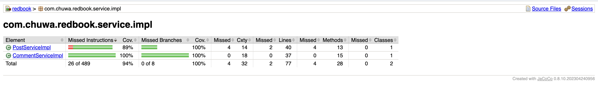

# HW13: Testing
@ Jul 20, 2025 _Gloria Wang_

## Explain and compare following concepts, provide specific examples when doing comparison:
### Testing related:
#### 1. Unit Testing

Tests individual components/methods in isolation using mocks.
- Tools: JUnit, Mockito
- Scope: Single method/function
- Mocking: Yes (external dependencies)

Example:
```java
  // Class to Test:

  public class Calculator {
      public int add(int a, int b) {
          return a + b;
      }
  }
  
  // Unit Test:

  public class CalculatorTest {

      @Test
      public void testAdd() {
          // 1. Setup
          Calculator calculator = new Calculator();
          int expected = 6;

          // 2. Execute
          int actual = calculator.add(2, 4);

          // 3. Assert
          assertEquals(expected, actual);
      }
  }

  // With Mocking Example:

  public class UserServiceTest {

      @Mock
      private UserRepository userRepository;

      @InjectMocks
      private UserService userService;

      @Test
      public void testFindUser() {
          // Mock behavior
          when(userRepository.findById(1L)).thenReturn(new User("John"));

          // Execute
          User result = userService.findUser(1L);

          // Assert
          assertEquals("John", result.getName());
      }
  }


```

#### 2. Functional Testing

Tests complete features from user perspective without mocking.
- Tools: Postman, Selenium
- Scope: Complete business requirements
- Mocking: No (real dependencies)

Example:
```http request
POST /login
{
  "username": "test",
  "password": "1234"
}
```

#### 3. Integration Testing

Tests interactions between multiple components using real dependencies.
- Example: Testing payment flow between frontend, API, and database
- Tools: JUnit, SpringBootTest
- Scope: Multiple connected modules
- Mocking: Rarely (blackbox testing, use real beans)

Example:
```java
@SpringBootTest
public class OrderServiceIntegrationTest {
    @Autowired
    private OrderService orderService;

    @Test
    public void testPlaceOrder() {
        Order order = orderService.placeOrder(userId, itemId);
        assertNotNull(order.getId());
    }
}
```

#### 4. Regression Testing

Re-runs previous existing tests after code changes to ensure no new bugs.
- Example: After adding new search filters, verify existing search still
  works
- Tools: Jenkins, JUnit, Selenium
- Scope: Full system or selected modules
- Timing: After modifications
- Mocking: Depends on test type (unit/integration/etc.)

#### 5. Smoke Testing

Basic verification that core functionality works (build verification).
- Example: Can application start? Can users log in? Basic navigation
  works?
- Tools: Manual or automated with CI/CD
- Scope: Core functionalities
- Part of: CI/CD pipeline

Example: After deploying, verify:
- Login page loads
- Dashboard is accessible
- Create post API works

#### 6. Performance Testing

Measures system performance (evaluates how fast the system responds) under normal workload.
- Example: API responds within 200ms under normal load
- Tools: JMeter, Gatling
- Metrics: Response time, throughput
- Target: Performance efficiency

Example:
- Test homepage load time with 100 concurrent users.
- Expect response in <200ms.

#### 7. Stress Testing

Tests system stability under extreme conditions beyond normal levels.
- Example: Testing with 2k QPS (queries per second) until system breaks
- Tools: JMeter, k6
- Purpose: Find breaking point
- Scope: High pressure scenarios, whole system

Example:
- Simulate 2000 QPS (queries per second) on an API to test system stability and memory leaks.

#### 8. A/B Testing

Compares two versions to determine better performance 
- Example: Testing two different UI designs for conversion rates
- Purpose: Data-driven decision making

Example:
- Group A sees red “Buy Now” button, group B sees green one.
- Track which one converts better.

#### 9. End-to-End Testing

Tests complete user workflows from start to finish.
- Example: User registration → login → purchase → confirmation email
- Tools: Selenium (user behavior simulation)
- Performed by: QA engineers
- Scope: Frontend to backend

Example:
- Automated test logs in → creates post → views post in feed → logs out.

#### 10. User Acceptance Testing (UAT)

Final users test software under actual conditions.
- Purpose: Ensure software meets user needs
- Environment: Non-prod/staging only

Example:
- Client tests “create invoice” flow to ensure it matches actual business needs.

### Key Comparisons:

- Mocking: Unit (heavy mocking) vs Integration/Functional (no mocking)

- Scope: Unit (smallest) → Integration → End-to-End (largest)

- Performers: Unit (developers) → E2E/UAT (QA/users)

- Timing: Unit (during development) → Smoke (CI/CD) → UAT (before release)

- Environment: Unit/Integration (any) vs UAT (staging only)

### Environment related:
#### 1. Development
Where developers write and test code locally or in isolated dev servers.
- Access: Developers only 
- Data: Dummy or local test data 
- Purpose: Fast feedback, unit testing, active development

```bash
$ mvn spring-boot:run
# Running app on localhost:8080
```

#### 2. QA (Quality Assurance)
Used by QA engineers to run manual or automated tests.
- Access: QA team
- Data: Test data (sometimes realistic)
- Purpose: Functional, integration, and regression testing

Example:
- Running Postman collections or Selenium tests on `qa.myapp.com`.

#### 3. Pre-prod/Staging

Replica of production with similar configuration and infrastructure.
- Access: Internal users, product managers 
- Data: Masked or cloned production data 
- Purpose: Final UAT, smoke tests, performance checks before go-live
Example:
```bash
#  to staging before release 
https://staging.myapp.com
```

#### 4. Production
The live system used by real users.
- Access: End users + on-call dev/ops 
- Data: Real user data 
- Purpose: Serve customers, high availability and reliability

Example:
- Monitoring tools (e.g., Grafana, Splunk) and logging are heavily used here for debugging live issues.

## Write unit test for `CommentServiceImpl.java` Prove your code coverage using Jacoco Report.


