# HW15: Kafka
@ Jul 24, 2025 _Gloria Wang_

## Key Concepts in Kafka

### Topic
- A topic is a logical channel or category to which records (messages) are sent by producers and from which consumers read.
- like a folder name or feed tag.
- Topics are append-only logs, messages are stored in the order they arrive.

### Partition
- Topic can be split into partitions, which allow Kafka to scale horizontally.
- Each partition is an ordered, immutable sequence of messages, and each message has a unique offset.
- Partitions are the unit of parallelism, more partitions mean higher concurrency for producers and consumers.

### Offset
- Offset is a unique ID assigned to each message within a partition.
- Consumers track offsets to know which messages have been processed.
- Stored either in Kafka itself (via a special topic: __consumer_offsets) or externally.

### Producer
- Producer sends messages to Kafka topics.
- Can specify which partition to send to (via a key) or allow Kafka to distribute randomly.
- Producers are asynchronous and scalable, they don’t wait for consumer acknowledgment.

### Consumer Group
- Consumer group consists of one or more consumer instances working together to consume messages from one or more topics.
- Each partition is read by only one consumer in the group, ensuring load balancing and parallel consumption.
- Kafka ensures at-least-once delivery for messages read by the consumer group.

### Broker
- Broker is a Kafka server, it stores topic data and serves client (producer/consumer) requests.
- Each broker can handle multiple partitions and is part of a Kafka cluster.
- Kafka brokers replicate data to ensure fault tolerance.

### Zookeeper
- Zookeeper is used to manage and coordinate the Kafka cluster.
- Responsibilities:
  - Maintaining metadata like broker info
  - Leader election for partitions
  - Detecting broker failures
- Note: Kafka is transitioning to KRaft mode, which eliminates the need for Zookeeper (as of Kafka 3.0+).


## How They Work Together

```mermaid
graph TD
    Producer       -->|sends messages| Topic
    Topic          -->|split into| Partition1 & Partition2
    Partition1     -->|has| Offset1 & Offset2
    Broker1        --> Partition1
    Broker2        --> Partition2
    Consumer1      -->|reads from| Partition1
    Consumer2      -->|reads from| Partition2
    Zookeeper      -->|manages| Broker1 & Broker2
    Consumer Group --> Consumer1 & Consumer2
```

### Workflow:
1.	Producer sends messages to a topic.
2.	Kafka partitions the topic and stores them across different brokers.
3.	Zookeeper tracks which broker handles which partitions.
4.	Consumers in a consumer group subscribe to the topic and Kafka assigns partitions to them.
5.	Offsets are tracked to know which messages were read.
6.	Zookeeper helps with broker health, partition leadership, and failover handling.

## 1. Given N (number of partitions) and M (number of consumers,) what will happen when N>=M and N respectively?

### N ≥ M (Partitions ≥ Consumers)

Each consumer in the consumer group will be assigned at least one partition:
- Kafka distributes partitions as evenly as possible among consumers.
- Some consumers may get more than one partition, but none are left unassigned.
- This is the ideal and scalable setup.
    ```mermaid
    Example:
    - N = 4 partitions
    - M = 2 consumers
    
    Possible assignment:
    - Consumer 1 → Partition 0 and 1
    - Consumer 2 → Partition 2 and 3
    ```


🟢 Result: All partitions are consumed; consumers are fully utilized.


### N < M (Partitions < Consumers)

Kafka enforces the rule: One partition can only be assigned to one consumer within a group.
- So only N consumers will be active.
- The remaining M - N consumers will be idle (do nothing until reassignment).
- No load balancing across all consumers, wasted resources.
```mermaid
Example:
- N = 2 partitions
- M = 5 consumers

Kafka may assign:
- Consumer 1 → Partition 0
- Consumer 2 → Partition 1
- Consumers 3, 4, 5 → Idle
```

🔴 Result: Only 2 out of 5 consumers do any work; inefficient.


## 2. Explain how brokers work with topics

### Broker Architecture
- **Brokers** are Kafka servers that store and serve data
- Each broker is identified by a unique ID
- Brokers work together as a cluster

### Topic Distribution
```
Topic: user-events
├── Partition 0 → Broker 1 (Leader), Broker 2 (Follower)
├── Partition 1 → Broker 2 (Leader), Broker 3 (Follower)
└── Partition 2 → Broker 3 (Leader), Broker 1 (Follower)
```

### Key Concepts:
- **Partitions**: Topics are split into partitions for parallelism
- **Replication**: Each partition has multiple copies across brokers
- **Leaders and Followers**: One broker leads each partition, others follow
- **Load Distribution**: Partitions spread across brokers for balance

## 3. Message Delivery Pattern: Push vs Pull

### Kafka Uses PULL Model
```
Producer (push)  ───────▶  Kafka Broker  ◀─────── (poll) Consumer
                 (send)                  (fetch)
```

### Why Pull Model?
- **Consumer Control**: Consumers decide when and how much to consume
- **Backpressure Handling**: Slow consumers don't affect the system
- **Batch Processing**: Consumers can fetch multiple messages efficiently
- **Replayability**: Consumers can re-read messages from any offset

### Consumer Polling Example:
```java
while (true) {
    ConsumerRecords<String, String> records = consumer.poll(100);
    for (ConsumerRecord<String, String> record : records) {
        processRecord(record);
    }
}
```

## 4. Avoiding Duplicate Message Consumption

### Idempotent Processing
```java
// Use unique message IDs
if (!processedMessages.contains(message.getId())) {
    processMessage(message);
    processedMessages.add(message.getId());
}
```

### Exactly-Once Semantics (EOS)
1. **Producer Side**: Enable idempotent producers
   ```properties
   enable.idempotence=true
   acks=all
   ```

2. **Consumer Side**: Use transactions
   ```java
   consumer.beginTransaction();
   processMessages();
   consumer.commitTransaction();
   ```

### Manual Offset Management
```java
// Process message first
processMessage(record);
// Then commit offset
consumer.commitSync(Collections.singletonMap(
    partition, new OffsetAndMetadata(record.offset() + 1)
));
```

## 5. Consumer Failures in a Consumer Group

### Scenario: Some Consumers Down
```
Consumer Group: payment-processors
├── Consumer-1 (Active) → Partitions 0, 1
├── Consumer-2 (DOWN)   → Partitions 2, 3 (reassigned)
└── Consumer-3 (Active) → Partitions 4, 5 + (2, 3 from Consumer-2)
```

### What Happens:
- **Automatic Rebalancing**: Kafka detects failed consumers via heartbeat timeout
- **Partition Reassignment**: Partitions from dead consumers redistribute to live ones
- **No Data Loss**: Messages remain in Kafka until retention period expires
- **Temporary Lag**: Brief processing delay during rebalancing

### Configuration:
```properties
session.timeout.ms=10000      # Detection time for consumer failure
heartbeat.interval.ms=3000    # How often to send heartbeats
```

## 6. Entire Consumer Group Down

### Scenario: All Consumers Down
```
Before: Topic → Consumer Group (3 consumers) → Processing
After:  Topic → X (No consumers) → Messages accumulate
```

### What Happens:
- **No Data Loss**: Messages persist in Kafka brokers
- **Message Accumulation**: New messages continue to arrive and store
- **Offset Preservation**: Last committed offsets are saved
- **Resume from Last Position**: When group restarts, continues from saved offset

### Retention Policy Impact:
```properties
# Messages retained for 7 days regardless of consumption
log.retention.hours=168
log.retention.bytes=1073741824  # 1GB per partition
```

## 7. Consumer Lag: Understanding and Resolution

### What is Consumer Lag?
```
Producer Write Position: 1,000,000
Consumer Read Position:    950,000
Consumer Lag:               50,000 messages
```

### Monitoring Lag:
```bash
# Using Kafka tools
kafka-consumer-groups --bootstrap-server localhost:9092 \
  --describe --group my-consumer-group

# Output:
TOPIC     PARTITION  CURRENT-OFFSET  LOG-END-OFFSET  LAG
my-topic  0          950000          1000000         50000
```

### Resolution Strategies:

#### 1. Scale Consumers
```yaml
# Increase consumer instances
replicas: 3 → 6
```

#### 2. Optimize Processing
```java
// Batch processing instead of one-by-one
List<Record> batch = new ArrayList<>();
for (ConsumerRecord record : records) {
    batch.add(record);
    if (batch.size() >= 100) {
        processBatch(batch);
        batch.clear();
    }
}
```

#### 3. Increase Throughput
```properties
fetch.min.bytes=50000      # Fetch more data per request
max.poll.records=1000      # Process more records per poll
```

#### 4. Skip Non-Critical Messages
```java
// During high lag, process only important messages
if (lag > threshold && !message.isPriority()) {
    continue;
}
```

## 8. How Kafka Tracks Message Delivery

### Offset Management
```
Partition 0: [0][1][2][3][4][5][6][7][8][9]
                          ↑
                    Consumer offset: 5
                    (messages 0-4 processed)
```

### Tracking Mechanisms:

#### 1. Consumer Offsets Topic
```
__consumer_offsets topic stores:
- Consumer Group ID
- Topic-Partition
- Committed Offset
- Metadata
```

#### 2. Offset Commit Strategies:
```java
// Automatic commit
enable.auto.commit=true
auto.commit.interval.ms=5000

// Manual commit
consumer.commitSync();    // Blocking
consumer.commitAsync();   // Non-blocking
```

#### 3. Delivery Guarantees:
- **At-most-once**: Commit before processing (possible message loss)
- **At-least-once**: Commit after processing (possible duplicates)
- **Exactly-once**: Transactional processing (no loss, no duplicates)

## 9. Kafka vs RabbitMQ vs MySQL Comparison

### Kafka vs RabbitMQ

| Feature             | Kafka                    | RabbitMQ                  |
|---------------------|--------------------------|---------------------------|
| **Architecture**    | Distributed log          | Message broker            |
| **Throughput**      | Very High (1M+ msgs/sec) | Moderate (50K msgs/sec)   |
| **Message Order**   | Guaranteed per partition | Guaranteed per queue      |
| **Message Replay**  | Yes (offset-based)       | No (consumed = deleted)   |
| **Routing**         | Topic-based              | Exchange-based (flexible) |
| **Protocol**        | Binary over TCP          | AMQP, MQTT, STOMP         |
| **Use Case**        | Event streaming, logs    | Task queues, RPC          |
| **Persistence**     | Always persistent        | Optional                  |
| **Consumer Groups** | Built-in                 | Plugin-based              |

### Why Kafka over RabbitMQ?
```
Choose Kafka when:
- High throughput required (>100K messages/sec)
- Need message replay capability
- Event sourcing architecture
- Log aggregation and streaming analytics
- Multiple consumers for same data

Choose RabbitMQ when:
- Complex routing rules needed
- RPC-style communication
- Low latency for individual messages
- Traditional request-reply patterns
```

### Messaging Systems vs MySQL

| Aspect               | Kafka/RabbitMQ        | MySQL               |
|----------------------|-----------------------|---------------------|
| **Purpose**          | Message streaming     | Data persistence    |
| **Data Model**       | Time-ordered events   | Relational tables   |
| **Performance**      | Optimized for writes  | Balanced read/write |
| **Scalability**      | Horizontal (easy)     | Vertical (complex)  |
| **Consistency**      | Eventually consistent | ACID transactions   |
| **Query Capability** | Limited (sequential)  | Complex SQL queries |
| **Data Retention**   | Time/size-based       | Until deleted       |
| **Real-time**        | Yes (ms latency)      | No (query overhead) |

### Why Use Kafka Instead of MySQL for Messaging?

#### 1. **Performance**
```
Kafka:  1,000,000+ messages/second
MySQL:  10,000-50,000 inserts/second
```

#### 2. **Scalability**
```
Kafka: Add brokers → Linear scaling
MySQL: Add servers → Complex sharding
```

#### 3. **Decoupling**
```
// Kafka: Producers and consumers independent
Producer → Kafka ← Consumer A
                 ← Consumer B
                 ← Consumer C

// MySQL: Tight coupling via polling
Producer → MySQL → Consumers (polling)
```

#### 4. **Built for Streaming**
- Kafka: Native support for stream processing
- MySQL: Requires complex triggers/polling

#### 5. **Resource Efficiency**
```sql
-- MySQL: Expensive polling
SELECT * FROM messages 
WHERE processed = false 
AND consumer_id = 'consumer-1'
FOR UPDATE;

-- vs Kafka: Efficient offset-based consumption
consumer.poll(Duration.ofMillis(100));
```

### Architecture Comparison

#### Traditional MySQL-based Queue:
```
Producer → INSERT INTO queue → MySQL → SELECT/DELETE → Consumer
                                ↓
                          Locks, indexes, 
                          transaction overhead
```

#### Kafka Architecture:
```
Producer → Append to log → Kafka Broker → Sequential read → Consumer
                             ↓
                        Optimized for 
                        sequential I/O
```

### When to Use Each:

**Use Kafka/RabbitMQ when:**
- High-volume event streaming
- Multiple consumers for same data
- Need for replay/reprocessing
- Microservices communication
- Real-time data pipelines

**Use MySQL when:**
- Need complex queries
- ACID transactions required
- Relational data model fits
- Low message volume
- Need to JOIN with other data


# Hands On Experiment

## 1. set up 3 consumers in a single consumer group

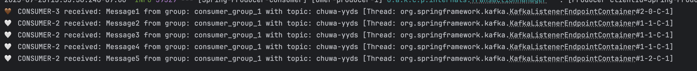

Key Observations:

1. Only 2 out of 3 consumers are active (CONSUMER-2 and CONSUMER-3)
2. CONSUMER-1 didn't receive any messages
3. CONSUMER-2 received 4 messages (Message2, 3, 4, 5)
4. CONSUMER-3 received 1 message (Message1)
5. Thread names show different container endpoints

Why This Happened:

- Topic has 3 partitions but only 2 are being used
- Consumer-2 is assigned to partition 1 (gets most messages)
- Consumer-3 is assigned to partition 2 (gets 1 message)
- Consumer-1 is assigned to partition 0 (gets no messages because producer didn't send to that partition)

## 2. Increase number of consumers in a single consumer group, observe what happens, explain your observation.
Observation:
- Active Consumers: Only CONSUMER-3 and CONSUMER-5 received messages
- Idle Consumers: CONSUMER-1, CONSUMER-2, CONSUMER-4, CONSUMER-6 received 0 messages
- Load Distribution: Messages alternated between the 2 active consumers

Thread Assignment:
- CONSUMER-5: ntainer#4-1-C-1 and ntainer#4-2-C-1 (assigned to 2 partitions)
- CONSUMER-3: ntainer#2-0-C-1 (assigned to 1 partition)

Explanation:
"When consumers in a group exceed the number of partitions, only some consumers get
partition assignments. Excess consumers remain idle as backup/standby consumers. In
our case, with 6 consumers and 3 partitions, only 2-3 consumers were active,
demonstrating Kafka's load balancing limitation."


# Kafka Consumer Application Report

## 1. 3 Consumers in Single Consumer Group

### Implementation
```java
@KafkaListener(topics = "${kafka.topic.name}", groupId = "${spring.kafka.consumer.group-id}")
public void consumer1(String message){
    System.out.println("🩵 CONSUMER-1 received: " + message + " from group: " + consumerGroupId + " with topic: " + topic + " [Thread: " + Thread.currentThread().getName() + "]");
}

@KafkaListener(topics = "${kafka.topic.name}", groupId = "${spring.kafka.consumer.group-id}")
public void consumer2(String message){
    System.out.println("🤍 CONSUMER-2 received: " + message + " from group: " + consumerGroupId + " with topic: " + topic + " [Thread: " + Thread.currentThread().getName() + "]");
}

@KafkaListener(topics = "${kafka.topic.name}", groupId = "${spring.kafka.consumer.group-id}")
public void consumer3(String message){
    System.out.println("🤎 CONSUMER-3 received: " + message + " from group: " + consumerGroupId + " with topic: " + topic + " [Thread: " + Thread.currentThread().getName() + "]");
}
```

### Screenshots


### Observation
- **Topic**: `chuwa-yyds` with 3 partitions, 3 consumers in `consumer_group_1`
- **Result**: Messages load-balanced across consumers - each message consumed by only ONE consumer
- **Partition Assignment**: Each consumer assigned to 1 partition (1-to-1 mapping)

---

## 2. Increase Number of Consumers

### Implementation
Added 3 more consumers (total 6) to same group `consumer_group_1`


### Screenshots
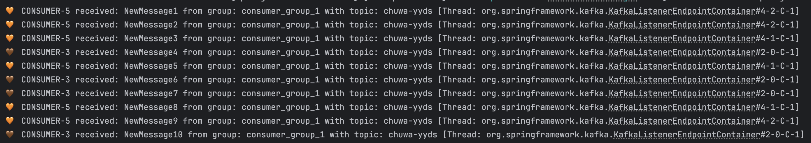
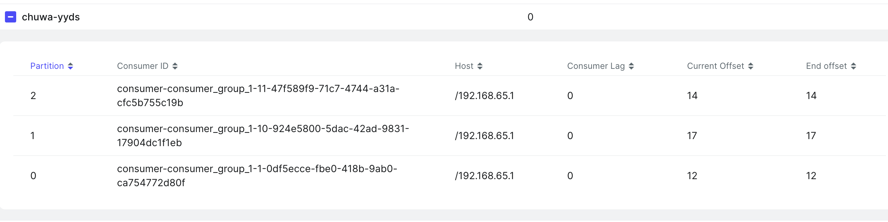

### Observation
- **Configuration**: 6 consumers, 3 partitions
- **Result**: Only 2-3 consumers active, others idle
- **Active**: CONSUMER-3 and CONSUMER-5 received messages
- **Idle**: CONSUMER-1, CONSUMER-2, CONSUMER-4, CONSUMER-6 got 0 messages

### Explanation
**Why excess consumers are idle?**
- Each partition can only be assigned to ONE consumer per group
- 3 partitions = maximum 3 active consumers
- Extra consumers serve as standby for fault tolerance
- When active consumer fails, idle consumer takes over automatically

**Key Insight**: Adding more consumers than partitions doesn't increase throughput - it only provides redundancy.

## 3. Multiple Consumer Groups

### Implementation
Created 3 consumer groups with different numbers of consumers:

```java
// Consumer Group 2 - 2 consumers
@KafkaListener(topics = "${kafka.topic.name}", groupId = "consumer_group_2")
public void group2Consumer1(String message){
    System.out.println("🔴 GROUP2-CONSUMER1 received: " + message + " [Thread: " +
            Thread.currentThread().getName() + "]");
}

@KafkaListener(topics = "${kafka.topic.name}", groupId = "consumer_group_2")
public void group2Consumer2(String message){
    System.out.println("🟠 GROUP2-CONSUMER2 received: " + message + " [Thread: " +
            Thread.currentThread().getName() + "]");
}

// Consumer Group 3 - 1 consumer
@KafkaListener(topics = "${kafka.topic.name}", groupId = "consumer_group_3")
public void group3Consumer1(String message){
    System.out.println("🟢 GROUP3-CONSUMER1 received: " + message + " [Thread: " +
            Thread.currentThread().getName() + "]");
}
```

### Screenshots
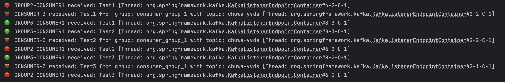
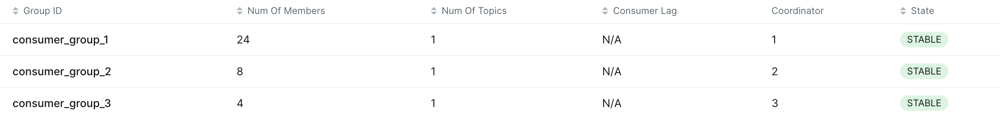

### Observation
- **Setup**: 3 groups consuming same topic `chuwa-yyds`
    - Group 1: 6 consumers
    - Group 2: 2 consumers
    - Group 3: 1 consumer

- **Message Distribution**: Each message received by **ALL 3 groups independently**
    - Test1: GROUP2-CONSUMER1 + CONSUMER-3 + GROUP3-CONSUMER1
    - Test2: GROUP3-CONSUMER1 + CONSUMER-3 + GROUP2-CONSUMER1
    - Test3: Same pattern

## 4. Consumer Offset Analysis
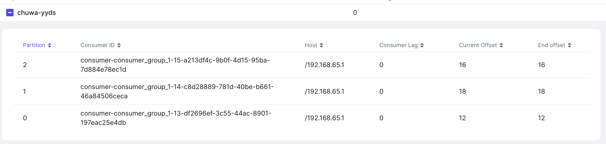
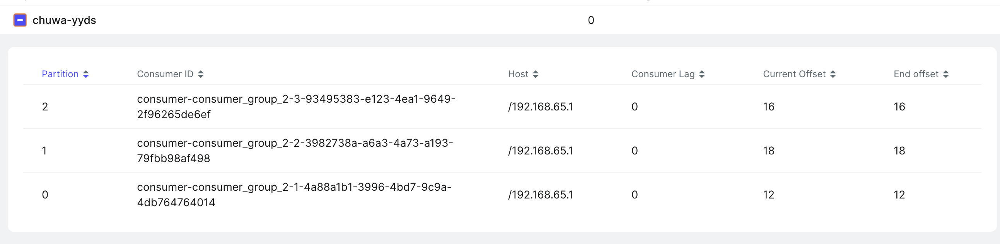
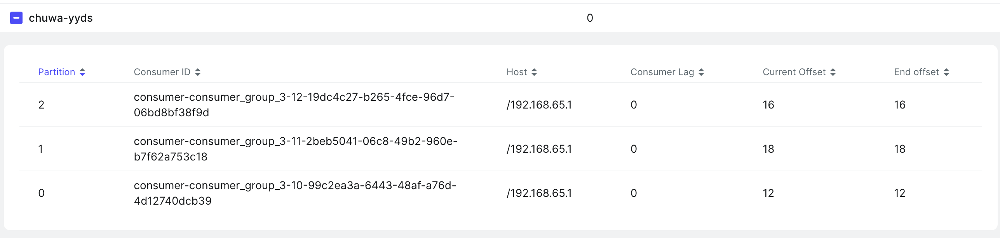

#### Key Insight: 
All 3 groups have identical offset values because:
1. Independent Processing: Each group consumes ALL messages independently
2. Same Topic: All groups read from the same chuwa-yyds topic
3. Separate Offset Tracking: Each group maintains its own offset state
4. No Consumer Lag: All show 0 lag, meaning real-time processing

## 5. Message Delivery Guarantees

### Implementation
Created separate producer configurations for each delivery guarantee level:

#### 1. At-Most-Once (Fire and Forget)
```java
// Configuration
props.put(ProducerConfig.ACKS_CONFIG, "0");           // No acknowledgment
props.put(ProducerConfig.RETRIES_CONFIG, 0);          // No retries
props.put(ProducerConfig.ENABLE_IDEMPOTENCE_CONFIG, false);

// Usage
@PostMapping("/publish/at-most-once")
public String publishAtMostOnce(@RequestParam("key") String key, @RequestParam("message") String message) {
    deliveryGuaranteeService.sendAtMostOnce(message, key);
    return "AT-MOST-ONCE: Message sent (fire and forget)";
}
```

#### 2. At-Least-Once (With Acknowledgment)
```java
// Configuration  
props.put(ProducerConfig.ACKS_CONFIG, "1");           // Leader acknowledgment
props.put(ProducerConfig.RETRIES_CONFIG, 3);          // Retry on failure
props.put(ProducerConfig.ENABLE_IDEMPOTENCE_CONFIG, false);

// Usage
@PostMapping("/publish/at-least-once") 
public String publishAtLeastOnce(@RequestParam("key") String key, @RequestParam("message") String message) {
    deliveryGuaranteeService.sendAtLeastOnce(message, key);
    return "AT-LEAST-ONCE: Message sent with acknowledgment";
}
```

#### 3. Exactly-Once (Transactional)
```java
// Configuration
props.put(ProducerConfig.ACKS_CONFIG, "all");         // All replicas acknowledgment
props.put(ProducerConfig.RETRIES_CONFIG, 3);          // Retry on failure
props.put(ProducerConfig.ENABLE_IDEMPOTENCE_CONFIG, true);    // Prevent duplicates
props.put(ProducerConfig.TRANSACTIONAL_ID_CONFIG, "tx-producer-1");

// Usage
public void sendExactlyOnce(String message, String key) {
    exactlyOnceTemplate.executeInTransaction(template -> {
        template.send(topicName, key, message);
        return null;
    });
}
```

### Screenshots
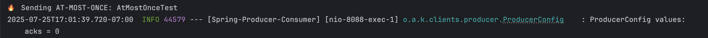


---
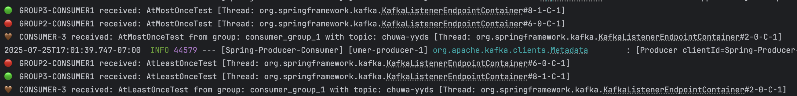
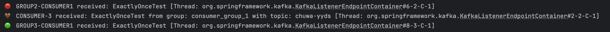

### Test Results
```bash
# At-Most-Once Test
curl --location --request POST 'http://localhost:8088/publish/at-most-once?message=AtMostOnceTest&key=test1'

# At-Least-Once Test  
curl --location --request POST 'http://localhost:8088/publish/at-least-once?message=AtLeastOnceTest&key=test2'

# Exactly-Once Test
curl --location --request POST 'http://localhost:8088/publish/exactly-once?message=ExactlyOnceTest&key=test3'
```

### Observation
- **At-Most-Once**: Fastest delivery, no acknowledgment waiting (acks=0, retries=0)
- **At-Least-Once**: Waits for leader acknowledgment, may duplicate on retry (acks=1, retries=3)
- **Exactly-Once**: Slowest, full replication + transaction, no duplicates (acks=all, idempotence=true)

### Configuration Differences Proven by Logs
The verbose Kafka logs demonstrate different producer configurations:
- **At-Most-Once**: `acks = 0, retries = 0, enable.idempotence = false`
- **At-Least-Once**: `acks = 1, retries = 3, enable.idempotence = false`
- **Exactly-Once**: `acks = -1, retries = 3, enable.idempotence = true`

**Key Insight**: Each delivery guarantee requires different producer configuration, trading off between performance and reliability.

## 6. Custom Partitioning Logic

### 1. Custom Business Logic Partitioner
```java
public class CustomPartitioner implements Partitioner {
    @Override
    public int partition(String topic, Object key, byte[] keyBytes, Object value, byte[] valueBytes, Cluster cluster) {
        String keyStr = key.toString();
        
        // Route based on key prefix
        if (keyStr.startsWith("user")) {
            return 0; // All user messages → Partition 0
        } else if (keyStr.startsWith("order")) {
            return 1; // All order messages → Partition 1
        } else if (keyStr.startsWith("product")) {
            return 2; // All product messages → Partition 2
        } else {
            return Math.abs(keyStr.hashCode() % numPartitions); // Hash-based fallback
        }
    }
}
```

### 2. Round-Robin Partitioner
```java
public class RoundRobinPartitioner implements Partitioner {
    private final AtomicInteger counter = new AtomicInteger(0);
    
    @Override
    public int partition(String topic, Object key, byte[] keyBytes, Object value, byte[] valueBytes, Cluster cluster) {
        int numPartitions = cluster.partitionCountForTopic(topic);
        return counter.getAndIncrement() % numPartitions; // Sequential distribution
    }
}
```

### 3. Configuration
```java
// Custom Partitioner Configuration
props.put(ProducerConfig.PARTITIONER_CLASS_CONFIG, CustomPartitioner.class.getName());

// Round-Robin Partitioner Configuration  
props.put(ProducerConfig.PARTITIONER_CLASS_CONFIG, RoundRobinPartitioner.class.getName());

// Default Partitioner (Hash-based) - no configuration needed
```

### Screenshots

#### Custom
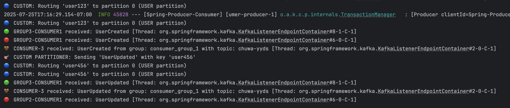
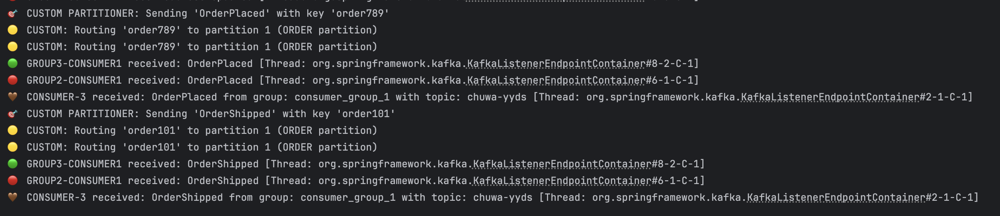
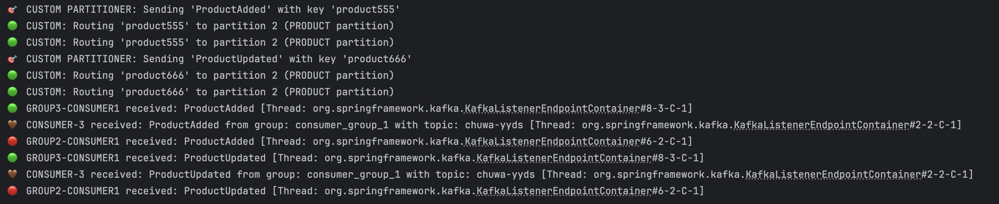


#### Round-Robin
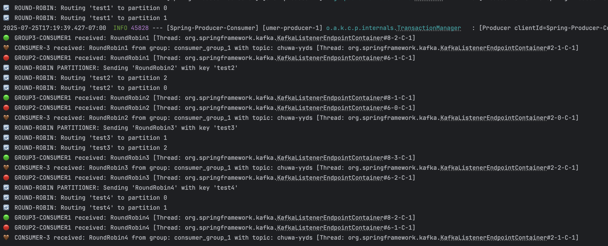


#### Default
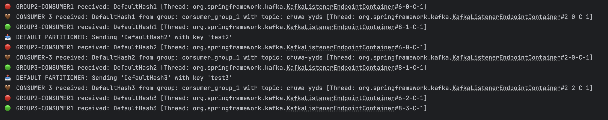


### Observation

#### Custom Partitioner Results:
- **user123, user456** → 🔵 Partition 0 (USER partition)
- **order789, order101** → 🟡 Partition 1 (ORDER partition)
- **product555, product666** → 🟢 Partition 2 (PRODUCT partition)

#### Key Features:
- **Business Logic Routing**: Messages grouped by domain (users, orders, products)  
- **Predictable Distribution**: Same entity type always goes to same partition  
- **Load Balancing**: Distributes different business domains across brokers  
- **Consumer Specialization**: Consumers can specialize in specific domains

#### Comparison with Round-Robin & Default Partitioning:
- **Default (Hash-based)**: Uses `key.hashCode() % partitions` - unpredictable distribution
- **Custom (Business Logic)**: Routes based on business rules - predictable and logical
- **Round-Robin**: Distributes evenly regardless of key - balanced but no business context


With 3 partitions and 3 brokers (configured in `docker-compose.yml`):
- **Partition 0** → Broker 1 (localhost:9091) - USER domain
- **Partition 1** → Broker 2 (localhost:9092) - ORDER domain
- **Partition 2** → Broker 3 (localhost:9093) - PRODUCT domain

**Key Insight**: Custom partitioning enables business-aware message distribution, allowing domain-specific consumer processing and improved system organization.