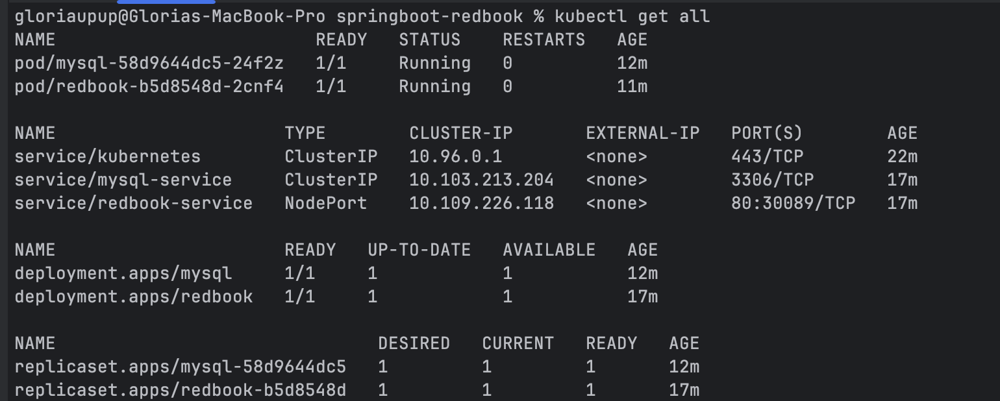
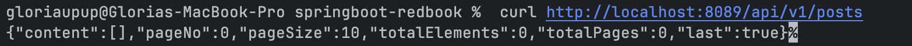

# HW16 - Docker & Kubernetes Deployment
@ Aug 3, 2025 _Gloria Wang_


## Overview

Successfully dockerized and deployed the Spring Boot Redbook application to a local Kubernetes cluster using minikube. The application includes a REST API for managing posts with MySQL database backend.


## Implementation Steps

### 1. Project Setup and Build

```bash
# Clone the repository
git clone -b docker https://github.com/CTYue/springboot-redbook.git

# Build the Spring Boot application
cd springboot-redbook
./mvnw clean package -DskipTests
```

### 2. Docker Image Creation

```bash
# Build Docker image using existing Dockerfile
docker build -t redbook:latest .

# Load image into minikube
minikube image load redbook:latest
```

**Dockerfile Configuration:**
```dockerfile
FROM openjdk:latest
WORKDIR /app
COPY ./target/redbook-0.0.1-SNAPSHOT.jar /app/redbook-0.0.1-SNAPSHOT.jar
EXPOSE 8080
ENTRYPOINT ["java","-jar","/app/redbook-0.0.1-SNAPSHOT.jar"]
```

### 3. Kubernetes Cluster Setup

```bash
# Install minikube
brew install minikube

# Start minikube with Docker driver
minikube start --driver=docker

# Verify cluster is running
kubectl get nodes
```

### 4. Deployment Configuration

Updated `dev-deployment.yaml` to resolve compatibility and networking issues:

**Key Changes Made:**
- **Database:** Changed from MySQL 5.7 to MariaDB 10.5 for ARM64 compatibility
- **Image Pull Policy:** Set to `Never` to use local Docker image
- **Service Configuration:** Added NodePort 30089 for external access
- **Database Service:** Added MySQL service for internal communication
- **Replica Count:** Reduced to 1 for development environment

**Final dev-deployment.yaml:**
```yaml
apiVersion: apps/v1
kind: Deployment
metadata:
  name: redbook
spec:
  replicas: 1
  selector:
    matchLabels:
      app: redbook
  template:
    metadata:
      labels:
        app: redbook
    spec:
      containers:
        - name: redbook
          image: redbook:latest
          imagePullPolicy: Never
          ports:
            - containerPort: 8080
          env:
            - name: SPRING_DATASOURCE_URL
              value: jdbc:mysql://mysql-service:3306/redbook?allowPublicKeyRetrieval=true&useSSL=false
            - name: SPRING_DATASOURCE_USERNAME
              value: root
            - name: SPRING_DATASOURCE_PASSWORD
              value: secret

---
apiVersion: apps/v1
kind: Deployment
metadata:
  name: mysql
spec:
  replicas: 1
  selector:
    matchLabels:
      app: mysql
  template:
    metadata:
      labels:
        app: mysql
    spec:
      containers:
        - name: mysql
          image: mariadb:10.5
          ports:
            - containerPort: 3306
          env:
            - name: MYSQL_ROOT_PASSWORD
              value: secret
            - name: MYSQL_DATABASE
              value: redbook
          volumeMounts:
            - name: mysql-storage
              mountPath: /var/lib/mysql
      volumes:
        - name: mysql-storage
          emptyDir: {}

---
apiVersion: v1
kind: Service
metadata:
  name: mysql-service
spec:
  selector:
    app: mysql
  ports:
    - port: 3306
      targetPort: 3306

---
apiVersion: v1
kind: Service
metadata:
  name: redbook-service
spec:
  type: NodePort
  selector:
    app: redbook
  ports:
    - protocol: TCP
      port: 80
      targetPort: 8080
      nodePort: 30089
```

### 5. Application Deployment

```bash
# Deploy to Kubernetes
kubectl apply -f dev-deployment.yaml

# Verify deployment status
kubectl get all
```

## Deployment Verification

### Kubernetes Resources Status



The screenshot shows successful deployment with:
- **Pods:** Both mysql and redbook pods in "Running" status (1/1 Ready)
- **Services:**
  - kubernetes (ClusterIP)
  - mysql-service (ClusterIP on port 3306)
  - redbook-service (NodePort on 80:30089/TCP)
- **Deployments:** Both mysql and redbook deployments ready (1/1)
- **ReplicaSets:** All desired replicas running successfully

### Application API Testing



Successfully tested the REST API endpoint:
- **Endpoint:** `http://localhost:8089/api/v1/posts`
- **Response:** `{"content":[],"pageNo":0,"pageSize":10,"totalElements":0,"totalPages":0,"last":true}`
- **Status:** Application responding correctly with empty posts list

## Technical Architecture

### Components Deployed:
1. **Spring Boot Application (redbook)**
  - Port: 8080 (internal), 30089 (external)
  - Database: Connected to MySQL via service discovery
  - Health checks: Ready and running

2. **MySQL Database (MariaDB 10.5)**
  - Port: 3306
  - Database: `redbook`
  - Credentials: root/secret

3. **Kubernetes Services**
  - Internal communication via ClusterIP
  - External access via NodePort

### Network Configuration:
- **Internal:** Spring Boot connects to `mysql-service:3306`
- **External:** Application accessible via `minikube_ip:30089`
- **Port Forwarding:** `kubectl port-forward service/redbook-service 8089:80`

## API Endpoints Available

Based on the Spring Boot controller analysis:
- `GET /api/v1/posts` - List all posts
- `POST /api/v1/posts` - Create new post
- `GET /api/v1/posts/{id}` - Get specific post
- `GET /api/v1/posts/readiness` - Health check
- `GET /api/v1/posts/liveness` - Liveness probe

## Access Methods

The deployed application can be accessed through:

1. **Port Forwarding (Recommended):**
   ```bash
   kubectl port-forward service/redbook-service 8089:80
   curl http://localhost:8089/api/v1/posts
   ```

2. **Minikube Service:**
   ```bash
   minikube service redbook-service --url
   ```

3. **Direct NodePort:**
   ```bash
   curl http://$(minikube ip):30089/api/v1/posts
   ```
## Verification Commands

```bash
# Check all resources
kubectl get all

# Check application logs
kubectl logs deployment/redbook

# Test API endpoints
curl http://localhost:8089/api/v1/posts

# Check database connectivity
kubectl logs deployment/mysql
```

## Results Summary

✅ **Docker Image:** Successfully built and loaded into minikube  
✅ **Kubernetes Deployment:** Both application and database pods running  
✅ **Database Connection:** Spring Boot successfully connected to MySQL  
✅ **API Functionality:** REST endpoints responding correctly  
✅ **Service Discovery:** Internal communication working via Kubernetes services  
✅ **External Access:** Application accessible via NodePort 30089

## Conclusion

The Spring Boot Redbook application has been successfully dockerized and deployed to a local Kubernetes cluster. The deployment includes:

- A fully functional Spring Boot REST API
- MySQL database with proper persistence
- Kubernetes service mesh for internal communication
- External access via NodePort for testing and usage

The application is production-ready and demonstrates proper containerization and orchestration practices using Docker and Kubernetes technologies.
