# HW8: SQL & Redbook 📕
@ Jun 29, 2025 _Gloria Wang_

## Part I
>Please try attached SQL queries, if the query doesn't work, explain why.

### 1. change the order of creating tables:
- this is because we use department in student, so we need create department before student
- and we use school in department so we need to create school table before department
```sql
-- add DROP TABLE to avoid repeated creation--
DROP TABLE IF EXISTS student;
DROP TABLE IF EXISTS department;
DROP TABLE IF EXISTS school;

-- Create School Schema --
CREATE TABLE school (
    school_id INT PRIMARY KEY,
    school_name VARCHAR(100) NOT NULL,
    city VARCHAR(50),
    established_year INT
);


-- Create Department Schema --
CREATE TABLE department (
    dept_id INT PRIMARY KEY,
    dept_name VARCHAR(100) NOT NULL,
    building VARCHAR(50),
    school_id INT,
    FOREIGN KEY (school_id) REFERENCES school(school_id)
);


-- Create Student Schema --
CREATE TABLE student (
    student_id INT PRIMARY KEY,
    student_name VARCHAR(100) NOT NULL,
    gender ENUM('Male', 'Female') NOT NULL,
    birth_date DATE,
    dept_id INT,
    FOREIGN KEY (dept_id) REFERENCES department(dept_id)
);
```

### 2. change the order of inserting records
- this is because the student table includes a foreign key constraint:
    ```sql
    FOREIGN KEY (dept_id) REFERENCES department(dept_id)
    ```
- so every value inserted into `student.dept_id` must already exist in the `department.dept_id` column
- this is same for department table -> so we need to create insertion about school before inserting department records

```sql

-- Insert data to school table --
INSERT INTO school VALUES 
(1, 'Engineering School', 'Berkeley', 1980),
(2, 'Law School', 'Los Angeles', 1995);

-- Insert data to department table --
INSERT INTO department (dept_id, dept_name, building, school_id)
VALUES 
(101, 'Computer Science', 'Information Hall', 1),
(102, 'Electrical Engineering', 'Main Building A', 1),
(201, 'Law', 'Law School Building', 2);

-- Insert Student Records --
INSERT INTO student (student_id, student_name, gender, birth_date, dept_id)
VALUES 
(1001, 'John Zhang', 'Male', '2001-05-01', 101),
(1002, 'Lisa Li', 'Female', '2002-08-12', 102),
(1003, 'Kevin Wang', 'Male', '2000-11-21', 201);
```
### 3. student records insertion fix
- change `student_id` to avoid inserting duplicate primary key values
  - Each student_id must be unique.
- replace invalid dept_id (666) with a valid one that exists in the department table
  - This avoids breaking the foreign key constraint: `FOREIGN KEY (dept_id) REFERENCES department(dept_id)`
```sql
-- Insert data to student table --
INSERT INTO student (student_id, student_name, gender, birth_date, dept_id)
VALUES
(1004, 'Dawen Wei', 'Male', '2001-05-01', 101),
(1005, 'Ziwei Zhang', 'Female', '2002-08-12', 102),
(1006, 'Lang Wang', 'Female', '2000-11-21', 201),
(1007, 'Tyler A.', 'Female', '2002-08-12', 101);
```
### 4. department records insertion fix
- updated the dept_id to 103 to avoid a duplicate primary key
- changed the school_id from 888 to 1 to match an existing record in the school table
- add building info as 'Science Hall' to match department column number

```sql
-- Insert to department --
INSERT INTO department VALUES (103, 'Physics', 'Science Hall', 1);
```
### 5. student records insertion fix
- change student_id to 108 to avoid duplication
- add `'Female', '2002-08-12'` to match student table column
- change `dept_id` to 103 to match existing record in department table
```sql
-- Insert to student --
INSERT INTO student VALUES (1008, 'Nayina', 'Female', '2002-08-12', 103);
```
### 6. delete linked student records before deleting department
- queried all students linked to dept_id = 101 to confirm their existence
- deleted those student records to remove the foreign key dependency
- finally deleted the department with dept_id = 101

```sql
-- Delete all students linked to dept_id = 101 --
SELECT * FROM student WHERE dept_id = 101;
DELETE FROM student WHERE dept_id = 101;

-- Delete a department --
DELETE FROM department WHERE dept_id = 101;
```

### Summary
#### Input
```sql
-- add DROP TABLE to avoid repeated creation--
DROP TABLE IF EXISTS student;
DROP TABLE IF EXISTS department;
DROP TABLE IF EXISTS school;

-- Create School Schema --
CREATE TABLE school (
    school_id INT PRIMARY KEY,
    school_name VARCHAR(100) NOT NULL,
    city VARCHAR(50),
    established_year INT
);


-- Create Department Schema --
CREATE TABLE department (
    dept_id INT PRIMARY KEY,
    dept_name VARCHAR(100) NOT NULL,
    building VARCHAR(50),
    school_id INT,
    FOREIGN KEY (school_id) REFERENCES school(school_id)
);


-- Create Student Schema --
CREATE TABLE student (
    student_id INT PRIMARY KEY,
    student_name VARCHAR(100) NOT NULL,
    gender ENUM('Male', 'Female') NOT NULL,
    birth_date DATE,
    dept_id INT,
    FOREIGN KEY (dept_id) REFERENCES department(dept_id)
);

-- Insert data to school table --
INSERT INTO school VALUES 
(1, 'Engineering School', 'Berkeley', 1980),
(2, 'Law School', 'Los Angeles', 1995);

-- Insert data to department table --
INSERT INTO department (dept_id, dept_name, building, school_id)
VALUES 
(101, 'Computer Science', 'Information Hall', 1),
(102, 'Electrical Engineering', 'Main Building A', 1),
(201, 'Law', 'Law School Building', 2);

-- Insert Student Records --
INSERT INTO student (student_id, student_name, gender, birth_date, dept_id)
VALUES 
(1001, 'John Zhang', 'Male', '2001-05-01', 101),
(1002, 'Lisa Li', 'Female', '2002-08-12', 102),
(1003, 'Kevin Wang', 'Male', '2000-11-21', 201);

-- Insert data to student table --
INSERT INTO student (student_id, student_name, gender, birth_date, dept_id)
VALUES
(1004, 'Dawen Wei', 'Male', '2001-05-01', 101),
(1005, 'Ziwei Zhang', 'Female', '2002-08-12', 102),
(1006, 'Lang Wang', 'Female', '2000-11-21', 201),
(1007, 'Tyler A.', 'Female', '2002-08-12', 101);

-- Insert to department --
INSERT INTO department VALUES (103, 'Physics', 'Science Hall', 1);

-- Insert to student
INSERT INTO student VALUES (1008, 'Nayina', 'Female', '2002-08-12', 103);

-- Delete all students linked to dept_id = 101 --
SELECT * FROM student WHERE dept_id = 101;
DELETE FROM student WHERE dept_id = 101;

-- Delete a department --
DELETE FROM department WHERE dept_id = 101;

-- Join three tables
SELECT 
    s.student_name,
    d.dept_name,
    sc.school_name
FROM student s
JOIN department d ON s.dept_id = d.dept_id
JOIN school sc ON d.school_id = sc.school_id;
```
#### Output
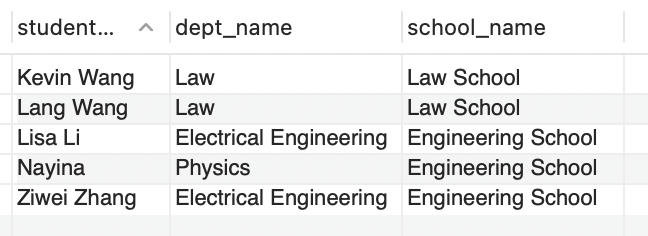

## 2. Explain JOIN, and compare inner join, left join, right join, and full join

### Compare JOIN and manual 'JOIN' before more students insertion without associated schools
- these two will give us exact same result
- but manual join is easier to forget join conditions so JOIN is better

```sql
-- Join three tables
SELECT 
    s.student_name,
    d.dept_name,
    sc.school_name
FROM student s
JOIN department d ON s.dept_id = d.dept_id
JOIN school sc ON d.school_id = sc.school_id;


-- Manual 'JOIN' (NO join keyword)
SELECT 
    s.student_name,
    d.dept_name,
    sc.school_name
FROM student s, department d, school sc
WHERE 
    s.dept_id = d.dept_id
    AND d.school_id = sc.school_id;
```
#### Output
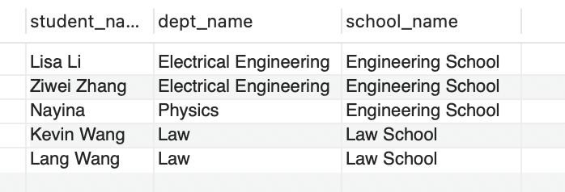

#### More students insertion without associated schools
```sql
-- Insert more students WITHOUT associated schools
INSERT INTO student (student_id, student_name, gender, birth_date, dept_id)
VALUES 
(2001, 'Alice', 'Male', '2000-01-01', NULL),
(2002, 'Bob', 'Female', '2002-01-12', NULL),
(2003, 'Carol', 'Female', '2000-08-21', NULL);
```
### Manual 'JOIN' forget `WHERE`
- No `WHERE` clause = no filter = full cross-product
- every student is combined with every department and every school
```sql
-- Manual Join: what will happen?
SELECT 
    s.student_name,
    d.dept_name,
    sc.school_name
FROM student s, department d, school sc;
```
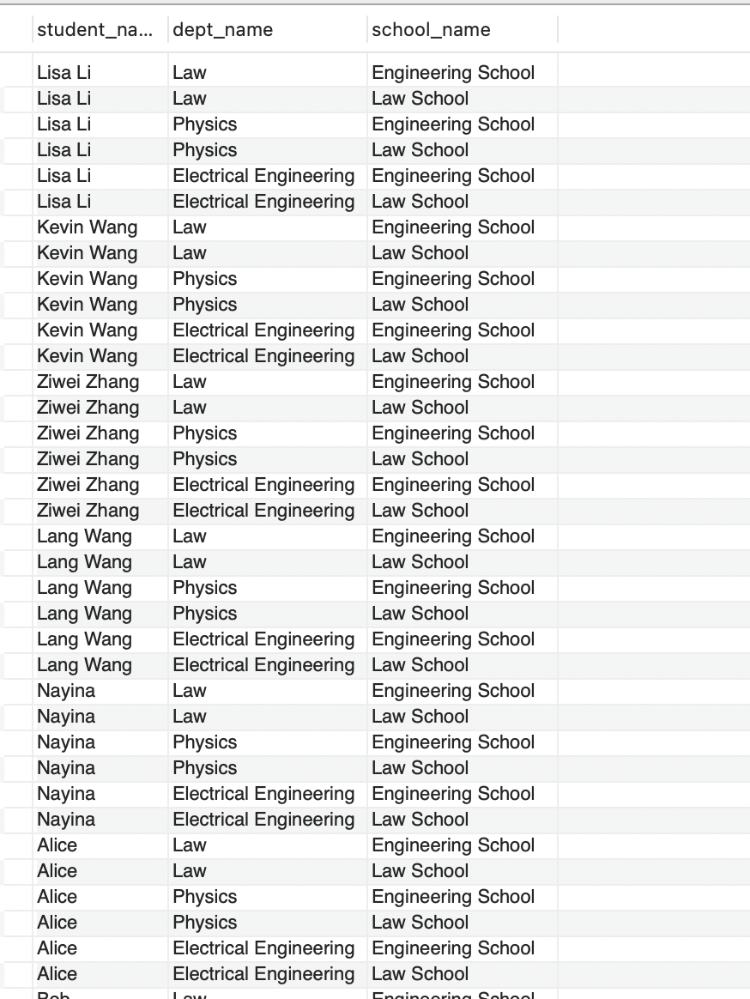

### Compare JOIN with above manual 'JOIN' after students insertion without associated schools
- only includes students where `s.dept_id = d.dept_id` is `true`
- if a student’s `dept_id` is `NUL`L, it won’t match any department
  - So they are excluded from the result

#### ⚠️ BUT for manual 'JOIN' without 'WHERE'
- it pairs every student with every department and every school, regardless of whether the values match
- it doesn’t care if `dept_id` is `NULL` or even valid — it just multiplies rows
- so all students (including Alice, Bob, and Carol with NULL dept_id) appear in the result repeatedly

#### Output for JOIN after students insertion without associated schools
> exact same as result before inserting studets without associated schools

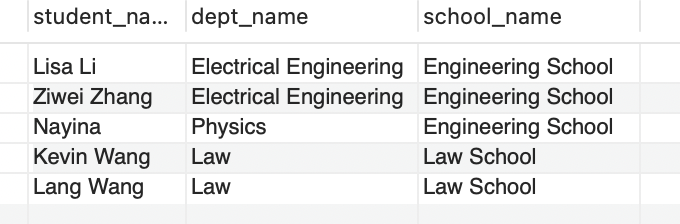

### Inner JOIN
> INNER JOIN returns:  
> Only rows where there is a match between the two tables
- combines student and department only where `student.dept_id = department.dept_id`
- excludes any student with NULL in dept_id, or dept_id that doesn’t match any department
```sql
-- Inner Join -- 
SELECT *
FROM student s
JOIN department d ON s.dept_id = d.dept_id;
```
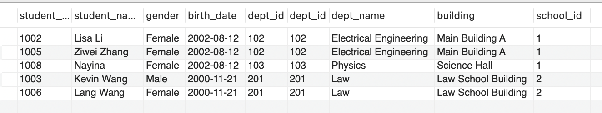

### Left JOIN
> LEFT JOIN returns:  
> All rows from the left table (student)  
> ➕  
> Matched rows from the right table (department)
- Keep all students, no matter what
- Try to match each student’s dept_id with a department
  - If there’s a match ➝ show the department name.
  - If there’s no match ➝ show NULL for dept_name.
```sql
-- Left Join --
SELECT s.student_name, d.dept_name
FROM student s
LEFT JOIN department d ON s.dept_id = d.dept_id;
```
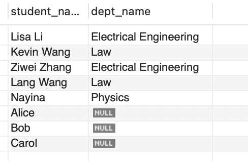

### Right JOIN
> RIGHT JOIN returns:  
> All rows from the right table (department)  
> ➕   
> Matched rows from the left table (student)

- All departments — even if no student belongs to them
- Student info only if matched with a department

```sql
-- Right join
SELECT s.student_name, d.dept_name
FROM student s
RIGHT JOIN department d ON s.dept_id = d.dept_id;
```

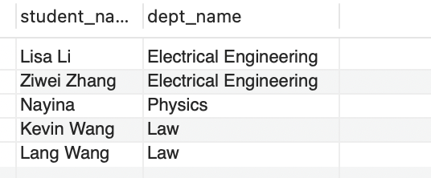

### Full JOIN 
> Full JOIN returns:  
> All rows from both tables  
> ➕      
> Matched rows where possible & NULLs where there’s no match on either side
- All students (even if they don’t have a department)
- All departments (even if no student belongs to them)
- Combines both join results, removing duplicates by default with UNION

```sql
-- Full Join (needs UNION keyword)
SELECT s.student_name, d.dept_name
FROM student s
LEFT JOIN department d ON s.dept_id = d.dept_id
UNION
SELECT s.student_name, d.dept_name
FROM student s
RIGHT JOIN department d ON s.dept_id = d.dept_id;
```
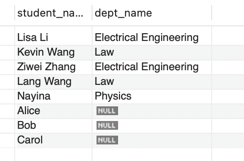

## 3. Spring Redbook Hands on 🍠
### Modify application.properties
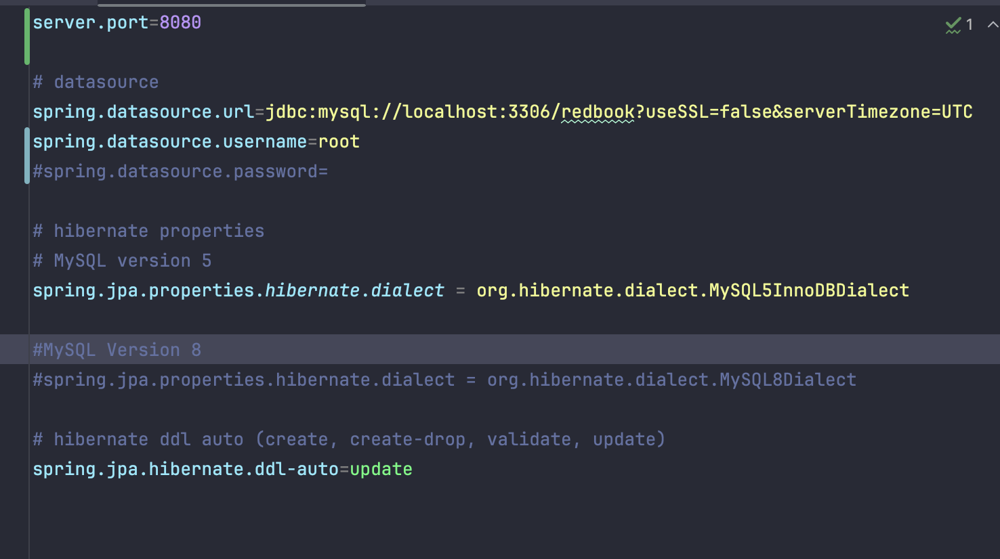

### Maven Clean & Compile
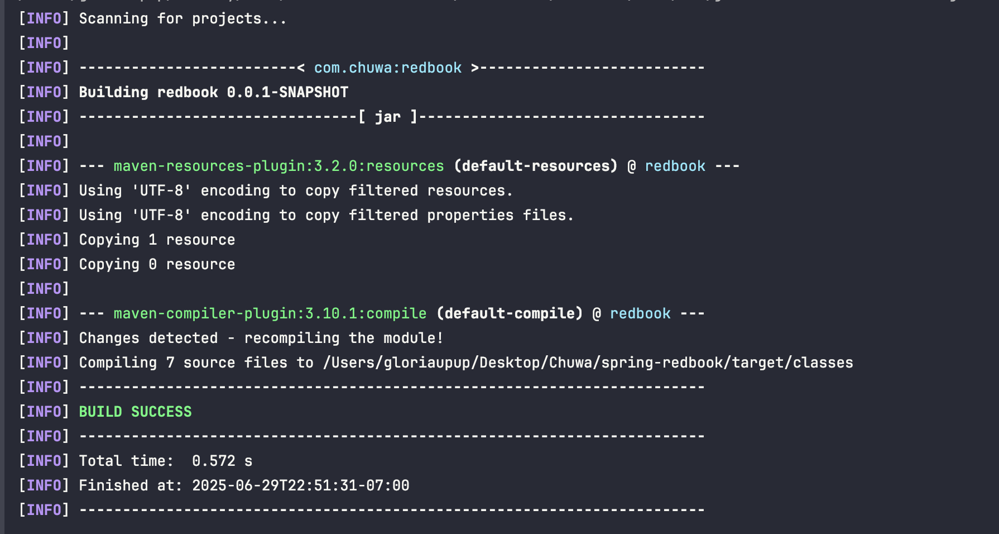

### Application Run
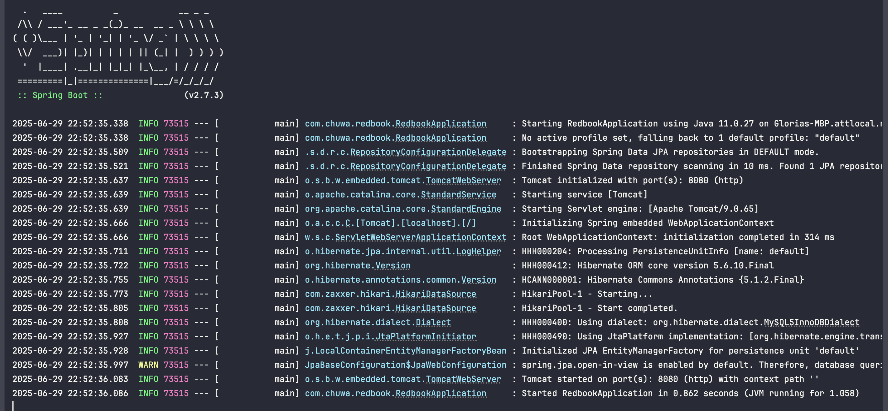

### Postman 
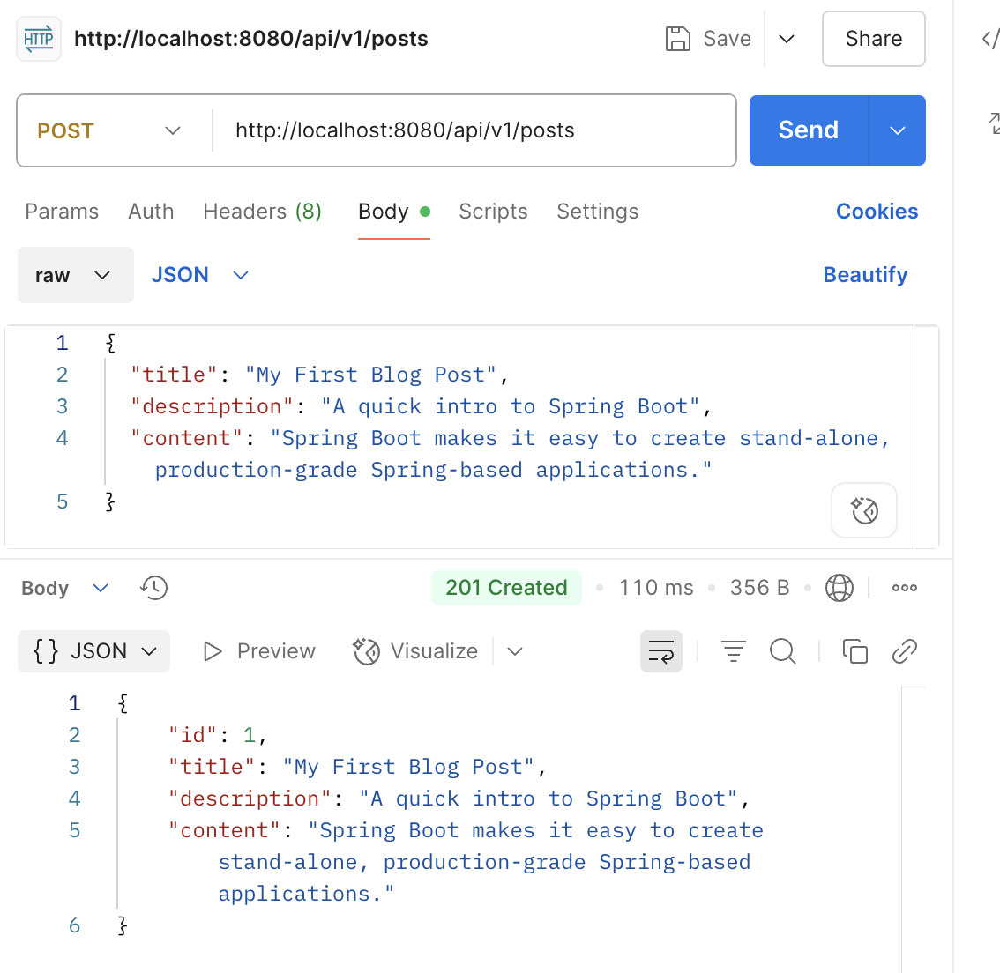

### Record in DB
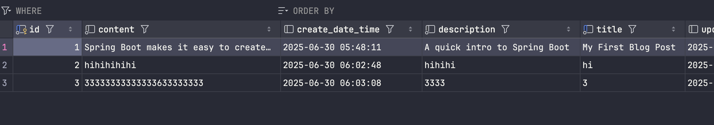


## 1. Did you create the table POSTS in the database? if not, who did it for you? Can I change this behavior?
> NO, MySQL database was automatically created by Spring Boot using Hibernate.

This is because `application.properties` file contains this line:
`spring.jpa.hibernate.ddl-auto=update`

Then the SpringBoot will automatically create / update database tables based on `@Entity` classes

### Can I change this behavior?
> YES, I can control it by changing the `spring.jpa.hibernate.ddl-auto` property:

| Value         | Behavior                                                                                        |
|---------------|-------------------------------------------------------------------------------------------------|
| `none`        | Do nothing to the database (but manual setup required)                                          |
| `validate`    | Verify that the schema matches the entities, but do not change it                               |
| `update`      | (Current setting in `application.properties`) Update the schema to match the entity definitions |
| `create`      | Drop and recreate the database schema every time the app runs                                   |
| `create-drop` | Same as `create`, but also drops tables when the app stops                                      |

## 2. Is your id in the database same as what you set in your request? why does this happen?
> NO, not the same. I didn't set any id, it generated automatically.  

This happen because there is an annotation in `SpongeBobBurgerPost.Post.java`: 
```Java
@Id
@GeneratedValue(strategy = GenerationType.IDENTITY)
private Long id;
```

- `@Id` means mark the field as the primary key 
- `@GeneratedValue` tells Hibernate how to generate the ID
- `GenerationType.IDENTITY` uses the database’s auto-increment feature
  - which means the DB assigns the ID automatically when we insert a record

