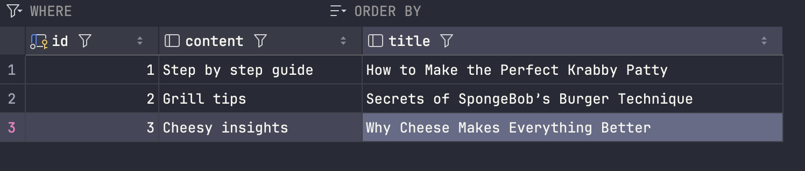
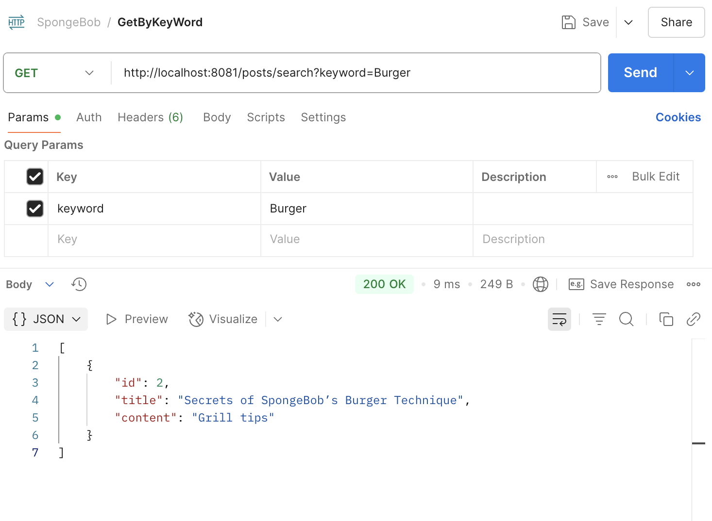

# HW9:  Spring Boot: JPA and Web Annotations Explained
@ Jul 2, 2025 _Gloria Wang_

## 1. Why is it better to use a custom exception class (e.g. `ResourceNotFoundException` ) in your application?
### Improve Clarity & Semantics
- Custom exception can help us to tell explicit what went wrong
- Instead of just throw `RuntimeException`,  `ResourceNotFoundException` clearly tells us the issue is missing resource
### Better Error Handling with @ControllerAdvice
- Spring allows global 🌍 exception handling using `@ControllerAdvice` and we can catch and customize the response for specific custom exceptions
### Make Code More Maintainable
- Help developers to easier understand the exact cause of failure
- Once defined, we can reuse the custom exception multiple services
- ALso help for in writing unit tests that expect specific exceptions to be thrown

## 2. Explain how `@Table` , `@Column` , and `@Id` work. What is the default behavior if you don’t use them?
### `@Table`
- Used to locate the database table name
  - Maps the Java class to a specific database table
- Usually placed on top of an `@Entity` class

    ```Java
    @Entity
    @Table(name = "posts")
    public class SpongeBobBurgerPost.Post {
        ...
    }
    ```
#### Default behavior if omitted:
- JPA will use the class name (cpnverted to snake_case) as the table name
  - `UserAccount -> user_account`

### `@Column`
- Used to specify the information for the column
  - Maps a class field to a column in the db
- Allows customization: column name, nullability, length, unique constrains, etc
    ```Java
    @Column(name = "description", nullable = false)
    private String description;
    ```
#### Default behavior if omitted:
- JPA maps the field name to the column name, converting camelCase 🐫 to snake_case 🐍
  - `birthDate -> birth_date`
- The column is nullable by default, unless constrained otherwise (with @NotNull / DA schema)

### @Id
- Marks the field (column) as the primary key of the entity
- Required for JPA to know how to uniquely identify an entity
    ```java
    @Id 
    @GeneratedValue(strategy = GenerationType.IDENTITY)
    private Long id;
    ```
#### Default behavior if omitted:
⚠️ JPA will fail to map the entity correctly
- Will get a runtime error
- `@id` is mandatory for every `@Entity`

## 3. What happens if you don’t annotate a class with `@Entity` , but still try to save it with JPA?
### ⚠️ JPA will throw a Runtime Exception
- Spring Data JPA won't recognize the class as a persistent entity --> runtime error

### ❓ Why Error
- `@Entity` tells 🗣️ JPA that this class **should be mapped to a db table**
- Without it --> the class is just a plain POJO --> JPA has no metadata to map it to a db table
- JPA doesn't scan / manage classes that are not marked as `@Entity`

### 🔍 What `@Entity` does internally?
- Register the class as a persistent entity in the JPA persistence context
- Signals the framework to generate SQL to map objs of this class to rows in a table
- Works in conjunction with `@Table`, `@Id`, `@Column`

## 4. What happens if we forget to annotate a controller with `@RestController` and only use `@RequestMapping`?
> `@RestController` = `@Controller` + `@ResponseBody`

- If `@RestController` is missing -> Spring treats the class as a traditional MVC controller
- --> the return value of the method is interpreted as a view name, not as response data
```Java
@RequestMapping("/hello")
public String sayHello() {
    return "Hello, world!";
}

// will leads to 404 error -> because Spring tries to find view named "Hello, world!"
```

### ❓Why
- `@RestController` is the standard for building APIs in Spring Boot that return JSON / string data
- It aligns with RESTful principles and simplifies controller logic
- Using `@Controller` alone is suitable when rendering HTML pages but not for REST API responses
- If forget 🧠 `@RestController` --> break the expected data-returning behavior in a RESTful application

## 5. What is the default naming strategy of JPA for tables and columns when no explicit name is given?
- Class name are converted to snake_case 🐍 table names
  - `User -> user`
  - `UserAccount -> user_account`
- Field names are converted to snake_case 🐍 column names
  - `birthDate -> birth_date`

## 6. How does `@PathVariable` differ from `@RequestParam`?
### `@PathVariable`
- Binds a variable from the URI path
  - Used when the value is part of the URL itself
  - Typically used for identifying resources

```Java
import SpongeBobBurgerPost.Post;

@GetMapping("/posts/{id}")
public Post getPostById(@PathVariable Long id) {
  return postService.findById(id);
}
```
> Call URL: `/posts/5` -> id = 5

### `@RequestParam`
- Binds a query parameter from the URL
  - Used when passing optional / filtering parameters
  - Typically used for searching 🔍 / filtering 💉/ pagination 📑

```Java
import SpongeBobBurgerPost.Post;

@GetMapping("/posts")
public List<Post> getPostsByAuthor(@RequestParam String author) {
  return postService.findByAuthor(author);
}
```
> Call URL: `/posts?author=Gloria` -> author = "Gloria"


Required by default  
`@PathVariable` -> Yes  
`@RequestParam` -> No (can be made optional with required = false)

## Hands on
### Write a method in a repository to find all posts with the title containing a certain keyword. (Create some test posts if necessary)

#### BurgerApplication
```Java
package com.burgerspongebobnew.burger;

import org.springframework.boot.SpringApplication;
import org.springframework.boot.autoconfigure.SpringBootApplication;

@SpringBootApplication
public class BurgerApplication {

    public static void main(String[] args) {
        SpringApplication.run(BurgerApplication.class, args);
    }

}
```

#### PostRepository

```Java
package com.burgerspongebobnew.burger;

import org.springframework.data.jpa.repository.JpaRepository;
import java.util.List;

public interface PostRepository extends JpaRepository<Post, Long> {
    List<Post> findByTitleContainingIgnoreCase(String keyword);
}
```

#### PostController
```java
package com.burgerspongebobnew.burger;

import jakarta.annotation.PostConstruct;
import org.springframework.beans.factory.annotation.Autowired;
import org.springframework.web.bind.annotation.GetMapping;
import org.springframework.web.bind.annotation.RequestMapping;
import org.springframework.web.bind.annotation.RequestParam;
import org.springframework.web.bind.annotation.RestController;

import java.util.List;

@RestController
@RequestMapping("/posts")
public class PostController {

    @Autowired
    private PostRepository postRepository;

    @PostConstruct
    public void spongebobBurgerPosts() {
        if (postRepository.count() == 0) {
            postRepository.saveAll(List.of(
                    new Post(null, "How to Make the Perfect Krabby Patty", "Step by step guide"),
                    new Post(null, "Secrets of SpongeBob’s Burger Technique", "Grill tips"),
                    new Post(null, "Why Cheese Makes Everything Better", "Cheesy insights")
            ));
        }
    }

    @GetMapping("/search")
    public List<Post> searchPosts(@RequestParam String keyword) {
        return postRepository.findByTitleContainingIgnoreCase(keyword);
    }
}
```

#### Post
```java
package com.burgerspongebobnew.burger;

import jakarta.persistence.Entity;
import jakarta.persistence.GeneratedValue;
import jakarta.persistence.GenerationType;
import jakarta.persistence.Id;

@Entity
public class Post {
    @Id
    @GeneratedValue(strategy = GenerationType.IDENTITY)
    private Long id;

    private String title;
    private String content;

    public Post() {}

    public Post(Long id, String title, String content) {
        this.id = id;
        this.title = title;
        this.content = content;
    }

    public Long getId() {
        return id;
    }
    public void setId(Long id) {
        this.id = id;
    }

    public String getTitle() {
        return title;
    }
    public void setTitle(String title) {
        this.title = title;
    }

    public String getContent() {
        return content;
    }
    public void setContent(String content) {
        this.content = content;
    }
}
```
#### DB 🗄️


#### Postman 🧍‍♂️


