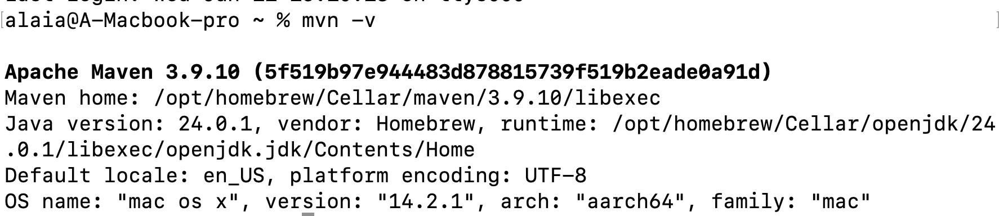
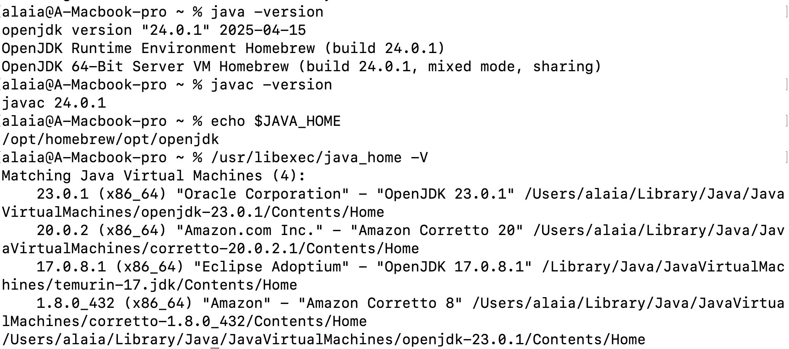
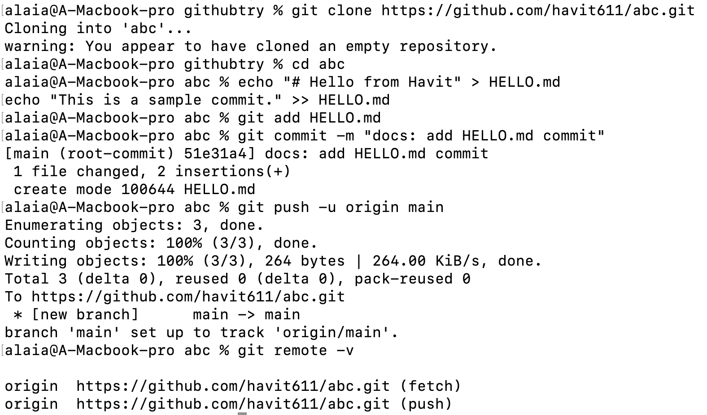
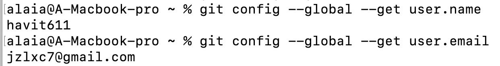
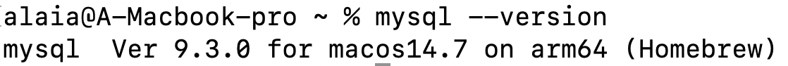
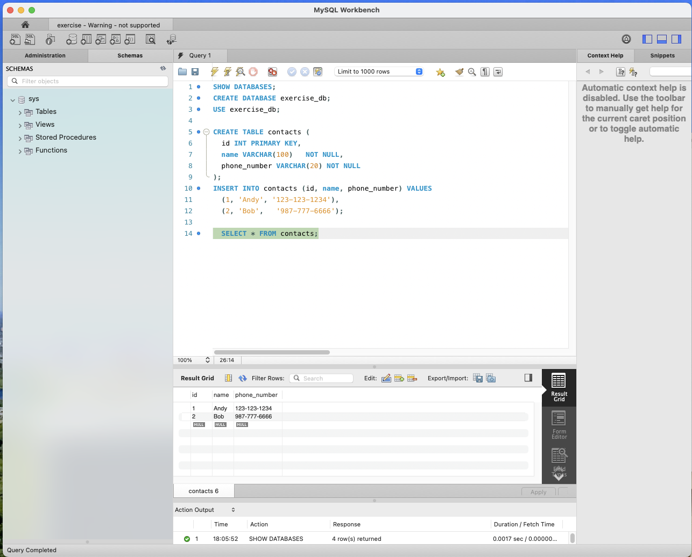
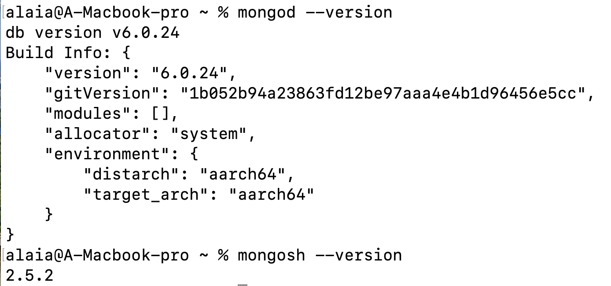
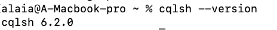
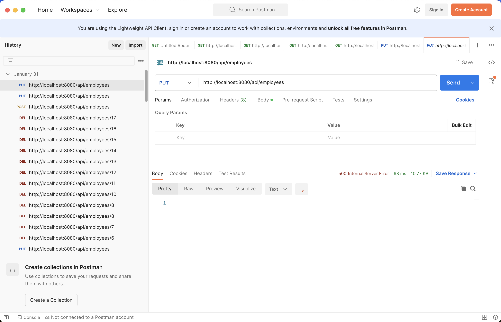
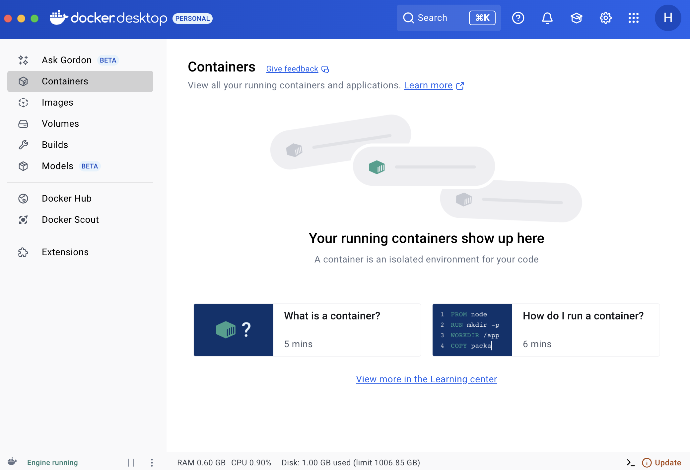

Necessary tools setup

1. maven   
2. JDK download   

3. Github Setup  
     
     

4. MySQL  
     
     

5. NoSQL – MongoDB:   
   No-SQL – Cassandra:   

6. Postman:   
7. Docker:   
